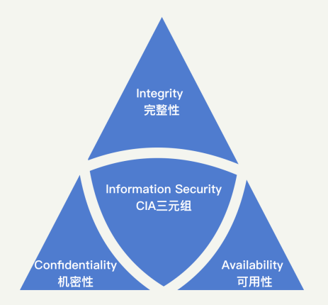

# HackerMe

## 别说你没被安全困扰过 

### 为什么要学安全？

首先，不知道你是否还记得 2017 年 9 月美国知名征信公司 Equifax 的数据泄露事件，这事导致了 1.45 亿美国居民个人隐私信息被泄露。受事件影响，Equifax 公司市值瞬间就蒸发了 30 亿美元，最后还赔偿给用户 4.25 亿美元，可谓损失惨重。后来，Equifax 公司复盘了安全事故的原因，发现这个事故的罪魁祸首，居然是一个早已被披露出来的安全漏洞，叫作 Apache Struts，真是让人哭笑不得。

> 关于Equifax 公司的数据泄漏详细内容，参见：[Equifax Hacker Incident](EquifaxHackerIncident.md)

你说这事难吗？现在看起来，一点都不难。但问题出现在什么地方呢？我觉得核心点是Equifax 公司的工程师可能没有安全意识，也没有把安全当成一个优先级很高的事情去做。

同样的事情其实还有很多，我觉得 Equifax 公司的低级安全事件，应该给我们每一个程序员敲响警钟，我们在追求开发效率的同时，一定要把“安全”这俩字“放在心上”。

其次，从公司的角度来说，安全同样是不可或缺的一环。

任何一家公司都会存在安全的刚需问题，肯定需要有人来解决它。但是，公司招人组建安全团队，需要投入较大的成本。而这部分安全的成本，很多时候并不产生直接的收益。因此，对很多公司来说，业务都没成熟，就去考虑安全，是不合算的。这也就产生了一种现状：小公司没有安全，大公司都在“补”安全。

从安全发展角度上来讲，这种前期不重视安全，后期再补安全的做法，是很不利的。一方面，在发展前期留下了极大的安全隐患，公司可能在一次攻击后就彻底垮台了。另一方面，后期补安全，会因为安全去改动已经发展成熟的业务，导致安全和业务产生冲突，从而阻碍安全发展。

于是，矛盾点就产生了：很多规模不大的公司不愿意投入成本去做安全，但从长远考虑又需要安全。那该怎么办呢？我认为，如果业务的开发和管理人员，能够具备基础的安全知识，尽早做好安全规划，就能够以很低的成本满足公司前期的安全诉求。

因此，如果你想要在企业的全面发展中占据一席之地，或者是在管理方向上走得更“远”，那么我建议你，尽早地掌握安全知识，掌握企业安全防护的专业技巧。 

### 我们究竟该怎么学习安全呢？

你可能会存在这样的顾虑：安全可能需要花上几年时间学习和实践才能小有所成，时间成本是否有点高呢？确实，想要真正做好安全，时间的磨砺是不可或缺的。但是，这并不意味着你需要几年后再去从事安全相关的工作。正如上面所说的，公司初期的安全需求相对简单。因此，你完全可以快速入门，然后投入到公司的安全需求中去。接下来，你就可以随着公司的发展，边学习边做安全。

那么，学习安全是否门槛很高、难度很深呢？学习安全的过程中，你可能需要懂前端、懂后端、懂操作系统、懂网络。需要懂的知识非常多，但幸运的是，对于安全入门来说，宽度比深度更重要。因此，对于这些基础知识，深刻理解自然更好，但是懂些皮毛也足够了。在专栏中，我也会由浅入深，对安全需要的基础知识进行讲解。

你还可能会问：没有实践的机会，我能不能学好安全呢？确实，实践出真知，个人安全能力的提升，需要经过不断地磨练。跟着专栏进行学习，我相信你可以具备解决安全问题的基本能力。为了帮助你快速实践，我会通过思考题的形式，去引导你分析自己所在公司的现状和未来。你可以将你的所思所想发表出来，共同探讨，进行“沙盘演练”。

总结来说，本次专栏的定位是安全基础课。在专栏的覆盖面上，我会力求全面，让你能够了解安全的方方面面。我希望，通过对安全专栏的学习，你能够具备安全思维，在遇到安全问题的时候，有解决问题的方向和路径。

这里，我为你准备了一张安全攻防知识全景图，包含你需要掌握的所有相关知识。建议你最好保存下来，在之后的学习过程中，有针对性地去训练自己。 

### 专栏内容设计

在内容设计上，我根据安全方向的不同，把专栏内容划分为五个模块。

在第一模块“安全基础”中，我首先会为你系统地讲解安全基础概念、思考框架，以及解决安全问题的思路，带你从理论层次认知安全，让你能够系统地看待安全问题、评估安全需求，为你的安全学习指明方向。

在第二模块“Web 安全”中，我会为你讲述 Web 安全中一些经典安全问题的成因，结合当下 App 端各类接口中存在的 Web 漏洞，让你了解常见的 Web 攻防手段，帮助你在开发时，从源头切断安全问题。

在第三模块“Linux 系统和应用安全”中，我会为你讲解底层攻击的各种手段，以及它们会产生的影响，让你掌握其中的原理，能够在部署底层设施时，遵守安全事项，避免产生运维层面的安全问题。

在第四模块“安全防御工具”中，我会结合真实的安全防护案例，为你介绍六大安全防御工具的使用方法和适用场景。另外，我还会总结一些常见的安全防御手段，引导你建设系统级 的安全防御体系。

在第五模块“业务安全”中，我会为你讲解“黑灰产”的常见手段，教你识别查找“黑灰产”的方法及防护策略。另外，我还会联系实际业务场景，手把手教你系统解决业务安全问题。

我希望学完这个专栏之后，你能够既懂“攻”又懂“防”，既懂理论也懂实践。比如，你既能知道怎么发起一个简单的 SQL 注入攻击，也能够知道怎么从代码开发层次进行防御，同时也会了解到怎么通过和代码接耦合的 WAF 去做防御。又比如，你会知道怎么去规划和设计安全体系，以及在不同的阶段应该做什么事。

除了正文之外，我还设计了几篇不定期加餐，来和你聊一聊目前一些热门的安全方向，希望能够加深你对安全的理解。同时，加餐中也包含了我对个人发展的一些思考和建议。目前，安全行业普遍存在人才供给不足的现象，很多岗位招不到合适的人。因此，我希望结合我的个人经验，能够给想往安全专业发展的同学一些指引，教你成为“合适的人”。

最后，我想说，安全是一个特别重实践的领域，如果你有时间，一定要多练习，多总结。在课程设计中，我在每一节课后都留了思考题，希望你能够结合知识点，给出自己的思考。很多事情都没有标准答案，你梳理的过程本身也就是强化思考的过程，所以，千万不要有心理负担，大胆表达就可以了，我一定会尽我所能及时给你反馈。

## 安全的本质：机密性、完整性、可用性

### 安全是什么？

首先，我们来看，安全是什么？ 

当你所在的企业内网被入侵，数据被窃取之后，你也许能知道，是某个业务漏洞导致黑客能够进入内网，但你是否意识到，数据安全保护机制上同样产生了问题？类似这种的问题有很多。当我们遇到某一个特定的攻击或者安全问题时，往往看到的都是表象的影响，而能否找到根本原因并进行修复，才是安全投入的关键。

任何应用最本质的东西其实都是**数据**。用户使用产品的过程，就是在和企业进行数据交换的过程。比如，用户在使用微博时，或是将数据**写入**到微博（发博、评论、点赞等）中，或是从微博中**获取**数据（刷 feed、热门流）；用户在使用支付宝进行交易时，则是将资产以数据的形式进行转移。

因此，从另一个层面来说，安全的本质就是保护数据被合法地使用。怎么才叫“被合法地使用”呢？我们可以从机密性、完整性、可用性这 3 个方面具体来看。这也是在安全领域内最为基础的 3 个安全原则。

### 安全原则

机密性（Confidentiality）、完整性（Integrity）、可用性（Availability），我们可以简称为 CIA 三元组，是安全的基本原则。理论上来说，一个完整的安全保障体系，应该充分考虑到所有的 CIA 原则。当然，实际情况中，我们会根据企业需求，对安全在这三个方向上的投入做取舍。我们平时在评判一个企业的安全水平时，也会分别从这三个方向进行考量。

可以说，CIA 三元组原则，是安全领域内最基础也最重要的原则。你现在估计还没有感性认识，没关系，先有个整体印象，下面，我来给你详细讲解这三个原则的具体含义。 

#### 机密性

我们先来看机密性。机密性用一句话来说就是，确保数据只被授权的主体访问，不被任何未授权的主体访问。 简单用一个词总结就是**“不可见”**。

如何理解这个定义呢？举个例子，你不会允许陌生人查看你的个人隐私信息，但你可能会允许父母、朋友查看部分信息。同样的，对于应用中的数据，比如微信的朋友圈，你可以允许好友查看三天内的数据，但不允许好友查看三天前的数据。这些都是机密性在日常生活中的表现。

当然，首先你需要注意，机密性的一个前提是明确授权规则，也就是明确每一项数据可以被什么样的主体访问。在这个问题上，最安全的方法一定是，当每一次主体访问某一项数据时，都由相关负责人对该次行为进行审批。但是，这样显然是无法落地的，因为随着互联网的发展，每天都有万亿次的数据访问行为在发生。

因此，在安全领域我们提出了很多访问控制机制和安全模型，对数据和访问主体打上标签或者进行分类，并制定相应的访问控制规则去自动进行授权。关于访问控制机制， 在后续的内容中我们会再详细介绍，这里暂时不展开。另外，数据的存储、传输和处理过程也需要受到应有的保护。这些保护技术包括：加密、隔离、混淆、隐藏等等。

那么，针对机密性的攻击，都有哪些形式呢？ 

有的会直接针对保护技术进行破解。比如，去破解加解密算法、去逆向混淆代码等等。经过长期的发展，这些保护技术普遍都趋于成熟，安全性也在不断地提高。有了前人的积累，在保护技术上，我们其实不需要做太多投入，只需要采用最新的技术即可。

更多的时候，我们面临的机密性攻击，其实是人为原因导致的疏忽，也就是错误使用访问控制机制或数据保护技术。比如，因为权限滥用，导致开发人员拥有敏感数据的无限制访问权限；因为弱密钥，导致加密被破解；甚至显示器上的数据被别有用心的人窥探。所以说，当前机密性保护的要点是引导人去做正确的事情，避免这类看似低级、实则普遍的漏洞发生。

可以说，机密性是我们最容易理解的一个安全原则，也是企业在建立安全时最先想到的点。总的来说，机密性保护的技术都已经十分成熟了，但是在实施和落地的时候，往往会出现误用安全技术的情况。人的懒惰性是不可避免的，因此，机密性的安全保护往往都无法达到最佳状态，而是处于一个可用性和安全性的动态平衡点上。

机密性强调的是数据的“不可见”，但这并不代表数据是正确的。比如，将一个“True”存成了“False”，这就不是机密性要考虑的事了，而这种错误的存储，则是完整性需要考虑的事情。 

#### 完整性

完整性就是确保数据只被授权的主体进行授权的修改，简单来说，就是**“不可改”**。

所谓“授权的修改”，就是对主体可进行的操作进行进一步的限制。比如，只能追加数据的主体无法执行删除的操作。以个人隐私信息为例，法律允许学校或者公司在个人档案内追加信息，但不能做任何修改。又或者说，你自己发的朋友圈，不希望被其他人进行修改。这些都是完整性的典型表现。

在授权方面，机密性中提到的访问控制机制同样适用。除此之外，完整性会更加强调对修改行为的日志记录，并有合适的监督机制进行审计。在保护技术方面，主要是利用加密、签名等技术，使得数据的完整性变得可验证。

你应该发现了，完整性和机密性是紧密相连的。因此，大部分的机制和技术都同时对完整性和机密性提供保护。 

针对完整性的攻击也和机密性一样，更多的是由于人为原因导致的疏忽。除了黑客本身对数据的恶意篡改，已授权的主体也可能对数据完整性产生破坏，比如员工意外地误删除数据、程序 bug 导致错误数据被写入、正常用户的一些无效输入等。

相比于机密性，完整性往往容易被忽视。但是很多时候，机密性和完整性是共同出现的，做好了机密性的保护，基本也意味着做好了完整性的保护。因此，当我们在探讨安全问题、建设安全体系时，要将这两者结合起来，放在一起来研究。

机密性和完整性是为了保障数据是安全的，而数据的最终目的是要能够被看到或者使用。所以，对于数据来说，可用性也是很重要的一个方面。 

#### 可用性

可用性应该是你最熟悉的原则。因为它不仅仅是安全方向上的问题，也是工程上面临的主要挑战。用一句话来说就是，可用性就是确保数据能够被授权的主体访问到， 简单来说，就是**“可读”**。

但事实上，可用性往往没有被划分到安全的责任中去，因为对于大部分企业来说，开发是最受到重视的，而开发会比安全首先去考虑可用性的问题。

举个典型的例子，面对高峰期的集中用户访问，如何保障用户能够正常地获取数据（“双11”购物或者 DDoS 攻击等），你可以看到大量的研发人员对这个问题进行探讨和分享，但这其实都属于安全在可用性上的考量范围。

在安全机制上，我们要确保授权机制能够正确运行，使得拥有访问数据的主体能够及时地被授权，这是可用性的基本。那具体来说，可用性会面临哪些挑战呢？

在运维层面上，有很多技术在为可用性提供支撑，比如，在基础建设上的机房建设（如何在断电、高温、火灾等情况下保护设备）、多地冗余，以及在服务中的备份、资源冗余等。

在研发层面上，如何降低响应延迟、如何处理海量数据、如何在峰值进行扩容等，这些问题其实都是在可用性上的挑战。

在攻击的角度上，黑客也会对可用性发起攻击，也就是我们常说的 DoS（Denial of Service，拒绝服务）攻击。比如，通过发送大量的流量来占满带宽资源。 

可用性一旦受到损害，其对企业的影响显而易见，也最容易受到关注。长久以来，无数研发和运维人员都投入了大量精力来进行完善。很多时候，可用性的投入，并不会非常精确地被划分到安全的责任中去。这正是我们最需要关注和去做的事情。

### 总结

在所有的安全计划中，都会涉及对 CIA 三元组的取舍。不同的企业，在不同的发展阶段，CIA 都会有不同的优先级。什么是 CIA，你一定要牢记在脑海中，它将会贯穿我们整个专栏的学习。

通常来说，在互联网企业发展初期，可用性的优先级较高。如果涉及金钱相关的业务，则完整性的优先级更高；而涉及个人隐私相关的业务，则保密性的优先级更高。对于大部分企业而言，可用性在初期受到的挑战更多，则越发展越稳定，后期在可用性上的投入会逐渐降低。而完整性和机密性，会随着业务的发展，重要性越来越高，在企业的安全投入中，占比会越来越大。

因此，根据不同的发展阶段，列好 CIA 的优先级，是我们理解安全问题、定义安全需求、建设安全体系首先要做的事情。 

### 课后思考

假设，你正在参加一个面试，面试官问：“你能否从 CIA 三元组的三个特性出发，结合你们公司的业务系统情况，和我分享下你理解的安全是什么？”你会怎么回答呢？ 

## 安全原则：认证、授权、审计

CIA 三元组，也就是机密性、完整性和可用性。它们分别代表了数据的“不可见”“不可改”和“可读”。简单来说，以购买极客时间专栏为例，机密性就是未付费用户无法学习这个专栏，完整性就是这个专栏的内容不会变成别的其他方向的内容，可用性就是你作为付费用户，能够随时学习这个专栏。

理解了 CIA，上一节最后面试官问的“安全是什么”的问题，你现在一定可以回答出来了。面试官点点头，接着说道：“你觉得该怎么去解决安全问题呢？” 

毫无疑问，不同的应用、不同的模块会受到不同的安全威胁，当然，我们面对这些威胁也会有不同的解决方案。万变不离其宗。正如安全威胁都是针对 CIA 三元组产生的攻击一样，安全解决方案在根本思路上也都是相通的。

今天，我就从方法原则这个层面上，来给你讲讲安全解决方案的主要思路。这块内容看起来比较偏理论，我尽量多从实践角度来给你讲我的理解，但是你一定要耐心看完，这样可以确保你对后面实践的内容能够理解得更加深入。

### 什么是“黄金法则”？

对于安全解决方案来说，不同的教材会有不同的解释。就我个人而言，我比较喜欢“黄金法则”这种理解方式。下面我就用这种方式来具体给你讲讲。

黄金法则主要包含三部分：认证（Authentication）、授权（Authorization）、审计（Audit）。为什么称它为“黄金”呢？一方面是因为，它包含的这三部分重要且通用；另一方面是因为，这三个单词的前两个字母都是 Au，而 Au 在元素周期表中代表着“金”。

有的教材中，会给黄金法则加上问责（Accounting）这一部分，组成“4A 法则”；还有的会加上身份识别（Identification），组成“IAAAA 法则”。不管被划分为几个部分，这些法则的中心内容都是相似的，都是围绕着**识别、认证、授权、审计、问责**这五个部分展开的。因此，黄金法则其实就是 IAAAA 法则更高一层的概括，它将识别和认证、审计和问责归纳到了一起，更加强调了这两两之间的协同性质。

搞清楚了“黄金法则”的概念，我们现在来看它的三个部分（认证、授权、审计）。这三部分其实是一种串联的关系，它描述的其实是用户在使用应用过程中的生命周期：先进行登录、再进行操作、最后留下记录。 

下面，我们就一一来看这三个部分。

#### 身份识别和认证

首先，我们先来了解一下黄金法则的第一个部分：认证。认证其实包括两个部分：身份识别和认证。身份识别其实就是在问“你是谁”，你会回答“你是你”。身份认证则会问“你是你吗”，那你要证明“你是你”这个回答是合法的。

身份识别和认证通常是同时出现的一个过程。身份识别强调的是主体如何声明自己的身份，而身份认证强调的是，主体如何证明自己所声明的身份是合法的。比如说，当你在使用用户名和密码登录的过程中，用户名起到身份识别的作用，而密码起到身份认证的作用；当你用指纹、人脸或者门卡等进行登入的过程中，这些过程其实同时包含了身份识别和认证。

通常来说，不管你以什么形式进行登入，在身份识别的过程中，这些形式最终都需要落地成唯一的身份 id。在你后续的操作中，身份 id 都会始终跟随会话，记录在日志中。这也是后续授权、审计和问责的基础。身份识别的过程并不关注合法性，因此，认证是这个部分中最为关键的一环。

依据具体的认证场景，对安全等级、易用性等的综合考量，认证形式可以大致分为三种。按照认证强度由弱到强排序，分别是： 

> 你知道什么（密码、密保问题等）；
>
> 你拥有什么（门禁卡、安全令牌等）；
>
> 你是什么（生物特征，指纹、人脸、虹膜等）。 

我们通过将多种类型的认证进行组合，可以形成多因素认证机制，进一步加强认证强度。常见的，在登录过程中，很多应用会在输入完账号密码后，让你进行手机验证，这其实就是结合了“你知道什么”和“你拥有什么”的双因素认证。

可信的身份认证是建立安全保障体系的第一步。如果身份认证被破解，则后续的保护或者补救机制都无法起到太多的效果。因此，很多时候，通过衡量一个应用的认证安全等级，我们就能看出它整体的安全水平。那么怎样才能做好身份认证这个环节呢？这就需要进行系统分析了，这个问题我们在后续的课程中会详细讲解。 

#### 授权

在确认完“你是你”之后，下一个需要明确的问题就是“你能做什么”。毫无疑问，在系统或者应用中，我们的操作都会受到一定的限制。比如，某些文件不可读，某些数据不可修改。这就是授权机制。除了对“你能做什么”进行限制，授权机制还会对“你能做多少”进行限制。比如，手机流量授权了你能够使用多少的移动网络数据。

最原始和最安全的授权机制，一定是你的每一次操作，都经过了管理人员的审批和确认。比如我们**申请签证**的过程，其实就是一次申请授权的过程。当部分国家的签证策略比较严格时（如美国），那么我们每次出入境都需要重新申请签证，这也就意味着，会有很多的操作需要进行授权审批，其效率肯定是无法保证的（可以想想美国大使馆门前的长队）。

因此，很多时候，我们会定义自动化的授权机制来进行更快速地响应。比如，某些国家会制定免签或者落地签政策，只要符合一定的条件（如拥有中国护照），就能够直接出入境。这就相当于将“是否拥有中国护照”当成了一种授权的规则。同样的，在安全领域中，也有很多成熟的授权策略，如：自主访问控制、强制访问控制等。关于这些策略，在后续的课程中，我们也会进行详细地讲解。 

#### 审计和问责

当你在授权下完成操作后，安全需要检查一下“你做了什么”，这个检查的过程就是审计。当发现你做了某些异常操作时，安全还会提供你做了这些操作的“证据”，让你无法抵赖， 这个过程就是问责。

举一个生活中的例子，当你去**银行办理业务**时，工作人员会让你对一些单据签字。这些单据就是审计的信息来源，而签字则保证了你确认这是你进行的操作，这就是问责的体现。

审计和问责通常也是共同出现的一个过程，因为它们都需要共同的基础：**日志**。很容易理解，所谓审计，就是去通过日志还原出用户的操作历史，从而判断是否出现违规的操作。而问责则是通过日志的完整性，来确保日志还原出来的操作是可信的。想象一下，如果一份日志可以被人任意地篡改，那我们基于这份日志去进行审计，即使发现违规操作，也无法证明违规操作确实发生了，只能是白费功夫。

可能你会产生疑问，你已经获得了授权，理论上这些操作都应该是合法的，那为什么还需要审计呢？当然，如果授权机制能够达到“完美”，那么审计的意义确实不大。然而，我们一直都强调，安全不存在**“银弹”**，不可能达到 100% 的安全。即使是 1% 的漏洞，也可能造成 100% 的损伤。

在授权中，我们需要平衡可用性和安全性，很多时候都会选择牺牲部分的安全保障，来降低使用成本。而审计是事后的策略，它做的任何操作，理论上都不会直接影响用户，因此，能够做到更全面更严格，也能发现更多的问题。所以，审计这一环节，对于发现安全问题、回溯产生的攻击、完善安全保护体系来说，非常重要。

而问责，是对审计结果的一个保障，有的时候我们也称之为“不可否认性”。一方面，它保证了黑客无法通过篡改日志或者仿造身份，来隐藏自己的行为；另一方面它也保证了，当审计中发现了恶意的行为，需要寻求法律保护时，我们能够提供充分的证据。

从法律上来说，一个企业和应用在遭受攻击时，只能进行被动防御。如果想要主动出击，打击黑客的话，必须通过法律的途径。因此，建立完善的问责机制，能够为企业提供“**法律保护”**，大大提高企业安全的自信力。

这里你注意一下，一定不要狭义地去理解黄金法则的每个模块。认证不仅是帐密登录，也可以是生物特征识别或者证书等形式；授权不只是基于简单规则的访问控制，基于内容或者会话的检测等也是授权的一部分；审计也不只是简单的翻日志，很多机器学习、异常检测的算法，也都能运用到审计中来。针对不同的数据，不同的访问形式，我们能够采用的认证、授权、审计技术都不尽相同。 

换一种方式来概括的话，你可以这么理解：大部分情况下，事前防御属于认证，事中防御属于授权，事后防御属于审计。

### 企业安全建设管理

通过学习“黄金法则”，我们可以看到，安全是一个很浩大的工程，涉及各个方面的投入建设。对于任何一个公司来说，建立安全体系都是一个长期过程，因此，我们需要一个有效的管理方案来进行推动。

通过这么些年的实践，我觉得安全问题需要**自上而下的方式**去进行管理和推动。这也是为什么，大部分安全负责人加入企业做的第一件事就是向上教育，只有**企业高层**理解了安全，才有可能有效推动安全的发展。

正如，我们在开发一款应用时，需要评估功能的优先级，先以有限的资源实现 1.0 版本，然后再逐步进行迭代，不断完善。在做企业安全建设时，我们也需要对发展阶段进行划分，进行合理管理。通常来说，我们会根据周期的不同，制定三种安全规划，在这里，我举个简单的例子，比方说，可以制定 **5 年左右的战略计划、1 年左右的战术计划、3 个月左右的操作计划**。 

> 战略计划是一个较长期的安全目标，它和企业的长期发展目标相结合，保证安全的发展能够符合企业的长期发展方向。
>
> 战术计划会基于长期的安全目标，拆解出详细的任务计划，比如：项目列表、安全预算、人员扩张等。
>
> 操作计划则是对战术计划的具体实现，包括人员的分配、资源的投入、进度的安排等。 

和产品研发一样，当建立好不同的计划后，我们就能够给予企业的安全建设一个明确的方向，大大降低投入的成本，提高效率。因此，挖掘安全问题，明确安全计划，对于企业建立安全体系来说，至关重要。

### 总结

黄金法则描述的是，在用户操作的各个环节中，我们所需要采取的安全策略。黄金法则的核心内容包括三部分：认证、授权、审计。大部分情况下，事前防御属于认证，事中防御属于授权，事后防御属于审计。

毫不夸张地说，所有的安全保护措施或者工具，都是在黄金法则的一个或者多个模块中进行工作的。安全是严格遵从“木桶原理”的领域，只专注于某一个方向必然无法产出最优的结果。因此，我们一定要积极寻找短板，全面发展。

最后，我想说，安全没有“银弹”。只有当可用性接近 0 时，我们才有可能接近 100% 的安全。比如，将电脑关闭电源并深埋地下。所以，在实际进行安全防御的时候，不要过分追求完美，先有基本的保障就可以了。

### 课后思考

1. 通过今天的学习，你可以尝试分析一下，你负责的系统和应用中，在认证、授权和审计方面，分别做了哪些工作？又起到了怎样的保护效果？
2. 我在前面说了，安全问题需要自上而下的方式去进行管理和推动，这只是我个人的观点。结合你们公司的实际情况，站在你的角度，你觉得你们公司应该如何去推动安全建设呢？ 

## 密码学基础：对称、非对称、散列算法

黄金法则的三部分核心内容：认证、授权、审计。它们描述了用户在使用应用的各个环节，我们需要采取的安全策略。

在掌握了黄金法则之后，你就能以在安全发展规划上的宏观能力，赢得面试官的认可。接下来，他想考验一下你对安全具体知识的理解，以此来判断你能否将安全发展落地。于是，他问了一个非常基础的问题：你懂加解密吗？

可以说，密码学是“黄金法则”的基础技术支撑。失去了密码学的保护，任何认证、授权、审计机制都是“可笑”的鸡肋。 

在实际的生活工作中经常会有这样的场景发生：多个用户共用一个 Wi-Fi 来上网、共用一个服务器来跑任务；多个进程共用一个数据库来完成数据存储。在这些场景中，多方交互都通过一个共同的通道来进行，那我们该如何保障其中内容的 CIA 呢？这就需要用到各种加密技术了。今天，我们就一起来学习密码学相关的知识。

首先，我先来普及一个语文知识。密钥中的钥，发音为 yuè，不是 yào。虽然通常情况下，你按正常发音读的话，别人都会听成“蜜月”。但是，我们还是要用正确、专业的发音。

接下来，我来介绍一些经典的密码学算法：对称加密算法、非对称加密算法和散列算法。这些算法的具体实现不是咱们课程的重点，而且本身的过程也非常复杂。在安全这块内容里，你只需要明确了解这些算法的概念及其优缺点，就足够你去选取合适的加密算法了。 

### 对称加密算法

首先，我们来看对称加密算法。所谓对称加密，代表加密和解密使用的是同一个密钥。概念很简单，但是也很不具体、直观。为了帮助你理解，我把具体的加解密过程，画了一张图，你可以看一下。 

下面我来具体讲讲这个过程，如果我想给你发一段消息，又不想被其他人知道。那么我作为发送方，会使用加密算法和密钥，生成消息对应的密文；而你作为接收方，想要阅读消息， 就需要使用解密算法和一个同样的密钥，来获得明文。

我们常见的经典对称加密算法有 DES、IDEA、AES、国密 SM1 和 SM4。下面我们一起来具体看看。

#### DES

第一种对称加密算法是 DES（数据加密标准，Data Encryption Standard）。

DES 应该是最早的现代密码学算法之一。它由美国政府提出，密钥长度为 56 位。目前，它暴力破解 56 位密码的时间，已经能控制在 24 小时内了。

DES 实际上是一个过时的密码学算法，目前已经不推荐使用了。关于 DES，还有一点特别有意思。DES 包含一个关键模块：S 盒，其设计的原理一直没有公开。因此，很多人都相信，这个 S 盒中存在后门，只要美国政府需要，就能够解密任何 DES 密文。

#### IDEA

第二种对称加密算法是 IDEA（国际数据加密算法，International Data EncryptionAlgorithm）。

IDEA 由瑞士研究人员设计，密钥长度为 128 位。对比于其他的密码学算法，IDEA 的优势在于没有专利的限制。相比于 DES 和 AES 的使用受到美国政府的控制，IDEA 的设计人员并没有对其设置太多的限制，这让 IDEA 在全世界范围内得到了广泛地使用和研究。

#### AES

第三种需要了解的对称加密算法是 AES（高级加密标准，Advanced Encryption Standard）。

在 DES 被破解后，美国政府推出了 AES 算法，提供了 128 位、192 位和 256 位三种密钥长度。通常情况下，我们会使用 128 位的密钥，来获得足够的加密强度，同时保证性能不受影响。目前，AES 是国际上最认可的密码学算法。在算力没有突破性进展的前提下，AES 在可预期的未来都是安全的。

#### 国密 SM1 和 SM4

最后一种是国密 SM1（SM1 Cryptographic Algorithm）和 SM4（SM4 Cryptographic Algorithm）。

我们知道，密码学作为安全的基础学科，如果全部依靠国外的技术，对于国家安全可能产生不利影响。因此，中国政府提出了一系列加密算法。其中，国密算法 SM1 和 SM4 都属于 对称加密的范畴。

- SM1 算法不公开，属于国家机密，只能通过相关安全产品进行使用。
- 而SM4 属于国家标准，算法公开，可自行实现使用。
- 国密算法的优点显而易见：受到国家的支持和认可。

借助下面的对比情况表，相信你会对这几种对称加密算法有更清晰的认识。 

#### 应用

现在你应该对几种经典的对称加密算法有了初步地了解。接下来，我们来看一看它们是如何应用的。

- 在加密通信中（如 HTTPS、VPN、SSH 等），通信双方会协商出一个加密算法和密钥，对传输的数据进行加密，从而防止第三方窃取。
- 在类似数据库加密这种存储加密技术中，通信双方也是将存储空间中的数据进行加密，这样即使硬盘被物理窃取，也不会导致信息丢失。
- 在公司内部，为了避免用户的 Cookie 和隐私信息发生泄漏，也需要对它们进行加密存储。
- 对于大部分公司来说，选取 AES128 进行加解密运算，就能获得较高的安全性和性能。
- 如果是金融或政府行业，在涉及国家层面的对抗上，有一定的合规需求，则需要应用国密算法。

另外，在选取加密算法的时候，存在不同的分组计算模式：ECB/CBC/CFB/OFB/CTR。这些模式的具体细节不是我们学习的重点，在这里就不展开了。你需要知道的是：选取 CBC 和 CTR 这两种推荐使用的模式就可以满足大部分需求了，它们在性能和安全性上都有较好的保证。

### 非对称加密算法

有对称就一定会有非对称。非对称加密代表加密和解密使用不同的密钥。具体的加解密过程就是，发送方使用公钥对信息进行加密，接收方收到密文后，使用私钥进行解密。具体我也画了一张图，你可以和上面的对称加密算法的图一起对照着看一下。可以看到，非对称加密和对称加密算法的最大区别就是，加密和解密使用的密钥是不同的。 

当使用对称加密算法的时候，你不仅要跟每一个通信方协定一个密钥，还要担心协商过程中密钥泄漏的可能性。比如，我当面告诉了你一个密码，怎么保证不被偷听呢？而在非对称加密算法中，公钥是公开信息，不需要保密，我们可以简单地将一个公钥分发给全部的通信方。也就是说，我现在就可以告诉你一个公钥密码，即使这意味着所有阅读这篇文章的人都知道了这个密码，那也没关系。因此，非对称密钥其实主要解决了密钥分发的难题。

除了加密功能外，大部分的非对称算法还提供签名的功能。这也就是说，我们可以使用私钥加密，公钥解密。一旦接收方通过公钥成功解密，我们就能够证明发送方拥有对应的私钥，也就能证实发送方的身份，也就是说，私钥加密就是我们说的签名。 

你还可以这样理解，比如我现在和你说话，内容经过了我的私钥加密，你用公钥解得了明文。因为私钥只有我拥有，所以只有我能够发出这段话来，别人都不可能。这也就是说，我不可能狡辩称这段话不是我说的。 

所有的非对称加密算法，都是基于各种数学难题来设计的，这些数学难题的特点是：正向计算很容易，反向推倒则无解。经典的非对称加密算法包括：RSA、ECC 和国密 SM2。接下来，我们一个个来看。

#### RSA

我们先看第一种非对称加密算法 RSA（RSA 加密算法，RSA Algorithm）。

RSA 的数学难题是：两个大质数 p、q 相乘的结果 n 很容易计算，但是根据 n 去做质因数分解得到 p、q，则需要很大的计算量。RSA 是比较经典的非对称加密算法，它的主要优势就是性能比较快，但想获得较高的加密强度，需要使用很长的密钥。

#### ECC

我们再来看第二种 ECC（椭圆加密算法，Elliptic Curve Cryptography）。

ECC 是基于椭圆曲线的一个数学难题设计的。目前学术界普遍认为，椭圆曲线的难度高于大质数难题，160 位密钥的 ECC 加密强度，相当于 1088 位密钥的 RSA。因此，ECC 是目前国际上加密强度最高的非对称加密算法。

#### 国密 SM2

最后一种是国密 SM2（SM2 Cryptographic Algorithm）。 

国密算法 SM2 也是基于椭圆曲线问题设计的，属于国家标准，算法公开，加密强度和国际标准的 ECC 相当。而国密的优势在于国家的支持和认可。

好了，这 3 种非对称加密算法的优缺点我也总结成了一张表格，你可以看一看。 

我们前面说了，对比于对称加密算法，非对称加密算法最大的优势就是解决密钥分发的问题。因此，现在大部分的认证和签名场景，其实使用的都是非对称加密算法。比如，在SSH 登录、Git 上传等场景中，我们都可以将自己的公钥上传到服务端，然后由客户端保存私钥。

那么，如果你遇到需要使用非对称加密的场景（比如多对一认证），我推荐你使用 ECC 算法。

### 散列算法

散列算法应该是最常见到的密码学算法了。大量的应用都在使用 MD5 或者 SHA 算法计算一个唯一的 id。比如 Git 中的提交记录、文件的完整性校验、各种语言中字典或者 Map 的实现等等。很多场景下，我们使用散列算法并不是为了满足什么加密需求，而是利用它可以对任意长度的输入，计算出一个定长的 id。 

作为密码学的算法，散列算法除了提供唯一的 id，其更大的利用价值还在于它的不可逆性。当用户注册，提交账号密码时，作为一个安全的应用，是绝对不能够存储明文密码的。因此，我们对用户的密码通过散列算法进行计算，存储最终的散列值。

在后续登录的过程中，我们如果计算出的用户提交的密码的散列值和你存储的散列值一致，就可以通过验证了。这样一来，任何人（即使是内部员工）都不知道用户真实的密码是什么，而用户也能够完成密码的校验。

除了刚才说的不可逆性，在密码学上，我们对散列算法的要求还有：鲁棒性（同样的消息生成同样的摘要）、唯一性（不存在两个不同的消息，能生成同样的摘要）。

经典的散列算法包括 MD5、SHA、国密 SM3。下面我们逐一来看。

#### MD5

我们先来看第 1 种，MD5（消息摘要算法，Message-Digest Algorithm 5）。

MD5 可以用来生成一个 128 位的消息摘要，它是目前应用比较普遍的散列算法，具体的应用场景你可以自行参阅。虽然，因为算法的缺陷，它的唯一性已经被破解了，但是大部分场景下，这并不会构成安全问题。但是，如果不是长度受限（32 个字符），我还是不推荐你继续使用 MD5 的。

#### SHA

第 2 种是 SHA（安全散列算法，Secure Hash Algorithm）。

SHA 是美国开发的政府标准散列算法，分为 SHA-1 和 SHA-2 两个版本，SHA-2 细分的版本我们就不介绍了。和 MD5 相同，虽然 SHA 的唯一性也被破解了，但是这也不会构成大的安全问题。目前，SHA-256 普遍被认为是相对安全的散列算法，也是我最推荐你使用的散列算法。

#### 国密 SM3

第 3 种是国密 SM3（SM3 Cryptographic Algorithm）。

国密算法 SM3 是一种散列算法。其属于国家标准，算法公开，加密强度和国际标准的SHA-256 相当。和国密 SM2 一样，它的优势也在于国家的支持和认可。

上述算法的相关对比情况，我也总结了一下，如下表所示： 

#### 盐

另外，我们在使用散列算法的时候，有一点需要注意一下，一定要注意加“盐”。所谓“盐”，就是一串随机的字符，是可以公开的。将用户的密码“盐”进行拼接后，再进行散列计算，这样，即使两个用户设置了相同的密码，也会拥有不同的散列值。同时，黑客往往会提前计算一个彩虹表来提升暴力破解散列值的效率，而我们能够通过加“盐”进行对抗。“盐”值越长，安全性就越高。

### 总结

在这节课中，我对各种加密算法和应用场景进行了全面的介绍。密码学是一门深奥的学科，而作为密码学的使用者，你只需要正确地理解各类算法的特性和功能，就可以满足日常的应用需求了。

总的来说，在使用的时候，你要记住下面这些内容：

- 对称加密具备较高的安全性和性能，要优先考虑。
- 在一对多的场景中（如多人登录服务器），存在密钥分发难题的时候，我们要使用非对称加密；
- 不需要可逆计算的时候（如存储密码），我们就使用散列算法。

在具体算法的选取上，你只需要记住：

- 对称加密用 AES-CTR、
- 非对称加密用 ECC、
- 散列算法用 SHA256 加盐。

这些算法就能够满足大部分的使用场景了，并且在未来很长一段时间内，都可以保持一个较高的安全强度。

### 思考题 

通过今天的学习，相信你已经了解了密码学的各种概念和知识。对于这些加密算法，哪些你比较了解或者使用过呢？可以谈谈你的想法。 

### 课后阅读

更加详细的密码学知识，参见：[CryptographyTools](CryptographyTools.md)

## 身份认证：身份管理

密码学的三种算法：高效安全的对称加密算法，解决密钥分发难题的非对称加密算法，以及提供单向加密的散列算法。

在表达了你对密码学清晰的理解之后，面试官开始相信你具备安全方面的基础知识了。于是，他准备和你探讨一下安全落地的细节。基于你之前提出的“黄金法则”，面试官问道：“黄金法则的认证（Authentication）部分不就是账号密码吗？这么简单的东西，有必要考虑得那么复杂吗？” 

认证，也就是身份识别与认证（通常来说，识别和认证是一体的，因此后面我会用身份认证来指代识别和认证）。毫无疑问，对于一个安全的应用来说，身份认证是第一道门槛，它为后续所有的安全措施提供“身份”这样一个关键信息。

听完你的简单叙述后，面试官直接问道：“现在我们公司有好几个应用，每一个应用都有独立的账号体系，管理起来十分复杂。而且，内部员工的账号体系也没有建设起来。如果是你，你会怎么解决这些问题呢？”

现在你可能很难回答这些问题，没关系，带着这些问题，让我们来学习今天的内容。相信学完之后，再有人问，你都可以对答如流。

### 对外、对内认证

首先，身份认证不仅仅是一个输入账号密码的登录页面而已，应用的各个部分都需要涉及身份认证。在我看来，身份认证可以分为两个部分：**对外认证和对内认证**。

- 对外认证，其实就是应用的登录注册模块，它面向用户进行认证。对外认证的入口比较集中，一个应用通常只有一个登录入口。因此，我们可以在登录这个功能上，实现很多种认证的方式。这就可以用到我们之前提到的“你知道什么、你拥有什么、你是什么”。
- 除了应用本身需要有登录注册的模块，应用的各种内部系统同样需要涉及登录认证的功能，比如：服务器的登录、数据库的登录、Git 的登录、各种内部管理后台的登录等等。这也就是我所说的对内认证。

那么，对内认证和对外认证有什么**区别**呢？我觉得，它们最主要的区别在于认证场景的复杂程度。从下面这张图中我们可以看出，对外认证是单一场景下的认证，对内认证是多场景下的认证。 

在了解了对内、对外认证的特点之后，我们再来聊一聊它们的应用。我了解到的目前行业的现状是，**各个公司的对内认证都比较薄弱**。其主要原因在于，内部的认证场景过于分散，很难进行统一管理。尤其是服务器、数据库等的认证，目前还无法做到统一。因此，对内认证是一个长期治理的过程，需要我们投入较大的精力。

正如我在第一节课中提到的，“面对一个问题时，我们总是很容易发现表面的影响，而忽视其产生的根本原因”，在身份认证这个问题上同样如此。表面上，我们要做好对外认证，防止用户的账号被盗。根本上或者说更普遍的问题是，我们要如何做好对内认证。因此，当你在考虑身份认证的安全问题时，一定要尽可能考虑得更全面。毕竟，对于安全来说，有一个小场景没做到位，很多时候，就意味着什么都没做。

### 无认证、弱密码、认证信息泄漏

接下来，你肯定想问，我们该如何做好身份认证呢？不要着急，我们先来看一下身份认证都会面临哪些威胁。只要我们针对这些威胁找到对应的解决办法，就能做好身份认证了。身份认证面临的威胁主要包括**无认证、弱密码、认证信息泄漏**。接下来，我们一个一个来看。

首先，没有认证环节是所有应用和公司存在的最普遍的问题。尤其是在对内认证的部分，我们经常会看到，很多公司的数据库、接口、管理后台在使用的时候，并不需要经过认证这个环节。 

除了没有认证环节的直接“裸奔”，弱密码也是一个普遍存在的问题。我常常觉得，安全最大的敌人是人类的惰性。设计一个好记的强密码并不是一件简单的事情，这也是弱密码屡禁不止的原因。

说完了无认证和弱密码，接下来我们来聊一聊认证信息泄漏。所谓认证信息泄露，就是指黑客通过各种手段，拿到了用户的密码信息和身份凭证这样的认证信息。常见的手段包括钓鱼、拖库等等。更可怕的是，很多攻击对于用户来说都是**无感知**的。

那么，无感知体现在哪里呢？我们可以来做一个小测试。你可以在 [haveibeenpwned](https://haveibeenpwned.com/) 中，输入自己的账号信息，测试一下它们是否被泄漏了。如果显示“Oh no -powned!”，那就说明你的邮箱密码已经被泄露了，我建议你可以尽快修改你的密码了。 

除了密码的直接泄漏以外，大部分的登录系统都无法应对**重放攻击**。重放攻击简单来说就是，黑客在窃取到身份凭证（如 Cookie、Session ID）之后，就可以在无密码的情况下完成认证了。

总结来说，身份认证面临的威胁其实都是认证信息的泄漏。这其中，既可能是应用本身就没有认证信息或者认证信息强度比较弱，使得黑客可以通过猜测的方式快速获取认证信息；也有可能是黑客通过一些攻击手段（如窃听等），从用户那获取了认证信息，从而冒充用户进行登录。 

而身份认证被破解的后果，相信你也知道一些：一旦黑客仿冒了正常用户进行认证，那么就相当于获得了这个用户的所有权限。更严重的是，所有的后续操作，都会记录到这个正常用户的名下，使得后续应用进行授权和审计的时候，都很难发现黑客本身的存在。

### 技术方案、安全意识

在了解了身份认证环节会面临的各种威胁，以及这些威胁可能产生的影响之后，你可能要问了，我们应该怎么解除这些威胁呢？我觉得，很多时候，我们解决安全问题，不只是在解决一个技术问题，还要**培养外部用户和内部员工的安全意识**。也就是说，认证安全并没有什么完善的技术解决方案，更多的是通过一些规章制度去强化我们的安全意识。

尽管如此，我这里也会去讲一些技术方案，让你知道一些基本的解决方案。

比如，对密码的强度进行限制（如强制使用字母、数字、特殊字符的组合密码，并达到一定长度），强制用户定期修改密码，对关键操作设置**第二密码**（如微信、支付宝的支付密码）等等。

当然，随着互联网的发展，我们也会不断地利用新技术去升级验证手段，帮助用户降低被“攻击”的风险。比如，通过手机验证替代密码验证（因为丢失手机的几率比丢失密码的几率低）；通过人脸、指纹等生物特征替代密码。

除此之外，我们还可以通过加密信道（如 HTTPS）来防止窃听；也可以通过给下发的凭证设置一个有效期，来限制凭证在外暴露的时间，以此来减少重放攻击带来的影响。

这里面有一点你要注意，身份认证的最大的问题还是在于身份管理。随着公司业务的不断扩张，当账号体系变得越来越复杂时，如何对这些账号进行统一的管理，是解决身份认证问题的关键。而单点登录就是一个非常有效的解决方案。

### 单点登录

那么单点登录（Single Sign On，SSO）到底是什么呢？单点登录的概念很简单：用户只需要进行一次认证，就可以访问所有的网页、应用和其他产品了。随着互联网产品形式的不断发展，单点登录的实现方式也经历了多次的升级革新。下面我为你介绍几种典型的单点登录方式，它们分别是：CAS 流程、JWT、OAuth 和 OpenID。 

#### CAS 流程

第一个要讲的是 CAS（Central Authentication Service，集中式认证服务）流程。

CAS 是一个开源的单点登录框架，它不属于某一种单点登录的实现方式，而是提供了一整套完整的落地方案。整体的流程如下图所示，具体步骤我会通过访问极客时间 App 的例子来为你详细讲解。 

1. 假如用户现在要访问某个应用，比如极客时间 App。
2. 应用需要进行认证，但应用本身不具备认证功能。因此，应用将用户重定向至认证中心的页面。比如，你在登录一个应用的时候，它显示你可以选择微信、QQ、微博账号进行登录，你点击微信登录，就跳转至微信的登录页面了。
3. 用户在认证中心页面进行认证操作。如果用户之前已经在其他应用进行过认证了，那么认证中心可以直接识别用户身份，免去用户再次认证的过程。
4. 认证完成后，认证中心将认证的凭据，有时会加上用户的一些信息，一起返回给客户端。也就是你在微信登录完成后，回到了极客时间 App。
5. 客户端将凭据和其他信息发送给应用，也就是说，极客时间 App 将微信的登录凭据发送给了极客时间后端。
6. 应用收到凭据后，可以通过签名的方式，验证凭据的有效性。或者，应用也可以直接和认证中心通信，验证凭据并获取用户信息。这也就是为什么极客时间能够拿到你的微信头像了。 
7. 用户完成认证。 

CAS 的流程非常经典，你现在应该理解了吧？我们后面要讲的 3 种单点登录方式，都和CAS 的流程相似，说它们是 CAS 的“衍生品”也不为过。所以说，你一定要先掌握了CAS 流程，然后再来看下面这 3 种。

#### JWT

JWT（JSON Web Token）是一种非常轻量级的单点登录流程。它会在客户端保存一个凭证信息，之后在你每一次登录的请求中都带上这个凭证，将其作为登录状态的依据。JWT的好处在于，不需要应用服务端去额外维护 Cookie 或者 Session 了。但是，正是因为它将登录状态落到了客户端，所以我们无法进行注销等操作了。

#### OAuth

OAuth（Open Authorization）的主要特点是授权，也是我们通常用 QQ、微信登录其他应用时所采用的协议。通过 OAuth，用户在完成了认证中心的登录之后，应用只能够验证用户确实在第三方登录了。但是，想要维持应用内的登录状态，应用还是得颁发自己的登录凭证。这也就是为什么 QQ 授权后，应用还需要绑定你的手机号码。这也就意味着，应用是基于 QQ 的信息创建了一个自身的账号。 

#### OpenID

OpenID（Open Identity Document）和 OAuth 的功能基本一致。但是，OpenID 不提供授权的功能。最常见的，当我们需要在应用中使用微信支付的时候，应用只需要收集支付相关的信息即可，并不需要获取用户的微信头像。 

#### SSO 的认证体系

在实际情况中，基于各种业务需求的考虑，很多公司都倾向于自己去实现一套 SSO 的认证体系，它的认证流程如下图所示： 

在这个流程中，应用的服务器直接接收用户的认证信息，并转发给认证中心。对用户来说，这个认证中心是完全透明的。但是，这个流程给予了应用过多的信任，从安全性方面考量的话，是不合理的。在这个过程中，应用直接获取到了用户的认证信息，但应用能否保护好这些信息呢？我们并没有有效的办法去做确认。

> 参见：[Equifax Hacker Incident](EquifaxHackerIncident.md) 中，携程的案例，保存了不必要保存的用户数据。

因此，我的建议是，多花一些功夫去接入成熟的单点登录体系，而不是自己去实现一个简化版的。

- JWT 适用范围广，在单点登录的选取上面，如果想要将用户信息做统一管理，选择它最为简单；
- 如果认证中心只是被用来维护账号密码，由业务去维护用户所绑定的其他手机等信息，那么，采用 OAuth 更合适。

### 总结

身份认证的主要场景可以分为：对外认证和对内认证。其中，对内认证往往会因为管理的疏忽，导致很严重的问题。从威胁上来说，无认证和弱密码，是最普遍的安全问题。除此之外，各种密码和认证信息的窃取，也是黑客常用的攻击手段。对于身份认证来说，单点登录 是一种集大成的解决方案。基于 CAS 流程，衍生出了很多成熟的单点登录流程，可以供你去使用。

那么，掌握身份认证的一些技巧，对我们有哪些帮助呢？首先，任何的应用都会存在对内和对外的认证，因此，这将是你提升应用安全水平的一个首要任务。其次，在复杂的应用系统和网络结构中，如何管理身份认证，既优化用户体验，又保证其安全性，对你的设计和管理能力都是一个考验。做好了身份认证，不论是在安全上，还是在个人能力上，你都能够得到极大的提升。

### 思考题

好了，学习了今天的内容，你现在可以来思考一下面试官的问题：怎么做好认证？

这里我先给你提供一个思路。首先，你需要告诉面试官，公司目前存在哪些认证问题。这些认证问题的存在，可能导致哪些严重后果。接下来，就可以设想一下，想要解决这些认证问题，你会设计出怎样的认证体系。 

## 访问控制：授权机制

在上一讲中，我们主要从身份认证的场景和威胁上，对身份认证进行了介绍。同时，身份认证的核心问题是身份管理，因此我们可以采用单点登录的形式，来解决复杂的身份管理问题。常用的单点登录方式包括 CAS 流程、JWT、OAuth 和 OpenID。

那听了你对身份认证的规划之后，面试官觉得很满意，接着又问道：“既然身份认证都做到这么好了，是不是就不需要所谓的‘黄金法则’了？有了身份认证，还需要授权和审计做什么呢？” 

对于这个问题，你肯定要先给出否定的回答，这个很显然。接着，你可以说：“通过身份认证，我们只能够确认用户的身份，而对用户的操作和访问行为的把控，就是授权和审计的任务了。”

接着，面试官又发问了：“我理解身份认证和授权的区别了。目前，我们公司的授权机制比较随意，基本就是有什么需求就做什么。如果是你，你会怎么优化授权机制呢？”

那这一讲中，我们就来介绍几种常见授权机制的概念和原理，以及在实际工作中我们该如何去选取合适的保护机制。这些通用的机制学习起来可能比较抽象，但“磨刀不误砍柴工”，理解了宏观上的知识基础，对我们后续学习各类具体的防御机制会有很大的帮助。

我个人认为，“授权”和“访问控制”其实是同一个概念，都是允许或者禁止某个用户做某件事情。现在行业内普遍用“访问控制”这个术语来讨论相关问题。因此，后续我们都会用“访问控制”来替代“授权”。如果你看到了这两种说法，知道它们是一个意思就可以了。

### 访问控制模型

首先，在探讨访问控制的机制之前，我们先要来了解一下，访问控制的场景是什么。这也是你去理解访问控制机制的一个基础。我把访问控制模型抽象成了下图的模型，你可以看看。具体来说就是，一个主体请求一个客体，这个请求的授权由访问控制来完成。 

如何具体的理解这个模型呢？你可以这样想：在用户去读取文件的过程中，用户是主体，读取这个操作是请求，文件是客体。下面我来详细介绍一下。 

主体：请求的发起者。主体可以是用户，也可以是进程、应用、设备等任何发起访问请求的来源。

客体：请求的接收方，一般是某种资源。比如某个文件、数据库，也可以是进程、设备等接受指令的实体。

请求：主体对客体进行的操作。常规的是读、写和执行，也可以进一步细分为删除、追加等粒度更细的操作。 

### 常见的访问控制机制

访问机制是否对请求进行授权，决定着这个操作能否顺利执行下去。所以，对于我们来说，了解访问机制的规则至关重要。常见的访问控制机制有 4 种：DAC、role-BAC、ruleBAC、MAC。 接下来，我们一一来看。

#### DAC

我们先来第 1 种，DAC（Discretionary Access Control，自主访问控制）。

DAC 就是让客体的所有者来定义访问控制规则。想象一下，你想要从图书馆中拿走一本书。这个时候，管理员说，“你经过这本书的所有人同意了吗？”这个过程就是 DAC。

在 DAC 中，访问控制的规则维护完全下发到了所有者手上，管理员在理论上不需要对访问控制规则进行维护。因此，DAC 具备很高的灵活性，维护成本也很低。相对的，尽管 DAC降低了管理员的工作难度，但是会增加整体访问控制监管的难度，以至于安全性完全取决于所有者的个人安全意识。

这么说来，DAC 的特性其实就是将安全交到了用户手中，因此，DAC 适合在面向用户的时候进行使用。当用户需要掌控自己的资源时，我们通常会采取 DAC，来完成访问控制。比方说，Linux 中采用的就是 DAC，用户可以控制自己的文件能够被谁访问。

#### role-BAC

第 2 种是 role-BAC（role Based Access Control，基于角色的访问控制）。

role-BAC 就是将主体划分为不同的角色，然后对每个角色的权限进行定义。我们还是以图书馆为例。当你想借书的时候，管理员说，“你是学生吗？”这个过程就是 role-BAC。管理员只需要定义好每一个角色所具备的功能权限，然后将用户划分到不同的角色中去，就完成了访问控制配置的过程。

role-BAC 是防止权限泛滥，实现最小特权原则的经典解决方案。试想一下，假如没有角色的概念，那么管理员需要给每一个用户都制定不同的权限方案。当用户的岗位或职责发生变更时，理论上管理员需要对这个用户的权限进行重新分配。但是，准确识别每一个用户需要哪些权限、不需要哪些权限，是一个很有挑战的工作。如果采用了 role-BAC，那么管理员只需要简单地将用户从一个角色转移到另一个角色，就可以完成权限的变更。

因此，role-BAC 更适合在管理员集中管理的时候进行使用。在这种情况下，所有的权限都由管理员进行分配和变更，所以，使用 role-BAC 可以大大降低管理员的工作难度，提高他们的工作效率。同样的原理也适用于应用，应用可以对不同的角色限定不同的操作权限，比如：运维人员给开发、产品、运维划分不同的机器操作权限。

> 回顾：基于用户角色的权限管理系统设计。

####  rule-BAC

第 3 种是 rule-BAC（rule Based Access Control，基于规则的访问控制）。

rule-BAC 就是制定某种规则，将主体、请求和客体的信息结合起来进行判定。在 ruleBAC 的控制机制中，如果想要在图书馆借书，管理员会说，“根据规定，持有阅览证就可以借书。”

相比较来说，DAC 是所有者对客体制定的访问控制策略，role-BAC 是管理员对主体制定的访问控制策略，而 rule-BAC 可以说是针对请求本身制定的访问控制策略。

在 rule-BAC 中，有一点需要我们注意。那就是，我们需要定义是“默认通过”还是“默认拒绝”，即当某次请求没有命中任何一条规则时，我们是应该让它“通过”还是“拒绝”呢？这需要根据安全的需求来进行综合考量。

> 比如，某个服务只提供了 80 和 443 端口的 Web 服务，那么防火墙配置的规则是允许这两个端口的请求通过。对于其他任何请求，因为没有命中规则，所以全部拒绝。这就是“默认拒绝”的策略。很多时候，为了保障更高的可用性，**应用会采取“默认通过”的策略**。

rule-BAC 适合在复杂场景下提供访问控制保护，因此，rule-BAC 相关的设备和技术在安全中最为常见。一个典型的例子就是**防火墙**。防火墙通过将请求的源 IP 和端口、目标 IP 和端口、协议等特征获取到后，根据定义好的规则，来判定是否允许主体访问。比如，限制 22 端口，以拒绝 SSH 的访问。同样地，应用也往往会采取风控系统，对用户异常行为进行判定。

#### MAC

最后一种是 MAC（Mandatory Access Control，强制访问控制）。

MAC 是一种基于安全级别标签的访问控制策略。只看这个定义你可能不太理解，我们还是用图书馆的例子来解释一下，当你在图书馆排队借书的时候，听到管理员说：“初中生不能借阅高中生的书籍。”这就是一种强制访问控制。在互联网中，主体和客体被划分为“秘密、私人、敏感、公开”这四个级别。MAC 要求对所有的主体和客体都打上对应的标签，然后根据标签来制定访问控制规则。

比如：为了**保证机密性**，MAC 不允许低级别的主体读取高级别的客体、不允许高级别的主体写入低级别的客体；为了保证完整性，MAC 不允许高级别的主体读取低级别的客体，不允许低级别的主体写入高级别的客体。这么说有些难以理解，我们可以这样来记：机密性不能低读、高写；完整性不能高读、低写。

MAC 是安全性最高的访问控制策略。但它对实施的要求也很高，需要**对系统中的所有数据都进行标记**。在实际工作中，想要做到这一点并不容易。每一个应用和系统，每时每刻都在不停地生产新的数据，数据也不停地在各个系统之间流转。你需要对这些行为进行全面的把控，才能将标签落地。因此，MAC 仅仅会出现在**政府系统**中，普通公司在没有过多的合规需求下，不会采取 MAC。 

好了，相信你现在已经对 4 种访问控制机制的特点，有了更深刻的理解了。那你可能要问了，在实际工作中，它们是如何应用的呢？在实际的工作中，我们常常需要将它们进行组合使用。比如，在 Linux 中，我们除了对文件进行 DAC 访问控制，也利用了 role-BAC 定义了用户组（group）的概念。这样，管理员就可以将用户分配到不同的组中，DAC 也会按照分组去定义相应的权限了。所以，使用访问控制机制的时候，我们要学会灵活应用。

### 威胁评估的步骤

最后，我想跟你聊一下威胁评估。在前面的课程中，我们描述了如何去衡量安全以及如何去做安全。但是，在安全方案实际落地的过程中，我们首先要考虑的是：目前存在哪些安全威胁。只有明确了这些安全威胁，你才能够成功说服老板和业务人员，去配合你推动安全方案的落地。既然如此，我们首先要做的就是威胁评估，看看哪里有安全威胁。

威胁评估主要有三个步骤：**识别数据、识别攻击、识别漏洞**。

我们先来看一下识别数据。我们知道，安全保护的核心资产就是数据。因此，威胁评估的第一步就是去识别数据。识别数据的最终目的是，当发生攻击，某一份数据的 CIA 受到影响时，会对公司造成多大的损失。这也是我们衡量安全投入高低的一个主要指标。

一般情况下，在识别完数据之后，我们就能推测出黑客会采取哪些方式进行攻击，这也就到了第二个步骤：识别攻击。识别攻击的核心就是，明确什么样的数据有价值被攻击。比如，对于公开的数据，没有被窃取的意义，所以黑客只会通过爬虫来抓站，而不会花费更大的成本去盗号。

在识别了数据和攻击之后，我们就需要根据应用去识别可能的漏洞了。这也就是第三个步骤：识别漏洞。比如，对于 Web 应用，它可能出现诸如 XSS、SQL 注入等 Web 漏洞。关于这一点，业内将常见的攻击和漏洞进行了总结。比如，近两年来由 MITRE 提出的 **ATTACK框架**比较知名。在识别漏洞的时候，我们可以基于这些总结性框架去进行罗列。

> [ATT&CK](https://attack.mitre.org/)是由MITRE机构开发的攻击模型框架，其全称为Adversarial Tactics, Techniques, and Common Knowledge（对抗性战术，技术以及公共知识库），是一个基于现实世界所观察到的攻击向量所组成的一个公开的对抗性战术和技术知识库，其可被用于私营机构、政府部门、网络安全产品和服务社区作为特定威胁模型和方法的开发基础
>
> 官网：https://attack.mitre.org/
>
> ATT&CK框架详解：https://www.freebuf.com/articles/network/254613.html
>
> 知识盒子参考资料：https://zhishihezi.net/b/bd8f04df32a3e24ad21fc720a784d802#start

通过对数据、攻击、漏洞的识别，你就能够知道，公司当前面临了哪些潜在的威胁，从而可以去思考解决方案，并推动它的落地。通常来说，我们需要定期（比如每年）对公司进行一次全面的威胁评估工作，并且随着公司的发展，不断调整安全方案。 

### 总结 

在这一节中，我们主要介绍了 4 种常见的访问控制机制：DAC、role-BAC、rule-BAC 和MAC。它们的特点分别是：自主访问控制、基于角色的访问控制、基于规则的访问控制和基于标签的访问控制。

通过学习它们的特点，我们就能知道它们的使用场景：DAC 适合面向用户；role-BAC 适合集中管理使用；rule-BAC 适合复杂场景；MAC 安全性最高，一般只出现在政府系统中。在实际的工作中，我们往往需要把它们进行组合使用。

在任何的应用中，权限都必然会存在。通过对访问机制的理解学习，会引导你去思考在设计应用的过程中，有哪些点被忽视了。这样在实际的开发工作中，我们就能通过合理的设计，选取合适的访问控制机制，来避免安全问题的产生。

除此之外，我们又介绍了威胁评估。威胁评估的主要思路是，通过识别数据、识别攻击、识别漏洞这三个步骤，来评估公司当前所面临的潜在威胁。只有明确了公司目前存在的安全威胁，你的安全方案才能顺利推进和落地实施。

最后补充一点，黄金法则我们已经讲过认证和授权这两个部分了，审计部分因为没有具体的方法论，主要就是日志记录和分析，我们就不再单独介绍了。这块内容不难，如果感兴趣，你可以自己找一些资料来学习。

讲到这里，关于安全基础的理论知识部分我们就全部讲完了。我把这一模块的重点内容梳理了一个脑图。你可以用它来查漏补缺，也可以自己来梳理看看，加深印象。 

## XSS：

