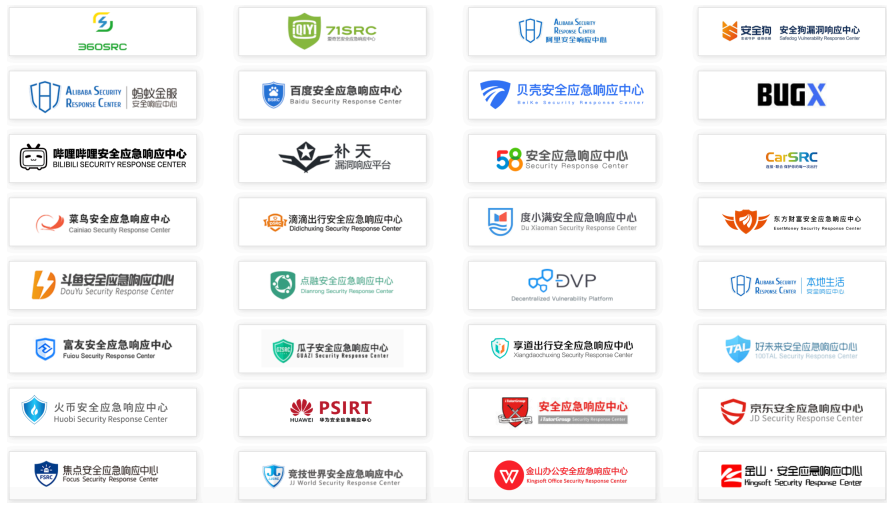

# README

This is a Hacker Record，I hope to help you grown up!

## Contents

### HackerMe

- [HackerMe](HackerMe.md)
  - This is include some base knowledge about hacker theory.

### HackerMeWeb

- [HackerMeWeb](HackerMeWeb.md)
  - This is my Web Hacker knowledge Collection.
- [HackerMeWeb Xmind](HackerMeWeb.xmind)
  - This  is my Web Hacker knowledge Collection Xmind.

### HackerWords

- [HackerWords](HackerWords.md)
  - This is include some commonly used hacker words.

### HackerMeStudyRecord

- [HackerMeStudyRecord](HackerMeStudyRecord.xmind)
  - This is my study Hacker trip.

## Code

- link: https://github.com/Kate-liu/HackerMeCode

## Knowledge Tools

- [BrowserTools](https://github.com/Kate-liu/BrowserTools)
- [GoogleV8Tools](Tools/GoogleV8Tools.md)
- [CryptographyTools](Tools/CryptographyTools.md)
- [OAuth2.0Tools](Tools/OAuth2.0Tools.md)
- [LinuxTools](Tools/LinuxTools.md)
- [NetworkTools](Tools/NetworkTools.md)
- [KubernetesTools](Tools/KubernetesTools.md)
- [ContainerTools](Tools/ContainerTools.md)
- [RedisTools](Tools/RedisTools.md)
- [MySQLTools](Tools/MySQLTools.md)
- [BigDataTools](Tools/BigDataTools.md)
- [FlinkTools](Tools/FlinkTools.md)
- 

## Hacker Tools

- Shiro 反序列化回显工具
  - https://github.com/fupinglee/ShiroScan
- Struts2 漏洞检查工具
  - https://github.com/HatBoy/Struts2-Scan
  - https://github.com/shack2/Struts2VulsTools/releases
- Kali Linux system
  - http://cdimage.kali.org/

## Appendix

- [EquifaxHackerIncident](Appendix/EquifaxHackerIncident.md)
- [网络安全法](Appendix/网络安全法.pptx)

## Book

- 《白帽子讲 Web 安全》
- 《黑客攻防技术宝典》
- 《Metasploit 渗透测试指南》
- 企业防御书籍
  - 《互联网企业安全高级指南》
  - 《企业安全建设指南》
  - 《大型互联网企业安全架构》

## Certificate

- CISP

  - Certified Information Security Professional ，注册信息安全专业认证
  - 国家信息安全水平考试：https://www.nisphome.cn/

- CISSP
  - Certification for Information System Security Professional，信息系统安全专业认证
  - https://www.isc2.org/
  - CISSP备考资料下载地址：
    - [链接](https://pan.baidu.com/s/1C9OwQBhmKA2Bz4MYuu_Olw ) 
    - 提取码: mvf3

- OSCP
  - Offensive Security Certified Professional，安全攻击专业认证
  - https://www.offensive-security.com/

## Safety Emergency Response Center(SRC)

- 微博安全应急响应中心（WSRC）
  - https://wsrc.weibo.com/
- SRC 集合
  - 

## Reference Link

- WebGoat
- https://owasp.org/www-project-webgoat/
  - https://github.com/WebGoat/WebGoat
  
- Pwnable.kr
- http://pwnable.kr/
  
- XCTF 联赛
- https://www.xctf.org.cn/
  
- FreeBuf

  - https://www.freebuf.com/

- 安全客

  - http://www.anquanke.com/

- 安全牛

  - https://www.aqniu.com/

- 乌云镜像

  - https://wooyun.x10sec.org/

- 中国互联网络信息中心

  - http://www.cnnic.cn/

- 谜团靶场平台

  - https://mituan.zone/#/login

